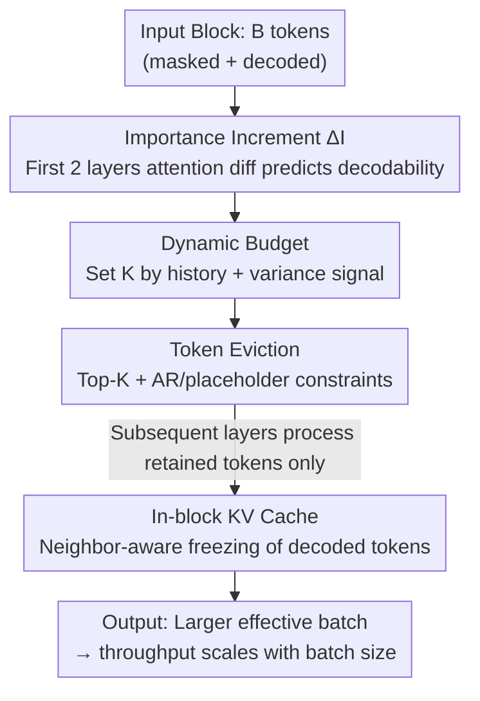

# FOCUS: DLLMs Know How to Tame Their Compute Bound

**Conference**: ICML 2026  
**arXiv**: [2601.23278](https://arxiv.org/abs/2601.23278)  
**Code**: https://github.com/sands-lab/FOCUS  
**Area**: LLM Efficiency / Diffusion Language Model Inference / ML Systems  
**Keywords**: Diffusion Language Models, Inference Acceleration, Token Eviction, Attention Importance, Throughput  

## TL;DR
FOCUS finds that in Diffusion Large Language Models (DLLMs), only ~10% of tokens in a block are actually decoded per step, leaving 90% of the compute wasted. It reveals that the "incremental attention importance from the first two layers" highly predicts which tokens are decodable. Based on this, it designs a training-free inference system that evicts non-decodable tokens after Layer 1, allowing for larger effective batches. Compared to the production-grade engine LMDeploy, FOCUS achieves up to a 3.52× throughput increase under large batches with no loss (and even slight improvements) in generation quality.

## Background & Motivation
**Background**: Autoregressive (AR) LLMs suffer from limited parallelism due to token-by-token decoding. Diffusion Large Language Models (DLLMs, e.g., LLaDA, Dream) are promising alternatives that generate multiple tokens via iterative denoising, breaking strict sequential dependencies. Recently, the **Block-Diffusion** paradigm (SDAR, LLaDA2.0) has become mainstream: it processes one token block at a time while treating previous text as fixed context, using bidirectional attention within blocks to achieve **exact KV caches** and avoid periodic re-computation.

**Limitations of Prior Work**: DLLMs hit a "compute wall" entirely different from AR. AR decoding is **memory-bound**; increasing batch size amortizes I/O, linearly increasing throughput until compute saturation. However, DLLMs calculate attention for all query tokens in a block at each denoising step, causing arithmetic intensity to spike and making them **compute-bound**. Consequently, throughput plateaus quickly as batch size increases.

**Key Challenge**: While block-parallelism maximizes hardware utilization, **only about 10% of block tokens are truly decoded per step** (averaging 2.00–4.05 tokens for $B=32$). The remaining ~90% of FLOPs are wasted on non-decodable tokens. Compared to the 1:1 "compute-to-generation" ratio of AR, DLLMs have structural redundancy. Restoring batch scalability requires pruning these redundant tokens during each step.

**Goal**: To **compute only for decodable tokens** (masked tokens predicted to meet decoding criteria for unmasking) during inference. This directly reduces per-step FLOPs, alleviates compute bottlenecks, and allows throughput to scale with batch size—all while being **training-free** and maintaining generation quality.

**Key Insight**: Findings in AR suggest that a few "heavy-hitter" or "attention-sink" tokens dominate attention quality, a concept used for KV cache compression (H2O, StreamingLLM, SnapKV, Quest). This paper **migrates the concept of "memory-side cache compression" to "compute-side query token eviction."** It reveals a DLLM-specific phenomenon: the "drift" in token importance within a block (the increment in incoming attention scores in early layers) is highly correlated with the final decoding probability of that token.

**Core Idea**: Use the "difference in attention importance between the first two layers" as a cheap predictor for token decodability. Evict non-decodable tokens early—immediately after Layer 1—allowing subsequent layers to process only a small set of candidates. This reduces the number of tokens processed per step by approximately 65%–80%.

## Method

### Overall Architecture
FOCUS is a DLLM inference system centered on one core action: **evicting non-decodable tokens from subsequent computation at a very early stage (after Layer 1)**. This forces the GPU to only compute for a small number of "promising" candidates, fitting a larger effective batch into the same memory and increasing throughput.

To ensure this eviction is accurate and stable, three components work in tandem: (1) a **cheap and accurate decodability signal**—the discovered importance increment $\Delta\mathcal{I}$ (Design 1); (2) a **dynamic budget** $K$ for token retention based on historical decoding volume and instantaneous signals (Design 2); and (3) structural constraints and safe KV cache reuse for already decoded tokens to prevent generation degradation (Designs 3 & 4). The workflow involves computing Q/K projections for the first two layers → calculating $\Delta\mathcal{I}$ → determining $K$ via the dynamic budget → selecting top-$K$ candidates with structural constraints → running subsequent layers only on these reduced tokens.

### Key Designs

**1. Importance Increment $\Delta\mathcal{I}$: Low-cost decodability prediction**

To decide which tokens to evict in early layers, a signal is needed that distinguishes "decodable tokens" from "noise" without a full forward pass. The authors define token importance $\mathcal{I}_j$ as the aggregation of attention scores from all query tokens in the block to token $j$:

$$\mathcal{I}_j=\sum_{i,h}\operatorname{Softmax}\big(\operatorname{MaxPool1D}(S_{i,j}^{(h)})\big)$$

where $S_{i,j}^{(h)}=(\mathbf{q}_i^{(h)})^\top\mathbf{k}_j^{(h)}/\sqrt{d_k}$ is the pre-softmax attention score from query $i$ to key $j$ in head $h$. Column-wise aggregation highlights tokens that are "critically attended" by others (MaxPool1D follows SnapKV to capture local features robustly).

However, $\mathcal{I}_j$ alone is insufficient—decoded tokens naturally dominate attention. The key observation is that after filtering decoded tokens, the importance of decodable vs. non-decodable tokens diverges **starting from Layer 1** (they are near-identical at Layer 0). Layer 0 Q/K projections are derived from noisy input embeddings without cross-token interaction. Layer 1 operates on mixed hidden states where tokens acquire enough semantics to differentiate themselves. Thus, the **importance increment** is proposed as a predictor:

$$\Delta\mathcal{I}_j=\mathcal{I}_j^{(\text{Layer1})}-\mathcal{I}_j^{(\text{Layer0})}$$

This subtraction acts as "common mode rejection," filtering out non-specific positional priors from Layer 0 and leaving the "semantic lift" emerging in Layer 1. Since Layer 1 is the earliest point where divergence occurs, identifying tokens here saves compute for all subsequent layers.

**2. Dynamic Budget: Adapting retention per step**

The number of decodable tokens fluctuates (many in easy steps, few in hard ones). A static budget $K$ would either evict valid candidates or waste compute. FOCUS uses a dual-criterion dynamic budget:

$$K=\min\big(B,\ \max(\lceil\alpha\times\bar{N}_{decoded}^{(t)}\rceil,\ N_\sigma)\big)$$

where $\alpha>1$ is the **only new hyperparameter** in FOCUS, controlling expansion aggressiveness. $\bar{N}_{decoded}$ is the historical average decoded count. $N_\sigma=\sum_{j\in\mathcal{M}}\mathbb{1}(\Delta\mathcal{I}_j\ge\operatorname{Std}(\Delta\bm{\mathcal{I}}))$ counts tokens whose importance increment is $\ge$ one standard deviation. The historical term $\alpha\bar{N}$ provides a "safety baseline," while the variance term $N_\sigma$ **adaptively expands** the budget when the model detects a burst of high-confidence tokens.

**3. Token Eviction Policy: Early filtering + structural constraints**

With $K$ and $\Delta\mathcal{I}$, FOCUS selects top-$K$ masked tokens. To prevent generation instability, two structural constraints are added: **AR context retention**—since many DLLMs are fine-tuned from AR backbones, local $t_i\leftarrow t_{i-1}$ patterns are critical, so every candidate's direct predecessor is retained; and **placeholder integrity**—any unprocessed masked tokens before a selected candidate are retained to initialize KV states, preventing relative position shifts. The final subset $\mathcal{S}$ is gathered, and **subsequent layers only process these reduced representations**.

**4. In-block KV Cache + Neighbor-aware Stability: Reuse without breaking dependency chains**

Standard Block-Diffusion refreshes all KV states every step. FOCUS introduces an **in-block KV Cache** to freeze states of decoded tokens. However, immediate freezing can break local dependency chains: in CPT architectures, $t_{i+1}$ heavily depends on the attention features of $t_i$. FOCUS applies a **neighbor-aware stability criterion**: it delays caching the KV of $t_i$ until both $t_i$ and its right neighbor $t_{i+1}$ are decoded, ensuring the local context window is fully stable before finalize.

### A Complete Example
Using SDAR-8B-Chat with $B=32$ and a confidence threshold of 0.9: At a specific step, there are 32 masked tokens, but statistically only ~2–4 will be decoded. FOCUS computes Q/K for Layer 0 and 1 to find $\Delta\mathcal{I}$. The dynamic budget (e.g., historical average 3, $\alpha=1.5$) suggests $K\approx 5$. If $N_\sigma$ detects 7 high-increment tokens, $K$ scales to 7. After adding predecessors and placeholder tokens, perhaps ~12 tokens remain. Only these are computed across the remaining 30 layers, saving ~65%–80% of processing. Decoded tokens enter the KV cache once they and their neighbors stabilize. The scheduling overhead is only ~1% of latency.

## Key Experimental Results

### Main Results
Evaluated on a single A100-80GB. Baseline: LMDeploy (including Continuous Batching, PagedAttention, FlashAttention). Models: SDAR-8B-Chat and LLaDA2.0-mini (16B MoE/1.4B active). Throughput measured at batch size 256.

| Model / Dataset | Redundancy Ratio (Proc/Dec) Baseline | FOCUS | Redundancy Reduction |
|---|---|---|---|
| SDAR / ShareGPT | 15.02 | 3.12 | 79.23% |
| SDAR / WildChat | 14.83 | 3.05 | 79.43% |
| SDAR / MATH | 7.45 | 2.69 | 63.89% |
| LLaDA2.0 / ShareGPT | 19.73 | 4.19 | 78.76% |
| LLaDA2.0 / WildChat | 21.47 | 4.30 | 79.97% |

FOCUS reduces redundancy from ~15 to ~3 (approaching AR's 1:1 ideal). Peak throughput for SDAR-ShareGPT reached 2272 tokens/s (2.32× speedup). With $B=64$ (higher redundancy), speedup reached **3.52×**. While the baseline plateaus at batch size 32, FOCUS allows throughput to scale with batch size.

### Ablation Study

| Experiment | Setting | Conclusion |
|---|---|---|
| Selection Strategy (Math500, $K{=}2$) | Top / Random / Bottom | Top (65.40) ≫ Random (7.50) ≫ Bottom (4.40), validating $\Delta\mathcal{I}$ as a signal. |
| Threshold Robustness (Math500, SDAR) | Conf 0.9→0.7 | Baseline dropped from 64.70 to 54.60; FOCUS ($\alpha{=}1.5$) held at 62.20. |
| In-block KV Cache (SDAR) | DC vs DC+ vs FOCUS | Naive Delayed Cache (DC) hurts quality; neighbor-aware DC+ recovers it. |

### Key Findings
- **$\Delta\mathcal{I}$ is the Core**: Top selection significantly outperforms Random/Bottom; since decoding is Markovian, error from wrong candidates accumulates.
- **Quality Improvement**: FOCUS matches or exceeds baseline quality across various settings. Eviction acts as a noise filter, removing "high confidence but incorrect" tokens.
- **Scaling with Block Size**: Larger blocks ($B=64$) see higher gains (3.52×), as they contain more redundancy.
- **MoE Performance**: Acceleration is more modest on LLaDA2.0 (MoE) because its active FLOPs are already low.

## Highlights & Insights
- **Cross-domain Concept Migration**: Migrating "cache compression" (memory-side) to "query eviction" (compute-side) perfectly addresses the compute-bound nature of DLLMs.
- **Common Mode Rejection**: Using $\Delta\mathcal{I}=\mathcal{I}^{(1)}-\mathcal{I}^{(0)}$ to filter positional priors is both cheap and theoretically sound as an early-exit strategy.
- **Training-free, Minimal Tuning**: Only one hyperparameter ($\alpha$) is added. The system relies on custom Triton kernels for performance.
- **Serendipitous Quality Gain**: The mechanism naturally filters noise tokens, improving robustness especially at lower confidence thresholds.

## Limitations & Future Work
- **Unproven Causality of Quality Gain**: The "noise filtering" explanation is intuitive but lacks rigorous controlled causal verification.
- **Workload Dependency**: Speedup is less significant for MoE architectures and short-prompt/long-reasoning tasks (e.g., MATH).
- **Architecture Coupling**: Constraints like AR context retention assume the DLLM is derived from an AR backbone; effectiveness on from-scratch DLLMs is unverified.
- **Engineering Complexity**: Implementing irregular memory access (Gather/Eviction) requires high-performance Triton kernels.

## Related Work & Insights
- **vs Fast-dLLM**: Fast-dLLM uses confidence-based decoding but requires periodic re-computation. FOCUS uses exact KV caches and targets query redundancy specifically.
- **vs SDAR / LLaDA2.0**: These establish the block-parallel paradigm; FOCUS optimizes it by reducing the redundancy ratio from ~15 to ~3.
- **vs AR Cache Compression**: While H2O/SnapKV focus on memory, FOCUS applies similar sparsity intuitions to compute, utilizing the unique DLLM $\Delta\mathcal{I}$ signal.

## Rating
- Novelty: ⭐⭐⭐⭐⭐ First to link DLLM attention importance to decoding probability for compute-side eviction.
- Experimental Thoroughness: ⭐⭐⭐⭐ Solid across multiple models, benchmarks, and ablation conditions.
- Writing Quality: ⭐⭐⭐⭐ Clear motivation and logical flow from the "10% decoding" observation to system design.
- Value: ⭐⭐⭐⭐⭐ High practical value; addresses the primary deployment bottleneck for DLLMs with significant speedups.

<!-- RELATED:START -->

## Related Papers

- [\[ICML 2026\] Stochastic Sparse Attention for Memory-Bound Inference](stochastic_sparse_attention_for_memory-bound_inference.md)
- [\[ACL 2025\] FastDraft: How to Train Your Draft](../../ACL2025/llm_efficiency/fastdraft_how_to_train_your_draft.md)
- [\[AAAI 2026\] How Many Experts Are Enough? Towards Optimal Semantic Specialization for Mixture-of-Experts](../../AAAI2026/llm_efficiency/how_many_experts_are_enough_towards_optimal_semantic_specialization_for_mixture-.md)
- [\[ACL 2025\] How to Train Long-Context Language Models (Effectively)](../../ACL2025/llm_efficiency/train_long_context_effectively.md)
- [\[NeurIPS 2025\] From Shortcut to Induction Head: How Data Diversity Shapes Algorithm Selection in Transformers](../../NeurIPS2025/llm_efficiency/from_shortcut_to_induction_head_how_data_diversity_shapes_algorithm_selection_in.md)

<!-- RELATED:END -->
