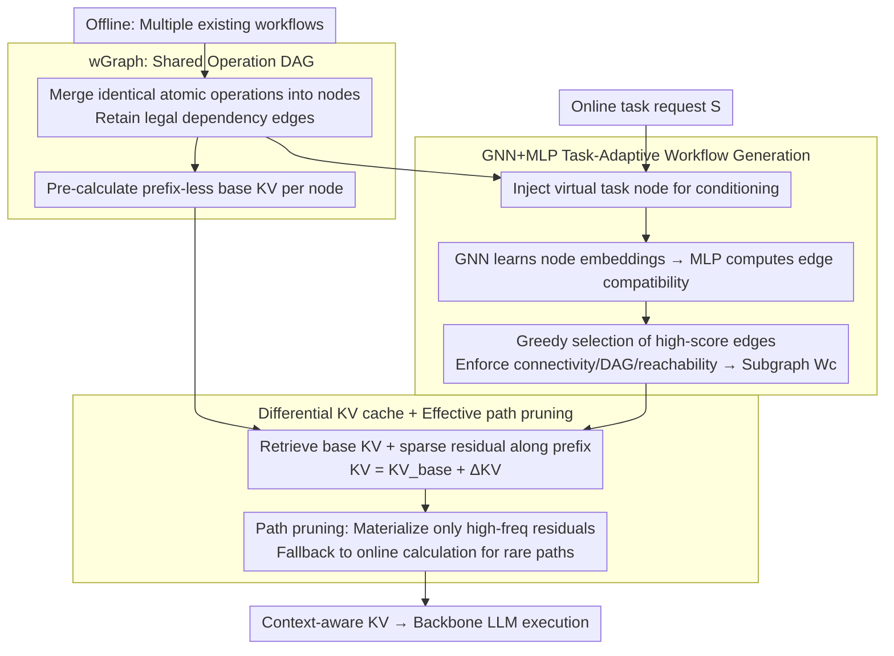

# GraphFlow: A Graph-Based Workflow Management for Efficient LLM-Agent Serving

**Conference**: ICML 2026  
**arXiv**: [2605.22566](https://arxiv.org/abs/2605.22566)  
**Code**: To be confirmed  
**Area**: LLM Efficiency / Agent  
**Keywords**: LLM Agent serving, workflow graph, KV cache reuse, GNN subgraph generation, topology-aware state management

## TL;DR
GraphFlow unifies multiple agent workflows into a global operational Directed Acyclic Graph (wGraph). It generates task-adaptive subgraph workflows online using GNN+MLP. By replacing independent workflow caching with differential caching ("base KV + sparse prefix residual + path pruning"), it achieves an average improvement of 4.95pp across five reasoning/coding/QA benchmarks while reducing KV memory consumption to approximately 1/4.

## Background & Motivation

**Background**: LLM agents for long-chain multi-step tasks increasingly rely on "workflows"—sequences of atomic operations (tool calls, thinking steps, validation modules) combined according to predefined rules. Representative systems like MetaGPT, TaskWeaver, AFlow, and AgentKB typically maintain a repository of workflow templates and retrieve the most similar template based on the task description.

**Limitations of Prior Work**: The authors identify two critical engineering bottlenecks. First, template/retrieval-based construction is too "coarse-grained"—treating the entire workflow as an indivisible unit fails to capture fine-grained correspondences between task requirements and internal process structures, leading to poor generalization on unseen tasks. Second, during serving, KV caches are managed independently for each workflow. Since different workflows frequently reuse identical atomic operations (e.g., the same tool call or validation prompt), the KV state for the same operation is redundantly stored across multiple workflow replicas, causing memory to grow linearly or super-linearly with the number of workflows.

**Key Challenge**: Correct attention context requires operations to be stateful based on their prefix. However, storing every (operation, prefix) pair leads to a "prefix combination explosion." Conversely, stateless storage (caching by operation only) breaks cross-step reasoning dependencies and causes significant performance degradation. Thus, a **trade-off exists between correctness (stateful) and scalability (sharing)**; standard template stitching fails to amortize redundant storage on shared structures like wGraph.

**Goal**: (1) Evolve workflow construction from "template retrieval" to "task-driven subgraph selection on a shared operation graph"; (2) Design a KV cache strategy on the shared operation graph that maintains correctness while enabling high reuse.

**Key Insight**: A key observation is that multiple workflows overlap significantly at the atomic operation level, and empirically, the KV matrices for the same operation are highly similar across different prefixes—>75% of K terms and >70% of V terms differ only within a very small threshold (Figure 3). This implies that KV can be effectively expressed as a "base KV + sparse residual."

**Core Idea**: Elevate both workflow "construction" and "state management" to a global operational graph (wGraph). On the construction side, use a GNN for task-conditional subgraph generation on wGraph. On the state side, eliminate redundant storage using "base KV + prefix differential KV + high-frequency path pruning."

## Method

### Overall Architecture
GraphFlow unifies workflow construction and KV state management onto a global operational graph. In the offline phase, it merges existing workflows into a Directed Acyclic Graph $\mathcal{G}_{\text{op}}=(\mathcal{V}_{\text{op}},\mathcal{E}_{\text{op}})$ (termed **wGraph**), where nodes are atomic operations and edges are legal dependencies. It pre-calculates "prefix-less base KV" for each node and trains a generation model. In the online phase, upon receiving a request $S$, it injects a virtual task node to condition the graph and uses GNN+MLP to select a task-specific subgraph as the workflow. During execution, it retrieves the base KV along the subgraph prefix and adds sparse residuals to reconstruct context-aware KV for the backbone LLM.

### Key Designs

**1. wGraph: Compressing scattered workflows into a shared operation DAG to enable computable operation-level reuse**

Template-based systems retrieve workflows as indivisible units, losing fine-grained structural correspondence and redundantly storing operation states. GraphFlow resolves this by merging identical atomic operations into node $v_i$ and retaining legal dependencies to form the global wGraph $\mathcal{G}_{\text{op}}$. Node features $\mathbf{x}_i\in\mathbb{R}^D$ encode functional semantics, linguistic triggers, and execution schemas. For each new task, a task-conditioned graph $\mathcal{G}=(\mathcal{V}_{\text{op}}\cup\{v_{\text{task}}\},\,\mathcal{E}_{\text{op}}\cup\{(v_{\text{task}},v_i),(v_i,v_{\text{task}})\})$ is constructed. Task semantics ($\mathbf{x}_{\text{task}}$ from the input query) are injected into candidate operations via message passing. This transforms the workflow from a "retrieval unit" into a "subgraph on wGraph," explicitly representing cross-workflow sharing.

**2. GNN+MLP Task-Adaptive Workflow Generation: Reassembling operations at edge granularity rather than top-1 template retrieval**

Retrieval-based methods generalize poorly to unseen tasks requiring recombination. GraphFlow frames construction as conditional subgraph selection: $\mathcal{W}^*=\arg\max_{\mathcal{W}\subseteq\mathcal{G}_{\text{op}}}\mathbb{E}[f(S,\mathcal{W})]$. It uses a GNN to learn embeddings fusing task context and structural dependencies $\mathbf{H}=\mathrm{GNN}(\mathbf{X},\mathbf{A}|\Theta_{\text{GNN}})$, and an MLP to compute task-aware compatibility scores $s_{i,j}=\mathrm{MLP}(\mathrm{Concat}[\mathbf{h}_i,\mathbf{h}_j,\mathbf{h}_{\text{task}}]|\Theta_{\text{MLP}})\in[0,1]$ for each edge $(v_i,v_j)$. By greedily selecting high-scoring edges starting from $v_{\text{task}}$ while enforcing DAG and reachability constraints, it constructs an executable subgraph $\mathcal{W}_c$. This allows the model to branch and recombine on wGraph based on the task, optimizing both "what" to do and "in what order." Experimentally, this yields more accurate and concise workflows (HumanEval +8.1pp with reduced latency).

**3. Differential KV cache + Effective path pruning: Eliminating exponential redundancy while maintaining prefix-dependent correctness**

Operation KV must be stateful for correct attention, but per-(operation, prefix) storage leads to combination explosion, while stateless storage degrades reasoning. GraphFlow relies on the observation that >75% of K and >70% of V terms remain similar across prefixes. It pre-calculates prefix-less $\mathbf{KV}_{\text{base}}(v)$ and stores only sparse residuals $\Delta\mathbf{KV}(\mathcal{P},v)$ for actual prefix paths $\mathcal{P}$. At execution, it reconstructs $\mathbf{KV}(\mathcal{P},v)=\mathbf{KV}_{\text{base}}(v)+\Delta\mathbf{KV}(\mathcal{P},v)$. This is further optimized via **effective path pruning**: residuals are materialized only for high-frequency transitions identified via execution statistics, while rare/unreachable paths are computed on-the-fly. This decouples prefix dependence from memory redundancy, causing memory to scale with the active working set of trajectories rather than combinatorial complexity, reducing memory to ~1/4 of stateful baselines.

### Loss & Training
The paper provides the formal inference objective $\mathcal{W}^*=\arg\max_{\mathcal{W}}\mathbb{E}[f(S,\mathcal{W})]$, where $f$ represents downstream task metrics (e.g., success rate). Specific training objectives, subgraph sampling (such as Gumbel-softmax), and GNN architecture details are provided in Appendix B. Base KVs are computed once offline; prefix residuals are driven by execution statistics and managed by the pruning strategy.

## Key Experimental Results

### Main Results

Setup: Three backbones (Qwen-2.5-7B, Llama-3.1-8B, Gemma-2-9B) across five benchmarks (GSM8K, MATH, HotpotQA, HumanEval, MBPP), compared against 7 baselines (Vanilla, MetaGPT, LLMCompiler, TaskWeaver, AgentKB, AutoFlow, AFlow). Metrics include Acc, F1, pass@1, and P90 latency.

| Backbone | Dataset | Metric | AFlow (SOTA baseline) | GraphFlow | Gain |
|----------|---------|--------|------------------------|-----------|------|
| Qwen-2.5-7B | GSM8K | Acc | 89.2 | **92.1** | +2.9 |
| Qwen-2.5-7B | MATH | Acc | 72.1 | **76.4** | +4.3 |
| Qwen-2.5-7B | HumanEval | pass@1 | 78.1 | **86.2** | +8.1 |
| Qwen-2.5-7B | MBPP | pass@1 | 68.4 | **74.7** | +6.3 |
| Qwen-2.5-7B | HotpotQA | F1 | 67.5 | **70.4** | +2.9 |
| Llama-3.1-8B | HumanEval | pass@1 | 72.2 | **76.6** | +4.4 |
| Llama-3.1-8B | MATH | Acc | 47.5 | **52.6** | +5.1 |
| Gemma-2-9B | HumanEval | pass@1 | 75.4 | **82.5** | +7.1 |
| Gemma-2-9B | MBPP | pass@1 | 66.1 | **72.8** | +6.7 |

Regarding P90 latency on Qwen-2.5-7B, the aggregated latency dropped from 14.06s (AFlow) to 12.25s, demonstrating that generated workflows are both more accurate and more efficient.

### Ablation Study

| Configuration | Key Metric | Description |
|---------------|------------|-------------|
| Stateful KV (Upper Bound) | MATH Acc 53.8; GSM8K KV ≈ 50 GB | Individual caching per workflow; high correctness, but memory explosion |
| **GraphFlow (Diff + Pruning)** | MATH Acc 52.6 (-1.2pp); GSM8K KV ≈ 11 GB | ~1/4 memory; performance nearly aligned with stateful |
| Stateless KV | MATH Acc 39.4; HotpotQA F1 ≈ 58.6 | Prefix ignored; significant drop in long-chain reasoning |
| GraphFlow w/o path pruning | KV reduction: GSM8K 15.0 → **11.5** GB | Pruning filters out "reachable but never used" edges |
| Concurrent Scaling (BS 10→50) | Stateful: 0.8 GB → > 2.4 GB; GraphFlow: < 0.5 GB | Base KV is shared; memory growth is negligible with concurrency |

### Key Findings
- **Feasibility of differential KV from structural observation**: Empirically, >70% of KV terms have near-zero prefix differences (Figure 3). This enables precise compensation via sparse residuals without sacrificing correctness.
- **Impact of path pruning**: In high-branching tasks like HotpotQA, pruning saves an additional ≈4.2 GB. It ensures KV memory scales with actual execution trajectories rather than combinatorial complexity.
- **Simultaneous improvement in accuracy and efficiency**: In HumanEval, pass@1 increased significantly (+8.1pp) while latency decreased, validating the hypothesis that task-adaptive generation produces "leaner and more accurate" workflows.

## Highlights & Insights
- **Workflow as a global graph**: Unlike treating workflows as isolated templates (MetaGPT/TaskWeaver), merging operations into a global DAG (wGraph) makes structural "sharing" a first-class computable object. This single abstraction enables both GNN-based generation and cross-workflow KV sharing.
- **Operation-level differential KV**: While existing serving optimizations (PagedAttention, prefix caching) focus on token-level exact matches, GraphFlow works at the operation level and relaxes the requirement from "identical prefix" to "approximate prefix $\implies$ sparse differential," which better suits agentic patterns.
- **Transferable design**: The combination of "shared base + sparse residual + path pruning" is naturally applicable to RAG pipelines, prompt template pools, and tool-use sequences—any scenario where LLM calls overlap significantly.

## Limitations & Future Work
- **wGraph Maintenance**: The paper assumes a predefined set of atomic operations and dependencies. The automated extraction of these primitives from historical data and the online expansion of wGraph for new scenarios remain underexplored.
- **GNN Training Signals**: The $\arg\max\mathbb{E}[f]$ objective is non-differentiable. While details are in Appendix B, the reliance on advanced sampling or reinforcement learning may increase reproduction difficulty.
- **Cumulative Bias in Long Chains**: The 1.2pp drop in MATH suggests that residual errors might accumulate in extremely long reasoning chains; more validation on high-hop tool chains is needed.
- **Cold Start Robustness**: Path pruning depends on execution statistics, which might be sparse during initial deployment or distribution shifts.

## Related Work & Insights
- **vs MetaGPT / AFlow**: While these methods treat workflows as isolated SOPs or graphs, GraphFlow merges them to optimize global structure and serving.
- **vs LLMCompiler**: LLMCompiler uses task-specific DAGs for tool dependencies; GraphFlow uses a global wGraph to enable cross-task sharing.
- **vs PagedAttention / Prefix Caching**: These assume exact token-level prefix matches. GraphFlow relaxes this to operation-level similarity, capturing reuse opportunities that token-perfect caching would miss.
- **vs AgentKB**: While AgentKB focuses on knowledge-driven structures, GraphFlow integrates structural awareness with serving-layer optimization (KV reuse).

## Rating
- Novelty: ⭐⭐⭐⭐ Unifying workflow generation and serving optimization on a global operation graph is a clean and effective combination.
- Experimental Thoroughness: ⭐⭐⭐⭐ Extensive testing across three backbones and five benchmarks with diverse ablation targets.
- Writing Quality: ⭐⭐⭐⭐ Clear motivation and architecture; strong synergy between formulas and figures, though Appendix-dependent.
- Value: ⭐⭐⭐⭐ Highly practical for industrial agent serving: 4× KV compression and +4.95pp average gain with efficient concurrency scaling.

<!-- RELATED:START -->

## Related Papers

- [\[ICML 2026\] Theoretically Optimal Attention/FFN Ratios in Disaggregated LLM Serving](theoretically_optimal_attentionffn_ratios_in_disaggregated_llm_serving.md)
- [\[ICML 2026\] OServe: Accelerating LLM Serving via Spatial-Temporal Workload Orchestration](oserve_accelerating_llm_serving_via_spatial-temporal_workload_orchestration.md)
- [\[ICML 2026\] Optimal Bayesian Stopping for Efficient Inference of Consistent LLM Answers](optimal_bayesian_stopping_for_efficient_inference_of_consistent_llm_answers.md)
- [\[NeurIPS 2025\] Efficient Training-Free Online Routing for High-Volume Multi-LLM Serving](../../NeurIPS2025/llm_efficiency/efficient_training-free_online_routing_for_high-volume_multi-llm_serving.md)
- [\[ICML 2026\] OBCache: Optimal Brain KV Cache Pruning for Efficient Long-Context LLM Inference](obcache_optimal_brain_kv_cache_pruning_for_efficient_long-context_llm_inference.md)

<!-- RELATED:END -->
