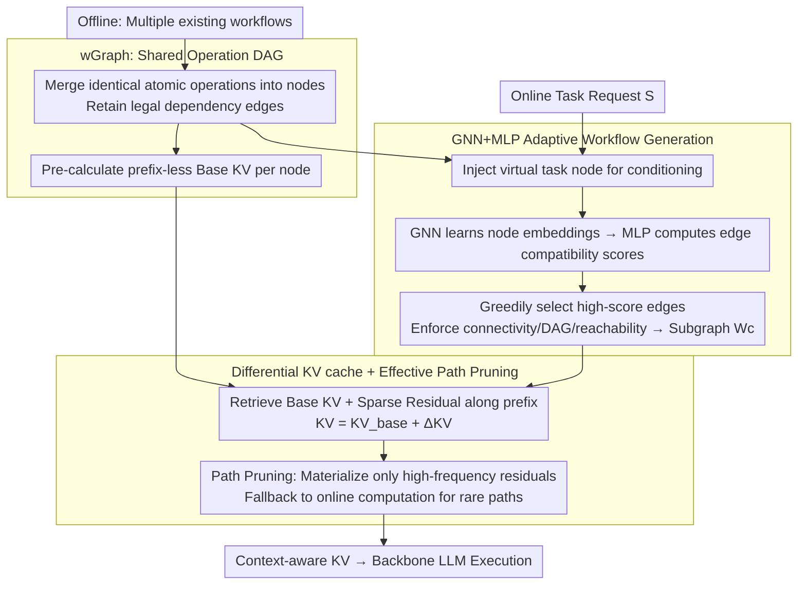

# GraphFlow: A Graph-Based Workflow Management for Efficient LLM-Agent Serving

**Conference**: ICML 2026  
**arXiv**: [2605.22566](https://arxiv.org/abs/2605.22566)  
**Code**: To be confirmed  
**Area**: LLM Efficiency / Agent  
**Keywords**: LLM Agent Serving, Workflow Graph, KV cache reuse, GNN Subgraph Generation, Topology-aware State Management

## TL;DR
GraphFlow unifies multiple agent workflows into a global operational DAG (wGraph). It uses GNN+MLP to generate task-adaptive subgraph workflows online and replaces traditional independent caching with a differential KV cache strategy ("Base KV + Sparse Prefix Residual + Path Pruning"). This achieves an average improvement of 4.95pp across five benchmarks while reducing KV memory to approximately 1/4.

## Background & Motivation

**Background**: LLM agents increasingly rely on "workflows" for long-chain, multi-step tasks—combining atomic operations (tool calls, reasoning steps, verification modules) according to predefined orders and control rules. Representative systems like MetaGPT, TaskWeaver, AFlow, and AgentKB typically maintain a workflow repository and retrieve the most similar template based on the task description for execution.

**Limitations of Prior Work**: The authors identify two significant engineering bottlenecks. First, template/retrieval-based construction is too "coarse-grained"—treating the entire workflow as an indivisible unit fails to capture fine-grained correspondences between task requirements and internal process structures, leading to poor generalization for unseen tasks requiring recombination. Second, during serving, KV caches are managed "independently per workflow." Since different workflows frequently reuse the same atomic operations (e.g., same tool calls or verification prompts), redundant copies of KV states for the same operation are stored across multiple workflow instances, causing memory to grow linearly or even super-linearly with the number of workflows.

**Key Challenge**: The KV state of an operation must be stateful (prefix-dependent) to ensure correct attention context. However, storing every (operation, prefix) pair leads to a "prefix combination explosion," while storing operations statelessly (individually) breaks cross-step reasoning dependencies and causes significant performance drops. Thus, a **trade-off exists between correctness (stateful) and scalability (sharing)**, which simple template assembly cannot resolve on shared structures like wGraph.

**Goal**: (1) Upgrade workflow construction from "template retrieval" to "task-adaptive subgraph selection on a shared operation graph"; (2) Design a KV cache strategy on the shared graph that maintains correctness while achieving high reuse.

**Key Insight**: The authors observe that multiple workflows have significant overlap at the atomic operation level. Empirically, the KV matrices calculated for the same operation under different prefixes are highly similar: over 75% of K-entries and 70% of V-entries have differences within a very small threshold (Figure 3). This implies that KV states can be represented as "Base KV + Sparse Residuals."

**Core Idea**: Elevate both workflow "construction" and "state management" to a global operation graph (wGraph). For construction, use a GNN for task-conditioned subgraph generation on the wGraph; for state management, eliminate redundant storage using "Base KV + Prefix Differential KV + High-frequency Path Pruning."

## Method

### Overall Architecture
GraphFlow unifies workflow construction and KV state management onto a global operation graph. In the offline phase, it merges all existing workflows into a directed acyclic graph (DAG) $\mathcal{G}_{\text{op}}=(\mathcal{V}_{\text{op}},\mathcal{E}_{\text{op}})$ (termed **wGraph**), where nodes are atomic operations and edges represent legal dependencies. It pre-calculates "prefix-less base KV" for each node and trains a generation model. Upon receiving an online request $S$, a virtual task node is injected to condition the graph, and a GNN+MLP extracts a task-specific subgraph as the workflow. During execution, it fetches base KV along the subgraph prefix, adds sparse residuals to reconstruct context-aware KV, and feeds it to the backbone LLM.

### Key Designs

**1. wGraph: Compressing scattered workflows into a shared operation DAG to make "operation-level reuse" computable**

Template-based systems retrieve workflows as indivisible units, losing fine-grained mapping and causing redundant state storage. GraphFlow resolves this by merging identical atomic operations into node $v_i$ and retaining dependency edges to form the global wGraph $\mathcal{G}_{\text{op}}$. Node features $\mathbf{x}_i\in\mathbb{R}^D$ encode functional semantics, language triggers, and execution schemas. For new tasks, a task-conditioned graph $\mathcal{G}=(\mathcal{V}_{\text{op}}\cup\{v_{\text{task}}\},\,\mathcal{E}_{\text{op}}\cup\{(v_{\text{task}},v_i),(v_i,v_{\text{task}})\})$ is formed. Task semantics ($\mathbf{x}_{\text{task}}\in\mathbb{R}^D$) are injected via message passing. This transforms workflows from "retrieval units" to "subgraphs on wGraph," explicitly expressing cross-workflow sharing.

**2. GNN+MLP Task-Adaptive Workflow Generation: Recombining operations at edge granularity**

Retrieval-based construction generalizes poorly to unseen tasks. GraphFlow reformulates construction as conditional subgraph selection: $\mathcal{W}^*=\arg\max_{\mathcal{W}\subseteq\mathcal{G}_{\text{op}}}\mathbb{E}[f(S,\mathcal{W})]$. A GNN learns node embeddings $\mathbf{H}=\mathrm{GNN}(\mathbf{X},\mathbf{A}|\Theta_{\text{GNN}})$ fusing task context and structural dependencies. An MLP then computes task-aware compatibility scores $s_{i,j}=\mathrm{MLP}(\mathrm{Concat}[\mathbf{h}_i,\mathbf{h}_j,\mathbf{h}_{\text{task}}]|\Theta_{\text{MLP}})\in[0,1]$ for each edge $(v_i,v_j)$. Starting from $v_{\text{task}}$, the model greedily selects high-score edges while enforcing structural validity (connectivity, DAG, reachability) to form workflow $\mathcal{W}_c$. This allows the model to branch and recombine operations, unifying "what to do" and "in what order" into a generation problem. Experiments show this produces more accurate and concise workflows (HumanEval +8.1pp with reduced latency).

**3. Differential KV cache + Effective Path Pruning: Eliminating exponential redundancy while maintaining correctness**

KV states must be stateful for correct attention, but storing every (operation, prefix) induces an explosion of prefixes. GraphFlow leverages an empirical observation: the KV of the same operation under different prefixes is highly similar (Figure 3). It pre-materializes a prefix-less $\mathbf{KV}_{\text{base}}(v)$ for each operation $v$. For actual prefix paths $\mathcal{P}$, it stores only sparse residuals $\Delta\mathbf{KV}(\mathcal{P},v)$, reconstructing at runtime via $\mathbf{KV}(\mathcal{P},v)=\mathbf{KV}_{\text{base}}(v)+\Delta\mathbf{KV}(\mathcal{P},v)$. Due to extreme sparsity, this compression is nearly lossless. Furthermore, **effective path pruning** identifies high-frequency transitions via execution statistics; only residuals for these paths are materialized. Rare paths are computed on-the-fly. This decouples "prefix dependency" from "memory redundancy," converging storage scale to the actual working set rather than combinatorial complexity, reducing memory to ~1/4 of the stateful approach.

### Loss & Training
The main text provides the formal objective for inference: $\mathcal{W}^*=\arg\max_{\mathcal{W}}\mathbb{E}[f(S,\mathcal{W})]$, where $f$ is a task-level metric (Success Rate/Accuracy). Specific training objectives, subgraph sampling (e.g., Gumbel-softmax), and GNN details are provided in Appendix B. Base KVs are computed once offline; prefix residuals are driven by execution statistics.

## Key Experimental Results

### Main Results

Setup: Three backbones (Qwen-2.5-7B, Llama-3.1-8B, Gemma-2-9B) across five benchmarks (GSM8K, MATH, HotpotQA, HumanEval, MBPP), compared against 7 baselines (Vanilla, MetaGPT, LLMCompiler, TaskWeaver, AgentKB, AutoFlow, AFlow). Metrics include Acc / F1 / pass@1 and P90 latency.

| Backbone | Dataset | Metric | AFlow (SOTA baseline) | GraphFlow | Gain |
|----------|--------|------|------------------------|-----------|------|
| Qwen-2.5-7B | GSM8K | Acc | 89.2 | **92.1** | +2.9 |
| Qwen-2.5-7B | MATH | Acc | 72.1 | **76.4** | +4.3 |
| Qwen-2.5-7B | HumanEval | pass@1 | 78.1 | **86.2** | +8.1 |
| Qwen-2.5-7B | MBPP | pass@1 | 68.4 | **74.7** | +6.3 |
| Qwen-2.5-7B | HotpotQA | F1 | 67.5 | **70.4** | +2.9 |
| Llama-3.1-8B | HumanEval | pass@1 | 72.2 | **76.6** | +4.4 |
| Llama-3.1-8B | MATH | Acc | 47.5 | **52.6** | +5.1 |
| Gemma-2-9B | HumanEval | pass@1 | 75.4 | **82.5** | +7.1 |
| Gemma-2-9B | MBPP | pass@1 | 66.1 | **72.8** | +6.7 |

Regarding P90 latency, aggregate P90 on Qwen-2.5-7B dropped from 14.06s (AFlow) to 12.25s, indicating that the generated workflows are both more accurate and more efficient.

### Ablation Study

| Configuration | Key Metric | Description |
|------|---------|------|
| Stateful KV (Upper Bound) | MATH Acc 53.8; GSM8K KV ≈ 50 GB; HotpotQA KV ≈ 85 GB | Independent cache per workflow; strong correctness, memory explosion |
| **GraphFlow (Diff + Pruning)** | MATH Acc 52.6 (only -1.2pp); GSM8K KV ≈ 11 GB; HotpotQA KV ≈ 25 GB | ~1/4 memory, performance nearly matches stateful |
| Stateless KV | MATH Acc 39.4; HotpotQA F1 ≈ 58.6; KV 8–17 GB | Completely ignores prefix; long-chain reasoning drops significantly |
| GraphFlow w/o path pruning | GSM8K KV 15.0 → **11.5** GB; MBPP 9.9 → **7.2** GB | Pruning filters out "semantically reachable but unused" edges |
| Concurrent Scaling (BS 10→50) | Stateful: 0.8 GB → > 2.4 GB; GraphFlow: Constantly < 0.5 GB | Base KV shared across requests; memory barely grows with concurrency |

### Key Findings
- **Feasibility of Differential KV**: Empirical structural observations show that >75% of K and >70% of V prefix differences are near zero (Figure 3). This decoupling allows sparse residuals to compensate for prefix effects with minimal loss.
- **Impact of Path Pruning**: In high-branching tasks like HotpotQA, pruning saves an additional ~4.2 GB. It shows that many wGraph transitions are semantically reachable but never executed, allowing memory to grow with the active working set rather than combinatorial complexity.
- **Joint Accuracy and Efficiency**: In HumanEval, performance increased from 78.1% to 86.2% (+8.1pp) while latency decreased, validating the hypothesis that task-adaptive generation trims unnecessary operations.

## Highlights & Insights
- **Workflow as a Graph**: Unlike treating workflows as independent retrieval units, merging them into a global wGraph makes sharing a computable object. This enables both GNN-based generation and cross-workflow KV sharing within a single abstraction.
- **Precise Granularity for Differential KV**: While other works perform KV reuse at the token or page level, GraphFlow operates at the operation level. By proving that operation-level differences are sparse, it transitions "theoretical differential caching" into "lossless engineering."
- **Transferable Design**: The "Shared Base + Sparse Residuals + Path Pruning" combination can be naturally applied to RAG pipelines, prompt template pools, or tool-use sequences—any scenario with highly overlapping multi-stage LLM calls.

## Limitations & Future Work
- **wGraph Maintenance**: The paper assumes a predefined set of atomic operations and dependencies. The automated extraction of these primitives from historical workflows and the online expansion of wGraph for new scenarios remain underexplored.
- **Training Signals**: The $\arg\max\mathbb{E}[f]$ objective for subgraph selection is non-differentiable. The reliance on Appendix B for training details (RL vs. imitation learning) makes reproduction challenging.
- **Error Accumulation**: The 1.2pp drop in MATH suggests that residual errors might accumulate in extremely long horizons; verification on tasks with more "hops" is needed.
- **Pruning Robustness**: Pruning relies on execution statistics. Its robustness during cold starts or distribution shifts requires further discussion.

## Related Work & Insights
- **vs MetaGPT / AFlow**: These treat workflows as independent units. GraphFlow's wGraph enables structural sharing and task-adaptive recombination.
- **vs LLMCompiler**: LLMCompiler uses task-specific DAGs. GraphFlow uses a global wGraph, expanding reuse from "within a request" to "across all requests."
- **vs PagedAttention / Prefix Caching**: These systems assume identical prefixes for reuse. GraphFlow relaxes this to "approximate prefixes" via differential sparsity, fitting the actual reuse patterns of agentic workflows.

## Rating
- Novelty: ⭐⭐⭐⭐ Unifying workflows into a global graph and applying differential KV is a clean, effective combination.
- Experimental Thoroughness: ⭐⭐⭐⭐ Comprehensive coverage across three backbones and five benchmarks with diverse ablations.
- Writing Quality: ⭐⭐⭐⭐ Clear motivation and abstraction; well-integrated diagrams.
- Value: ⭐⭐⭐⭐ Directly applicable to industrial agent serving: 4x memory compression with improved accuracy.

<!-- RELATED:START -->

## Related Papers

- [\[ICML 2026\] Theoretically Optimal Attention/FFN Ratios in Disaggregated LLM Serving](theoretically_optimal_attentionffn_ratios_in_disaggregated_llm_serving.md)
- [\[ICML 2026\] OServe: Accelerating LLM Serving via Spatial-Temporal Workload Orchestration](oserve_accelerating_llm_serving_via_spatial-temporal_workload_orchestration.md)
- [\[ICLR 2026\] IceCache: Memory-Efficient KV-cache Management for Long-Sequence LLMs](../../ICLR2026/llm_efficiency/icecache_memory-efficient_kv-cache_management_for_long-sequence_llms.md)
- [\[ICLR 2026\] MemAgent: Reshaping Long-Context LLM with Multi-Conv RL-based Memory Agent](../../ICLR2026/llm_efficiency/memagent_reshaping_long-context_llm_with_multi-conv_rl-based_memory_agent.md)
- [\[ICLR 2026\] Dynamic Speculative Agent Planning](../../ICLR2026/llm_efficiency/dynamic_speculative_agent_planning.md)

<!-- RELATED:END -->
