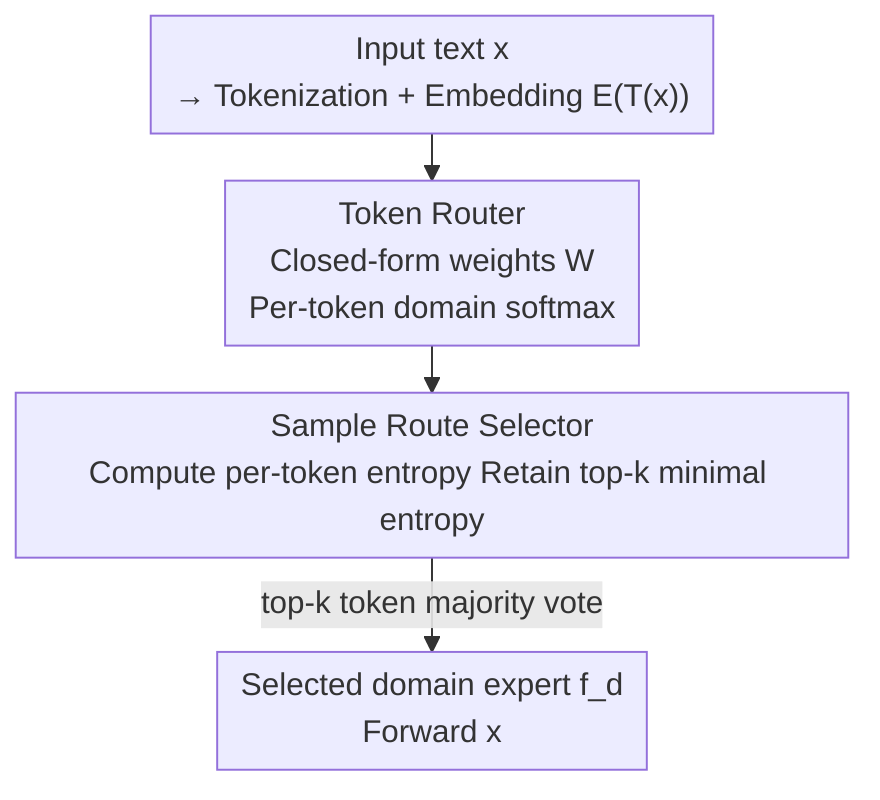

# IR3DE: A Linear Router for Large Language Models

**Conference**: ICML 2026  
**arXiv**: [2606.06098](https://arxiv.org/abs/2606.06098)  
**Code**: https://github.com/gensyn-ai/IR3DE  
**Area**: LLM Efficiency / Inference Routing / Expert Model Selection  
**Keywords**: LLM Routing, Ridge Regression, Domain Experts, Token-level Routing, Decentralized Training

## TL;DR
This paper proposes IR3DE—a linear LLM router constructed using the **closed-form solution of ridge regression**. It routes each prompt to the most suitable domain expert based solely on token embeddings, eliminating the need to train additional language models or centralize datasets. It allows experts to be added or removed dynamically without retraining the router. Despite its linear nature, it achieves 98.4% normalized performance on reasoning tasks, surpassing all baselines.

## Background & Motivation

**Background**: The number of available LLMs is increasing—general foundation models perform well across wide tasks, while domain experts (code, math, instruction following, etc.) are stronger in their respective specialties. Consequently, "inference routers" have emerged to dynamically select the most appropriate model for each query.

**Limitations of Prior Work**: Existing routing methods fall into two categories, both with significant drawbacks. One category focuses on **cost-performance trade-offs**, selecting between strong/weak general models of different capacities. These primarily route by query difficulty rather than model "expertise." The other category targets **expertise routing** for accuracy, but generally requires an auxiliary (language) model for query classification or extracting final-layer hidden states as token embeddings. This necessitates centralizing all domain datasets to train the router—a requirement often infeasible due to privacy constraints or limited communication/computational budgets.

**Key Challenge**: The desire for "accurate expertise-based routing" currently requires the cost of "training a heavy LM router + centralizing all domain data." Conversely, "cheap and fast" routing is restricted to coarse difficulty-based selection. Achieving expertise routing, lightweight efficiency, and decentralization simultaneously is difficult.

**Goal**: To create a router that accurately routes to domain experts, remains **cheap and fast, and supports decentralization and hot-swapping of experts**. Specifically: routing decisions must be cheap & fast; router construction should not require centralizing data at a single node; and adding/removing experts should not require retraining from scratch.

**Key Insight**: The authors leverage the closed-form solution of ridge regression (Regularized Least Squares, RLS), which has been proven in federated learning and MoE routing to allow for asynchronous accumulation of statistics. Since the RLS solution relies only on two statistical matrices that can be accumulated batch-wise, each domain dataset can be treated as an independent batch calculated at its own node, naturally fitting decentralization and hot-swapping.

**Core Idea**: Use a **linear ridge regression token router** to assign domain distributions to each token, followed by an **entropy-based sample selector** that allows only the "most confident" top-k tokens to vote for the expert—compressing the entire router overhead to "a single small matrix inversion."

## Method

### Overall Architecture
IR3DE consists of two components: the **Token Router (TR)** and the **Sample Route Selector (SRS)**. Given an input text $x$, it is converted into a token embedding matrix using an arbitrary tokenizer $\mathcal{T}$ and a pretrained embedding layer $\mathcal{E}$. The TR uses linear weights $W$ to map each token into a domain softmax probability vector. The SRS then calculates the Shannon entropy of these per-token probabilities, retaining only the top-k tokens with the lowest entropy (highest confidence). These tokens vote via majority rule to select the final domain expert for $x$. $W$ is calculated via a closed-form ridge regression solution rather than gradient-based training, and its statistics can be accumulated across batches or nodes.

### Key Designs

**1. Ridge Regression Token Router: Turning the Router into a "Small Matrix Inversion"**

To route by domain, the most direct approach is training a classifier, but that requires gradient descent and centralized data. The authors formulate this as a regularized least squares problem: let $\mathcal{E}(\mathcal{T}(X))\in\mathbb{R}^{n\times h}$ be the stacked embeddings of all tokens across all domain samples, and $Y\in\mathbb{R}^{n\times C}$ be the corresponding domain one-hot labels ($Y_{ij}=1$ if token $i$ belongs to domain $j$). The goal is to solve:

$$\min_{W\in\mathbb{R}^{h\times C}}\big[\,\lVert \mathcal{E}(\mathcal{T}(X))-Y\rVert^2+\lambda\lVert W\rVert^2\,\big]$$

The closed-form solution is $W^*=(\mathcal{E}(\mathcal{T}(X))^\top\mathcal{E}(\mathcal{T}(X))+\lambda I_h)^{-1}\mathcal{E}(\mathcal{T}(X))Y$, where $\lambda$ controls Tikhonov regularization. At inference time, $\mathcal{R}(x)=\mathrm{softmax}(\mathcal{E}(\mathcal{T}(x))W)$ provides a domain probability vector for each token.

The defining benefit of this design is that **statistics are batch-accumulable**: defining $A\coloneqq\sum_j [\mathcal{E}]_{j:j+J}^\top[\mathcal{E}]_{j:j+J}$ and $B\coloneqq\sum_j[\mathcal{E}]_{j:j+J}^\top[Y]_{j:j+J}$, then $W^*=(A+\lambda I_h)^{-1}B$. Both $A$ ($h\times h$, typically ~1k×1k) and $B$ can be accumulated independently per batch, domain, or node. Thus, **domain data does not need to be centralized**, and **new experts can be added anytime** simply by adding their statistics. The overhead is negligible, requiring only one small matrix inversion. Notably, the $\mathcal{T}$ and $\mathcal{E}$ used by TR are **fully decoupled** from those used by the experts.

**2. Entropy-based Sample Route Selector: Only Confident Tokens Vote**

After obtaining per-token domain distributions, how should a final decision for a prompt be aggregated? A naive approach is letting all tokens vote, but this introduces noise: common tokens like "the" appear frequently in all domains, leading ridge regression to assign near-uniform probabilities (e.g., $(0.5, 0.5)$ for two domains). Such **non-discriminative** tokens only disrupt the voting. The SRS calculates the Shannon entropy $e_t=-\sum_{d=1}^D s_{td}\log s_{td}$ for each token's softmax $s_t$, selecting only the $\min(k,T)$ tokens with the **lowest** entropy (the most confident). These vote via $\arg\max$ to determine the domain.

This is effective because high-entropy tokens are precisely those that appear with equal frequency across domains and provide no routing information. Removing them leaves discriminative tokens that carry true domain signals. Experiments show a "sweet spot" for $k$: too small lacks signal, too large introduces uncertain noise.

**3. Three SRS Variants: Balancing Accuracy and Overhead**

To address how token signals are used to select experts, the authors provide three tiers. The default **IR3DE** uses the top-k minimal entropy + majority vote mentioned above, offering the highest accuracy for complex reasoning. **IR3DE-all** skips entropy filtering, letting all tokens (truncated to 1024) participate in voting; while it simplifies the SRS logic, it yields lower average scores due to noise. **IR3DE-avg** is the most efficient: it averages token embeddings first, then calculates softmax on the mean vector to select the domain via $\arg\max$; its weakness is that strong signal compression reduces individual token discriminative power.

### Loss & Training
There is no "training" in the traditional sense—$W$ is calculated via a closed-form solution (though one could optionally train $\mathcal{R}$ with cross-entropy). The only tunable parameters are the regularization coefficient $\lambda$, the top-k threshold $k$ (tested $k\in\{1,2,5,10,20,50,100,200,500\}$), and the choice of embedding layer. All experiments were conducted on a single NVIDIA H100 (80GB HBM3).

## Key Experimental Results

Three settings were used: two causal language modeling tasks (CLM and CLMlarge, using next-token prediction perplexity) and a Reasoning task (specific reasoning benchmarks for each domain). Results are reported as **normalized metrics**—the performance of a method in a domain divided by the domain expert's own performance ($\bar p_d=\hat p_d/p_d$ for CLM, $\bar p_d=p_d/\hat p_d$ for Reasoning), multiplied by 100. Due to sampling randomness (temperature 0.7), scores may slightly exceed 100. Baselines include domain experts, expert average, random routing, MoDEM-small/large (DeBERTa v3, 44M/304M), and 1NN/kNN routers (BERT embeddings).

### Main Results

| Setting | IR3DE Avg | kNN router | MoDEM-large | Remarks |
|------|------|------|------|------|
| CLM (5 domains) | 98.2 (IR3DE-all 100.0) | 100.0 | 98.3 | Surpasses all baselines in Coding/Math/Physics |
| CLMlarge (4 domains) | 95.3 | 97.9 | 87.0 | Significantly better than MoDEM, slightly lower than kNN |
| Reasoning (4 domains) | **98.4** | 97.6 | 72.3 | Ranked first on average, first or second in all single domains |

Reasoning is IR3DE's highlight: using LLaMA3-3B domain experts (Code/Math/Multilingual/Instruct) from MergeBench and evaluating on HumanEval (pass@1), GSM8k, M_ARC, and IFEval. IR3DE's average of 98.4% exceeds kNN (97.6%), while MoDEM (which relies on external LMs) collapses to 72–74%. Notably, in CLM, MoDEM-large (304M) is larger than the experts themselves, making it impractical for deployment.

### Ablation Study

| Configuration | Reasoning Avg | Description |
|------|---------|------|
| IR3DE (top-k entropy filtering) | 98.4 | Default, highest accuracy |
| IR3DE-all (all token voting) | 95.0 | Dropping entropy filtering introduces noise, -3.4 gain |
| IR3DE-avg (embedding average) | 96.0 | Most efficient, high signal compression |
| top-k $k$ scan | — | Small $k$ lacks signal, large $k$ adds noise; sweet spot exists |

### Key Findings
- **Entropy filtering is critical**: Removing it (IR3DE-all) decreases scores across all settings. Common high-entropy tokens (like "the") appear equally across domains with near-uniform probabilities; their votes dilute the signal. Selecting top-k minimal entropy tokens ensures "only confident votes are heard."
- **Sweet spot for $k$**: Routing accuracy follows an inverted U-shape as $k$ increases, showing that the router needs enough confident token signals while excluding noise from uncertain ones.
- **Linear models are powerful**: Despite being a closed-form linear router, IR3DE outperforms LM-based baselines in Reasoning. In the CLM setting, IR3DE-all hits an average of 100.0, matching the experts' performance in their respective domains.
- **Expertise routing beats difficulty routing**: In Reasoning tasks with high domain variance, MoDEM (relying on LM classification) fails significantly. This indicates that for expert pools, "selecting the right domain" is more vital than "estimating difficulty."

## Highlights & Insights
- **Downsizing the router from a "trained model" to a "matrix inversion"**: Using ridge regression closed-form solutions with accumulable $A,B$ statistics eliminates training costs. It simultaneously enables decentralization (data remains on-node) and hot-swapping (incremental statistics)—providing a substantial engineering advantage over MoDEM/PolyRouter.
- **Clean use of entropy as "token confidence"**: By using softmax entropy to separate discriminative tokens from noise without additional parameters, the authors provide a lightweight trick adaptable to any token-level aggregation task.
- **Decoupled tokenizer and embeddings**: The router's tokenizer and embedding layer are independent of the experts, meaning a mixture-of-experts system can serve heterogeneous models trained with different tokenizers.
- **Scientifically grounded decentralization**: The authors explicitly link "treating each dataset as an independent batch" to the reuse of RLS statistics in federated learning, providing theoretical support for privacy-constrained routing.

## Limitations & Future Work
- The authors acknowledge an **expression ceiling** for linear structures: IR3DE may be weaker than LM-based routers on queries requiring deep semantic understanding or complex decision boundaries. It is fundamentally a "domain relevance" discriminator.
- Routing is domain-centric and **does not consider multi-step reasoning needs**: In scenarios where query difficulty varies wildly within a single domain, domain labels alone may be insufficient.
- Current benchmarks do not integrate **system-level costs** (compute, latency, VRAM) into routing objectives, leaving a gap before real-world deployment.
- Future Work: Upgrading to Kernel Ridge Regression to capture non-linear structures (while retaining analytical simplicity), adapting to more complex reasoning, and explicitly incorporating latency/compute costs into the routing objective.

## Related Work & Insights
- **vs MoDEM**: MoDEM trains a DeBERTa v3 router on the union of domain data, requiring centralization; the large version (304M) is larger than the experts. IR3DE uses a closed-form solution with data staying on-node and negligible costs, outperforming MoDEM 98.4 vs 72–74 in Reasoning.
- **vs PolyRouter**: These require extra LMs for classification or token embedding extraction. IR3DE uses existing embeddings but calculates weights analytically, supporting hot-swapping.
- **vs kNN router**: The kNN router uses BERT embeddings for nearest-neighbor voting and is a strong baseline. IR3DE matches it in CLM and surpasses it in Reasoning (98.4 vs 97.6) without requiring external LMs or centralized data.
- **vs Cost-Difficulty Routers (RouterLLM, etc.)**: These route by difficulty among general models. IR3DE focuses on "routing by expertise," serving as a complementary approach.

## Rating
- Novelty: ⭐⭐⭐⭐ Combining ridge regression closed-form solutions with entropy filtering for decentralized, hot-swappable routing is engineering-novel, though components are classic.
- Experimental Thoroughness: ⭐⭐⭐⭐ Extensive across three settings, multiple domains, three variants, and $k$ scans, though expert sizes remain small (115M–3B).
- Writing Quality: ⭐⭐⭐⭐ Clear logic across motivation, method, and experiments; solid arguments for decentralization.
- Value: ⭐⭐⭐⭐ Provides a lightweight, privacy-friendly, and practical solution for expertise-based routing with direct utility for multi-expert service systems.

<!-- RELATED:START -->

## Related Papers

- [\[ICML 2026\] ProactiveLLM: Learning Active Interaction for Streaming Large Language Models](proactivellm_learning_active_interaction_for_streaming_large_language_models.md)
- [\[ICML 2026\] dLLM-Cache: Accelerating Diffusion Large Language Models with Adaptive Caching](dllm-cache_accelerating_diffusion_large_language_models_with_adaptive_caching.md)
- [\[ACL 2026\] Lizard: An Efficient Linearization Framework for Large Language Models](../../ACL2026/llm_efficiency/lizard_an_efficient_linearization_framework_for_large_language_models.md)
- [\[ACL 2026\] Are Large Language Models Economically Viable for Industry Deployment?](../../ACL2026/llm_efficiency/are_large_language_models_economically_viable_for_industry_deployment.md)
- [\[ICML 2026\] RepetitionCurse: Measuring and Understanding Router Imbalance in Mixture-of-Experts LLMs under DoS Stress](repetitioncurse_measuring_and_understanding_router_imbalance_in_mixture-of-exper.md)

<!-- RELATED:END -->
