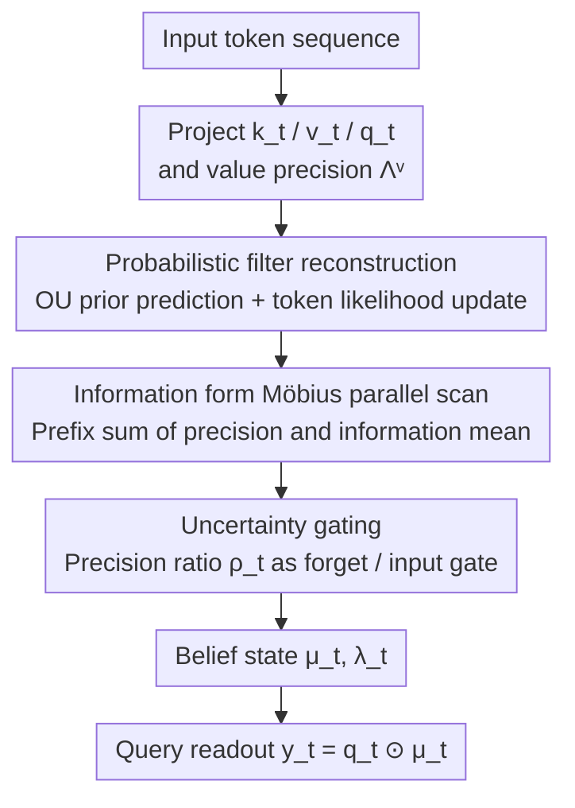

# Kalman Linear Attention: Parallel Bayesian Filtering For Efficient Language Modelling and State Tracking

**Conference**: ICML2026  
**arXiv**: [2602.10743](https://arxiv.org/abs/2602.10743)  
**Code**: https://github.com/vaisakh-shaj/kalman-linear-attention  
**Area**: LLM Efficiency / State Space Models / Linear Attention  
**Keywords**: Kalman Filter, Information Form, Möbius Scan, Uncertainty Gating, State Tracking

## TL;DR
This work reinterprets sequence mixing as exact Bayesian filtering. By utilizing the "information form" of the Kalman filter, it reformulates the sequential recursive update into a parallelizable prefix scan using Möbius (fractional linear) mappings. The resulting KLA is a plug-and-play, linear-complexity sequence mixing layer that is more expressive than GLA and provides explicit state uncertainty.

## Background & Motivation
**Background**: To bypass the $\mathcal{O}(T^2)$ complexity of Transformer attention, State Space Models (S4/S5, Mamba) and Gated Linear Attention (GLA) have emerged as primary alternatives. These models achieve $\mathcal{O}(T)$ training/inference and allow training within $\mathcal{O}(\log T)$ depth via parallel scans. Recent works have unified models like Mamba as gated variants of GLA, where performance is primarily determined by the gating mechanism.

**Limitations of Prior Work**: The hidden state updates in these models are essentially **linear/affine** ($\mathbf{h}_t=\bar{\mathbf{a}}_t\odot\mathbf{h}_{t-1}+\bar{\mathbf{b}}_t x_t$). Their expressivity is limited compared to softmax attention, as softmax normalization introduces non-linear interactions between tokens that linear recursions cannot replicate. Crucially, they lack **explicit state uncertainty**; the model has no sense of how reliable its memory is, leading to gates that are deterministic reweightings rather than selection based on confidence.

**Key Challenge**: Achieving stronger expressivity (especially in state tracking tasks like the $A_5$ permutation group synthesis) requires non-linear updates, but non-linearity typically implies sequential recursion. Efficiency requires maintaining linear updates for parallelism. There exists a tension between expressivity and parallelism.

**Goal**: To design a state space block that **efficiently implements exact Kalman filter updates**, thereby achieving non-linear expressivity and explicit uncertainty beyond GLA while maintaining linear time and parallelism.

**Key Insight**: The authors adopt a probabilistic perspective—treating the token sequence as **noisy observations** of a latent stochastic process rather than as control signals driving the state. Consequently, sequence mixing becomes Bayesian filtering (posterior inference). While filtering is traditionally sequential, the **information form** of the Kalman filter allows precision updates to be rewritten as fractional linear (Möbius) mappings. These mappings can be composed via $2\times 2$ matrix multiplication, which is associative and thus parallelizable via prefix scans.

**Core Idea**: Replace linear recursion with "information-form Kalman filtering" for sequence mixing. Recursive updates per token are non-linear (Möbius precision recursion) but remain parallelizable across the time dimension, resulting in superior state tracking and an explicit uncertainty trajectory.

## Method

### Overall Architecture
KLA (Kalman Linear Attention) is a plug-and-play sequence mixing layer that can directly replace attention or SSM layers in Transformers. Instead of deterministically updating a hidden state like Mamba, it maintains a **belief state** regarding the latent representation $\mathbf{z}_t$—specifically, a posterior Gaussian $\mathcal{N}(\bm{\mu}_t,\bm{\lambda}_t^{-1})$ with a posterior mean $\bm{\mu}_t$ and explicit precision (uncertainty) $\bm{\lambda}_t$. Input tokens are projected into $(\mathbf{k}_t,\mathbf{v}_t,\mathbf{q}_t)$ and value precision $\bm{\Lambda}_t^{\mathrm{v}}$. Each token is treated as a noisy observation: a continuous-time OU stochastic prior performs "prediction," the token likelihood performs the "update," and the query $\mathbf{q}_t$ reads from the belief to produce output $\mathbf{y}_t=\mathbf{q}_t\odot\bm{\mu}_t$.

The critical workflow involves rewriting the Kalman filter into information form, where precision updates become Möbius mappings and information mean updates become affine mappings. Since both are associative, they can be calculated using parallel prefix scans with $\mathcal{O}(T)$ work and $\mathcal{O}(\log T)$ depth. The following diagram illustrates the KLA data flow (diagonal channel-wise for readability):

### Key Designs

**1. Probabilistic Filter Reconstruction: Sequence Mixing as Posterior Inference**

To address the lack of explicit uncertainty in existing SSMs/GLAs, KLA reformulates token processing as Bayesian filtering over a Linear Gaussian State Space Model. Latent state evolution uses an Ornstein–Uhlenbeck (OU) process as a prior—the continuous-time counterpart of a stable AR(1) process. This preserves exponential forgetting while **explicitly introducing process noise** to capture unmodeled drift. Discretization yields the Gaussian transition $\mathbf{z}_t\mid\mathbf{z}_{t-1}\sim\mathcal{N}(\bar{\mathbf{a}}_t\odot\mathbf{z}_{t-1},\,\bar{\mathbf{p}}_t)$, where decay $\bar{\mathbf{a}}_t=e^{-\mathbf{a}\Delta t}$ and process noise $\bar{\mathbf{p}}_t=\tfrac{\mathbf{p}^2}{2\mathbf{a}}\odot(1-e^{-2\mathbf{a}\Delta t})$ are coupled.

Each token is modeled as noisy evidence: $\mathbf{v}_t\mid\mathbf{z}_t\sim\mathcal{N}(\mathbf{k}_t\odot\mathbf{z}_t,(\bm{\Lambda}_t^{\mathrm{v}})^{-1})$, where $\mathbf{k}_t$ is the observation operator and $\bm{\Lambda}_t^{\mathrm{v}}$ is the precision (confidence) of the token evidence. This maps naturally to attention: $\mathbf{k}_t$ provides geometry, $\mathbf{v}_t$ the value, and $\mathbf{q}_t$ determines the readout from inferred beliefs. Unlike Mamba, which uses $\Delta_t$ as both a scale and a gate, KLA delegates selection entirely to the uncertainty mechanism.

**2. Information Form Möbius Reparameterization: Parallelizing Sequential Filtering**

Pure Bayesian filtering is recursive. The authors' key observation is that in the **information form** (using precision $\bm{\lambda}_t$ and natural parameter $\bm{\eta}_t:=\bm{\lambda}_t\odot\bm{\mu}_t$), the structured transformations from the prediction step can be composed.

Theorem 1 provides the core result: the precision recursion $\bm{\lambda}_{t-1}\mapsto\bm{\lambda}_t$ is a fractional linear (Möbius) transformation:

$$\bm{\lambda}_t=\frac{\bm{\alpha}_t\odot\bm{\lambda}_{t-1}+\bm{\beta}_t}{\bm{\gamma}_t\odot\bm{\lambda}_{t-1}+\bm{\delta}_t},\qquad \mathbf{M}_t=\begin{pmatrix}1+\bar{\mathbf{p}}_t\odot\bm{\phi}_t & \bar{\mathbf{a}}_t^2\odot\bm{\phi}_t\\ \bar{\mathbf{p}}_t & \bar{\mathbf{a}}_t^2\end{pmatrix}.$$

Composition of Möbius transformations is equivalent to multiplying their $2\times 2$ coefficient matrices. Since matrix multiplication is associative, $\{\bm{\lambda}_t\}$ can be computed via parallel prefix scans. Theorem 2 proves that given the precision trajectory, the information mean $\bm{\eta}_t$ follows an **affine** evolution, which is also parallelizable. This structure is more GPU-friendly than previous approaches that required iterative solvers.

**3. Uncertainty-Driven Nonlinear Gating: History-Dependent Evidence Absorption**

This is the source of KLA's superior expressivity compared to linear SSMs. Rearranging the Möbius update into a "gate" form:

$$\bm{\lambda}_t=\underbrace{(\bar{\mathbf{a}}_t^2+\bar{\mathbf{p}}_t\odot\bm{\lambda}_{t-1})^{-1}\odot\bm{\lambda}_{t-1}}_{\text{historical confidence}}+\underbrace{\mathbf{k}_t^2\odot\bm{\Lambda}_t^{\mathrm{v}}}_{\text{current token confidence}},$$

The shared denominator introduces **history dependence**: as cumulative precision increases, the model becomes more selective about absorbing new evidence. The precision ratio $\bm{\rho}_t:=\mathbf{1}\oslash(\bar{\mathbf{a}}_t^2+\bar{\mathbf{p}}_t\odot\bm{\lambda}_{t-1})$ acts as a forget gate $\mathbf{f}_t=\bm{\rho}_t\odot\bar{\mathbf{a}}_t$, coupling the precision and mean trajectories. If $\bar{\mathbf{p}}_t=\mathbf{0}$, $\bm{\rho}_t$ becomes constant, and KLA collapses to a linear recursion (standard GLA). This allows KLA to solve complex state tracking tasks (like $A_5$) in constant depth, whereas linear models require depth to scale with sequence length.

### Loss & Training
KLA follows the fused-MLP design of Mamba. Language modeling is trained using standard autoregressive next-token prediction. Ablations indicate that OU discretization is vital for filtering stability; removing it degrades precision and stability, especially in deeper models.

## Key Experimental Results

### Main Results
KLA is among the first stacked Bayesian filtering primitives pretrained at the **billion-token scale**. Regarding expressivity, replacing the final attention layer of GPT with KLA (GPT++KLA) yields significant gains at 45M and 180M parameters. It successfully solves the $A_5$ permutation task where linear SSMs fail.

| Metric | Softmax Attention | SSM / GLA | KLA |
|------|---------------|-----------|-----|
| Expressivity | Non-linear | Linear | Möbius |
| Training Complexity | $\mathcal{O}(T^2)$ | $\mathcal{O}(T)$ | $\mathcal{O}(T)$ |
| Inference Complexity | $\mathcal{O}(T)$ | $\mathcal{O}(1)$ | $\mathcal{O}(1)$ |
| Explicit Sequence Uncertainty | ✗ | ✗ | ✓ |
| Parallelizable Training | ✓ | ✓ | ✓ |

### Ablation Study

| Configuration | Observation | Explanation |
|------|------|------|
| Full KLA | Stable convergence, highest expressivity | OU Prior + Möbius Gating |
| w/o OU Discretization | Stability and accuracy drop | Loss of coupled noise/time-scales |
| $\bar{\mathbf{p}}_t=\mathbf{0}$ | $\bm{\rho}_t$ becomes constant | Loss of non-linearity; collapses to GLA |

### Key Findings
- Non-linear expressivity is **entirely** supplied by the process noise $\bar{\mathbf{p}}_t$.
- Explicit uncertainty is not merely diagnostic; it drives the gating. The precision ratio $\bm{\rho}_t$ emerges as a natural gate: "the more certain the history, the more selective of new evidence."
- Solving state-tracking tasks that linear SSMs cannot demonstrates that Möbius expressivity provides measurable utility beyond theoretical elegance.

## Highlights & Insights
- **Refuting the Parallelization Myth**: The work proves that Bayesian filtering is not inherently sequential; in information form, updates are Möbius mappings that compose via $2\times 2$ matrices.
- **Uncertainty as the Gate**: Unlike heuristic gates in GLA, KLA's gates are derived from the Bayesian precision ratio, providing clear semantic meaning.
- **Unified Online Learning**: The precision-weighted least squares interpretation places KLA in the same family as DeltaNet/Mamba but with a unique precision-coupled recursion.

## Limitations & Future Work
- The covariance/precision is kept **diagonal** throughout, limiting the model's ability to express correlations across hidden dimensions.
- The theoretical optimality of the probabilistic model (MMSE) assumes Linear Gaussian conditions, which natural language likely violates.
- Scaled to 1B tokens, but large-scale validation (>7B) is pending. Numerical stability of Möbius scans in extremely long contexts requires further stress testing.
- The readout takes the deterministic limit $\bm{\Lambda}_t^{\mathrm{out}}\to\infty$; incorporating uncertainty into downstream decision-making is a future direction.

## Related Work & Insights
- **vs Mamba / GLA**: These use linear/affine recursion with heuristic gates. KLA uses Möbius recursion with uncertainty-derived gates, upgrading expressivity with similar overhead.
- **vs MesaNet / Gated KalmaNet**: These assume static hidden states or require iterative solvers like Conjugate Gradient. KLA provides closed-form, scannable updates including process noise.
- **vs Parallelized Filtering (Särkkä)**: Earlier methods required 5-tuple lifting. KLA proves $2\times 2$ matrix composition in information form is sufficient and more efficient for neural sequence modeling.

## Rating
- Novelty: ⭐⭐⭐⭐⭐ 
- Experimental Thoroughness: ⭐⭐⭐⭐ 
- Writing Quality: ⭐⭐⭐⭐⭐ 
- Value: ⭐⭐⭐⭐⭐ 

<!-- RELATED:START -->

## Related Papers

- [\[ICML 2026\] Dynamic Linear Attention](dynamic_linear_attention.md)
- [\[ICML 2026\] Optimal Bayesian Stopping for Efficient Inference of Consistent LLM Answers](optimal_bayesian_stopping_for_efficient_inference_of_consistent_llm_answers.md)
- [\[NeurIPS 2025\] Tiled Flash Linear Attention: More Efficient Linear RNN and xLSTM Kernels](../../NeurIPS2025/llm_efficiency/tiled_flash_linear_attention_more_efficient_linear_rnn_and_xlstm_kernels.md)
- [\[ICML 2026\] IR3DE: A Linear Router for Large Language Models](ir3de_a_linear_router_for_large_language_models.md)
- [\[NeurIPS 2025\] ZeroS: Zero-Sum Linear Attention for Efficient Transformers](../../NeurIPS2025/llm_efficiency/zeros_zero-sum_linear_attention_for_efficient_transformers.md)

<!-- RELATED:END -->
