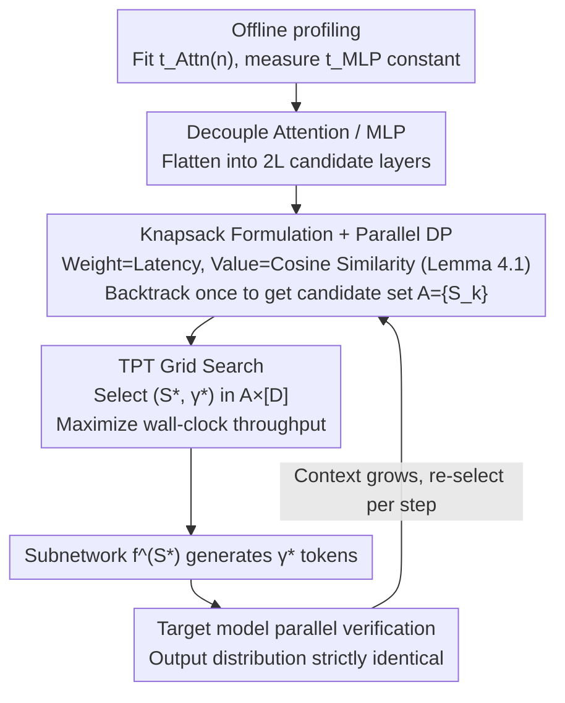

# KnapSpec: Self-Speculative Decoding via Adaptive Layer Selection as a Knapsack Problem

**Conference**: ICML 2026  
**arXiv**: [2602.20217](https://arxiv.org/abs/2602.20217)  
**Code**: https://github.com/kaist-flexml-lab/knapspec (Available)  
**Area**: LLM Efficiency  
**Keywords**: Self-Speculative Decoding, Layer Selection, Knapsack Problem, Long-Context Inference, Dynamic Programming

## TL;DR
KnapSpec reformulates draft layer selection in Self-Speculative Decoding (SSD) as a 0/1 knapsack problem. By decoupling Attention and MLP modules, using context-length-dependent hardware latency as "weight" and hidden state cosine similarity (with the first rigorous proof provided) as "value," it adaptively identifies the subnetwork that maximizes Tokens-per-Time via parallel DP at each step. It achieves up to 1.47× wall-clock speedup on Qwen3 / Llama3 in long-context scenarios without additional training.

## Background & Motivation

**Background**: LLM inference bottlenecks are increasingly severe. Speculative Decoding (SD) has become a mainstream acceleration paradigm by using a small draft model to predict and a large target model to verify in parallel. Self-Speculative Decoding (SSD) further eliminates the independent draft model by selecting a subnetwork directly from the target model, avoiding the overhead of training and aligning two sets of weights. Representative methods include LayerSkip (early exiting), Draft&Verify / SWIFT (Bayesian search), and CLaSp (cosine-based DP).

**Limitations of Prior Work**: Existing SSD methods treat Transformer layers as "indivisible atoms" or "black boxes with equal latency." This static heuristic suffices for short contexts; however, as context length increases, Attention latency grows linearly with sequence length ($t_{\mathtt{Attn}}=\Theta(n)$), while MLP latency remains constant ($t_{\mathtt{MLP}}=\Theta(1)$). Layer-skipping schemes optimized for the prefill stage become inefficient during the decode stage when Attention dominates, causing the acceleration ratio to collapse.

**Key Challenge**: The optimal trade-off between draft latency and acceptance rate **drifts dynamically with context length**. However, prior methods search for a static, global subset of layers and bind Attention/MLP pairs together. This restricts the search space and decouples the objective functions (TPL, cosine) from actual wall-clock speed. Furthermore, the use of cosine similarity as a proxy for acceptance rate in methods like CLaSp lacked a rigorous theoretical foundation and was only "empirically effective."

**Goal**: (i) Design a layer selection framework that truly targets wall-clock throughput and is aware of context length and hardware latency; (ii) Decouple Attention and MLP to expand the search space; (iii) Establish the mathematical foundation for the "cosine similarity → acceptance rate" proxy relationship.

**Key Insight**: The authors observe that since each Attention/MLP layer has its own "latency cost" and "contribution value" to the final output, selecting a set of layers to maximize total value under a total latency budget is naturally a **0/1 Knapsack Problem**. Knapsack problems have standard DP solutions, and the intermediate DP table can provide optimal solutions for all budgets simultaneously, avoiding repeated searches.

**Core Idea**: Formulate SSD layer selection as a 0/1 knapsack problem where hardware latency is the weight and cosine similarity is the value. At each decoding step, use parallel DP to instantly recompute the optimal draft subnetwork and perform a TPT grid search over the DP candidate set to select the final configuration.

## Method

### Overall Architecture

KnapSpec treats each layer's Attention and MLP as independent "items," flattening them into $2L$ candidate layers ($f^{(2i-1)}:=f^{(i)}_{\mathtt{Attn}}$, $f^{(2i)}:=f^{(i)}_{\mathtt{MLP}}$). The draft network is a subset $S\subseteq[2L]$ composed in their original order. It first performs one-time hardware profiling to fit Attention latency as a function of context length $t_{\mathtt{Attn}}(n)$ and measures MLP latency as a constant $t_{\mathtt{MLP}}$. During inference, every speculation step solves a knapsack problem with "latency as weight and cosine similarity as value" via parallel DP. It then performs a grid search for the maximum throughput $(S^*,\gamma^*)$ among all budget-optimal candidates. The subnetwork $f^{(S^*)}$ generates $\gamma^*$ tokens serially, which are then verified in parallel by the target model. The process requires no extra training, and the output distribution is strictly equivalent to the original model.

### Key Designs

**1. TPT (Tokens-per-Time): Aligning the Objective with Wall-clock Throughput**

Previous SSD methods used Tokens-per-Layer (TPL) or acceptance rate as objectives, implicitly assuming "equal latency per layer." In long contexts, the gap between Attention and MLP latency widens, causing layer-based metrics to decouple from wall-clock speed. KnapSpec adopts throughput based on actual latency: the expected tokens produced per step is the mean of a truncated geometric distribution $\frac{1-\alpha_S^{\gamma+1}}{1-\alpha_S}$ (where $\alpha_S$ is the acceptance rate of subnetwork $S$). The denominator is the total latency per step $\gamma\,t_{\mathtt{Draft}}(S)+t_{\mathtt{Target}}$, where $t_{\mathtt{Draft}}(S)=n_{\mathtt{Attn}}(S)\cdot t_{\mathtt{Attn}}+n_{\mathtt{MLP}}(S)\cdot t_{\mathtt{MLP}}$ and $t_{\mathtt{Target}}=L(t_{\mathtt{Attn}}+t_{\mathtt{MLP}})$. Thus, $\text{TPT}(S,\gamma)=\frac{1-\alpha_S^{\gamma+1}}{1-\alpha_S}\cdot\frac{1}{\gamma\,t_{\mathtt{Draft}}(S)+t_{\mathtt{Target}}}$. This generalizes TPL (to which it reduces when $t_{\mathtt{Attn}}=t_{\mathtt{MLP}}$). Figure 2 shows that best-TPT has significantly higher Pearson correlation and $R^2$ with actual throughput than the acceptance rate, proving that "time-based billing" better predicts speedup.

**2. Knapsack Formulation + Parallel DP: Compressing Search to $O(nL)$**

The original search space is $2^{2L}D$, which is exponentially infeasible. KnapSpec notes that selecting layers to maximize value under a latency budget is a 0/1 Knapsack problem. It first performs integer weight normalization: $\Delta=\min(t_{\mathtt{Attn}}(n),t_{\mathtt{MLP}})$, $w_{\mathtt{Attn}}=\lfloor t_{\mathtt{Attn}}(n)/\Delta\rceil$, $w_{\mathtt{MLP}}=\lfloor t_{\mathtt{MLP}}/\Delta\rceil$. Using computable $\cos(f(X),f^{(S)}(X))$ as value instead of non-differentiable $\alpha_S$, it solves $\max_{S\subseteq[2L]}\cos(f(X),f^{(S)}(X))$ s.t. $n_{\mathtt{Attn}}(S)w_{\mathtt{Attn}}+n_{\mathtt{MLP}}(S)w_{\mathtt{MLP}}=k$. The DP table $g[i,j]\in\mathbb{R}^{r\times d}$ stores the optimal hidden state for "first $i$ layers with weight $j$ skipped." The transition compares "executing layer $i$" ($h_{\mathtt{e}}=f^{(i)}(g[i-1,j])$) versus "skipping layer $i$" ($h_{\mathtt{s}}=g[i-1,j-w_i]$), taking the one with the higher cosine score. Budget dimensions $j$ are batch-parallelized on the GPU. Decoupling Attention/MLP doubles the items to $2L$ but allows new degrees of freedom, such as keeping an Attention module but dropping its corresponding MLP. Search overhead is reduced to the magnitude of a single AR decode step through DP and pruning ($\tau=0.5$ cosine lower bound and $K/2$ upper bound).

**3. Cosine Similarity as a Rigorous Proxy for Acceptance Rate (Lemma 4.1)**

The use of cosine similarity as a value proxy in CLaSp was empirical. KnapSpec provides a proof: let $w_1,\dots,w_V$ be the LM head word vectors, and the greedy prediction of target hidden state $x$ be $i^*=\arg\max_i\langle w_i,x\rangle$. Define the margin $\xi(x)=\langle w_{i^*},x\rangle-\max_{j\neq i^*}\langle w_j,x\rangle$. Lemma 4.1 shows that if $\|x'\|_2=\|x\|_2$ and $\cos(x,x')\geq 1-\frac{\xi(x)^2}{2\|x\|_2^2\max_{j\neq i^*}\|w_{i^*}-w_j\|_2^2}$, then $\arg\max_i\langle w_i,x\rangle=\arg\max_i\langle w_i,x'\rangle$, meaning the draft and target tokens are identical. Since modern LLMs use RMSNorm, the equal-norm assumption is naturally approximated. Thus, high cosine similarity **sufficiently** guarantees token matching. This bridges the gap between engineering tricks and provable methods, also explaining why CLaSp works.

### Loss & Training

Completely training-free, introducing no extra parameters. Runtime hyperparameters include: pruning threshold $\tau=0.5$, dynamic early exit threshold $\tau_{\text{conf}}=0.7$ (draft top-1 probability), maximum draft length $D=10$, and historical window $m=5$ speculation steps. Hardware latency coefficients $(t_{\mathtt{Attn}}(n),t_{\mathtt{MLP}})$ are measured once during preprocessing.

## Key Experimental Results

### Main Results

Evaluated on Qwen3 (4B/8B/14B/32B) and Llama3 (1B/3B/8B/70B) for **long-context generation** (AIME24/25, MMLU-Pro reasoning) and **long-context input** (GovReport, PG19, BookSum summarization), compared against SOTA SSD baselines (DEL, SWIFT, CLaSp).

| Model | Task | Metric | AR | SWIFT | CLaSp | KnapSpec |
|------|------|------|----|----|----|----|
| Qwen3-32B | AIME24 | Speedup | 1.00× | 1.23× | 1.30× | **1.43×** |
| Qwen3-32B | MMLU-Pro | TPT | 23.15 | 21.75 | 23.90 | **34.62** |
| Llama3.1-70B | GovReport | Speedup | 1.00× | 1.33× | 1.22× | **1.47×** |
| Llama3.1-8B | AIME24 | Speedup | 1.00× | 1.05× | 1.11× | **1.28×** |
| Llama3.1-8B | AIME24 | $\alpha$ | — | 62.1% | 91.7% | **97.0%** |
| Qwen3-4B | MMLU-Pro | TPT | 30.93 | 23.74 | 25.68 | **45.25** |

KnapSpec achieved the highest TPT and speedup across **all 48 configurations**, with a maximum wall-clock speedup of 1.47×. While its acceptance rate is comparable to CLaSp, its throughput is significantly higher due to cheaper draft subnetworks.

### Ablation Study

| Configuration | Key Observation | Description |
|------|---------|------|
| TPT vs TPL/acc-rate | TPT has the highest PCC and $R^2$ with throughput | Validates "time-based" vs "layer/acceptance-based" alignment |
| Attn/MLP Decoupling | Speedup +0.1–0.2× on average | Higher value in skipping Attention individually in long contexts |
| Pruning Threshold $\tau=0.5$ | Saves DP time without performance loss | Low-similarity paths are almost always sub-optimal |
| Nucleus Sampling $T=0.7$ | Speed advantage remains stable | Effective under sampling, not just greedy decoding |

### Key Findings

- **The bottleneck is Attention dominance in long contexts**: Context-unaware methods like SWIFT are sometimes slower than AR (speedup < 1×) on long-input tasks like PG19, whereas KnapSpec maintains 1.1–1.5×.
- **Draft subnetworks must be re-selected per step**: A global optimal subset searched once degrades quickly as the context grows; dynamic knapsack decisions are necessary.
- **Decoupling Attention/MLP matches hardware physics**: In long-context stages, DP tends to skip Attention while keeping MLP; the reverse is true for short contexts.
- **Acceptance rate is not the only metric**: CLaSp often has a higher acceptance rate, but because its subnetworks are "heavier," its TPT is surpassed by KnapSpec.

## Highlights & Insights

- **Formalizing SSD as a Knapsack Problem is an elegant abstraction**: Items=layers, Weight=latency, Value=cosine. This converts heuristic search into an optimal structure with an $O(nL)$ DP algorithm, a rare "perfect fit" between problem and algorithm in engineering optimization.
- **Lemma 4.1 provides the mathematical foundation for the cosine-based SSD family**: This serves not only KnapSpec but retrospectively justifies why CLaSp / ASD / DEL work.
- **Metric-Hardware-Search Trinity**: TPT aligns with wall-clock time, latency coefficients come from hardware profiling, and the search algorithm operates on hardware-aware weights. The pipeline is deployment-ready without "intuitive" hyperparameter tuning.
- **Transferable Tricks**: The decoupling of Attention/MLP and the "one-sweep DP for all budgets" can be applied to other sub-model selection scenarios like conditional early exiting or selective KV cache retention.

## Limitations & Future Work

- **Dependence on offline profiling**: Changing GPUs, batches, or KV cache implementations requires re-measuring $(t_{\mathtt{Attn}}(n), t_{\mathtt{MLP}})$. Online lightweight self-calibration could be explored.
- **DP Overhead**: While reduced to $O(nL)$, the overhead is non-zero. For very small models (e.g., Llama3.2-1B), the relative cost is higher, narrowing the speedup to 1.06–1.13×.
- **Lemma 4.1 is Greedy-specific**: Sampling acceptance criteria are more complex. While KnapSpec works empirically under sampling, the theoretical guarantee is a sufficient condition for greedy decoding only.
- **Proxy vs Reality**: Cosine similarity is a sufficient but not necessary condition. Future work could explore tighter proxies or mini-batch Monte Carlo estimates for the acceptance rate.

## Related Work & Insights

- **vs CLaSp (Chen et al., 2025)**: CLaSp also uses cosine + DP, but (i) binds Attention/MLP, (ii) uses a fixed layer count budget $|S|=B$, (iii) is context-unaware, and (iv) lacks theoretical support. KnapSpec improves all four points.
- **vs SWIFT (Xia et al., 2025) / Draft&Verify**: These use Bayesian optimization for subset searching, which is slow and insensitive to context changes. KnapSpec solves for all budgets via DP and re-calculates online.
- **vs DEL (Zarch et al., 2025)**: DEL is dynamic early exiting (optimizing TPL) and is restricted to prefix-based subnets. KnapSpec's TPT is a true generalization of TPL for $t_{\mathtt{Attn}}\neq t_{\mathtt{MLP}}$ and explores a larger search space.
- **vs LayerSkip / Kangaroo**: These require training or adapters. KnapSpec is completely training-free and plug-and-play.

## Rating

- Novelty: ⭐⭐⭐⭐⭐ Knapsack formulation + Attn/MLP decoupling + context awareness are combined systematically for the first time, supported by a rigorous proof.
- Experimental Thoroughness: ⭐⭐⭐⭐⭐ Covers 8 model scales × 6 tasks × 4 baselines, testing both greedy and nucleus sampling with correlation and pruning analyses.
- Writing Quality: ⭐⭐⭐⭐ Clear logical flow from problem to theory to experiments. Table 1 provides excellent baseline comparisons.
- Value: ⭐⭐⭐⭐⭐ Training-free, plug-and-play, and up to 1.47× speedup in long contexts. Directly valuable for industrial deployment.

<!-- RELATED:START -->

## Related Papers

- [\[ACL 2025\] CLaSp: In-Context Layer Skip for Self-Speculative Decoding](../../ACL2025/llm_efficiency/clasp_self_speculative_decoding.md)
- [\[ACL 2026\] SpecBound: Adaptive Bounded Self-Speculation with Layer-wise Confidence Calibration](../../ACL2026/llm_efficiency/specbound_adaptive_bounded_self-speculation_with_layer-wise_confidence_calibrati.md)
- [\[ICML 2026\] dLLM-Cache: Accelerating Diffusion Large Language Models with Adaptive Caching](dllm-cache_accelerating_diffusion_large_language_models_with_adaptive_caching.md)
- [\[ICML 2026\] MineDraft: A Framework for Batch Parallel Speculative Decoding](minedraft_a_framework_for_batch_parallel_speculative_decoding.md)
- [\[ACL 2025\] Tetris: Optimal Draft Token Selection for Batch Speculative Decoding](../../ACL2025/llm_efficiency/tetris_optimal_draft_token_selection_for_batch_speculative_decoding.md)

<!-- RELATED:END -->
