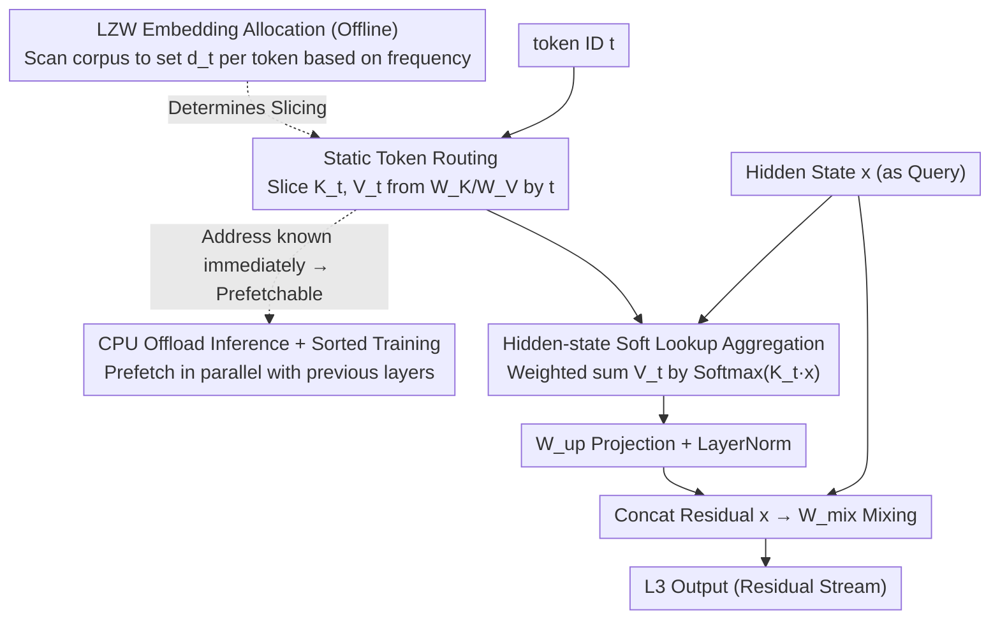

# L$^3$: Large Lookup Layers

**Conference**: ICML 2026  
**arXiv**: [2601.21461](https://arxiv.org/abs/2601.21461)  
**Code**: TBD  
**Area**: LLM Efficiency / Sparse Architecture  
**Keywords**: Sparse Models, Static Routing, Embedding Lookup, LZW Allocation, CPU offload

## TL;DR
This paper proposes L$^3$ (Large Lookup Layer), which generalizes the tokenizer embedding table into a "large lookup layer" that can be inserted into the decoder. By using **static routing** based on token IDs to retrieve a set of learned key/value embeddings, and then using the current hidden state for attention-based aggregation, the model achieves a higher degree of sparsity without the common MoE pitfalls of dynamic routing, auxiliary losses, and offloading difficulties. It outperforms dense models of the same compute power and MoE models of the same sparsity at 800M–2.6B active parameter scales.

## Background & Motivation

**Background**: The current mainstream approach for "parameter sparsity" is Mixture-of-Experts (MoE), where each decoder layer replaces the MLP with a router and multiple dense experts. The router assigns tokens to top-k experts based on their hidden states. Methods like GShard, Switch, DeepSeek-MoE, and OLMoE significantly improve quality under iso-FLOP conditions.

**Limitations of Prior Work**: The dynamic routing of MoE introduces several system-level complications. Load-balancing and router z-losses are required to prevent collapse. Furthermore, since expert assignment is only known at the routing step, expert parameters **cannot be easily prefetched or offloaded**; they must remain in GPU memory. Large batches typically hit all experts, rendering offloading ineffective. Ultra-large MoE models also require sophisticated sharding.

**Key Challenge**: The ideal goal is "parameter sparsity + context-aware aggregation." Currently, context-dependence is tied to dynamic routing, which is inherently not system-friendly. The paper observes that the tokenizer embedding table is an extremely sparse layer (one row per token) that is highly system-friendly (static lookup, prefetchable), but it lacks **contextual information**.

**Goal**: Extend the "system-friendly static sparse structure" of embedding tables into the middle of the decoder. This aims to retain the system advantages of static routing while enabling context-aware aggregation based on hidden states. The study addresses two questions: (a) Can this structure beat dense and MoE models under iso-FLOP conditions? (b) What is the optimal strategy for allocating embeddings to tokens?

**Key Insight**: The authors view "static routing by token ID + attention-based aggregation by hidden state" as a "soft lookup." The router remains static (token ID → set of embeddings), but the aggregation is context-dependent. Thus, L$^3$ still operates on known token IDs, allowing parameter prefetching from the CPU to begin as soon as a token is generated.

**Core Idea**: Replace MoE's hidden-state routing + dense experts with **token ID static routing + hidden-state attention aggregation**. This shifts the "routing dependency" from the hidden state back to the token ID and employs an LZW-style information-theoretic allocation algorithm to determine the number of embeddings per token.

## Method

### Overall Architecture
L$^3$ is a new decoder sublayer inserted between existing dense Llama decoder layers. It does not replace the MLP and is **orthogonal to MoE**. For an individual token, it first uses the token ID $t$ to retrieve a specific set of key/value embeddings from a large lookup table. It then uses the current hidden state $x$ as a query to perform attention over these keys, aggregating the corresponding values into a "context-aware lookup result" before adding it back to the residual stream.

Specifically: Given hidden state $x \in \mathbb{R}^{d_\text{in}}$ and token ID $t \in \{1, \dots, |\tau|\}$, static routing uses $t$ to slice token-specific $K_t \in \mathbb{R}^{d_t \times d_\text{in}}$ and $V_t \in \mathbb{R}^{d_t \times d_\text{emb}}$ from global tables $W_K \in \mathbb{R}^{v \times d_\text{in}}$ and $W_V \in \mathbb{R}^{v \times d_\text{emb}}$. Contextual aggregation computes softmax scores for $d_t$ entries using $x$ and $K_t$, followed by a weighted sum of $V_t$. After an up-projection $W_\text{up}$, LayerNorm, and concatenation with the residual flow, it is mixed via $W_\text{mix}$:

$$L^3(x,t) = W_\text{mix}\big[\text{LN}(W_\text{up}(V_t^\top \text{Softmax}(K_t x)))\,;\,x\big].$$

This layer performs mixing only in the channel dimension with **no cross-token communication**. The number of rows $d_t$ allocated per token is determined by a specialized allocation algorithm.

### Key Designs

**1. Static Token Routing + Hidden-state Soft Lookup: Decoupling "Routing" from "Aggregation"**

The systemic issues of MoE stem from the router's dependency on the hidden state ($r(x,e)$), meaning parameter addresses are unknown until the routing computation. L$^3$ changes the router to $t \mapsto \{K_t, V_t\}$, which **depends only on the token ID**. Consequently, required parameter addresses are known as soon as a token is generated. Contextual sensitivity is delegated to attention: $\text{Softmax}(K_t x)$ scores $d_t$ embeddings based on the hidden state. This "regression" to token ID routing eliminates MoE's system pain points, as parameters can be asynchronously prefetched from CPU to GPU while previous layers are still computing (Fig. 4).

**2. LZW Information-Theoretic Allocation: Non-uniform Capacity Based on Contextual Distinctiveness**

Given a fixed total budget $v = \sum_i d_i$, the key is how many embeddings to assign to each token. The authors find that using a static router to simulate a context router is equivalent to "finding a set of codewords covering common corpus suffixes." This is the dual problem of LZW lossless compression. The most frequent suffixes correspond to contexts that most need to be distinguished. Algorithm 1 uses LZW to build a (codeword, frequency) dictionary, assigning embeddings based on frequency while enforcing a range (e.g., $1 \le d_t \le 512$). High-frequency tokens like "then" might get 512 rows, while "orm" gets 1. Ablation shows that uniform allocation negates nearly all L$^3$ gains (Fig. 7C). The $k=512$ limit also caps the per-token activation at $O(1\text{M})$ parameters, ensuring CPU-to-GPU transfer stays within $O(1\text{MB})$, which fits within the prefetch window.

**3. Block-Diagonal Sorted Training + CPU Offload Inference: Turning Irregular Lookups into Hardware-Friendly Access**

Variable rows per token lead to irregular memory access. Since L$^3$ has no cross-token communication, training can sort tokens in a batch by ID. Hidden states of the same token become contiguous, transforming the attention mask into a block-diagonal matrix (Fig. 3). This allows the use of kernels like FlexAttention or MegaBlocks with minimal overhead. For inference (Fig. 4), L$^3$ parameters are stored on the CPU. Upon token sampling, $\{K_t, V_t\}$ are asynchronously prefetched. On a B200, offloading L$^3$ in a 2.6B/7B model only reduces throughput by a few percentage points (Table 2). If L$^3$ is placed after the 4th layer, PCIe latency is completely masked by preceding decoder layers.

### Loss & Training
The objective is standard cross-entropy for language modeling **without any auxiliary losses**, making it more stable than MoE. Based on the Llama architecture, models were pre-trained at 800M (400M decoder), 1.5B (1B), and 2.6B (1.9B) active parameters on FineWeb-Edu (10B–30B tokens). Each L$^3$ layer uses $v = 710\text{K}$ and $k = 512$, targeting a 2–4× sparsity ratio.

## Key Experimental Results

### Main Results

| Active Params | L3 Layers | Total Params | Wiki2 PPL ↓ | 0-shot Avg ↑ |
|---|---|---|---|---|
| 809M | 0 (dense) | 809M | 22.02 | 48.28 |
| 803M | 2 | 3.1B | 20.23 | 49.45 |
| 818M | 3 (wider) | 5.2B | **19.59** | **50.25** |
| 1.5B | 0 (dense) | 1.5B | 18.83 | 51.93 |
| 1.5B | 2 | 4.6B | **16.72** | **53.84** |
| 2.6B | 0 (dense) | 2.6B | 15.43 | 55.59 |
| 2.6B | 2 | 7B | **14.51** | **56.98** |

Adding L$^3$ consistently lowers perplexity and improves downstream scores (ARC, HellaSwag, PIQA, Winogrande) across scales. Gains appear at the start of training. Under iso-FLOP and iso-sparsity conditions, L$^3$ outperforms MoE baselines (Fig. 8).

### Ablation Study

| Configuration | Observation | Explanation |
|---|---|---|
| 2 layers × 710K vs 4 × 355K vs 1 × 1420K | Similar quality | Single large layers compress the prefetch window; many small layers limit placement. |
| LZW Allocation vs Uniform | LZW dominates | Uniform distribution loses almost all L3 gains; allocation is the key knob. |
| LZW $k=\infty$ vs $k=512$ vs $k=256$ | $\infty$ is slightly better | $k=512$ caps worst-case activation at $O(1\text{M})$ with negligible quality loss. |
| $W_K$ and $W_V$ Weight Tying | Quality unchanged | Halves sparsity ratio and data movement requirements. |
| L3 Placement (Layer 2/4/.../16) | Middle is optimal | Early layers lack context; late layers have limited time to influence output. |

### Key Findings
- **L3 Caches Information**: Tuned lens analysis shows sharp KL divergence "steps" at L$^3$ insertion points (e.g., layers 4 and 16), whereas dense models show a smooth decline. This suggests L$^3$ directly caches information that dense layers must recompute (Fig. 10).
- **Early Layers Lookup, Late Layers Aggregate**: The softmax distribution in the first L$^3$ layer has higher KL divergence from uniform than the second, indicating early layers act more like a "lookup" (selecting 1-2 entries) while deeper layers aggregate more broadly.
- **Near-Zero Cost for CPU Offload**: For 2.6B/7B models, offloading L$^3$ to CPU results in only a minor drop in throughput (e.g., 776 to 692 toks/s at BS=1). Static routing's prefetch window absorbs PCIe latency.
- **87% Training Throughput**: 800M dense reached 155K toks/s on 8×A100, while L$^3$ reached 135K toks/s.

## Highlights & Insights
- **Reverting Routing form to Token ID**: A choice that seems like a step backward actually solves MoE's major system issues. Outsourcing context-dependence to the attention mechanism is an elegant separation of concerns.
- **Capacity Allocation via Compression**: Treating "suffix coverage" as a dual of "codeword coverage" to leverage LZW is a brilliant theoretical bridge.
- **Harmonized Quality and System Knobs**: The $k$ limit simultaneously controls quality and hardware behavior (PCIe bandwidth), making system latency predictable.
- **Orthogonality**: L$^3$ is positioned as a sparsity dimension that can exist alongside MoE.

## Limitations & Future Work
- **Small Scale**: Experiments capped at 2.6B active / 7B total parameters and 30B tokens. Scaling laws for frontier-scale models (trillions of tokens) are unverified.
- **No Joint MoE Evaluation**: The combination of MoE + L$^3$ is suggested but not tested.
- **BPE Dependency**: LZW allocation is fixed before training; changing the vocabulary requires re-running allocation and retraining.
- **Comparison with Engrams**: Acknowledged as concurrent work; more detailed head-to-head comparisons are needed.
- **PyTorch Implementation**: The 87% throughput is a baseline; specialized kernels may be required for industrial-grade optimization.

## Related Work & Insights
- **vs MoE**: Both pursue "Parameters ≫ Active Params." MoE uses hidden-state routing + dense experts, while L$^3$ uses token-ID routing + lookup aggregation. L$^3$ is more system-friendly and avoids auxiliary losses.
- **vs Product Key Networks (PKN)**: PKN uses large embedding lookups but with hidden-state queries, losing the offloading advantage of static routing.
- **vs SCONE**: SCONE expands the tokenizer table at the model's **start**. L$^3$ moves this to the **middle** and adds aggregation to cache intermediate representations.
- **vs Engrams**: Concurrent work using learned embedding tables. L$^3$ achieves similar scaling with a simpler architecture.

## Rating
- Novelty: ⭐⭐⭐⭐☆ Decoupling static routing from contextual aggregation and using LZW is a fresh, logical path.
- Experimental Thoroughness: ⭐⭐⭐⭐☆ Strong comparisons for its scale, though it lacks ultra-large scale validation.
- Writing Quality: ⭐⭐⭐⭐⭐ Excellent flow; visualizations (Fig 4/5/10) provide strong intuition.
- Value: ⭐⭐⭐⭐⭐ Provides a new, system-friendly sparsity axis that is immediately applicable to CPU-offloaded inference.

<!-- RELATED:START -->

## Related Papers

- [\[ICML 2026\] Hyperparameter Transfer with Mixture-of-Experts Layers](hyperparameter_transfer_with_mixture-of-expert_layers.md)
- [\[ICML 2025\] Mixture of Lookup Experts](../../ICML2025/llm_efficiency/mixture_of_lookup_experts.md)
- [\[ICML 2026\] ProactiveLLM: Learning Active Interaction for Streaming Large Language Models](proactivellm_learning_active_interaction_for_streaming_large_language_models.md)
- [\[ICML 2026\] dLLM-Cache: Accelerating Diffusion Large Language Models with Adaptive Caching](dllm-cache_accelerating_diffusion_large_language_models_with_adaptive_caching.md)
- [\[ACL 2025\] SpindleKV: A Novel KV Cache Reduction Method Balancing Both Shallow and Deep Layers](../../ACL2025/llm_efficiency/spindlekv_layered_kv_cache.md)

<!-- RELATED:END -->
