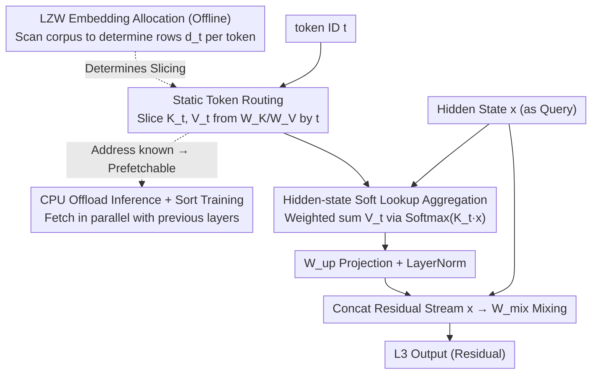

# L$^3$: Large Lookup Layers

**Conference**: ICML 2026  
**arXiv**: [2601.21461](https://arxiv.org/abs/2601.21461)  
**Code**: TBD  
**Area**: LLM Efficiency / Sparse Architectures  
**Keywords**: Sparse models, static routing, embedding lookup, LZW allocation, CPU offload

## TL;DR
The paper proposes L$^3$ (Large Lookup Layer), generalizing the tokenizer embedding table into "large lookup layers" that can be inserted into the decoder. By using **static routing** based on token IDs to retrieve a set of learned key/value embeddings and performing attention-based aggregation using the current hidden state, it achieves a higher level of model sparsity without the pain points of MoE (dynamic routing, auxiliary losses, offloading challenges). It outperforms dense models with equivalent compute and MoEs with equivalent sparsity across 800M–2.6B active parameters.

## Background & Motivation

**Background**: The current mainstream approach for "parameter sparsity" is Mixture-of-Experts (MoE). Each decoder layer replaces the MLP with a router and multiple dense experts. The router routes each token to the top-$k$ experts based on its current hidden state. This family of methods (GShard / Switch / DeepSeek-MoE / OLMoE, etc.) significantly improves quality under equivalent compute budgets.

**Limitations of Prior Work**: Dynamic routing in MoEs introduces a series of system-level complications. Load-balancing loss and router z-loss are necessary to prevent router collapse. Furthermore, since expert destinations are only known at the moment the token reaches the router, expert parameters **cannot be prefetched/offloaded** efficiently and must remain entirely in GPU VRAM. In large batch settings, most experts are activated anyway, making offloading ineffective. Extremely large MoEs also require delicate sharding to run.

**Key Challenge**: Researchers desire "parameter sparsity + context-aware aggregation," but currently, "context-aware" functionality is tied to dynamic routing, which is inherently not system-friendly. The paper observes that tokenizer embedding tables are an extreme case of a sparse layer (each token activates only one row). They are highly system-friendly (static lookup, prefetchable) but lack **contextual information**.

**Goal**: To generalize the "system-friendly static sparse structure" of embedding tables into the middle of the decoder, retaining the system advantages of static routing while enabling "context-aware aggregation" based on the current token's hidden state. It aims to answer: (a) Can this architecture beat dense and MoE models under iso-FLOP conditions? (b) What is the optimal way to allocate embeddings per token?

**Key Insight**: The authors view "static routing by token + attention aggregation via hidden state" as a "soft lookup." The router remains fixed (token ID → set of embeddings), but the aggregation is context-dependent. Since L3 still relies on known token IDs, the corresponding parameters can be prefetched from the CPU the moment a token is generated.

**Core Idea**: Replace MoE's hidden-state routing and dense experts with **token ID static routing + hidden-state attention aggregation**. This shifts the "routing dependency" from the hidden state back to the token ID architecturally, and uses an LZW-style information-theoretic allocation algorithm to determine how many embeddings each token receives.

## Method

### Overall Architecture
L$^3$ is a new decoder sublayer inserted between two dense Llama decoder layers. It does not replace the MLP and is **orthogonal to MoE**. For a single token, it first uses the token ID $t$ to retrieve a token-specific set of key/value embeddings from a massive lookup table. It then uses the current hidden state $x$ as a query to perform attention over these keys, aggregating the corresponding values into a "context-aware lookup result," which is finally merged back into the residual stream.

Specifically: Given hidden state $x \in \mathbb{R}^{d_\text{in}}$ and token ID $t \in \{1, \dots, |\tau|\}$, static routing uses $t$ to slice $K_t \in \mathbb{R}^{d_t \times d_\text{in}}$ and $V_t \in \mathbb{R}^{d_t \times d_\text{emb}}$ from global tables $W_K \in \mathbb{R}^{v \times d_\text{in}}$ and $W_V \in \mathbb{R}^{v \times d_\text{emb}}$. Contextual aggregation applies softmax to the scores of $x$ against $K_t$ to weight the sum of $V_t$. After an up-projection $W_\text{up}$ and LayerNorm, it is concatenated with the residual stream and passed through a mixing matrix $W_\text{mix}$:

$$L^3(x,t) = W_\text{mix}\big[\text{LN}(W_\text{up}(V_t^\top \text{Softmax}(K_t x)))\,;\,x\big].$$

The entire layer operates only in the channel dimension with **no cross-token communication**, which is the foundation for all subsequent system optimizations. The number of rows $d_t$ allocated to each token is determined by a specialized embedding allocation algorithm, a core hyperparameter of L3.

### Key Designs

**1. Static Token Routing + Hidden-state Soft Lookup: Decoupling "Routing" and "Aggregation"**
Most system issues with MoE—auxiliary losses, inability to offload, and high expert hit rates in large batches—stem from the router depending on the hidden state ($r(x,e)$). Parameters can only be addressed once the router calculation completes. L3 replaces the router with $t \mapsto \{K_t, V_t\}$, which **depends only on the token ID**. Thus, the parameter addresses are determined as soon as a token is generated. Contextual relevance is outsourced to the attention mechanism: $\text{Softmax}(K_t x)$ scores $d_t$ embeddings using the current hidden state, allowing the model to "select" information dynamically without regressing into a simple static embedding lookup. By reverting the routing dependency to the token ID, L3 eliminates the pain points of MoE. Parameters can be asynchronously prefetched from CPU to GPU while previous layers are still computing (Figure 4).

**2. LZW Information-Theoretic Allocation: Non-uniform Capacity Based on Contextual Distinctiveness**
Given a fixed budget $v = \sum_i d_i$, the critical question is how many rows each token should receive. The authors find that using a static router to simulate a context-dependent router is equivalent to "finding a set of codewords to cover common suffixes in the corpus." This is the dual of LZW lossless compression. The most frequent suffixes correspond to contexts that most need to be distinguished. Algorithm 1 uses LZW to build a (codeword, frequency) dictionary. It iterates through codewords in descending frequency, assigning an embedding to the final token of each codeword, while enforcing a minimum of 1 and a maximum of $k$ (e.g., $k=512$) per token. This leads to a Zipf-like distribution (e.g., "then" gets 512 rows, while "orm" gets 1). Uniform allocation fails to capture the benefits of L3 (Figure 7C). The $k$ cap also provides a hard guarantee—with $k=512$, a single token triggers at most $O(1\text{M})$ parameters, capping PCIe transfer at $O(1\text{MB})$, which can be fully hidden by prefetching.

**3. Block-Diagonal Sort Training + CPU Offload Inference: Hardware-Friendly Access**
Retrieving different rows per token is inherently irregular and inefficient for GPUs. However, since L3 only mixes in the channel dimension, tokens in a batch can be sorted by ID during training. Tokens with the same ID then form contiguous segments, and the batch's attention mask becomes a block-diagonal matrix (Figure 3). This allows the use of existing kernels like FlexAttention or MegaBlocks. For inference (Figure 4), the "killer feature" is offloading L3 parameters to the CPU. Since target addresses $\{K_t, V_t\}$ are known at the moment of sampling, they are asynchronously prefetched while pre-L3 layers are computing. Even with full offloading on a B200, the throughput for a 2.6B/7B model drops by only a few percent (Table 2). As long as the first L3 layer is not placed before layer 4, PCIe latency is absorbed by previous decoder computation.

### Loss & Training
The objective is standard language modeling cross-entropy **without any auxiliary losses**—an advantage over MoE. The architecture is based on Llama, pre-trained on FineWeb-Edu at three scales: 800M (400M decoder), 1.5B (1B), and 2.6B (1.9B) active parameters, with 10B to 30B tokens. Sequence length is 2048, and the BPE vocabulary is 180K. Each L3 layer defaults to $v=710\text{K}$ and $k=512$, targeting 2–4× sparsity.

## Key Experimental Results

### Main Results

| Active Params | L3 Layers | Total Params | Wiki2 PPL ↓ | 0-shot Avg ↑ |
|---|---|---|---|---|
| 809M | 0 (dense) | 809M | 22.02 | 48.28 |
| 803M | 2 | 3.1B | 20.23 | 49.45 |
| 818M | 3 (wider) | 5.2B | **19.59** | **50.25** |
| 1.5B | 0 (dense) | 1.5B | 18.83 | 51.93 |
| 1.5B | 2 | 4.6B | **16.72** | **53.84** |
| 2.6B | 0 (dense) | 2.6B | 15.43 | 55.59 |
| 2.6B | 2 | 7B | **14.51** | **56.98** |

Adding L3 layers consistently lowers perplexity and improves downstream scores (ARC, HellaSwag, PIQA, Winogrande) across all scales. Gains are visible from the start of training. Under iso-FLOP and iso-sparsity, L3 stabilizes above MoE baselines (Figure 8).

### Ablation Study

| Configuration | Observation | Explanation |
|---|---|---|
| 2 layers × 710K vs 4 × 355K vs 1 × 1420K | Similar quality | Single large layers compress the prefetch window; multiple small layers limit placement. |
| LZW vs Uniform allocation | LZW significantly leads | Uniform allocation loses nearly all L3 gains; allocation is the core performance knob. |
| LZW $k=\infty$ vs $k=512$ vs $k=256$ | $\infty$ is slightly better | $k=512$ caps worst-case activation at $O(1\text{M})$ with negligible quality loss. |
| Weight tying for $W_K$ and $W_V$ | Quality mostly unchanged | Halves sparsity ratio and data transfer requirements. |
| L3 placement (after layer 2/4/.../16) | Middle layers are optimal | Early layers lack context; late layers are too late to influence output. |

### Key Findings
- **L3 caches information**: Tuned lens analysis shows KL divergence drops sharply at the positions of L3 layers (Figure 10), whereas dense models show smooth declines. L3 caches information that would otherwise be recomputed over several decoder layers.
- **Early layers for lookup, late layers for aggregation**: The Softmax distribution in the first L3 layer has higher KL from uniform than the second, suggesting early layers perform "hard lookups" of 1–2 embeddings, while later layers aggregate more broadly.
- **Near-zero cost CPU offload**: For the 2.6B/7B model, offloading L3 layers results in only a minimal throughput drop on B200 (e.g., 776 to 692 toks/s at BS=1), as PCIe latency is hidden.
- **Training throughput (87%)**: 800M dense achieves 155K toks/s on 8×A100, while L3 achieves 135K toks/s. Specialized kernels could improve this further.

## Highlights & Insights
- **Reverting routing from hidden-state to token ID**: A counter-intuitive design choice that resolves MoE's system bottlenecks by outsourcing contextual awareness to attention. This "separation of duties" is a valuable lesson for dynamic routing scenarios.
- **Allocation via lossless compression**: Mapping the problem of finding "corpus-covering suffixes" to "corpus-covering codewords" via LZW is an elegant information-theoretic perspective.
- **$k$ as a dual-purpose knob**: A single hyperparameter controls both activation parameter count and PCIe transfer volume, ensuring predictable system latency.
- **Orthogonality to MoE**: L3 is positioned as an additional dimension of sparsity, leaving room for potential "MoE + L3" combinations.

## Limitations & Future Work
- **Experiment Scale**: Max scale is 2.6B active / 7B total with 30B tokens. Whether scaling laws hold at the level of frontier MoEs (trillions of tokens) remains unverified.
- **Lack of MoE combination**: The authors did not combine MoE and L3 in a single model in this paper.
- **Vocabulary dependency**: Embedding allocation is fixed before training. Changing the BPE vocabulary requires re-running LZW and re-training L3.
- **Comparison with Engrams**: Missing a detailed head-to-head comparison with Engrams (a concurrent work).
- **Throughput overhead**: The 13% throughput drop is based on a native PyTorch implementation; more optimized kernels are needed for production.

## Related Work & Insights
- **vs MoE**: Both pursue "Parameter ≫ FLOP," but L3 uses token-ID routing and attention-based lookup. L3 is more system-friendly and avoids auxiliary losses.
- **vs Product Key Networks (Lample 2019)**: PKN uses hidden-state queries for lookup, losing the offloading advantage of static routing.
- **vs SCONE (Yu et al. 2025)**: SCONE expands the tokenizer embedding at the **start** of the model. L3 moves this to the **middle** and adds attention.
- **vs Engrams (Cheng et al. 2026)**: L3 achieves similar scaling with a simpler skeleton, suggesting the core value lies in large embedding tables + contextual aggregation.
- **vs Cartridges (Eyuboglu 2025)**: Cartridges learn task-level KV caches. L3 learns token-level global caches, suggesting a trend toward "storing information in learnable KV tables."

## Rating
- Novelty: ⭐⭐⭐⭐☆
- Experimental Thoroughness: ⭐⭐⭐⭐☆
- Writing Quality: ⭐⭐⭐⭐⭐
- Value: ⭐⭐⭐⭐⭐

<!-- RELATED:START -->

## Related Papers

- [\[ICML 2026\] Hyperparameter Transfer with Mixture-of-Experts Layers](hyperparameter_transfer_with_mixture-of-expert_layers.md)
- [\[ICML 2025\] Mixture of Lookup Experts](../../ICML2025/llm_efficiency/mixture_of_lookup_experts.md)
- [\[ICML 2026\] Skip a Layer or Loop It? Learning Program-of-Layers in LLMs](skip_a_layer_or_loop_it_learning_program-of-layers_in_llms.md)
- [\[ICML 2026\] IR3DE: A Linear Router for Large Language Models](ir3de_a_linear_router_for_large_language_models.md)
- [\[ICML 2026\] ProactiveLLM: Learning Active Interaction for Streaming Large Language Models](proactivellm_learning_active_interaction_for_streaming_large_language_models.md)

<!-- RELATED:END -->
