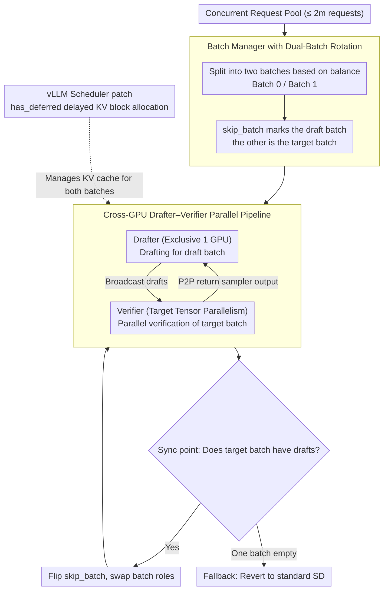

# MineDraft: A Framework for Batch Parallel Speculative Decoding

**Conference**: ICML2026  
**arXiv**: [2603.18016](https://arxiv.org/abs/2603.18016)  
**Code**: Available (MineDraft GitHub repository, detailed URL not provided in paper, released as a vLLM plugin)  
**Area**: LLM Efficiency / Inference Acceleration  
**Keywords**: Speculative Decoding, Parallel Speculative Decoding, Batch Parallelism, vLLM, GPU Overlap

## TL;DR
MineDraft maintains two batches of requests and **overlaps the execution** of drafting for one batch with the verification of another on two independent sets of GPUs. This transforms the sequential "draft-verify" pipeline of speculative decoding into batch-parallel PSD. At the cost of only one additional GPU, it increases throughput by up to 75% and reduces end-to-end latency by up to 39% compared to standard SD, and is implemented as a plug-and-play vLLM plugin.

## Background & Motivation

**Background**: Speculative Decoding (SD) is a mainstream solution for accelerating LLM inference—using a small draft model to autoregressively generate $k$ draft tokens, then letting a large target model verify them in parallel. When most drafts are accepted, SD is significantly faster than naive autoregressive decoding.

**Limitations of Prior Work**: The effectiveness of SD highly depends on the verification success rate (VSR) of the draft, and drafting and verification are **strictly sequential**—verification can only occur after drafting, and the next drafting step must wait for verification. Existing works (Medusa, EAGLE, TETRIS, etc.) focus on "improving VSR" or "tree/multi-branch drafting," but these methods often slow down the drafting phase (due to more complex drafters or larger sampling overhead), pinning drafting further onto the critical path and capping the acceleration ratio.

**Key Challenge**: Since verification data-dependently relies on the output of drafting, direct parallelization is non-trivial. Existing parallelization attempts either require double the GPU/VRAM (Wang 2024, Timor 2025), necessitate re-training the draft model (Xiao 2024), or only handle single requests (PEARL/Liu 2025a). In batched multi-request scenarios, how to effectively hide drafting behind verification using **limited additional resources** remains an open problem.

**Goal**: (i) Theoretically quantify "exactly how much time PSD can save compared to SD"; (ii) provide a batch-parallel PSD framework that can be directly integrated into production inference stacks (vLLM + PagedAttention + continuous batching); (iii) ensure orthogonality with existing drafting strategies (EAGLE, TETRIS, PEARL) to allow stacked usage.

**Key Insight**: It is observed that since verification waits for the current batch's draft, **letting the drafter simultaneously generate drafts for the "next batch"** allows the drafter's work to be completely hidden within the verifier's execution time. As long as the request pool is split into two and the batches alternate into the verifier, the drafter will never be idle.

**Core Idea**: Use "dual-batch rotation + independent GPUs on both sides" to hide drafting in the shadow of verification. While one batch is being verified, the other is being drafted. The two exchange tokens via direct GPU-to-GPU communication, keeping the verifier fully loaded.

## Method

### Overall Architecture

The deployment form of MineDraft is: **The target model runs on $N$ GPUs using tensor parallelism (where $N=4$ in the paper), while the drafter occupies one independent GPU**, making the total cost only one card more than standard SD. The framework consists of four components:

- **Batch Manager**: Splits up to $2m$ concurrent requests into two batches, Batch 0 and Batch 1, maintains `balance` and `skip_batch` states, and handles batch ID assignment for new requests and recycling for terminated ones.
- **Scheduler**: Manages request lifecycles and KV block allocation, patched for vLLM to solve the over-allocation issue of requests that are "drafted but not yet verified."
- **Drafter**: Generates draft tokens for the *draft batch* on the draft GPU and broadcasts them to the verifier.
- **Verifier**: Performs parallel verification on the *target batch* (the draft batch from the previous step) on the target GPUs and sends sampler results back to the drafter point-to-point.

The execution timing is shown in Fig.2 (right): Before the first SD step, the drafter sequentially drafts for Batch 0 and broadcasts to the verifier, then drafts for Batch 1. In each subsequent SD step, while the verifier verifies the previous draft batch, the drafter is already drafting for the next cycle. **The execution times on both sides almost completely overlap on the timeline.** The moment at the end of each SD step when the drafter sends output back to the Scheduler is called the sync point, where `skip_batch` is flipped and the roles of the two batches are swapped.

### Key Designs

1. **Batch Manager with Dual-Batch Rotation (balance + skip_batch state machine)**:
    - **Function**: Maintains two request pools of roughly equal size among $2m$ concurrent requests, ensuring the verifier receives a pre-drafted target batch every step and the drafter can immediately work on the other batch, thus enabling "hidden drafting."
    - **Mechanism**: Tracks the size difference between the two batches using `balance = |Batch 1| - |Batch 0|`. In the first SD step, new requests are assigned to the smaller batch for **load balancing** based on the sign of `balance` (if `balance >= 0`, assign to Batch 0 and `balance--`, else Batch 1 and `balance++`). After the first step, new requests are assigned to the current `skip_batch` (the batch currently being drafted), avoiding disruption to the verifier's rhythm and naturally maintaining balance as requests complete. Upon termination, `recycle` performs the reverse `balance` update to maintain consistency.
    - **Design Motivation**: The core benefit of PSD comes from continuous overlap on both sides. **An empty batch on either side causes the pipeline to degenerate into standard SD** (referred to as Fallback). The `balance/skip_batch` mechanism is a necessary state machine to minimize irrecoverable imbalances in real-world scenarios such as preemption, abortion, or chunked prefill, ensuring the theoretical 37% gain translates to practical results.

2. **Cross-GPU Drafter–Verifier Parallel Pipeline (Independent GPU + Direct Communication)**:
    - **Function**: Decouples the computing power, memory, and KV cache of the drafter and verifier, allowing their execution times to truly run in parallel rather than competing for resources on the same card.
    - **Mechanism**: The drafter occupies 1 GPU exclusively, while the target occupies the remaining GPUs via tensor parallelism. Drafter-to-verifier communication uses **broadcast** for draft tokens (magenta arrows), and verifier-to-drafter uses **point-to-point dispatch** for target sampler outputs (dark green arrows). At the sync point at the end of each step, `skip_batch` is flipped, and the draft and target batches are automatically swapped. Theoretical analysis (Theorem 1) shows that if $f(t) = 1 - e^{-\alpha t}$ describes the drafter's Pareto frontier (drafting time vs. VSR), then when $\alpha V \approx 1.68$, $T_{\text{SD}} \gtrsim 1.59 \, T_{\text{PSD}}$, meaning PSD saves at least 37% time; the ideal limit is 50% (drafting completely hidden within verification).
    - **Design Motivation**: Existing parallel solutions either pack both models on the same card (causing memory contention, Fig.5 shows SD OOMs when using Qwen3-8B as a drafter) or require doubled GPUs. MineDraft treats "1 dedicated card for draft" as the minimum hardware investment to achieve the engineering effect of drafting disappearing from the verifier's timeline, remaining orthogonal to existing strategies like EAGLE/TETRIS/PEARL.

3. **vLLM Scheduler patch: Delayed KV block allocation (`has_deferred`)**:
    - **Function**: Avoids over-allocating KV blocks to requests that are "only being drafted and not yet ready for verification" within the PagedAttention framework, maintaining compatibility while preventing memory waste.
    - **Mechanism**: Observes that the drafter only reads but does not write to newly allocated KV blocks, while the verifier performs the actual writes. The default vLLM scheduler assumes all running requests generate tokens every step and would allocate KV blocks for both batches, causing draft batch blocks to be "touched but not written." The patch introduces `has_deferred` to track "request IDs whose allocation has been postponed": when both batches are non-empty, prefill requests allocate as usual, but decoding requests only allocate if "the ID is not in `has_deferred` or belongs to the current draft batch," adding the ID to `has_deferred` thereafter. If either batch is empty (except for the first step), it falls back to allocating for all running requests. These rules ensure the first SD step target batch is not incorrectly skipped.
    - **Design Motivation**: Ensures MineDraft is not just theoretically parallel but is truly deployable as a **plug-and-play vLLM plugin**, fully compatible with continuous batching (Yu 2022) and PagedAttention. This addresses the "last mile" of moving PSD from paper to production stacks.

### Loss & Training
MineDraft is a **training-free** inference acceleration framework—it does not modify the draft or target models, only schedules the execution pipeline and KV cache allocation. Therefore, it can be applied to any existing SD/EAGLE/TETRIS setup.

## Key Experimental Results

### Main Results

**Seven target-draft configurations**, target uses tensor parallel = 4, drafter occupies 1 exclusive card; Datasets: Arena, ShareGPT, Spec-Bench, Tough.

| Configuration (Target–Draft) | Dataset Example | MineDraft vs. Best Baseline | MineDraft vs. Standard SD (Δ) |
|---|---|---|---|
| Qwen3 32B–0.6B | Arena | +42.36% Throughput | +70.32% |
| Qwen3 32B–1.7B | Tough | +48.47% Throughput | +75.68% (Highest) |
| Qwen3 32B–4B | ShareGPT | +65.02% Throughput | +65.64% |
| Llama-3 70B–8B | ShareGPT | +30.81% Throughput | +37.06% |
| Vicuna 33B–EAGLE | ShareGPT | +3.95% Throughput | +22.09% |
| Qwen3 32B–1.7B (E2EL) | Tough | -28.97% Latency | -39.51% Latency |
| Qwen3 32B–8B | Arena | Standard SD OOM | MineDraft runnable |

**Normalization (Adjustment for GPU count 5 vs 4)**: In Setting 2, MineDraft still increases normalized per-GPU throughput by up to 40.55% and reduces normalized latency by up to 24.38% compared to standard SD, only slightly underperforming in normalized latency by 2.08% on Spec-Bench with $k=2$.

### Ablation Study

4 ablation studies on the Arena dataset (corresponding to Fig.8 in the paper):

| Configuration | Key Finding | Description |
|---|---|---|
| Different draft models | Drafter selection significantly affects parallel gain | When drafter compute power approaches the verifier's, the $t$ term in $\max(V, t)$ dominates, reducing gains |
| Different extra tokens (TETRIS stack) | MineDraft consistently outperforms standard SD across all $k$ | Orthogonal stacking with TETRIS's "multi-sampling + selection" |
| Different #sequences per request $n$ | Benefits continue as $n$ increases | PSD remains robust under intra-batch multi-sampling |
| Different batch size $m$ | Gains stable as $m$ increases | Dual-batch rotation design scales well |

### Key Findings
- **Draft model size is a double-edged sword**: A larger drafter improves VSR but extends $t$. When $t > V$, the $\max(V, t)$ term in PSD is dominated by $t$, causing the acceleration ratio to drop rapidly (detailed analysis in Section C.6). The optimal point found is Qwen3-32B paired with a 1.7B/4B drafter.
- **Excessively long $k$ (draft steps) backfires**: Too many drafts lead to surging verification pressure, making drafting the critical path. This aligns with findings in adaptive drafting and explains the need to combine with adaptive $k$ selection like TETRIS.
- **Memory decoupling is a hidden benefit**: Fig.5 shows standard SD OOMs when using Qwen3-8B as a drafter, while MineDraft avoids this as the drafter is on an independent GPU and doesn't compete for the target's KV cache. This same decoupling allows MineDraft to serve massive targets like Qwen3-235B where standard SD fails.
- **EAGLE Degradation**: EAGLE's performance drops as $k$ increases in current vLLM implementations (under investigation by the vLLM team). Consequently, the gain of MineDraft with EAGLE is partially offset; the Vicuna+EAGLE throughput gain of +3.95%~7.51% is significantly lower than the 30%+ gain seen with standard SD drafters.

## Highlights & Insights
- **Engineering analogy to "Minecraft chunk loading"**: Mapping "background preloading of the next chunk while the player interacts with the current one" to "the drafter pre-generating the next batch while the verifier checks the previous one." This double-buffering idea, common in OS and game engines, is elegantly applied to the SD pipeline. Once stated, the logic seems "how it should have been."
- **Clear characterization of theoretical limits**: The $\max(V, t)$ term concisely explains all PSD behavior—ideally $t \le V$ makes drafting "free," pushing the acceleration ratio toward the 50% upper bound; once $t > V$, gains diminish. All experimental phenomena (performance drop with large drafters or large $k$) are predictable with this single-line formula.
- **Engineering ROI of "1 extra card for +75% throughput"**: Compared to solutions requiring double the GPUs for parallelization, MineDraft minimizes marginal hardware costs.
- **Portable design**: The `balance + skip_batch + dual-batch rotation` state machine can be applied to almost any "two-stage pipeline + multi-request" inference system (e.g., retrieve-then-rerank, prefill-vs-decode separation).

## Limitations & Future Work
- **Imbalance degradation**: As acknowledged by the authors, when chunked prefill causes the first SD step to receive fewer than $2m$ requests, or preemption/abortion empties a batch, subsequent new requests might be assigned to the same batch, potentially leading to an irrecoverable state where one batch stays empty, causing a fallback to standard SD (potential mitigations discussed in Appendix A but not fully resolved).
- **Lack of adaptive draft model selection**: Experiments show drafter size significantly impacts gains, but MineDraft does not provide an online mechanism for "selecting the optimal drafter," requiring offline tuning or stacking with AdaSpec-like methods.
- **Minimal improvement on EAGLE**: Stacking with EAGLE yielded only single-digit throughput gains, partly due to vLLM's EAGLE implementation issues. However, it also reveals that MineDraft's parallel gain is more pronounced when the drafting phase itself is simple—complex drafters are harder to hide behind the verifier.
- **Future directions**: (i) Enabling the Batch Manager to actively schedule from the waiting queue during imbalances rather than just waiting for new requests; (ii) integrating adaptive $k_i$ selection (similar to TETRIS/AdaSpec) into the Scheduler to dynamically adjust based on the real-time $V/t$ ratio; (iii) exploring rotation with $\ge 3$ batches to squeeze idle time from the verifier in extreme configurations where the drafter is much smaller.

## Related Work & Insights
- **vs. PEARL (Liu 2025a)**: PEARL uses pre-verify/post-verify to parallelize drafting and verification on **single requests**; MineDraft uses "dual-batch rotation" for parallelism in **multi-request batched** scenarios. PEARL was excluded from final comparison due to significantly weaker late-stage performance. MineDraft naturally fits high-concurrency LLM serving.
- **vs. Parallel SD (Wang 2024 / Timor 2025)**: These rely on doubled GPUs/VRAM to break the draft-verify dependency; MineDraft uses only one extra card (5 vs 4) and avoids memory contention via KV cache decoupling, showing much higher resource efficiency.
- **vs. Xiao 2024**: Xiao 2024 requires specialized training for the drafter to achieve decoupling; MineDraft is completely training-free and plug-and-play with any off-the-shelf drafter.
- **vs. EAGLE/TETRIS/Medusa (Drafting Innovations)**: These improve drafting quality and sampling, whereas MineDraft optimizes the **temporal relationship** between drafting and verification. They are orthogonal, as validated by the gains from MineDraft + TETRIS.
- **Insight**: Research on inference acceleration can shift focus from "squeezing a single stage (drafter or verifier)" to "rearranging the timing of two stages." This double-buffer concept is worth reusing in other systems with stage dependencies, such as prefill/decode separation or RAG retrieve/rerank.

## Rating
- Novelty: ⭐⭐⭐⭐ Porting double-buffering into batched SD with theoretical analysis; concept is not entirely new, but the scenario and engineering implementation are solid.
- Experimental Thoroughness: ⭐⭐⭐⭐⭐ 7 model configs × 4 datasets, covering comparisons with SD/PEARL/EAGLE/TETRIS, normalized per-GPU fair comparison, 4 sets of ablations, and a functional vLLM plugin.
- Writing Quality: ⭐⭐⭐⭐ The Minecraft analogy is evocative, and the theory and system tracks are clear; some details (on imbalance mitigation) being relegated to the Appendix makes them feel slightly hidden.
- Value: ⭐⭐⭐⭐⭐ 1 extra card for 75% throughput / 39% latency gain, implemented as a production-grade vLLM plugin; directly beneficial for LLM serving engineering teams.

<!-- RELATED:START -->

## Related Papers

- [\[ACL 2025\] Tetris: Optimal Draft Token Selection for Batch Speculative Decoding](../../ACL2025/llm_efficiency/tetris_optimal_draft_token_selection_for_batch_speculative_decoding.md)
- [\[ICLR 2026\] Speculative Speculative Decoding](../../ICLR2026/llm_efficiency/speculative_speculative_decoding.md)
- [\[ICML 2026\] Structuring The Future: Diffusion LLM Speculative Decoding via Calibrated Draft Graphs](structuring_the_future_diffusion_llm_speculative_decoding_via_calibrated_draft_g.md)
- [\[CVPR 2026\] ParallelVLM: Lossless Video-LLM Acceleration with Visual Alignment Aware Parallel Speculative Decoding](../../CVPR2026/llm_efficiency/parallelvlm_lossless_video-llm_acceleration_with_visual_alignment_aware_parallel.md)
- [\[ICML 2026\] Diffusion Language Model Parallel Decoding via Product-of-Experts Bridge](diffusion_language_model_parallel_decoding_via_product-of-experts_bridge.md)

<!-- RELATED:END -->
