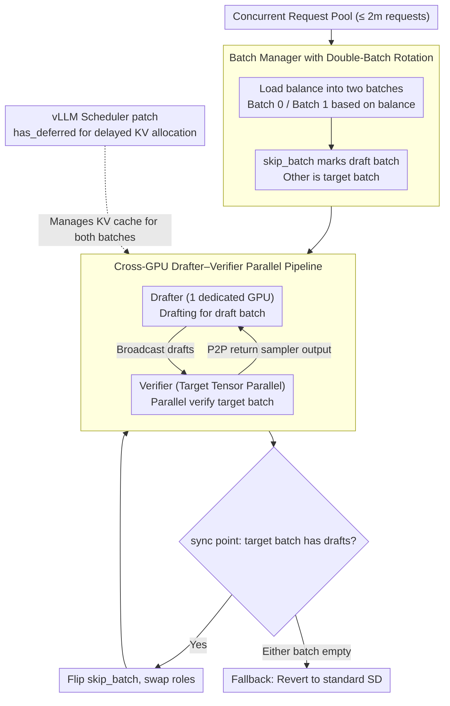

# MineDraft: A Framework for Batch Parallel Speculative Decoding

**Conference**: ICML2026  
**arXiv**: [2603.18016](https://arxiv.org/abs/2603.18016)  
**Code**: Yes (MineDraft GitHub repository, released as a vLLM plugin)  
**Area**: LLM Efficiency / Inference Acceleration  
**Keywords**: Speculative Decoding, Parallel Speculative Decoding, Batch Parallelism, vLLM, GPU Overlap

## TL;DR
MineDraft achieves **overlapped execution** of drafting for one batch and verification for another across two independent sets of GPUs by maintaining two request batches. This transforms the traditionally serial "draft-verify" pipeline of speculative decoding into batch-parallel PSD. At the cost of only one additional GPU, it increases throughput by up to 75% and reduces end-to-end latency by up to 39% compared to standard SD, and is implemented as a plug-and-play vLLM plugin.

## Background & Motivation

**Background**: Speculative Decoding (SD) is a mainstream solution for accelerating LLM inference—using a small draft model to autoregressively generate $k$ draft tokens, followed by a large target model for parallel verification. When most drafts are accepted, SD is significantly faster than naive autoregressive decoding.

**Limitations of Prior Work**: The effectiveness of SD highly depends on the verification success rate (VSR) of the drafts, and drafting and verification are **strictly serial**—verification starts only after drafting finishes, and the next drafting step waits for verification. Existing works (Medusa, EAGLE, TETRIS, etc.) focus on "improving VSR" or "tree/multi-branch drafting," but these methods often slow down the drafting phase (due to more complex drafters or larger sampling overhead), further pinning drafting to the critical path and capping the speedup ratio.

**Key Challenge**: Since verification has a data dependency on the drafting output, direct parallelization is non-trivial. Existing parallelization attempts either require double the GPU/VRAM (Wang 2024, Timor 2025), necessitate retraining the draft model (Xiao 2024), or only handle single requests (PEARL/Liu 2025a). In batched multi-request scenarios, how to effectively hide drafting behind verification using **limited extra resources** remains an open problem.

**Goal**: (i) Theoretically quantify "how much time PSD saves compared to SD"; (ii) provide a batch-parallel PSD framework compatible with production inference stacks (vLLM + PagedAttention + continuous batching); (iii) ensure orthogonality with existing drafting strategies (EAGLE, TETRIS, PEARL) for stacked usage.

**Key Insight**: It is observed that since verification waits for the current batch's draft, **letting the drafter simultaneously draft for the "next batch"** allows the drafter's work to be completely hidden within the verifier's execution time. By splitting the request pool in two and alternating them into the verifier, the drafter never remains idle.

**Core Idea**: Use "double-batch rotation + independent GPUs on both sides" to hide drafting in the shadow of verification—while one batch is being verified, the other is being drafted. The two exchange tokens via direct GPU-to-GPU communication, keeping the verifier fully utilized.

## Method

### Overall Architecture

The deployment of MineDraft consists of: **the target model running on $N$ GPUs with tensor parallelism ($N=4$ in the paper) and the drafter occupying 1 separate GPU**, totaling only one card more than standard SD. The framework comprises 4 components:

- **Batch Manager**: Splits up to $2m$ concurrent requests into Batch 0 / Batch 1, maintains `balance` and `skip_batch` states, and manages batch ID allocation for new and terminating requests.
- **Scheduler**: Manages request lifecycles and KV block allocation, patched for vLLM to resolve over-allocation issues for "drafted but not yet verified" requests.
- **Drafter**: Generates draft tokens for the *draft batch* on the draft GPU and broadcasts them to the verifier.
- **Verifier**: Performs parallel verification for the *target batch* (the draft batch from the previous step) on target GPUs and returns sampler results point-to-point to the drafter.

Execution timing follows Fig.2 (right): before the first SD step, the drafter serially drafts for Batch 0 and broadcasts to the verifier, then drafts for Batch 1. In each subsequent SD step, while the verifier verifies the previous draft batch, the drafter is already drafting for the next round. **The workloads on both sides almost completely overlap on the timeline.** The moment the drafter sends output back to the Scheduler at the end of each SD step is the sync point, where `skip_batch` flips and roles switch.

### Key Designs

1. **Batch Manager with Double-Batch Rotation (balance + skip_batch state machine)**:
    - **Function**: Maintains two approximately equal request pools for $2m$ concurrent requests, ensuring the verifier always receives the previously drafted target batch and the drafter immediately works on the other, enabling "hidden drafting."
    - **Mechanism**: Uses `balance = |Batch 1| - |Batch 0|` to track the size difference. In the first SD step, new requests are assigned to the smaller batch for **load balancing** based on the sign of `balance`. After the first step, new requests are assigned to the current `skip_batch` (the one currently being drafted) to avoid interrupting the verifier's rhythm, while naturally maintaining balance as requests complete. A `recycle` operation performs reverse `balance` updates upon request termination.
    - **Design Motivation**: PSD gains primarily from continuous overlapping. **An empty batch on either side causes the pipeline to degenerate into standard SD** (termed Fallback). `balance/skip_batch` is the necessary state machine to avoid irrecoverable imbalance in real-world scenarios like preemption, abortion, or chunked prefill.

2. **Cross-GPU Drafter–Verifier Parallel Pipeline (Independent GPUs + Direct Communication)**:
    - **Function**: Decouples computation, VRAM, and KV cache of the drafter and verifier, allowing execution times to be parallel rather than competing for resources on the same card.
    - **Mechanism**: The drafter occupies 1 GPU, while the target uses tensor parallel on the rest. The drafter uses **broadcasting** to send draft tokens, and the verifier uses **point-to-point dispatch** to return target sampler outputs. `skip_batch` flips at the sync point at the end of each step. Theoretical analysis (Theorem 1) shows that if $f(t) = 1 - e^{-\alpha t}$ describes the drafter's Pareto frontier, when $\alpha V \approx 1.68$, $T_{\text{SD}} \gtrsim 1.59 \, T_{\text{PSD}}$, saving at least 37% time. The ideal limit is 50%.
    - **Design Motivation**: Existing parallel solutions either crowd both models onto the same card (causing VRAM contention, Fig.5 shows SD OOMs with Qwen3-8B as a drafter) or require doubled GPUs. MineDraft treats "1 dedicated GPU for draft" as the minimal hardware investment to eliminate drafting from the verifier's timeline, remaining orthogonal to methods like EAGLE.

3. **vLLM Scheduler patch: Delayed KV Block Allocation (`has_deferred`)**:
    - **Function**: Avoids over-allocating KV blocks for requests that are "only being drafted and not yet due for verification" under PagedAttention, maintaining compatibility and preventing memory waste.
    - **Mechanism**: Observing that the drafter only reads while the verifier writes to newly allocated KV blocks, the default vLLM scheduler's assumption that all running requests generate tokens is modified. A `has_deferred` set tracks request IDs with postponed allocation. When both batches are non-empty, prefill requests allocate normally, while decoding requests only allocate if the ID is not in `has_deferred` or belongs to the current draft batch.
    - **Design Motivation**: Ensures MineDraft is not just theoretically parallel but acts as a **plug-and-play vLLM plugin**, fully compatible with continuous batching and PagedAttention.

### Loss & Training
MineDraft is a **training-free** inference acceleration framework—it modifies neither the draft nor the target model, only scheduling the pipeline and KV cache allocation.

## Key Experimental Results

### Main Results

**Seven target–draft configurations**, target uses tensor parallel = 4, drafter occupies 1 card; datasets: Arena, ShareGPT, Spec-Bench, Tough.

| Configuration (Target–Draft) | Dataset Example | MineDraft vs Best Baseline | MineDraft vs Standard SD (Δ) |
|---|---|---|---|
| Qwen3 32B–0.6B | Arena | +42.36% Throughput | +70.32% |
| Qwen3 32B–1.7B | Tough | +48.47% Throughput | +75.68% (Highest) |
| Qwen3 32B–4B | ShareGPT | +65.02% Throughput | +65.64% |
| Llama-3 70B–8B | ShareGPT | +30.81% Throughput | +37.06% |
| Vicuna 33B–EAGLE | ShareGPT | +3.95% Throughput | +22.09% |
| Qwen3 32B–1.7B(E2EL) | Tough | -28.97% Latency | -39.51% Latency |
| Qwen3 32B–8B | Arena | Standard SD OOMs | MineDraft runs |

**Normalization (Adjustment for 5 vs 4 GPUs)**: In Setting 2, MineDraft still improves per-GPU normalized throughput by up to 40.55% and reduces normalized latency by up to 24.38% compared to standard SD.

### Ablation Study

Four ablations on the Arena dataset (corresponding to Fig.8):

| Configuration | Key Finding | Description |
|---|---|---|
| Different Draft Models | Drafter choice significantly impacts gain | When drafter compute approaches verifier, $t$ dominates $\max(V, t)$, reducing gain |
| Different Extra Tokens (TETRIS) | MineDraft consistently outperforms SD | Orthogonal to TETRIS "multi-sampling + selection" |
| Different #sequences/req $n$ | Gains persist as $n$ increases | PSD remains robust under intra-batch multi-sampling |
| Different Batch Size $m$ | Gains stable as $m$ increases | Double-batch rotation scales well |

### Key Findings
- **Draft model size is a double-edged sword**: Larger drafters improve VSR but lengthen $t$. When $t > V$, the $\max(V, t)$ term is dominated by $t$, causing speedup to drop. The optimal point is Qwen3-32B paired with 1.7B/4B drafter.
- **Excessive $k$ (draft steps) backfires**: Too many drafts increase verification pressure, making drafting the critical path. This aligns with adaptive drafting observations.
- **VRAM decoupling is a hidden benefit**: Fig.5 shows standard SD OOMs with Qwen3-8B as a drafter, while MineDraft avoids contention. This allows MineDraft to serve massive targets like Qwen3-235B.
- **Degradation in EAGLE**: EAGLE performance in vLLM decreases as $k$ increases (issue being investigated by vLLM team), partially offsetting the gains when stacked with MineDraft.

## Highlights & Insights
- **Engineering analogy to "Minecraft chunk loading"**: Mapping "pre-loading next chunks while the player interacts with the current one" to "pre-generating the next batch while the verifier validates the previous one." This double-buffering logic is elegantly applied to the SD pipeline.
- **Clear theoretical limit characterization**: The term $\max(V, t)$ concisely explains all PSD behaviors—drafting is "free" when $t \le V$, approaching a 50% speedup limit.
- **Compelling ROI**: Adding one card for +75% throughput is a persuasive trade-off for engineering teams.
- **Transferable design**: The `balance + skip_batch` state machine can be applied to any two-stage pipeline with multiple requests, such as retrieve-then-rerank.

## Limitations & Future Work
- **Imbalance degradation**: When chunked prefill or preemption clears a batch, the system might revert to standard SD.
- **Lack of adaptive drafter selection**: Drafter size significantly impacts gains, but MineDraft does not yet offer online optimal drafter selection.
- **Marginal gains on EAGLE**: Limited throughput gains when stacked with EAGLE due to implementation issues and the complexity of the drafter phase itself.

## Related Work & Insights
- **vs PEARL (Liu 2025a)**: PEARL parallelizes for **single requests**; MineDraft uses "double-batch rotation" for **batched** scenarios, proving more suitable for high-concurrency LLM serving.
- **vs Wang 2024 / Timor 2025**: These require doubled GPUs/VRAM to break dependencies; MineDraft achieves this with only one extra card (5 vs 4).
- **vs Xiao 2024**: Xiao 2024 requires specialized training; MineDraft is completely training-free.

## Rating
- Novelty: ⭐⭐⭐⭐ Concepts are derived from double-buffering but applied effectively with theoretical rigor.
- Experimental Thoroughness: ⭐⭐⭐⭐⭐ Extensive combinations of models and datasets, including normalized fairness comparisons.
- Writing Quality: ⭐⭐⭐⭐ Clear analogies and architecture descriptions.
- Value: ⭐⭐⭐⭐⭐ Significant throughput/latency gains with a production-ready vLLM plugin.

<!-- RELATED:START -->

## Related Papers

- [\[CVPR 2026\] ParallelVLM: Lossless Video-LLM Acceleration with Visual Alignment Aware Parallel Speculative Decoding](../../CVPR2026/llm_efficiency/parallelvlm_lossless_video-llm_acceleration_with_visual_alignment_aware_parallel.md)
- [\[ACL 2025\] Tetris: Optimal Draft Token Selection for Batch Speculative Decoding](../../ACL2025/llm_efficiency/tetris_optimal_draft_token_selection_for_batch_speculative_decoding.md)
- [\[CVPR 2026\] E$^2$-SCI: Elastic Edge-Cloud Speculative Decoding via Credit Inertia](../../CVPR2026/llm_efficiency/e2-sci_elastic_edge-cloud_speculative_decoding_via_credit_inertia.md)
- [\[ACL 2026\] CreditDecoding: Accelerating Parallel Decoding in Diffusion Large Language Models with Trace Credit](../../ACL2026/llm_efficiency/creditdecoding_accelerating_parallel_decoding_in_diffusion_large_language_models.md)
- [\[ACL 2026\] Speculative Verification: Exploiting Information Gain to Refine Speculative Decoding](../../ACL2026/llm_efficiency/speculative_verification_exploiting_information_gain_to_refine_speculative_decod.md)

<!-- RELATED:END -->
