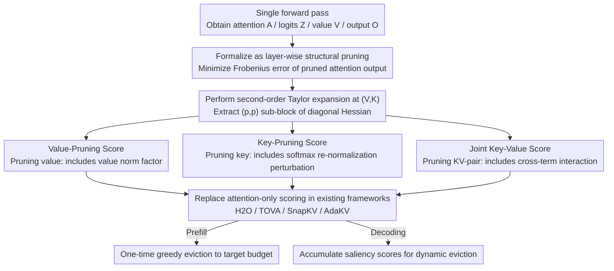

# OBCache: Optimal Brain KV Cache Pruning for Efficient Long-Context LLM Inference

**Conference**: ICML2026  
**arXiv**: [2510.07651](https://arxiv.org/abs/2510.07651)  
**Code**: https://github.com/DreamSoul-AI/OBCache  
**Area**: LLM Efficiency / KV Cache Compression  
**Keywords**: KV cache eviction, Optimal Brain Damage, long-context inference, second-order Taylor approximation, output-aware saliency

## TL;DR
This paper reformulates KV cache eviction as a "layer-wise structural pruning" problem. By leveraging the second-order Taylor approximation from Optimal Brain Damage, it derives closed-form saliency scores for independent value pruning, independent key pruning, and joint key-value pruning units. These serve as plug-and-play "score replacements" for existing attention-only eviction frameworks such as H2O, TOVA, SnapKV, and AdaKV, achieving consistent improvements on LLaMA-3.1 and Qwen-2.5 across RULER and LongBench (e.g., AdaKV's performance increases by nearly 15% on query-agnostic RULER-4K with a 30% budget).

## Background & Motivation

**Background**: The primary bottleneck in long-context LLM inference (128K–1M tokens) is the KV cache, which grows linearly with sequence length and batch size. For instance, LLaMA-3.1-8B requires over 120GB of KV cache for a 1M context, exceeding the memory of mainstream GPUs. A common mitigation is **training-free cache eviction**: methods like H2O, TOVA, and SnapKV discard unimportant tokens based on certain saliency scores, observing that only a few tokens significantly affect the output.

**Limitations of Prior Work**: Existing eviction methods almost exclusively use accumulated attention weights as saliency (H2O accumulates all history, TOVA looks at the latest query, and SnapKV uses a local window with pooling), completely ignoring the contribution of the value state to the final output. Intuitively, this is error-prone: a token with high attention weight but a near-zero value vector has no impact on the output yet is retained; conversely, a token with low attention weight but a unique value direction might be incorrectly evicted.

**Key Challenge**: The "gold standard" for saliency should be the **perturbation of the true output $\mathbf{O}$ after removing a token**, whereas attention weights are merely a coarse approximation of this perturbation. While VATP and CriticalKV recognize the importance of value norms, they either lack a formal framework or require additional assumptions about attention distributions.

**Goal**: (1) Provide a unified theoretical framework for cache eviction that incorporates both attention-only and value-aware scores; (2) Derive **closed-form saliency scores that explicitly include value/key information**; (3) Enable these new scores to replace saliency terms in any existing framework as plug-and-play components.

**Key Insight**: LeCun's Optimal Brain Damage (1989) provides an elegant closed-form solution for the second-order Taylor approximation of task loss after pruning weights. By treating the cached KV as "dynamic weights," eviction becomes structural pruning, making the OBD second-order expansion applicable.

**Core Idea**: Formalize cache eviction as a layer-wise pruning problem that minimizes the Frobenius error between the pruned attention output $\widehat{\mathbf{O}}$ and the original $\mathbf{O}$. By applying second-order Taylor expansion to this error, **closed-form scores for value, key, and joint KV-pair units** are derived, which can be computed immediately.

## Method

### Overall Architecture
All modifications in OBCache occur solely at the "scoring" step of the eviction method. It does not alter the scheduling logic (e.g., when to trigger pruning or how to allocate budgets across heads) of H2O, TOVA, SnapKV, or AdaKV. Instead, it replaces the attention-only saliency in their scoring functions with a value/key-aware closed-form score. This replacement is based on viewing cache eviction as layer-wise structural pruning: given perturbations $\widehat{\mathbf{V}} = \mathbf{V} + \delta\mathbf{V}$ and $\widehat{\mathbf{K}} = \mathbf{K} + \delta\mathbf{K}$ at token position $p$, pruning a token is equivalent to setting $\mathbf{e}_p^\top [\widehat{\mathbf{V}}\ \widehat{\mathbf{K}}] = \mathbf{0}$. The objective is to minimize the *pruning-induced eviction error* $\mathcal{L} = \| \sigma(\mathbf{Q}\widehat{\mathbf{K}}^\top/\sqrt{d})\widehat{\mathbf{V}} - \sigma(\mathbf{Q}\mathbf{K}^\top/\sqrt{d})\mathbf{V} \|_F^2$, which acts as a proxy for the unobservable true eviction error. Performing a second-order Taylor expansion at $(\mathbf{V}, \mathbf{K})$ causes the first-order term to vanish (since $\widehat{\mathbf{O}}-\mathbf{O}=\mathbf{0}$), leaving $\mathcal{L} = \tfrac{1}{2}\delta\mathbf{V}^\top \mathbf{H}^{vv} \delta\mathbf{V} + \tfrac{1}{2}\delta\mathbf{K}^\top \mathbf{H}^{kk} \delta\mathbf{K} + \delta\mathbf{V}^\top \mathbf{H}^{vk} \delta\mathbf{K} + \mathcal{O}(\|\cdot\|^3)$. Utilizing the OBD diagonal assumption and taking the $(p, p)$ block of the Hessian yields closed-form saliency scores $\mathbf{S}_p$ for all three units, which can then be integrated back into original frameworks.

### Key Designs

**1. Value-Pruning Score ($\mathbf{S}_p^{\text{value}}$): The cheapest metric for output perturbation when only removing values.**

The most direct flaw of attention-only scores is that they only consider how much a token is attended to, not what its value looks like—a token with high attention but a near-zero value contributes nothing to the output. By substituting value as the sole pruning unit ($\mathbf{e}_p^\top \widehat{\mathbf{V}} = \mathbf{0}$) into the first term of the second-order Taylor expansion, the closed-form result is $\mathbf{S}_p^{\text{value}} = \sum_i |\mathbf{A}_{i,p}|^2 \|\mathbf{v}_p\|^2$, which is the squared $\ell_2$ norm of the attention column multiplied by the squared value norm. This effectively adds a $\|\mathbf{v}_p\|^2$ scaling factor to the original attention score with almost zero overhead, while incorporating value-state information. Crucially, the heuristic value-aware scores previously proposed by VATP/CriticalKV are special cases using the $\ell_1$-norm, meaning the inclusion of value norms is a natural conclusion of the OBD framework rather than just empirical intuition.

**2. Key-Pruning Score ($\mathbf{S}_p^{\text{key}}$): Capturing the ripple effect of softmax re-normalization after pruning keys.**

While pruning a value only shifts a weighted vector, pruning a key is far more destructive as it alters the entire row of logits. After softmax re-normalization, the entire attention distribution is skewed, an effect not explicitly modeled by attention-only or value-aware scores. The closed-form score derived for key pruning ($\mathbf{e}_p^\top \widehat{\mathbf{K}} = \mathbf{0}$) is $\mathbf{S}_p^{\text{key}} = \sum_i |\mathbf{A}_{i,p} \mathbf{Z}_{i,p}|^2 \|\mathbf{v}_p - \mathbf{o}_i\|^2$, where $\mathbf{Z}$ are the pre-softmax logits and $\mathbf{o}_i$ is the attention output at the $i$-th query position. This score assigns high importance to tokens whose values differ significantly from the current output $\mathbf{o}_i$ and whose attention/logits are high—exactly the tokens that would significantly skew $\mathbf{O}$ if removed. By explicitly characterizing this sensitivity, key-pruning becomes the largest source of gain for OBCache.

**3. Joint Key-Value Score ($\mathbf{S}_p^{\text{joint}}$): A complete estimate incorporating key-value interaction terms.**

The previous two scores operate independently and cannot capture the coupling when $(\mathbf{k}_p, \mathbf{v}_p)$ are removed simultaneously. Using them as a joint pruning unit yields the closed-form score $\mathbf{S}_p^{\text{joint}} = \mathbf{S}_p^{\text{value}} + \mathbf{S}_p^{\text{key}} + 2 \sum_i |\mathbf{A}_{i,p}|^2 \mathbf{Z}_{i,p} (\|\mathbf{v}_p\|^2 - \mathbf{v}_p^\top \mathbf{o}_i)$. The third term, contributed by the cross-Hessian $\mathbf{H}^{vk}$, captures the interaction effect between key and value, providing the most comprehensive estimate of the true eviction error. Its significance lies in providing theoretical completeness and offering users different tiers (OBCache-V, -K, -V&K) based on their computational budget.

**Mechanism for Unifying Existing Methods**: By relaxing the objective function from "output error" to "attention matrix row error $\|\widehat{\mathbf{A}}_{w:s} - \mathbf{A}_{w:s}\|_{1,1}$" and simplifying the pruning unit to a single column of the attention matrix, the framework reduces to $\mathbf{S}_p^{\text{attn}} = \sum_{i=w}^s |\mathbf{A}_{i,p}|$. This corresponds exactly to the accumulated scores used by H2O ($w=1$), TOVA ($w=s$), and SnapKV ($w \gg 1$), making them special cases of OBCache under different "perturbation windows" $w$.

### Loss & Training
OBCache is a **training-free inference-time method** that requires no training or fine-tuning. All Hessian sub-blocks can be computed from a standard forward pass (requiring attention weights $\mathbf{A}$, pre-softmax logits $\mathbf{Z}$, values $\mathbf{V}$, and outputs $\mathbf{O}$). Implementing this with FlashAttention-2 during prefill results in nearly zero additional memory overhead. During the prefill stage, tokens are greedily evicted once to the target budget; during decoding, $\mathbf{S}_p$ is accumulated for real-time updates to support dynamic eviction. Derivations for GQA models are also provided (Appendix A.5).

## Key Experimental Results

### Main Results
Settings: LLaMA-3.1-8B-Instruct / Qwen-2.5-7B-Instruct using the KVPress framework. Evaluated on RULER (4K/32K) + LongBench during prefill, and PG19 (~70K tokens) for perplexity during decoding. Cache budget set at 10–40% of prompt length. Both query-aware and query-agnostic settings were tested.

| Baseline (LLaMA-3.1-8B, RULER-4K) | Setting | Avg Acc | + OBCache-K | + OBCache-V&K | Gain |
|------|------|------|------|------|------|
| H2O | Q-Aware | 57.5 | 67.6 | 67.8 | **+10.3** |
| H2O | Q-Agnostic | 31.7 | 38.9 | 40.0 | +8.3 |
| TOVA | Q-Aware | 74.5 | 76.5 | 76.7 | +2.2 |
| SnapKV | Q-Aware | 72.4 | 73.9 | 73.6 | +1.5 |
| SnapKV | Q-Agnostic | 37.9 | 42.1 | 41.9 | +4.2 |
| AdaKV | Q-Aware | 75.7 | 81.6 | 81.9 | +6.2 |
| AdaKV | Q-Agnostic | 43.0 | 55.0 | **55.2** | **+12.2** |

> RULER-32K shows similar across-the-board improvements; AdaKV + OBCache-V&K improves from 45.5 to 55.1 (+9.6) in the query-agnostic setting. On LongBench with 10% budget, AdaKV + OBCache-K contributes a gain of +1.2 (query-aware) and +2.6 (query-agnostic).

### Ablation Study

| Config (RULER-4K, AdaKV baseline, Q-Agnostic) | Avg Acc | Note |
|------|------|------|
| AdaKV (attention-only) | 43.0 | Strongest existing attention-only baseline |
| + OBCache-V | 51.4 | Value information only (similar to VATP/CriticalKV, but $\ell_2$) |
| + OBCache-K | 55.0 | Key sensitivity included; largest contribution |
| + OBCache-V&K | 55.2 | Cross-term added; marginal improvement over V |
| VATP (OBCache-V-L1) | < OBCache-V | $\ell_1$-norm value-only; outperformed by OBCache-V |
| CriticalKV | < OBCache-K | Closest to OBCache only at 40% budget |

### Key Findings
- **Key-pruning scores yield significantly higher gains than value-pruning scores**: Pruning keys modifies the attention distribution via softmax re-normalization, leading to naturally larger perturbations. OBCache-K consistently outperforms OBCache-V across all baselines and budgets.
- **OBCache is highly complementary to stronger baselines**: It improves H2O by ~10% and AdaKV by ~12% in query-agnostic settings, indicating that attention-only signals represent an "information gap" regardless of budget allocation strategies.
- **Second-order Taylor approximation is nearly lossless**: Needle-in-A-Haystack experiments (Section 4.4) show that the recall of the closed-form score for oracle top-$k$ is almost identical to exact recalculation of the error, but at a much lower cost.
- **Structural bias exists**: As the perturbation window grows, earlier tokens may accumulate excessively high scores because they are attended to by more queries. This is mitigated by following the H2O strategy of using a "fixed recent window" (e.g., 20 tokens).
- **Decoding performance**: On PG19 with a 1024-token budget and 4 sinks, OBCache-K achieves lower perplexity than H2O across the 1–32K range. OBCache-V&K does not significantly exceed OBCache-K, suggesting the simple additive form may not be optimal for fusion.

## Highlights & Insights
- **Repurposing 1989 OBD for 2026 KV Cache**: The realization that cached KV acts as "dynamic weights injected on demand" allows structural pruning analysis to be applied directly without reinventing the wheel.
- **Valuable unification of prior work**: Proving that H2O, TOVA, and SnapKV are special cases of the same objective under different windows, and that VATP/CriticalKV are $\ell_1$ value-only variants, provides a strong scholarly narrative.
- **OBCache-V is nearly free**: By simply adding a $\|\mathbf{v}_p\|^2$ scaling factor to existing attention scores, it improves most baselines at zero cost, making it highly suitable for production deployment.
- **Strong transferability**: This paradigm can be extended to channel-wise KV pruning, cache merging (replacing "pruning to 0" with merging into another token), and KV factorization.

## Limitations & Future Work
- **Validity of second-order expansion**: In scenarios with extremely low budgets (e.g., 5%), the diagonal and small-perturbation assumptions may break down as many tokens are pruned simultaneously. The theory is less robust for budgets < 10%.
- **Marginal cross-term gains**: OBCache-V&K barely outperforms OBCache-K, suggesting the interaction between V and K is not fully utilized by the additive form—an area for future refinement mentioned in the conclusion.
- **Scope of pruning units**: The paper focuses on token-wise eviction. While the framework can theoretically extend to head-wise or channel-wise pruning, this remains unexplored experimentally.
- **Dependency on intermediate tensors**: Implementing the method requires access to logits $\mathbf{Z}$ and outputs $\mathbf{O}$, which might require modifications to customized inference backends (e.g., where softmax is fused into the kernel).
- **Generalization across model families**: Validated only on LLaMA-3.1 and Qwen-2.5. Performance on MoE models (e.g., DeepSeek-V3) or models with long KV cache distillation remains to be verified.

## Related Work & Insights
- **vs H2O (NeurIPS 2023)**: H2O accumulates all historical attention. OBCache views this as a special case ($w=1$, minimizing attention row error) and adds value/key info to gain ~10% under the same budget.
- **vs SnapKV (NeurIPS 2024)**: SnapKV uses local windows and 1D pooling to smooth attention scores. OBCache provides a more accurate saliency where the marginal benefits of pooling are reduced.
- **vs VATP / CriticalKV (2024–2025)**: These heuristically multiply attention scores by $\|\mathbf{v}_p\|$. OBCache formally derives similar formulas (proving $\ell_2$ is superior for key-pruning derivation) and adds key/joint scores to outperform them.
- **vs Wanda / SparseGPT (2023)**: These represent the modern revival of OBD for static weight pruning. OBCache extends this to "dynamic KV weights" by shifting the Hessian derivation from weight dimensions to token dimensions.
- **Transferable Insights**: (1) This framework can be applied to any system with softmax (e.g., MoE expert eviction, RAG chunk eviction, vision token pruning). (2) Proving that heuristic scores are second-order solutions to well-defined objectives is a powerful narrative for "unification/revisiting" papers.

## Rating
- Novelty: ⭐⭐⭐⭐ Clean application of OBD to dynamic KV caches; the unification of existing methods is particularly elegant, though value-aware parts provide theoretical backup for existing heuristics.
- Experimental Thoroughness: ⭐⭐⭐⭐ Broad coverage across 4 baselines, 2 models, 2 benchmarks, multiple budgets, and both prefill/decoding; lacks MoE and extremely low budget verification.
- Writing Quality: ⭐⭐⭐⭐ Clear progression from OBD derivation to closed-form scores and baseline unification; GQA/multi-head notation can be a bit condensed.
- Value: ⭐⭐⭐⭐ Provides plug-and-play saliency components with immediate engineering value for long-context LLM deployment. OBCache-V is a "free" upgrade.

<!-- RELATED:START -->

## Related Papers

- [\[ICLR 2026\] DefensiveKV: Taming the Fragility of KV Cache Eviction in LLM Inference](../../ICLR2026/llm_efficiency/defensivekv_taming_the_fragility_of_kv_cache_eviction_in_llm_inference.md)
- [\[ICLR 2026\] FreeKV: Boosting KV Cache Retrieval for Efficient LLM Inference](../../ICLR2026/llm_efficiency/freekv_boosting_kv_cache_retrieval_for_efficient_llm_inference.md)
- [\[ICML 2026\] RKSC: Reasoning-Aware KV Cache Sharing and Confident Early Exit for Multi-Step LLM Inference](rksc_reasoning-aware_kv_cache_sharing_and_confident_early_exit_for_multi-step_ll.md)
- [\[ICML 2026\] Optimal Bayesian Stopping for Efficient Inference of Consistent LLM Answers](optimal_bayesian_stopping_for_efficient_inference_of_consistent_llm_answers.md)
- [\[ICML 2026\] CriticalKV: Optimizing KV Cache Eviction from an Output Perturbation Perspective](criticalkv_optimizing_kv_cache_eviction_from_an_output_perturbation_perspective.md)

<!-- RELATED:END -->
