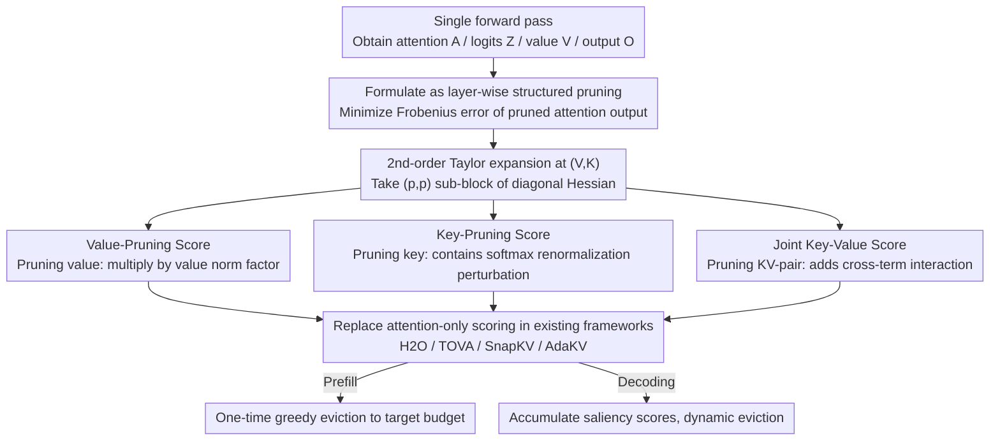

# OBCache: Optimal Brain KV Cache Pruning for Efficient Long-Context LLM Inference

**Conference**: ICML2026  
**arXiv**: [2510.07651](https://arxiv.org/abs/2510.07651)  
**Code**: https://github.com/DreamSoul-AI/OBCache  
**Area**: LLM Efficiency / KV Cache Compression  
**Keywords**: KV cache eviction, Optimal Brain Damage, long-context inference, second-order Taylor approximation, output-aware saliency

## TL;DR
This paper reformulates KV cache eviction as a "layer-wise structured pruning" problem. Leveraging the second-order Taylor approximation from Optimal Brain Damage, it derives closed-form saliency scores for independent value, independent key, and joint key-value pruning units. These serve as plug-and-play scoring components for existing attention-only eviction frameworks like H2O, TOVA, SnapKV, and AdaKV, achieving consistent improvements on LLaMA-3.1 and Qwen-2.5 across RULER and LongBench benchmarks (e.g., AdaKV's performance increases by nearly 15% on query-agnostic RULER-4K with a 30% budget).

## Background & Motivation

**Background**: The primary bottleneck in long-context LLM (128K–1M tokens) inference is the KV cache, which grows linearly with sequence length and batch size—LLaMA-3.1-8B requires over 120GB of KV cache for a 1M context, far exceeding the memory of mainstream GPUs. A common mitigation is **training-free cache eviction**: methods like H2O, TOVA, and SnapKV discard unimportant tokens permanently based on the observation that only a few tokens significantly affect the output.

**Limitations of Prior Work**: Existing eviction methods almost exclusively use accumulated attention weights as saliency (H2O accumulates all history, TOVA focuses on the latest query, SnapKV uses a local window with pooling), completely ignoring the contribution of value states to the final output. Intuitively, this is prone to error—a token with high attention weight but a near-zero value vector may have negligible impact on the output yet be preserved; conversely, a token with low attention weight but a unique value direction might be incorrectly evicted.

**Key Challenge**: The "gold standard" for saliency should be the **perturbation of the actual output $\mathbf{O}$ after removing a token**, whereas attention weight is merely a coarse approximation of this perturbation. While VATP and CriticalKV have recognized that the value norm should be incorporated, they lack a formalized framework or require additional assumptions about attention distribution.

**Goal**: (1) Provide a unified theoretical framework for cache eviction that incorporates both attention-only and value-aware scores; (2) derive **closed-form saliency scores that explicitly include value/key information**; (3) ensure these new scores can be used as plug-and-play replacements for saliency terms in any existing method.

**Key Insight**: It is observed that LeCun’s 1989 "Optimal Brain Damage" (OBD) provides an elegant closed-form solution for the second-order Taylor approximation of task loss after pruning a weight. If cached KV pairs are treated as "dynamic weights," eviction becomes structured pruning, making the second-order expansion of OBD applicable.

**Core Idea**: Cache eviction is formalized as a layer-wise pruning problem to minimize the Frobenius error between the pruned attention output $\widehat{\mathbf{O}}$ and the original $\mathbf{O}$. By applying a second-order Taylor expansion to this error, **closed-form scores for value, key, and joint KV-pair units** are derived for immediate calculation.

## Method

### Overall Architecture
All modifications in OBCache occur solely at the "scoring" step of the eviction process. It does not alter the scheduling logic (e.g., when to trigger pruning or how to allocate budgets across multiple heads) of H2O, TOVA, SnapKV, or AdaKV. Instead, it replaces the attention-only saliency in their scoring functions with a value-aware/key-aware closed-form score. This replacement is justified by viewing cache eviction as layer-wise structured pruning: at token position $p$, perturbations are written as $\widehat{\mathbf{V}} = \mathbf{V} + \delta\mathbf{V}$ and $\widehat{\mathbf{K}} = \mathbf{K} + \delta\mathbf{K}$. Evicting a token is equivalent to setting $\mathbf{e}_p^\top [\widehat{\mathbf{V}}\ \widehat{\mathbf{K}}] = \mathbf{0}$. The optimization goal is to minimize the *pruning-induced eviction error* $\mathcal{L} = \| \sigma(\mathbf{Q}\widehat{\mathbf{K}}^\top/\sqrt{d})\widehat{\mathbf{V}} - \sigma(\mathbf{Q}\mathbf{K}^\top/\sqrt{d})\mathbf{V} \|_F^2$, which acts as a proxy for the unobservable true eviction error affecting future outputs. After a second-order Taylor expansion at $(\mathbf{V}, \mathbf{K})$, the first-order term vanishes because $\widehat{\mathbf{O}}-\mathbf{O}=\mathbf{0}$, leaving $\mathcal{L} = \tfrac{1}{2}\delta\mathbf{V}^\top \mathbf{H}^{vv} \delta\mathbf{V} + \tfrac{1}{2}\delta\mathbf{K}^\top \mathbf{H}^{kk} \delta\mathbf{K} + \delta\mathbf{V}^\top \mathbf{H}^{vk} \delta\mathbf{K} + \mathcal{O}(\|\cdot\|^3)$. By following the OBD diagonal assumption and taking the $(p,p)$ sub-block of the Hessian, closed-form saliency scores $\mathbf{S}_p$ can be derived for value, key, and joint units from a single forward pass.

### Key Designs

**1. Value-Pruning Score ($\mathbf{S}_p^{\text{value}}$): The Cheapest Measure of Output Perturbation for Value Deletion**

The direct weakness of attention-only scores is that they only consider how much a token is attended to, without considering the characteristics of its value. A token with high attention weight but a near-zero value vector contributes nothing to the output. By setting value as the sole pruning unit ($\mathbf{e}_p^\top \widehat{\mathbf{V}} = \mathbf{0}$), the closed-form result is $\mathbf{S}_p^{\text{value}} = \sum_i |\mathbf{A}_{i,p}|^2 \|\mathbf{v}_p\|^2$, which is the squared $\ell_2$-norm of the attention column multiplied by the squared value norm. This simply attaches a $\|\mathbf{v}_p\|^2$ scaling factor to the original attention score, introducing value-state information with near-zero overhead. Furthermore, it reveals that value-aware scores previously proposed heuristically by VATP/CriticalKV are special cases ($\ell_1$-norm) of this formula, grounding the use of value norms in the OBD framework.

**2. Key-Pruning Score ($\mathbf{S}_p^{\text{key}}$): Capturing Cascading Perturbations from Softmax Renormalization**

While pruning value only shifts a weighted vector, pruning key is far more destructive as it alters an entire column of logits. Through softmax renormalization, the entire attention distribution is shifted—an effect not explicitly modeled by existing attention-only or value-aware scores. The closed-form score derived for key pruning ($\mathbf{e}_p^\top \widehat{\mathbf{K}} = \mathbf{0}$) is $\mathbf{S}_p^{\text{key}} = \sum_i |\mathbf{A}_{i,p} \mathbf{Z}_{i,p}|^2 \|\mathbf{v}_p - \mathbf{o}_i\|^2$, where $\mathbf{Z}$ are pre-softmax logits and $\mathbf{o}_i$ is the attention output at query position $i$. This assigns higher scores to tokens whose value direction differs significantly from the current output $\mathbf{o}_i$ and whose attention/logits are high—precisely the tokens that would significantly bias $\mathbf{O}$ if removed. By characterizing this sensitivity hidden from attention-only signals, key-pruning becomes the largest source of gain for OBCache.

**3. Joint Key-Value Score ($\mathbf{S}_p^{\text{joint}}$): A Complete Estimate Including Key/Value Interactions**

The first two scores act independently and fail to capture the coupling when $(\mathbf{k}_p,\mathbf{v}_p)$ are pruned together. Treating them as a joint unit yields $\mathbf{S}_p^{\text{joint}} = \mathbf{S}_p^{\text{value}} + \mathbf{S}_p^{\text{key}} + 2 \sum_i |\mathbf{A}_{i,p}|^2 \mathbf{Z}_{i,p} (\|\mathbf{v}_p\|^2 - \mathbf{v}_p^\top \mathbf{o}_i)$. The third term represents the contribution of the cross-Hessian $\mathbf{H}^{vk}$, capturing the interaction between keys and values for a complete estimate of the true eviction error. Its significance lies in theoretical completeness, allowing users to choose between OBCache-V, -K, or -V&K based on their computational budget.

**Unification with Existing Methods**: By relaxing the objective from "output error" to "attention matrix row error $\|\widehat{\mathbf{A}}_{w:s} - \mathbf{A}_{w:s}\|_{1,1}$" and simplifying the pruning unit to a single column of the attention matrix, the framework reduces to $\mathbf{S}_p^{\text{attn}} = \sum_{i=w}^s |\mathbf{A}_{i,p}|$. This matches the accumulated scores used by H2O ($w=1$), TOVA ($w=s$), and SnapKV ($w \gg 1$), making them special cases of OBCache under different "perturbation windows" $w$.

### Loss & Training
OBCache is a **training-free inference-time method** requiring no training or fine-tuning. All Hessian sub-blocks can be calculated from a standard forward pass (requiring attention weights $\mathbf{A}$, pre-softmax logits $\mathbf{Z}$, values $\mathbf{V}$, and outputs $\mathbf{O}$) with nearly zero additional memory cost using FlashAttention-2. During the prefill stage, it performs one-time greedy eviction to the target budget; during decoding, it performs real-time updates of $\mathbf{S}_p$ to support dynamic eviction. Derivations for GQA models are provided in Appendix A.5.

## Key Experimental Results

### Main Results
Setup: LLaMA-3.1-8B-Instruct / Qwen-2.5-7B-Instruct using the KVPress framework. Evaluation on RULER (4K/32K) + LongBench for prefill, and PG19 (~70K tokens) perplexity for decoding. Cache budget = 10–40% of prompt length. Comparison between query-aware and query-agnostic settings.

| Baseline (LLaMA-3.1-8B, RULER-4K) | Setting | Avg. Acc | + OBCache-K | + OBCache-V&K | Gain |
|------|------|------|------|------|------|
| H2O | Q-Aware | 57.5 | 67.6 | 67.8 | **+10.3** |
| H2O | Q-Agnostic | 31.7 | 38.9 | 40.0 | +8.3 |
| TOVA | Q-Aware | 74.5 | 76.5 | 76.7 | +2.2 |
| SnapKV | Q-Aware | 72.4 | 73.9 | 73.6 | +1.5 |
| SnapKV | Q-Agnostic | 37.9 | 42.1 | 41.9 | +4.2 |
| AdaKV | Q-Aware | 75.7 | 81.6 | 81.9 | +6.2 |
| AdaKV | Q-Agnostic | 43.0 | 55.0 | **55.2** | **+12.2** |

> RULER-32K shows similar across-the-board improvements; AdaKV + OBCache-V&K increases from 45.5 to 55.1 (+9.6) in the query-agnostic setting. On LongBench with a 10% budget, OBCache-K contributes +1.2 (Q-Aware) and +2.6 (Q-Agnostic) to AdaKV.

### Ablation Study

| Configuration (RULER-4K, AdaKV baseline, Q-Agnostic) | Avg. Acc | Description |
|------|------|------|
| AdaKV (attention-only) | 43.0 | Strongest existing attention-only baseline |
| + OBCache-V | 51.4 | Incorporates value info ($\ell_2$ version of VATP/CriticalKV) |
| + OBCache-K | 55.0 | Incorporates key sensitivity (largest contribution) |
| + OBCache-V&K | 55.2 | Adds cross-term (marginal improvement over V) |
| VATP (OBCache-V-L1) | < OBCache-V | $\ell_1$-norm value-only; outperformed by OBCache-V |
| CriticalKV | < OBCache-K | Competitive only at high (40%) budget |

### Key Findings
- **Key-pruning score gains significantly outweigh value-pruning gains**: Pruning keys modifies the attention distribution via softmax renormalization, naturally causing larger perturbations. OBCache-K consistently outperforms OBCache-V across all baselines and budgets.
- **OBCache is increasingly complementary to stronger baselines**: Gains of ~10% on H2O and ~12% on query-agnostic AdaKV suggest that attention-only signals are an "information gap" regardless of the budget allocation strategy.
- **2nd-order Taylor approximation is nearly lossless**: Needle-in-A-Haystack experiments (Section 4.4) show that OBCache’s closed-form scores achieve similar oracle top-$k$ recall as exact recalculation of Eq.(1), but at much lower cost.
- **Structural bias exists**: Larger perturbation windows lead to higher scores for early tokens as they are attended to by more queries. This is mitigated using H2O’s "fixed recent window" strategy (e.g., 20 tokens).
- **Decoding scenario**: On PG19 with a fixed 1024-token budget and 4 sinks, OBCache-K maintains lower perplexity than H2O across 1–32K tokens. OBCache-V&K does not significantly exceed OBCache-K, suggesting the additive fusion might not be optimal.

## Highlights & Insights
- **Elegantly applying 1989 OBD to 2026 KV caches**: Cached KV pairs essentially act as "on-demand dynamic weights" during inference. The machinery of second-order analysis for structured pruning is immediately applicable without reinvention.
- **Valuable byproducts of a unified framework**: The authors prove that H2O, TOVA, and SnapKV are special cases of the same objective with different perturbation windows $w$, and that VATP/CriticalKV are $\ell_1$ value-only variants. This narrative is more compelling than mere benchmark gains.
- **OBCache-V is nearly "free"**: Adding only a $\|\mathbf{v}_p\|^2$ scaling factor to attention-only scores provides performance gains across most baselines with negligible overhead, offering high deployment ROI.
- **High transferability**: The same paradigm can be extended to channel-wise KV pruning, cache merging (replacing "prune-to-0" with "merge-to-another"), and KV factorization in weight-sharing scenarios.

## Limitations & Future Work
- **Reliance on "small perturbation" assumption**: As budgets become extremely low (e.g., <5%), the diagonal Hessian and small perturbation assumptions may break down, weakening theoretical guarantees. The paper focuses on budgets $\ge 10\%$.
- **Weak gains from cross-terms**: OBCache-V&K barely outperforms OBCache-K, indicating that the additive form does not fully exploit V/K interactions, leaving room for more refined combinations.
- **Scope limited to token-wise pruning**: While the framework could theoretically apply to head-wise or channel-wise dimensions, experiments only cover token-wise eviction.
- **Dependency on internal states**: Accessing logits $\mathbf{Z}$ and outputs $\mathbf{O}$ may require engineering changes in custom inference backends that fuse softmax into kernels.
- **Cross-model family generalization**: Validation was limited to LLaMA-3.1 and Qwen-2.5. Stability in MoE models (e.g., DeepSeek-V3) or distilled long-context models remains to be verified.

## Related Work & Insights
- **vs H2O (NeurIPS 2023)**: H2O accumulates all historical attention. OBCache views this as a special case ($w=1$, minimizing attention row error) and adds value/key info for a stable 10% gain.
- **vs SnapKV (NeurIPS 2024)**: SnapKV uses recent windows and 1D pooling to smooth attention-only scores. OBCache provides more accurate saliency directly, reducing the marginal utility of such pooling.
- **vs VATP / CriticalKV (2024–2025)**: These heuristically multiply $\|\mathbf{v}_p\|$ with attention. OBCache re-derives this via OBD (showing $\ell_2$ is superior for deriving key terms) and introduces two superior scores (key and joint).
- **vs Wanda / SparseGPT (2023)**: These represent the modern revival of OBD for static weight pruning. OBCache extends this lineage to "dynamic KV weights" by moving the Hessian derivation from the weight dimension to the token dimension.
- **Transferable Insights**: (1) Any component with softmax (attention, routers) can use this framework—e.g., MoE expert eviction, retrieval-augmented chunk eviction, or vision token pruning. (2) Proving that a heuristic score is a second-order solution to a well-defined objective is a strong narrative for "unification" papers.

## Rating
- Novelty: ⭐⭐⭐⭐ Clean application of OBD to dynamic KV caches; the unification of existing methods is particularly excellent.
- Experimental Thoroughness: ⭐⭐⭐⭐ Extensive coverage across 4 baselines, 2 models, 2 benchmarks, and multiple budgets; lacks MoE and extremely low budget tests.
- Writing Quality: ⭐⭐⭐⭐ Clear derivation of three closed-form scores following the OBD framework; minor GQA/multi-head notation jumps.
- Value: ⭐⭐⭐⭐ Plug-and-play saliency component with immediate utility for long-context LLM deployment; OBCache-V provides gains at almost zero cost.

<!-- RELATED:START -->

## Related Papers

- [\[ICML 2026\] Optimal Bayesian Stopping for Efficient Inference of Consistent LLM Answers](optimal_bayesian_stopping_for_efficient_inference_of_consistent_llm_answers.md)
- [\[ICML 2026\] CriticalKV: Optimizing KV Cache Eviction from an Output Perturbation Perspective](criticalkv_optimizing_kv_cache_eviction_from_an_output_perturbation_perspective.md)
- [\[ICLR 2026\] LycheeDecode: Accelerating Long-Context LLM Inference via Hybrid-Head Sparse Decoding](../../ICLR2026/llm_efficiency/lycheedecode_accelerating_long-context_llm_inference_via_hybrid-head_sparse_deco.md)
- [\[AAAI 2026\] Judge Q: Trainable Queries for Optimized Information Retention in KV Cache Eviction](../../AAAI2026/llm_efficiency/judge_q_trainable_queries_for_optimized_information_retention_in_kv_cache_evicti.md)
- [\[ACL 2025\] Squeezed Attention: Accelerating Long Context Length LLM Inference](../../ACL2025/llm_efficiency/squeezed_attention_accelerating_long_context_length_llm_inference.md)

<!-- RELATED:END -->
