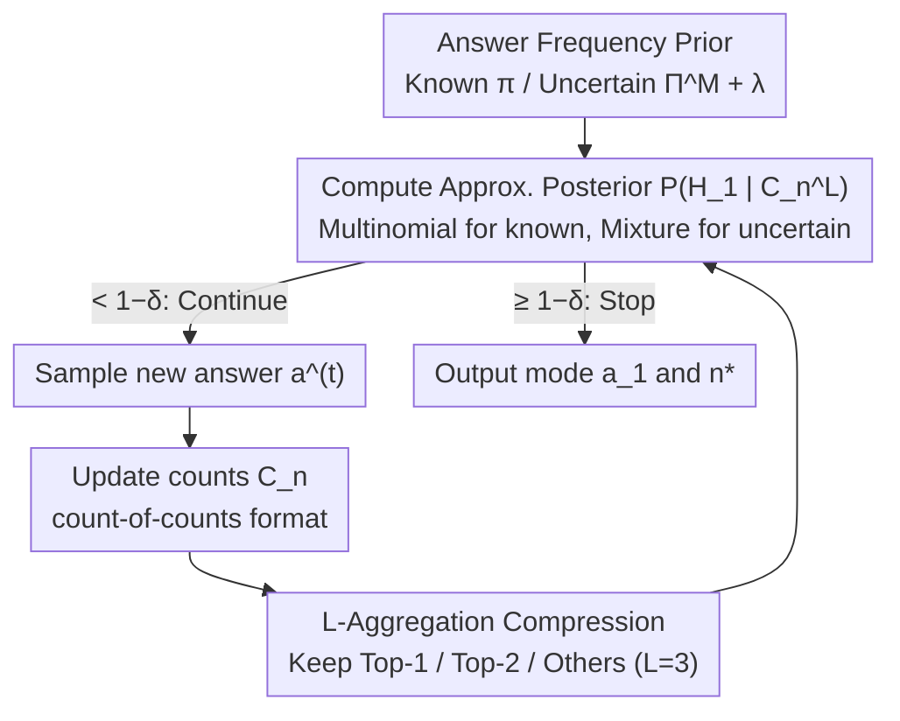

# Optimal Bayesian Stopping for Efficient Inference of Consistent LLM Answers

**Conference**: ICML 2026  
**arXiv**: [2602.05395](https://arxiv.org/abs/2602.05395)  
**Code**: https://github.com/jh9959-afk/Paper (Available)  
**Area**: LLM Efficiency / Test-time Computation / Adaptive Self-Consistency  
**Keywords**: Adaptive Sampling, Self-Consistency, Bayesian Stopping, Sequential Hypothesis Testing, Test-time Scaling

## TL;DR
This paper models the "Self-Consistency (multiple sampling for majority vote)" problem as a Bayesian optimal stopping problem with prior information. It proposes an $L$-aggregated posterior approximation that tracks only three types of counts: "top-1 frequency, top-2 frequency, and others." The authors theoretically prove that $L=3$ achieves the same asymptotically optimal stopping time as the exact posterior as $\delta \to 0$. Experimentally, it saves 30%–80% of LLM calls on GSM8K and CommonsenseQA at approximately 1.4x the speed of ASC.

## Background & Motivation

**Background**: The mainstream lightweight method to improve LLM accuracy on math and reasoning tasks is Self-Consistency (SC) — sampling multiple CoT paths for the same question and deciding the final answer by majority vote. While "sampling-then-voting" has become a standard recipe for test-time scaling, it incurs high costs due to fixed budgets (e.g., 40 samples per question). To mitigate this, Adaptive Self-Consistency (ASC) by Aggarwal et al. 2023 uses a Beta posterior under an uninformative prior for stopping criteria: "stop once the leading answer is strong enough."

**Limitations of Prior Work**: ASC and similar works ignore a clear signal — the shape of the answer distribution for the same LLM on similarly distributed problems is a learnable prior. Easy questions have "spiky" distributions (max probability near 1), while hard ones are "flat." This shape can be estimated from historical responses, but it is not utilized in ASC’s Bayesian updates.

**Key Challenge**: Directly plugging the "answer frequency vector $\pi$" as a prior into a Bayesian framework to calculate the posterior for "mode $a_1$ identified" leads to a combinatorial explosion. Since we cannot observe answer labels directly and only see "whether two answers are identical," one must enumerate all injections $\psi \in \mathfrak{S}_{M(n)}$ from $K$ distinct answers to hidden labels. The complexity of the exact posterior is $\mathcal{O}(K!)$, making it infeasible for open-ended reasoning tasks where $K$ is large.

**Goal**: (i) Provide an optimal stopping rule that is statistically superior to ASC and computationally efficient for real-time inference under both known and uncertain prior settings; (ii) Perform a rigorous comparison of its asymptotic stopping time against prior-independent lower bounds.

**Key Insight**: The authors compress observations into "count-of-counts" $\mathcal{C}_n = \{(v_i, c_i)\}$ (e.g., $\{(10,1),(3,2),(2,1)\}$ means "one answer appeared 10 times, two appeared 3 times, and one appeared 2 times"). They further retain only Top-$(L-1)$ frequencies and merge the rest into "others," resulting in an $L$-aggregated state $\mathcal{C}_n^L$. This reduces posterior complexity from $\mathcal{O}(K!)$ to $\mathcal{O}(K^L \cdot \bar n^2)$.

**Core Idea**: Approximate the Bayesian posterior using $L=3$ (tracking only Top-1, Top-2, and Others) — "three is all you need." As $\delta \to 0$, this remains verbatim identical to the asymptotic stopping time of the exact posterior ($L=K$), while inference latency remains nearly equal to $L=2$.

## Method

### Overall Architecture

This paper addresses the question: "When should Self-Consistency sampling stop?" For a given question, answers are sampled repeatedly with the goal of determining, with $1-\delta$ confidence, that the current majority answer is the true mode $a_1$ using the minimum number of samples. This is an online loop: for each new answer $a^{(t)}$, the counts $\mathcal{C}_n$ are updated, compressed into an $L$-aggregated state $\mathcal{C}_n^L$, and an approximate posterior $\mathbb{P}(H_1 \mid \mathcal{C}_n^L)$ is calculated. Once this posterior exceeds the threshold $1-\delta$, sampling stops, and the current mode and stopping step $n^{\star,L}$ are output. Input-wise, besides the answer sequence, an answer frequency prior is required: $\pi$ for a known prior, or a set of candidates $\Pi^M = \{\pi^1, \dots, \pi^M\}$ with hyper-prior weights $\lambda_m$ for uncertain priors.

### Key Designs

**1. From Exact Posterior to $L$-Aggregation: Reducing $\mathcal{O}(K!)$ to Real-time $\mathcal{O}(K^L)$**

Directly applying the Bayesian framework to calculate the posterior for "mode identified" hits a combinatorial explosion: because we only see "if two answers are the same" rather than the labels, the exact posterior $\mathbb{P}(H_1 \mid \mathcal{C}_n) = \frac{\sum_{\psi: \psi(1)=1} \prod_j p_{\psi(j)}^{n_j}}{\sum_{\psi \in \mathfrak{S}_{M(n)}} \prod_j p_{\psi(j)}^{n_j}}$ requires enumerating all injections $\psi$, with complexity $\mathcal{O}(K!)$. The authors' solution is to explicitly keep only Top-$(L-1)$ frequencies and treat the multinomial distribution of the remaining $K-L+1$ answers via an aggregate sum $\tilde S_\psi = \sum_{\mathbf{r}^{-\psi}} w(\mathbf{r}) \cdot \frac{\bar n!}{\prod r_j!} \prod p_j^{r_j}$, where weights $w(\mathbf{r}) = \binom{c_d' + m(\mathbf{r})}{c_d'}^{-1}$ correct for duplicate counts of marginal frequencies. This maintains accuracy because $\mathbb{P}(H_1 \mid \mathcal{C}_n^L) = \mathbb{E}[\mathbb{P}(H_1 \mid \mathcal{C}_n) \mid \mathcal{C}_n^L]$ — the aggregated posterior is simply an unbiased coarsening of the exact posterior. Essentially, this is a trade-off: keeping the head signals intact and summarizing the tail via a statistic $\bar n_{L(n)}$ compresses complexity from factorial to exponential in $L$.

**2. "Three is Enough" Asymptotic Optimality: $L=3$ as the Sweet Spot**

How much compression is too much? The authors characterize this at the $\delta \to 0$ limit. The asymptotic stopping rate for $L=2$ (Top-1 only) is $\lim \mathbb{E}[n^{\star,2}] / \log(1/\delta) = 1/D_{\mathrm{KL}}(p_1 \| p_2)$, whereas all $L \ge 3$ converge to the same faster rate $\lim \mathbb{E}[n^{\star,L}] / \log(1/\delta) = 1 / ((p_1 - p_2) \log(p_1/p_2))$, identical to $L=K$. Compared to the prior-independent baseline $n^{\star,f}$ (where the denominator is the symmetrized Jensen-Shannon divergence, corresponding to martingale bounds in Shah et al. 2020 / Jain et al. 2022), the order is $\mathbb{E}[n^{\star,f}] > \mathbb{E}[n^{\star,2}] > \mathbb{E}[n^{\star,3}] = \cdots = \mathbb{E}[n^{\star,K}]$. Intuition: Top-1 frequency measures leader strength, and the Top-1 vs. Top-2 gap measures the margin over the runner-up. Capturing these two statistics grasps the essence of Bayesian evidence; $L=4,5$ are redundant. $L=2$ is slower because it reduces the comparison to a Bernoulli test, losing discriminative power regarding the second-best answer.

**3. Hierarchical Bayesian Extension for Uncertain Priors: Replacing "Per-Question Prior" with a Candidate Pool**

A "known per-question $\pi$" is an oracle view. In real deployment, the authors relax this to "$\pi$ is randomly drawn from a candidate set $\Pi^M$ with probability $\lambda_m$." Consequently, the posterior generalizes to a mixture weighted by $\lambda_m$: $\mathbb{P}_{\Pi^M}(H_1 \mid \mathcal{C}_n^L) = \frac{\sum_m \lambda_m \sum_{\psi:\psi(1)=1} (\prod p_{\psi(j),m}^{n_j}) \tilde S_\psi^m}{\sum_m \lambda_m \sum_\psi (\prod p_{\psi(j),m}^{n_j}) \tilde S_\psi^m}$. The candidate pool is constructed by partitioning the dataset 70/30, using empirical distributions from 40 LLM samples per training question as $\Pi^M$ with uniform $\lambda_m$. This works because answer distribution "shapes" (for hard vs. easy, or multiple-choice vs. open questions) are stable at the distribution level for a given LLM.

### Loss & Training

No training loss. At the algorithmic level: (i) Algorithm 1 maintains dynamic programming for $\mathcal{C}_n \to \mathcal{C}_n^L$ and $\tilde S_\psi$; (ii) $L=3$ is the default; (iii) the threshold $1-\delta$ is set by the user based on target accuracy, with experiments using $1-\delta \in \{0.7, 0.8, 0.9, 0.95, 0.975, 0.99\}$.

## Key Experimental Results

### Main Results

On a synthetic dataset ($\pi = (0.5, 0.2, 0.1, 0.1, 0.05, 0.03, 0.01, 0.01), K=8$, 10,000 trials) at $1-\delta = 0.99$:

| Method | Mode Accuracy | Avg. Samples | Posterior Latency (ms) |
|------|-----------|------------|-------------------|
| $L=2$ | 99.5% | 22.43 | 9.0 |
| $L=3$ | 99.2% | 18.07 | 14.2 |
| $L=4$ | 99.2% | 18.11 | 37.4 |
| Exact ($L=K=8$) | 99.2% | 18.13 | 29.8 |
| ASC (Prior-Free) | 100.0% | 44.07 | — |

$L=3$ reduces samples from ASC's 44.07 to 18.07 (**~59% savings**), with posterior latency only ~5ms more than $L=2$ and ~2.6x faster than $L=4$.

On CommonsenseQA (Qwen-2.5-72B / $1-\delta = 0.99$):

| Method | Answer Accuracy | Mode Accuracy | Avg. Samples |
|------|-----------|------------|-----------|
| $L=3$ (Known Prior) | 88.0% | 99.4% | 4.24 |
| $L=3$ (Uncertain Prior) | 88.1% | 99.5% | 6.23 |
| ASC | 87.6% | 100.0% | 8.04 |

Under uncertain priors, it still saves ~22% calls compared to ASC with equivalent accuracy.

### Ablation Study

| Configuration | Key Finding |
|------|---------|
| $L=2$ vs $L=3$ | At $1-\delta=0.99$, $L=2$ requires 24% more samples than $L=3$. Under uncertain priors, $L=2$ degrades further, potentially performing worse than ASC. |
| $L=3$ vs $L=K$ | Asymptotically identical; sample count differences are $\le 0.1$ across $\delta$, but $L=3$ is ~2x faster. |
| Known vs Uncertain | Using uncertain priors increases samples by ~50% (6.23 vs 4.24) but still outperforms ASC. |
| $1-\delta = 0.95$ Edge Case | On GPT-4o mini, $L=3$ often stops at the first sample, **saving ~80% calls** with 96.9% mode accuracy. |

### Key Findings
- $L=3$ is the "sweet spot": moving from $L=2 \to 3$ costs 5ms in compute but saves ~25% in samples; moving $L=3 \to 4$ doubles latency with negligible sample gains.
- ASC is poorly calibrated: it over-samples at high $1-\delta$ and over-aggressively stops at low $1-\delta$. This Bayesian framework is naturally calibrated.
- A useful side-product: In CommonsenseQA, the probability that the true answer is in the Top-2 candidates is 93.3% (vs. 87.6% for just the mode). $L=3$ occasionally stops when Top-2 is still ambiguous, capturing correct answers that aren't the mode and slightly increasing answer accuracy.

## Highlights & Insights
- **New Case for Sequential Hypothesis Testing**: Prior work assumed prior-free settings because "knowing probabilities leaks the mode." This paper avoids leaks by defining the prior on "Top-$k$ frequencies" rather than specific answers, opening a new class of solvable Bayesian mode identification problems.
- **The "Three is Enough" Phase Transition**: The jump from $L=2$ to $L=3$ is a qualitative change (from KL-divergence to exact lower bounds), while $L=3$ to $K$ is merely quantitative. This "low-dimensional sufficient statistics" idea can transfer to best-arm identification or A/B testing.
- **Engineering-friendly Prior Pool**: Using empirical distributions from 70% of the training set as a baseline pool is practical and requires no new model training.

## Limitations & Future Work
- **Cold Start**: On new domains without historical data, the method defaults to ASC with no gains.
- **Robustness under Prior Bias**: Theorem 4.1 assumes $\Pi^M$ contains the true $\pi^{m^\star}$; performance when the pool is mis-specified (e.g., training on hard tasks, testing on easy ones) is not fully explored.
- **Mode $\neq$ Correctness**: The observation that Top-2 sometimes contains the truth suggests mode identification may not be the optimal target. Coupling priors with truth-feedback is a promising direction.
- **Large $K$ in Long-form Generation**: While $\mathcal{O}(K^3)$ beats $\mathcal{O}(K!)$, it may still be heavy if $K > 100$.

## Related Work & Insights
- **vs ASC (Aggarwal et al. 2023)**: ASC uses uninformative Beta priors; Ours uses multinomial priors. Ours shows Pareto dominance at the cost of requiring an offline candidate pool.
- **vs Shah et al. 2020 / Jain et al. 2022**: They established asymptotic optimality for prior-free martingale stopping. This paper proves priors can strictly beat those lower bounds.

## Rating
- Novelty: ⭐⭐⭐⭐ $L=3$ aggregation and the "three is enough" conclusion are elegant.
- Experimental Thoroughness: ⭐⭐⭐⭐ Covers various LLMs, datasets, and prior settings.
- Writing Quality: ⭐⭐⭐⭐ Rigorous derivations with intuitive remarks.
- Value: ⭐⭐⭐⭐ Practical 30-80% savings for SC deployments; code is available.

<!-- RELATED:START -->

## Related Papers

- [\[ICML 2026\] OBCache: Optimal Brain KV Cache Pruning for Efficient Long-Context LLM Inference](obcache_optimal_brain_kv_cache_pruning_for_efficient_long-context_llm_inference.md)
- [\[ICML 2026\] Training-Inference Consistent Segmented Execution for Long-Context LLMs](training-inference_consistent_segmented_execution_for_long-context_llms.md)
- [\[ICML 2026\] DOT-MoE: 用可微 optimal transport 把 dense LLM 转成 MoE](dot-moe_differentiable_optimal_transport_for_moefication.md)
- [\[ICML 2026\] Theoretically Optimal Attention/FFN Ratios in Disaggregated LLM Serving](theoretically_optimal_attentionffn_ratios_in_disaggregated_llm_serving.md)
- [\[ICML 2026\] Ekka: Automated Diagnosis of Silent Errors in LLM Inference](ekka_automated_diagnosis_of_silent_errors_in_llm_inference.md)

<!-- RELATED:END -->
