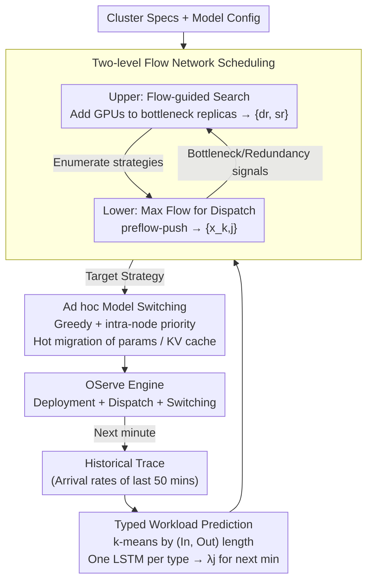

# OServe: Accelerating LLM Serving via Spatial-Temporal Workload Orchestration

**Conference**: ICML 2026  
**arXiv**: [2602.12151](https://arxiv.org/abs/2602.12151)  
**Code**: None  
**Area**: LLM Efficiency / Inference Serving Systems  
**Keywords**: LLM inference serving, heterogeneous deployment, flow network scheduling, workload prediction, online model switching  

## TL;DR
OServe jointly models "resource allocation + parallel strategy + request routing" for LLM serving as a two-level maximum flow problem on flow networks. Combined with LSTM workload prediction and ad hoc model switching based on GPU interconnects, it addresses the heterogeneity of real-world traffic in both spatial (different request types) and temporal (varying composition over time) dimensions. End-to-end P99 latency and throughput are improved by an average of 1.5× and a maximum of 2× compared to vLLM.

## Background & Motivation

**Background**: Existing LLM inference systems (vLLM, Llumnix, Dynamo+vLLM, etc.) mostly assume that workloads are spatially homogeneous and temporally static. Consequently, they deploy $N$ identical model replicas using a single parallel strategy and uniform resource allocation.

**Limitations of Prior Work**: Real-world traffic exhibits dual heterogeneity—(i) **Spatial Heterogeneity**: Concurrent requests at the same moment include short-input/short-output (chat, summarization) which are compute-intensive, and long-input/long-output (generation, coding) which are memory-bandwidth intensive. (ii) **Temporal Heterogeneity**: Traffic composition changes hourly or even minutely; for instance, business hours are dominated by short outputs, while the proportion of long outputs increases at night. On Azure public traces, the authors measured extreme distributions with input lengths of 1–7999 and output lengths of 1–5000.

**Key Challenge**: Compute-intensive workloads favor high replication (Data Parallelism, DP) to saturate compute power, whereas memory-intensive workloads favor high parallelism (Tensor Parallelism TP / Pipeline Parallelism PP) to spread the KV cache. A single static deployment cannot be optimal for all workloads, yet traditional systems lack the capability for "scheduled deployment switching" because reloading 70B models takes minutes.

**Goal**: (a) Find a **heterogeneous deployment**—different replicas can use different DP/TP/PP configurations—given a traffic profile; (b) Provide optimal "request-to-replica" dispatching; (c) Perform **fast switching** of deployments instead of cold-start reloading when traffic changes.

**Key Insight**: Model heterogeneous deployment and request dispatching simultaneously as a maximum flow problem on a directed flow network. Resource allocation and parallel strategies are treated as an upper-level discrete search, while request dispatching is treated as a lower-level maximum flow problem. Simultaneously, an LSTM predicts the composition of next-minute requests. During switching, parameter shards are migrated directly between GPUs using NVLink/InfiniBand rather than loading from disk.

**Core Idea**: Jointly solve spatial and temporal heterogeneity through flow-network-driven two-level scheduling and GPU-interconnect-based hot switching.

## Method

### Overall Architecture
The core approach of OServe is to package "which deployment to use, how to dispatch requests, and when to switch" into a closed loop that runs every minute, ensuring the cluster configuration always tracks the traffic profile of the next minute. In one cycle, the **Workload Predictor** reads historical traces to predict the arrival rates of various request types; the **OServe Scheduler** takes the predicted traffic and cluster specifications to search for the optimal serving strategy, determining the GPU allocation and parallel strategy for each replica (deployment $\{d_r, s_r\}$) as well as the routing of request types to replicas (dispatch $\{x_{k,j}\}$); the **Switch Planner** then translates the "current strategy → target strategy" into a parameter migration plan for hot switching via GPU interconnects. These three components form a "prediction → scheduling → switching" pipeline.

### Key Designs

**1. LSTM Typed Workload Prediction: Predicting category rates instead of request-level lengths**

Temporal heterogeneity requires the system to know the traffic profile of the next minute in advance. However, request-level input/output lengths are extreme high-variance signals that LSTMs struggle to learn. OServe's trick is to use k-means to cluster historical requests into a few categories (typically 4) based on (input length, output length). This reduces the high-dimensional, high-variance prediction task into several stable low-dimensional sequences. A separate LSTM is trained for **each category** (sequence length 50, using the past 50 minutes to predict the next minute). Ablation studies show that predicting aggregated arrival rates without type decomposition leads to an RRMSE of ~40% and non-convergence, whereas typed prediction reduces RRMSE to 5.045% with a 30ms inference time, fitting the 1-minute switching cycle.

**2. Two-level Flow Network Scheduling: Solving deployment and dispatching via Max-Flow**

Static systems cannot handle the spatial heterogeneity of simultaneous compute-intensive and memory-intensive requests. OServe decomposes this: the lower level is a directed flow network where each workload edge $w_j$ from source $\mathcal{S}$ has capacity $\lambda_j$ (arrival rate). Each replica $k$ is split into nodes $c_k^{in}$ and $c_k^{out}$, with a capacity $M_k = \mathrm{lcm}\{n_{k,j}\}$ representing a "normalized capacity for mixed workloads." A type-$j$ request consumes $M_k/n_{k,j}$ units of flow ($n_{k,j}$ is processing rate). Running preflow-push yields the optimal request-to-replica dispatch (lower level). The upper level uses these results to guide a discrete search: it identifies "full" bottleneck replicas and "empty" redundant ones, moving GPUs from the latter to the former and enumerating parallel strategies until no improvement is found for 20 steps. This collapses exponential search into dozens of heuristic rounds—brute force on 16 GPUs takes 50s, while this method takes 12s with only 6% difference in P99.

**3. Ad hoc Model Switching: Greedy + intra-node priority to bypass cold loading**

Reloading 70B models from disk takes minutes, while the minimum switching interval in Trace 2 is only 5 minutes—cold reloading would add ~17% average latency. OServe uses GPU interconnects for hot parameter migration. Since sharding differs between strategies, each target shard corresponds to sets of source and target GPUs. The algorithm iterates through feasible source GPUs for each target shard, picking the one with the lowest communication load while prioritizing **intra-node** NVLink (400GB/s) over inter-node InfiniBand (10–200GB/s). KV caches are migrated similarly: short-sequence KVs are drained at the source, while long-sequence KVs are moved greedily to target GPUs with a 10–20% headroom buffer to prevent OOM. This reduces switching overhead to under 10s, decreasing P99 by 12% on average.

### Loss & Training
Pure system work; no training loss. LSTMs are trained on two weeks of Azure traces with a 9:1 train/test split. Scheduling uses deterministic max-flow and heuristics; switching uses greedy algorithms.

## Key Experimental Results

### Main Results
Platform: 4 nodes with 8×H100-80GB, 400GB/s NVLink, 200GB/s InfiniBand. Models: OPT-30B/66B, LLaMA-30B, LLaMA2-70B. Traces: Azure Public Dataset Slices P1–P6.

| Baseline | P99 Latency / Throughput Gain | Average Gain |
|---|---|---|
| vLLM (static) | Up to 2.0× | 1.5× |
| vLLM (reload) | Up to 1.5× | 1.3× |
| Llumnix | Up to 1.51× | 1.32–1.51× |
| Dynamo+vLLM | -- | 12–20% |
| 32-GPU Cluster (LLaMA2-70B) | Up to 1.9× | -- |

Regarding spatial sensitivity, OServe's speedup over vLLM(static) rises monotonically from 1.14× ($CV=0.112$) to 2.66× ($CV=0.688$) as workload skewness increases.

### Ablation Study

| Configuration | LLaMA2-70B/OPT-66B P99 Improvement | Description |
|---|---|---|
| vLLM (reload) baseline | -- | Starting point |
| + Heterogeneous Deployment | Avg 34% / Max 52% | Different configs per replica |
| + Optimal Dispatch | Avg 64% / Max 109% | Routing to best-matched replicas |
| + Ad hoc Switching | Addl. P99 reduction: Avg 12% / Max 17% | Savings over cold load |
| Typed LSTM Prediction | RRMSE 5.045% | -- |
| Moving Average | RRMSE 43.375% | Simple baseline |
| Untyped LSTM | RRMSE ~40%, Non-convergent | Proves necessity of typing |

### Key Findings
- Gains from heterogeneous deployment correlate positively with traffic heterogeneity: the more skewed the traffic, the higher the OServe advantage (up to 2.66×).
- Heuristic search is 4× faster than brute force on 16 GPUs with only 6% P99 loss, indicating that flow-network signals are highly accurate.
- Ad hoc switching gains are most significant in **high-frequency fluctuation scenarios**; stable workloads rarely trigger switching, aligning with the "switch only when needed" philosophy.

## Highlights & Insights
- Consolidating resource allocation and dispatching into a max-flow framework transforms an NP-hard joint scheduling problem into a solvable two-level LP/Max-Flow form, which is structurally elegant.
- The concept of "predicting category rates instead of request-level lengths" is a universal trick to reduce prediction difficulty and can be applied to other system prediction tasks (e.g., GPU or storage scheduling).
- Using GPU interconnects for parameter migration is a valuable approach for multi-tenant clusters, MoE routing, and LoRA hot-swapping.

## Limitations & Future Work
- Two-level scheduling requires offline profiling of processing rates $n_{k,j}$ for each (replica, workload type), entailing high initial costs for new models.
- Prediction errors are inevitable; while 1-minute granularity handles most cases, extreme sub-second spikes might not be corrected until the next cycle.
- Only dense decoder LLMs are considered; adaptation to MoE, speculative decoding, or disaggregated prefill/decode paradigms remains to be addressed.

## Related Work & Insights
- **vs vLLM**: vLLM excels at paged KV cache and continuous batching but uses static deployment; OServe treats vLLM as a backend engine and handles the "strategy layer."
- **vs Llumnix**: Llumnix performs request-level migration but assumes homogeneous instances; OServe optimizes both configuration and routing, outperforming it by 1.32–1.51×.
- **vs Dynamo**: Dynamo focuses on prefill/decode disaggregation but keeps worker parallelism fixed; OServe allows parallelism to vary with load, gaining an extra 12–20%.

## Rating
- Novelty: ⭐⭐⭐⭐ (Flow network + two-level heuristics + ad hoc switching)
- Experimental Thoroughness: ⭐⭐⭐⭐⭐ (4 baselines, 4 models, 2 traces, 8-32 GPUs)
- Writing Quality: ⭐⭐⭐⭐ (Clear diagrams, though notation is dense)
- Value: ⭐⭐⭐⭐⭐ (Industrial-grade acceleration that is directly deployable)

<!-- RELATED:START -->

## Related Papers

- [\[ICML 2026\] Theoretically Optimal Attention/FFN Ratios in Disaggregated LLM Serving](theoretically_optimal_attentionffn_ratios_in_disaggregated_llm_serving.md)
- [\[ICML 2026\] GraphFlow: A Graph-Based Workflow Management for Efficient LLM-Agent Serving](graphflow_a_graph-based_workflow_management_for_efficient_llm-agent_serving.md)
- [\[ICML 2026\] TEAM: Temporal-Spatial Consistency Guided Expert Activation for MoE Diffusion Language Model Acceleration](team_temporal-spatial_consistency_guided_expert_activation_for_moe_diffusion_lan.md)
- [\[ICML 2026\] dLLM-Cache: Accelerating Diffusion Large Language Models with Adaptive Caching](dllm-cache_accelerating_diffusion_large_language_models_with_adaptive_caching.md)
- [\[ICLR 2026\] LycheeDecode: Accelerating Long-Context LLM Inference via Hybrid-Head Sparse Decoding](../../ICLR2026/llm_efficiency/lycheedecode_accelerating_long-context_llm_inference_via_hybrid-head_sparse_deco.md)

<!-- RELATED:END -->
