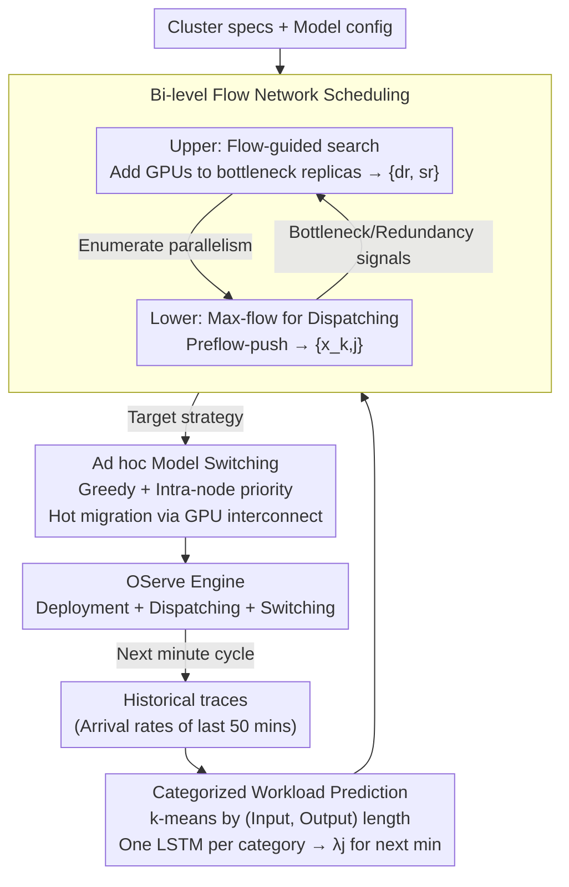

# OServe: Accelerating LLM Serving via Spatial-Temporal Workload Orchestration

**Conference**: ICML 2026  
**arXiv**: [2602.12151](https://arxiv.org/abs/2602.12151)  
**Code**: None  
**Area**: LLM Efficiency / Inference Serving Systems  
**Keywords**: LLM inference serving, heterogeneous deployment, flow network scheduling, workload prediction, online model switching  

## TL;DR
OServe jointly models LLM serving "resource allocation + parallel strategy + request routing" as a bi-level maximum flow problem on a flow network. Combined with LSTM-based workload prediction and ad-hoc model switching via GPU interconnects, it addresses the heterogeneity of real-world traffic in both spatial (different request types) and temporal (varying composition over time) dimensions. End-to-end P99 latency and throughput improved by an average of 1.5× and a maximum of 2× compared to vLLM.

## Background & Motivation

**Background**: Existing LLM inference systems (vLLM, Llumnix, Dynamo+vLLM, etc.) mostly assume that workloads are spatially homogeneous and temporally static. Consequently, they deploy $N$ identical model replicas using a single parallel strategy and uniform resource allocation.

**Limitations of Prior Work**: Real-world traffic exhibits dual heterogeneity: (i) **Spatial Heterogeneity**: Concurrent requests include short-input/short-output types (chat, summarization) which are compute-intensive, as well as long-input/long-output types (generation, coding) which are memory-bandwidth intensive. (ii) **Temporal Heterogeneity**: Traffic composition changes by the hour or minute, with business hours dominated by short outputs and nighttime seeing an increase in long outputs. On Azure public traces, the authors measured extreme distributions with input lengths of 1–7999 and output lengths of 1–5000 tokens.

**Key Challenge**: Compute-intensive workloads prefer many replicas (Data Parallelism, DP) to saturate compute units; memory-intensive workloads prefer higher parallelism degrees (Tensor Parallelism TP / Pipeline Parallelism PP) to spread the KV cache. A single static deployment cannot be optimal for all workloads, yet traditional systems lack the ability to "switch deployments by time period" because reloading a 70B model takes minutes.

**Goal**: (a) Given a traffic profile, find a **heterogeneous deployment**—where different replicas can use different DP/TP/PP configurations; (b) Provide optimal "request → replica" assignment; (c) When traffic changes, perform **fast switching** of deployments instead of cold-start reloading.

**Key Insight**: Modeling heterogeneous deployment and request dispatching simultaneously as a maximum flow problem on a directed flow network. Discrete search for "how many GPUs and which parallelism" is handled in the upper layer, while "assigning requests to replicas" is solved as a lower-layer maximum flow problem. Meanwhile, LSTMs predict the request composition for the next minute, and parameter fragments are migrated directly between GPUs via NVLink/InfiniBand during switching, bypassing disk I/O.

**Core Idea**: Utilize "flow-network-driven bi-level scheduling + GPU-interconnect-based hot switching" to jointly solve spatial and temporal heterogeneity.

## Method

### Overall Architecture
**Mechanism**: OServe packages deployment selection, request dispatching, and switching timing into a closed loop executed every minute, ensuring cluster configurations track the traffic profile of the next minute. In each cycle, the **Workload Predictor** reads historical traces to predict arrival rates of various request types for the next interval; the **OServe Scheduler** uses predicted traffic and cluster specifications to search for an optimal serving strategy, determining both replica deployment $\{d_r, s_r\}$ and request dispatching $\{x_{k,j}\}$; the **Switch Planner** translates the "current → target" transition into a parameter migration plan for hot switching via GPU interconnects. This "prediction → scheduling → switching" pipeline handles spatial heterogeneity through scheduling and temporal heterogeneity through switching.

### Key Designs

**1. Categorized LSTM Prediction: Predicting Arrival Rates per Category**

Temporal heterogeneity requires the system to know the future traffic profile. However, request-level input/output lengths are high-variance signals that LSTMs cannot easily learn. OServe uses k-means to cluster historical requests by (input length, output length) into a few categories (typically 4). This reduces high-dimensional, high-variance prediction into stable, low-dimensional sequences. A separate LSTM is trained for **each category** (sequence length 50). The ablation study shows that predicting aggregate arrival rates without categorization yields an RRMSE of ~40% and non-convergence, whereas categorization reduces RRMSE to 5.045% with a 30ms prediction latency.

**2. Bi-level Flow Network Scheduling: Joint Deployment and Dispatching**

Static systems cannot handle spatial heterogeneity. OServe decomposes the problem. The lower layer is a directed flow network: an edge from source $\mathcal{S}$ for each workload $w_j$ has capacity equal to the arrival rate $\lambda_j$. Each replica $k$ is split into nodes $c_k^{in}$ and $c_k^{out}$ with normalized capacity $M_k = \mathrm{lcm}\{n_{k,j}\}$, where $n_{k,j}$ is processing rate. A type-$j$ request consumes $M_k/n_{k,j}$ units. Solving this via preflow-push yields optimal dispatching (lower layer). The upper layer uses results to guide discrete search: it identifies "full" bottleneck replicas and "under-utilized" redundant replicas, moving GPUs from the latter to the former until no improvement occurs for 20 steps. This reduces exponential search to dozens of heuristic rounds—taking 12s vs 50s for exhaustive search on 16 GPUs, with only a 6% P99 difference.

**3. Ad hoc Model Switching: Greedy + Intra-node Priority**

Reloading a 70B model from disk takes minutes, while the smallest switching interval in traces is 5 minutes. Cold reloading would add ~17% average latency. OServe uses GPU interconnects for parameter hot migration. Since shardings differ between source and target strategies, each target parameter shard is mapped to source/target GPU pairs. The algorithm iterates through target shards, selecting the source GPU with the lowest communication load, prioritizing **intra-node** NVLink (400GB/s) over **inter-node** InfiniBand/RoCE (10–200GB/s). KV cache is managed similarly, with short sequences drained and long sequences migrated using the same greedy approach with 10–20% buffer headroom. This suppresses switching overhead to under 10s.

## Key Experimental Results

### Main Results
The platform consists of 4 nodes with 8×H100-80GB each (NVLink 400GB/s, IB 200GB/s). Models include OPT-30B/66B, LLaMA-30B, and LLaMA2-70B. Traces are from Azure Public Dataset.

| Baseline | P99 Latency / Throughput Gain | Average Gain |
|---|---|---|
| vLLM (static) | Up to 2.0× | 1.5× |
| vLLM (reload) | Up to 1.5× | 1.3× |
| Llumnix | Up to 1.51× | 1.32–1.51× |
| Dynamo+vLLM | -- | 12–20% |
| 32-GPU Cluster (LLaMA2-70B) | Up to 1.9× | -- |

Regarding spatial sensitivity, as the coefficient of variation (CV) of workload distributions increased from 0.112 (S1) to 0.688 (S5), OServe's speedup over vLLM(static) rose from 1.14× to 2.66×.

### Ablation Study

| Configuration | LLaMA2-70B/OPT-66B P99 Improvement | Description |
|---|---|---|
| vLLM (reload) baseline | -- | Starting point |
| + Heterogeneous Deployment | Avg 34% / Max 52% | Different configs per replica |
| + Optimal Dispatching | Avg 64% / Max 109% | Routing to best-fit replicas |
| + Ad hoc Switching | Extra P99 reduction: Avg 12% / Max 17% | Eliminates cold loading |
| LSTM Prediction (Categorized) | RRMSE 5.045% | -- |
| Moving Average | RRMSE 43.375%, -41% Throughput | Simple baseline |
| LSTM (Uncategorized) | RRMSE ~40%, Non-convergence | Shows necessity of categorization |

### Key Findings
- Gains from heterogeneous deployment correlate positively with traffic skewness; higher skewness leads to higher OServe advantages (up to 2.66×).
- Heuristic search is >4× faster than exhaustive search on 16 GPUs with only 6% P99 loss, proving flow-network-guided signals are accurate.
- Ad hoc switching gains are most significant in high-frequency fluctuation scenarios; it is rarely triggered in stable loads.

## Highlights & Insights
- Unifying heterogeneous resource allocation and request dispatching into a maximum flow framework transforms an NP-hard joint scheduling problem into a solvable bi-level LP/Max-flow form.
- The principle of "don't predict request-level length, predict category arrival rate" is a general trick for reducing prediction difficulty in system tasks.
- Using GPU interconnects for parameter migration in ad hoc switching is a design pattern applicable to multi-tenant GPU clusters, MoE routing, and LoRA swapping.

## Limitations & Future Work
- Bi-level scheduling requires offline profiling of processing rate $n_{k,j}$ and edge capacity $e_{k,j}$ for each (replica, workload) pair, incurring high initial costs for new hardware.
- Prediction errors are inevitable; OServe uses 1-minute granularity and fast switching to mitigate this, but extreme micro-bursts (second-level spikes) are only corrected in the next cycle.
- Currently limited to dense decoder LLMs; adaptation to MoE, speculative decoding, or disaggregated prefill/decode paradigms was not addressed.

## Related Work & Insights
- **vs vLLM**: vLLM excels at paged KV cache and continuous batching but uses static deployment. OServe uses vLLM as a backend and manages the "strategy layer."
- **vs Llumnix**: Llumnix performs request-level migration but assumes homogeneous instance configurations. OServe optimizes both configuration and routing.
- **vs Dynamo**: Dynamo focuses on scaling for prefill/decode decoupling with fixed worker parallelism. OServe allows parallelism to adapt to load composition.

## Rating
- Novelty: ⭐⭐⭐⭐ (Combination of flow networks, bi-level heuristics, and ad hoc switching)
- Experimental Thoroughness: ⭐⭐⭐⭐⭐ (Covers 4 baselines, 4 models, 8-32 GPUs, spatial/temporal sensitivity)
- Writing Quality: ⭐⭐⭐⭐ (Clear diagrams, concrete algorithms, though notation is dense)
- Value: ⭐⭐⭐⭐⭐ (Industrial-grade serving system with 1.5× average practical acceleration)

<!-- RELATED:START -->

## Related Papers

- [\[ICML 2026\] TEAM: Temporal-Spatial Consistency Guided Expert Activation for MoE Diffusion Language Model Acceleration](team_temporal-spatial_consistency_guided_expert_activation_for_moe_diffusion_lan.md)
- [\[ICML 2026\] Theoretically Optimal Attention/FFN Ratios in Disaggregated LLM Serving](theoretically_optimal_attentionffn_ratios_in_disaggregated_llm_serving.md)
- [\[ICML 2026\] GraphFlow: A Graph-Based Workflow Management for Efficient LLM-Agent Serving](graphflow_a_graph-based_workflow_management_for_efficient_llm-agent_serving.md)
- [\[ICLR 2026\] ReST-KV: Robust KV Cache Eviction with Layer-wise Output Reconstruction and Spatial-Temporal Smoothing](../../ICLR2026/llm_efficiency/rest-kv_robust_kv_cache_eviction_with_layer-wise_output_reconstruction_and_spati.md)
- [\[ICLR 2026\] DualMap: Enabling Both Cache Affinity and Load Balancing for Distributed LLM Serving](../../ICLR2026/llm_efficiency/dualmap_enabling_both_cache_affinity_and_load_balancing_for_distributed_llm_serv.md)

<!-- RELATED:END -->
