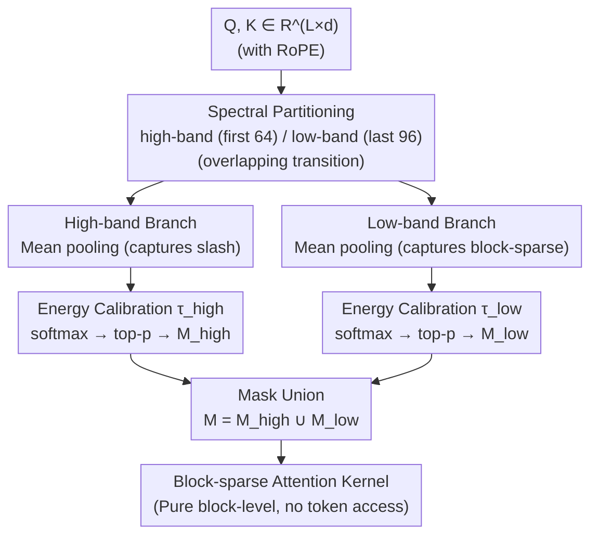

# Prism: Spectral-Aware Block-Sparse Attention

**Conference**: ICML 2026  
**arXiv**: [2602.08426](https://arxiv.org/abs/2602.08426)  
**Code**: https://github.com/xinghaow99/prism  
**Area**: LLM Efficiency / Long-Context Sparse Attention  
**Keywords**: Block-Sparse Attention, RoPE, Spectral Decomposition, Long Context, Pre-filling Acceleration  

## TL;DR
Prism decomposes "block importance estimation" into high-frequency and low-frequency bands of RoPE, performing mean-pooling and softmax separately. It automatically calibrates logit magnitudes using a temperature derived from energy ratios. This approach relies entirely on block-level operations (eliminating token-level search), achieving accuracy comparable to full attention and a 5.1× speedup over FlashAttention-2 at 128K context.

## Background & Motivation

**Background**: The pre-filling stage of long-context LLMs is bottlenecked by $O(L^2)$ self-attention. Block-sparse attention partitions sequences into $B \times B$ blocks (e.g., $B=128$) and computes only selected block pairs, naturally aligning with the tiling mechanism of FlashAttention. The core sub-problem is **block importance estimation**: identifying which Key blocks each Query should attend to without computing full attention.

**Limitations of Prior Work**: Existing training-free methods (e.g., MInference, FlexPrefill, XAttention, PBS-Attn) follow a pipeline of "mean pooling as a coarse-grained proxy followed by heuristic rescue." Since the proxy itself is inaccurate, these methods must employ additional token-level searching, scoring, permutation, or anti-diagonal scanning to capture local patterns like vertical slashes. Consequently, the estimation overhead offsets the sparsity gains—at the 32K scale, they often fail to outperform highly optimized FlashAttention-2.

**Key Challenge**: Why is the mean-pooling proxy so inaccurate? The authors identify a root cause: **mean pooling acts as a low-pass filter under RoPE**. RoPE assigns rotation frequencies $\theta_j = b^{-2j/d}$ that decay geometrically across dimensions. High-frequency dimensions (small $j$, fast rotation) undergo phase cancellation when averaged within a block, causing their energy to collapse toward zero. This creates a "blind spot" that erases signals representing local relative positions (the slash pattern). Essentially, typical attention sparsity patterns are not "dispersed across different heads" but "spectrally separated within the same head."

**Goal**: To develop a block-level estimator capable of simultaneously capturing vertical slash and block-sparse patterns with logit magnitudes aligned with full attention, without introducing any token-level operations.

**Key Insight**: Since mean pooling "filters out" high-frequency signals, the two frequency bands should not interfere in a single pooling result. By pooling and scoring high-frequency and low-frequency bands separately and applying a mathematically derived temperature to align their logit magnitudes, the estimator can match full-dimension equivalence.

**Core Idea**: Replace the "crude proxy + token-level rescue" paradigm with dual-band coarse-grained attention based on spectral decomposition and energy-ratio temperature calibration.

## Method

### Overall Architecture
Prism addresses the core bottleneck of block-sparse attention—accurately selecting Key blocks for each Query block without resorting to token-level operations. It decomposes block importance estimation into two frequency bands of RoPE. Given query/key matrices $Q, K \in \mathbb{R}^{L \times d}$, dimensions are split according to the RoPE spectrum into high-band (first $d_{\text{high}}$) and low-band (last $d_{\text{low}}$). Each branch performs intra-block mean pooling to obtain $\bar Q_z, \bar K_z \in \mathbb{R}^{N \times d_z}$ ($N = \lceil L/B \rceil$). Block-level scores $\bar S_z$ are calculated using softmax with energy-calibrated temperatures $\tau_z$. Blocks are selected via top-p, and the masks are merged $M = M_{\text{high}} \cup M_{\text{low}}$ for the final block-sparse attention kernel. The entire process uses block-level matrix multiplications without token-level access.

### Key Designs

**1. Mean pooling as a Low-Pass Filter: Explaining the Failure of Old Proxies**

Prior training-free methods relied on mean pooling proxies, but their inaccuracy necessitated token-level rescues. Prism proves that under RoPE, intra-block mean pooling is inherently a low-pass filter. Assuming local stability of semantic content $c^{(j)}$, the pooled result for the $j$-th frequency pair in a block of size $B$ starting at $n_0$ can be expressed as a geometric series $\bar q^{(j)} \approx \frac{c^{(j)} e^{i n_0 \theta_j}}{B} \sum_{k=0}^{B-1} e^{i k \theta_j}$. The magnitude decay factor is equivalent to $\lambda_j(B) = \frac{1}{B}\left|\frac{\sin(B \theta_j / 2)}{\sin(\theta_j / 2)}\right| \approx \mathrm{sinc}(B \theta_j / 2\pi)$. RoPE assigns high rotation frequencies $\theta_j = b^{-2j/d}$ to early dimensions. Within a block, phases cancel out, and energy collapses to near zero. Signals for local relative positions (slash patterns) reside in these high-frequency dimensions and are thus filtered out. For $B=128, d=128$, and Qwen3 base $b=10^6$, solving $B\theta_j = 2\pi$ yields a cutoff at $2j \approx 28$. Dimensions 0-30 are the "dead zone," 30-60 are the "transition zone," and dimensions beyond 60 are the "semantic zone." Measurements on Qwen3-8B confirm this: RMS in the dead zone is $\approx 1.0$ at the token level but collapses to $\approx 0.1$ after pooling.

**2. Dual-Band Block Importance Estimation: Separate Scoring for Frequency Bands**

Since high and low frequencies encode different structures (relative position vs. global semantics), forcing them into a single softmax allows strong semantic signals to mask the weakened high-frequency signals. Prism handles them separately. After slicing $Q_z, K_z$ and mean-pooling, each branch computes block-level attention via $\bar S_z = \mathrm{softmax}\big(\bar Q_z \bar K_z^\top / (\tau_z \sqrt{d_z})\big)$. Key blocks are selected using top-p per query block to generate $M_{\text{high}}$ and $M_{\text{low}}$. Their union $M$ captures both slash and block-sparse patterns without any token-level overhead. The design uses overlapping branches ($d_{\text{high}}=64, d_{\text{low}}=96$, total 160 > $d=128$) to ensure the transition zone is covered by both, improving stability.

**3. Energy-Based Temperature Calibration: Zero-Hyperparameter Logit Alignment**

Pooling flattens the logit distribution of the high-frequency branch, leading to high softmax entropy and wasteful noise in top-p selection. Prism introduces a zero-hyperparameter temperature $\tau_z$ to align logit magnitudes with the full-dimension level. Using $\mathrm{RMS}(\bar X) = \sqrt{\frac{1}{N}\sum_u \|\bar x_u\|^2 / d}$ to measure spectral energy density, the target logit magnitude follows $|L_{\text{full}}| \propto \sqrt{d}\,\mathrm{RMS}(\bar Q_{\text{full}})\mathrm{RMS}(\bar K_{\text{full}})$. For a branch, it is $|L_z| \propto \sqrt{d_z}\,\mathrm{RMS}(\bar Q_z)\mathrm{RMS}(\bar K_z)$. Setting $|L_z|/\tau_z \approx |L_{\text{full}}|$ yields:

$$\tau_z \approx \sqrt{d_z/d} \cdot \frac{\mathrm{RMS}(\bar Q_z)}{\mathrm{RMS}(\bar Q_{\text{full}})} \cdot \frac{\mathrm{RMS}(\bar K_z)}{\mathrm{RMS}(\bar K_{\text{full}})}.$$

This calibration re-sharpens the flattened distributions, ensuring top-p budgets are spent on relevant signals.

### Loss & Training
Prism is entirely training-free. Parameters: $B=128$; $d_{\text{high}}=64, d_{\text{low}}=96$. Top-p is $0.95$ for Llama-3.1-8B and $0.93$ for Qwen. Custom Triton kernels are used for estimation and sparse attention.

## Key Experimental Results

### Main Results
Evaluated on PG19, LongBench, RULER, VideoMME, and HunyuanVideo against MInference, FlexPrefill, XAttention, and PBS-Attn.

| Task/Model | Metric | Full | XAttention | FlexPrefill | MInference | PBS-Attn | **Prism** |
|---|---|---|---|---|---|---|---|
| LongBench / Llama-3.1-8B | Avg. | 41.47 | 39.68 | 33.90 | 41.14 | 40.94 | **41.08** |
| LongBench / Qwen-3-8B | Avg. | 39.49 | 38.82 | 36.13 | 39.18 | 39.01 | **39.12** |
| RULER / Llama-3.1-8B | 4K–128K Avg | 88.94 | 87.44 | 87.43 | 87.44 | 87.08 | **87.54** |
| RULER / Qwen-3-8B | 4K–128K Avg | 86.61 | 84.60 | 83.93 | 85.00 | 85.25 | **85.27** |
| VideoMME / Qwen3-VL-8B | Overall | 71.22 | 70.81 | 70.34 | 70.63 | 70.67 | **71.22** |
| VideoMME Long split | Acc | 63.11 | 63.44 | 62.67 | 62.44 | 62.89 | **64.00** |
| PG19 128K | Speedup vs FA-2 | 1.0× | 3.0× | — | — | — | **5.1×** |

### Ablation Study

| Configuration | PPL @ 32K | Observation |
|---|---|---|
| Full dim coarse | ≈ 35.0 | Baseline using only full-dimension mean pooling. |
| Only low-band | Close to Full | High-frequency terms in traditional pooling are essentially noise. |
| $d_h=32$ (Dead zone only) | Poor | Calibrating on phase-cancelled noise degrades performance. |
| $d_h=64$ + $d_l=96$ (Overlapping) | **Best** | Transition zone energy provides spectral regularization. |
| $d_h=64$ + $d_l=64$ (No overlap) | Unstable | Lack of transition zone destabilizes calibration temperature. |
| No calibration ($\tau=1.0$) | Poor | High-frequency logits too flat, top-p selects excessive invalid blocks. |

### Key Findings
- **Theoretical Consistency**: The derived cutoff matches the observed energy collapse in RoPE, providing a spectral explanation for proxy failures.
- **Estimation Bottleneck**: Estimation overhead is the real bottleneck. XAttention takes ~85ms at 128K, whereas Prism's block-only approach maintains low latency and memory growth.
- **Denoising Effect**: In VideoMME Long split, Prism outperforms full attention (64.00 vs 63.11), likely due to the removal of irrelevant visual tokens.
- **RoPE Transferability**: Prism generalizes across YaRN, M-RoPE, and 3D-RoPE variants without hyperparameter tuning.

## Highlights & Insights
- **From Heuristics to Spectral Facts**: The "blind spot" in mean pooling is quantified via $\lambda_j(B) \approx \mathrm{sinc}(B\theta_j/2\pi)$, turning "inaccurate proxy" into a solvable low-pass filtering problem.
- **Energy Calibration as a Lever**: The formula $\tau_z \propto \sqrt{d_z/d}\cdot \mathrm{RMS}_z / \mathrm{RMS}_{\text{full}}$ can be potentially applied to any subspace-based attention (e.g., latent attention, quantized keys) to align logits without tuning.
- **Efficiency across All Lengths**: Unlike prior methods that are slower than FlashAttention-2 until 32K+, Prism's low estimation cost makes it superior from 8K onwards.

## Limitations & Future Work
- **Limitations**: The top-p threshold $p$ still requires manual setting per model family (0.95 vs 0.93).
- **Assumptions**: The assumption of local block semantic stability may weaken during long-range theme shifts.
- **Future Work**: Extending temperature calibration to KV compression/quantization and analyzing compatibility with static patterns like attention sinks.

## Related Work & Insights
- **vs MInference / FlexPrefill**: While others use "proxy + token rescue," Prism fixes the proxy via spectral decomposition, eliminating token-level latency.
- **vs XAttention**: XAttention attempts to capture slash patterns with diagonal scoring but requires token-level access. Prism achieves the same via mask union of spectral branches at block-level.
- **vs YaRN**: While spectral analysis of RoPE was previously used for extrapolation, Prism is the first to apply it to block selection in sparse attention.

## Rating
- Novelty: ⭐⭐⭐⭐⭐ (Uses spectral theory to resolve engineering blind spots).
- Experimental Thoroughness: ⭐⭐⭐⭐ (Extensive across tasks and RoPE variants).
- Writing Quality: ⭐⭐⭐⭐⭐ (Clear progression from theory to empirical results).
- Value: ⭐⭐⭐⭐⭐ (Training-free, low overhead, stable gains from 8K context).

<!-- RELATED:START -->

<!-- RELATED:END -->

## Related Papers

- [\[ICML 2026\] Sparser Block-Sparse Attention via Token Permutation](sparser_block-sparse_attention_via_token_permutation.md)
- [\[ICML 2026\] Stochastic Sparse Attention for Memory-Bound Inference](stochastic_sparse_attention_for_memory-bound_inference.md)
- [\[ACL 2025\] Efficient Many-Shot In-Context Learning with Dynamic Block-Sparse Attention](../../ACL2025/llm_efficiency/efficient_many-shot_in-context_learning_with_dynamic_block-sparse_attention.md)
- [\[ICLR 2026\] Understanding and Improving Length Generalization in Hierarchical Sparse Attention Models](../../ICLR2026/llm_efficiency/understanding_and_improving_length_generalization_in_hierarchical_sparse_attenti.md)
- [\[ACL 2025\] Native Sparse Attention: Hardware-Aligned and Natively Trainable Sparse Attention](../../ACL2025/llm_efficiency/native_sparse_attention.md)

<!-- RELATED:END -->
