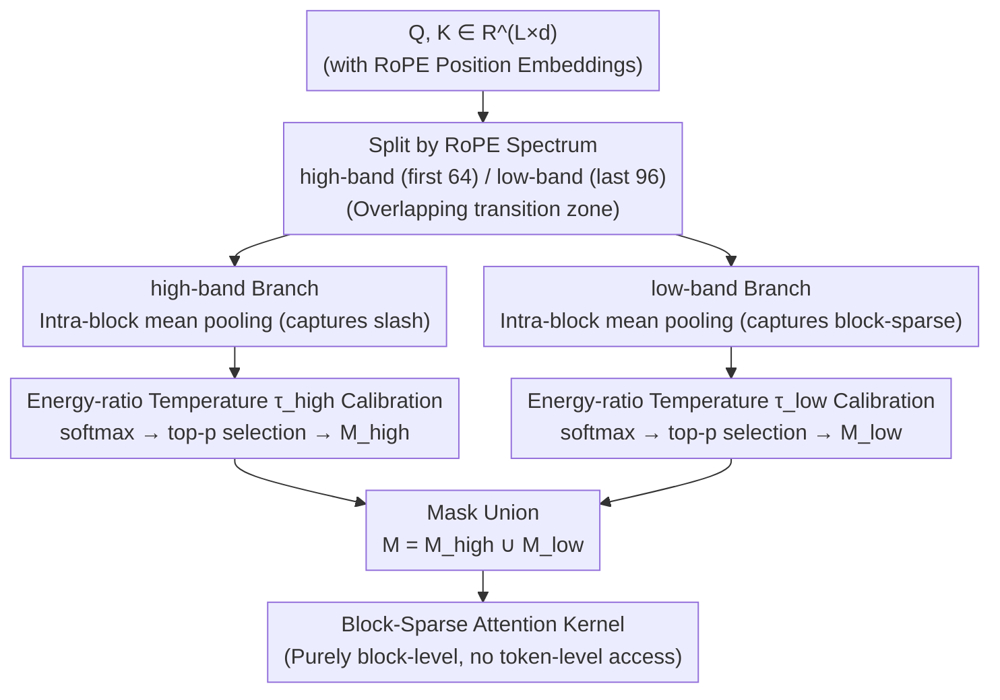

# Prism: Spectral-Aware Block-Sparse Attention

**Conference**: ICML 2026  
**arXiv**: [2602.08426](https://arxiv.org/abs/2602.08426)  
**Code**: https://github.com/xinghaow99/prism  
**Area**: LLM Efficiency / Long-Context Sparse Attention  
**Keywords**: Block-Sparse Attention, RoPE, Spectral Decomposition, Long Context, Pre-filling Acceleration

## TL;DR
Prism decomposes "block importance estimation" into high-frequency and low-frequency bands of RoPE, applying mean-pooling and softmax separately. It uses temperature automatically calibrated by energy ratios to align logit scales, enabling purely block-level operations (eliminating token-level search) while maintaining accuracy nearly identical to full attention. It achieves a 5.1× speedup over FlashAttention-2 at 128K.

## Background & Motivation

**Background**: The pre-filling stage of long-context LLMs is bottlenecked by the $O(L^2)$ complexity of self-attention. Block-sparse attention (BSA) partitions sequences into $B \times B$ blocks (typically $B=128$) and computes only selected block pairs, naturally aligning with the tiling mechanism of FlashAttention. This is currently a mainstream acceleration route. The core sub-problem is **block importance estimation**: identifying which Key blocks each Query block should attend to without computing full attention.

**Limitations of Prior Work**: Training-free methods (MInference, FlexPrefill, XAttention, PBS-Attn, etc.) follow a strategy of "using mean pooling as a coarse-grained proxy, followed by heuristic remedies." Since the proxy itself is inaccurate, they must perform extra token-level search, scoring, permutation, or anti-diagonal scanning to capture local patterns like "vertical slashes." Consequently, the estimation overhead often offsets the sparsity gains—at 32K scales, these methods struggle to outperform the highly optimized FlashAttention-2.

**Key Challenge**: Why is the mean pooling proxy so inaccurate? The authors identify a root cause previously overlooked: **mean pooling under RoPE acts as a low-pass filter**. RoPE assigns geometrically decaying rotation frequencies $\theta_j = b^{-2j/d}$ to different dimensions. High-frequency dimensions (small $j$, fast rotation) undergo phase cancellation when averaged within a block, causing their energy to collapse toward zero. This creates a "blind spot" exactly where signals characterizing local relative positions (slash patterns) are located. In other words, typical sparse patterns are not "distributed across different heads" but are "spectrally separated within the same head."

**Goal**: To design a block-level estimator capable of simultaneously capturing vertical slash and block-sparse patterns while aligning logit scales with full attention, without introducing any token-level operations.

**Key Insight**: Since mean pooling "filters out" high-frequency signals, the two frequency bands should not interfere in a single pooling result. By pooling and scoring high-frequency and low-frequency bands separately and using a mathematically derived temperature to align their logit scales, the estimation remains equivalent to the full dimension.

**Core Idea**: Replace the old paradigm of "coarse proxy + token-level remedy" with a dual-band coarse-grained attention based on spectral decomposition and energy-ratio temperature calibration.

## Method

### Overall Architecture
Prism addresses the core bottleneck of block-sparse attention—how to accurately select Key blocks for each Query block without falling back to token-level operations. It decomposes block importance estimation into two RoPE frequency bands. Given query/key matrices $Q, K \in \mathbb{R}^{L \times d}$, dimensions are split into a high-band (first $d_{\text{high}}$ dimensions) and a low-band (last $d_{\text{low}}$ dimensions). Each branch performs intra-block mean pooling to obtain $\bar Q_z, \bar K_z \in \mathbb{R}^{N \times d_z}$ ($N = \lceil L/B \rceil$), computes block-level scores $\bar S_z$ with softmax and a temperature $\tau_z$ calibrated by energy ratios, and selects blocks via top-p. Finally, the masks are merged $M = M_{\text{high}} \cup M_{\text{low}}$ and passed to the block-sparse attention kernel. The entire estimation process uses only block-level matrix multiplications.

### Key Designs

**1. Mean pooling = Low-pass filter under RoPE: Why old proxies fail to see slash patterns**

Existing training-free methods rely on "coarse-grained proxies + heuristic remedies," but proxies are inaccurate, necessitating token-level search. Prism identifies the root cause: under RoPE, intra-block mean pooling is essentially a low-pass filter. Assuming local semantic content $c^{(j)}$ is stable, the pooling result of the $j$-th frequency pair in a block of size $B$ starting at $n_0$ is a geometric series $\bar q^{(j)} \approx \frac{c^{(j)} e^{i n_0 \theta_j}}{B} \sum_{k=0}^{B-1} e^{i k \theta_j}$. Its magnitude decay factor is equivalent to $\lambda_j(B) = \frac{1}{B}\left|\frac{\sin(B \theta_j / 2)}{\sin(\theta_j / 2)}\right| \approx \mathrm{sinc}(B \theta_j / 2\pi)$. RoPE assigns large rotation frequencies $\theta_j = b^{-2j/d}$ to high-frequency dimensions; during block averaging, phases cancel out, and energy collapses to near zero. Signals capturing local relative positions (slash patterns) hidden in these high-frequency dimensions are thus filtered. Setting $B=128, d=128$, and Qwen3 base $b=10^6$, solving $B\theta_j = 2\pi$ yields a cutoff $2j \approx 28$: the first ~30 dimensions are the "dead zone" (signals fully cancelled), 30–60 is the "transition zone," and dimensions beyond 60 constitute the "semantic zone." Empirical query RMS norm on Qwen3-8B confirms this: token-level RMS in the dead zone is ≈1.0, collapsing to ≈0.1 after pooling, whereas the semantic zone remains largely unchanged.

This analysis elevates "proxy inaccuracy" from an empirical observation to a quantifiable spectral fact and provides a direct solution: frequency bands suppressed by low-pass filtering and those preserved have vastly different logit scales and should not share a softmax temperature or interfere in the same pooling operation.

**2. Dual-Band Block Importance Estimation: Separate scoring for high and low frequencies**

Since high and low frequencies encode entirely different structures under RoPE (relative position vs. global semantics), forcing them into a single softmax allows strong signals to mask high-frequency signals weakened by pooling. Prism processes them separately. After slicing $Q_z, K_z$ and performing mean pooling, each branch computes block-level attention $\bar S_z = \mathrm{softmax}\big(\bar Q_z \bar K_z^\top / (\tau_z \sqrt{d_z})\big)$. Blocks are selected via top-p cumulative probability for each query block to produce $M_{\text{high}}$ and $M_{\text{low}}$, which are merged into $M = M_{\text{high}} \cup M_{\text{low}}$. This allows the high-band to capture slash patterns and the low-band to capture block-sparse patterns, eliminating all token-level overhead.

A key detail is the deliberate overlap: the paper uses $d_{\text{high}} = 64, d_{\text{low}} = 96$, totaling 160 > $d=128$, ensuring the transition zone is covered by both. Ablations confirm this overlap is necessary—reducing the high-band to only the dead zone ($d_{\text{high}}=32$) causes performance drops due to calibration on pure noise, while reducing the low-band to $d_{\text{low}}=64$ (no transition zone) results in U-shaped instability.

**3. Energy-Based Temperature Calibration: Aligning logit scales with zero hyperparameters**

Separate scoring introduces a new problem: the high-frequency branch, weakened by low-pass filtering, produces flat logits and high softmax entropy, forcing top-p to select many noisy blocks. Prism uses a hyperparameter-free temperature $\tau_z$ to align sub-space logit magnitudes with the "full-dimension pooled" scale. High-frequency bands use $\mathrm{RMS}(\bar X) = \sqrt{\frac{1}{N}\sum_u \|\bar x_u\|^2 / d}$ to measure spectral energy density. Attention logit magnitudes satisfy $|L_{\text{full}}| \propto \sqrt{d}\,\mathrm{RMS}(\bar Q_{\text{full}})\mathrm{RMS}(\bar K_{\text{full}})$, and similarly for sub-spaces $|L_z| \propto \sqrt{d_z}\,\mathrm{RMS}(\bar Q_z)\mathrm{RMS}(\bar K_z)$. Setting $|L_z|/\tau_z \approx |L_{\text{full}}|$ yields:

$$\tau_z \approx \sqrt{d_z/d} \cdot \frac{\mathrm{RMS}(\bar Q_z)}{\mathrm{RMS}(\bar Q_{\text{full}})} \cdot \frac{\mathrm{RMS}(\bar K_z)}{\mathrm{RMS}(\bar K_{\text{full}})}.$$

This formula depends only on runtime statistics. Calibration resharpens the flattened distribution of the high-frequency branch, ensuring top-p budgets are spent on meaningful signals and making thresholds across branches comparable.

### Loss & Training
Entirely training-free. Parameters used: $B=128$; $d_{\text{high}}=64, d_{\text{low}}=96$ aligned to multiples of 32 for Tensor Cores; top-p $=0.95$ for Llama-3.1-8B and $0.93$ for Qwen series. Both estimation and sparse attention utilize custom Triton kernels.

## Key Experimental Results

### Main Results
Evaluated on PG19 (language modeling), LongBench (long-context understanding), RULER (long-context retrieval), VideoMME / LongVideoBench (video understanding), and HunyuanVideo (video generation).

| Task/Model | Metric | Full | XAttention | FlexPrefill | MInference | PBS-Attn | **Prism** |
|---|---|---|---|---|---|---|---|
| LongBench / Llama-3.1-8B | Avg Score | 41.47 | 39.68 | 33.90 | 41.14 | 40.94 | **41.08** |
| LongBench / Qwen-3-8B | Avg Score | 39.49 | 38.82 | 36.13 | 39.18 | 39.01 | **39.12** |
| RULER / Llama-3.1-8B | 4K–128K Avg | 88.94 | 87.44 | 87.43 | 87.44 | 87.08 | **87.54** |
| RULER / Qwen-3-8B (YaRN) | 4K–128K Avg | 86.61 | 84.60 | 83.93 | 85.00 | 85.25 | **85.27** |
| VideoMME / Qwen3-VL-8B | Overall | 71.22 | 70.81 | 70.34 | 70.63 | 70.67 | **71.22** |
| VideoMME Long split | Acc | 63.11 | 63.44 | 62.67 | 62.44 | 62.89 | **64.00** |
| PG19 128K | Speedup vs FA-2 | 1.0× | 3.0× | — | — | — | **5.1×** |

### Ablation Study
| Configuration | PPL @ 32K | Observation/Explanation |
|---|---|---|
| Full dim coarse | ≈ 35.0 | Equivalent to "full-dimension mean pooling only." |
| Only low-band ($d_l=96, d_h=0$) | ≈ Full scale | Confirms high-frequency items in traditional coarse-grained are "just noise." |
| $d_h=32$ (Dead zone only) | Significantly worse | Signals cancelled by phase; calibration only amplifies noise. |
| $d_h=64$ + $d_l=96$ (Overlap) | **Best** | Transition zone energy acts as spectral regularization. |
| $d_h=64$ + $d_l=64$ (No overlap) | U-shape instability | Rebounds at high densities; lack of transition zone destabilizes calibration. |
| $\tau_{\text{low}}=\tau_{\text{high}}=1.0$ (No calib) | Inferior Pareto front | Flat high-frequency logits → top-p selects many invalid blocks → density bloat. |

### Key Findings
- **Theoretical alignment**: The cutoff $\approx 28$ derived from Eq.8 for Qwen3 ($b=1M, B=128$) matches the RMS collapse observed in Figure 3, providing a clean spectral explanation.
- **Estimation overhead is the bottleneck**: XAttention takes ~85ms for estimation at 128K; FlexPrefill memory usage is ~5× that of Prism. Prism's purely block-level matmul delay and memory scale linearly and mildly with length.
- **Sparsity as an improver**: On VideoMME Long split (30–60 min videos), Prism (64.00) outperforms Full Attention (63.11). This is attributed to the denoising effect of sparsity on irrelevant visual tokens.
- **Portability across RoPE variants**: Directly applicable to YaRN (extrapolation), M-RoPE (interleaved), and 3D-RoPE (spatio-temporal) by adjusting $d_{\text{high}}/d_{\text{low}}$ via Eq.8 without re-tuning.

## Highlights & Insights
- **Turning engineering heuristics into spectral facts**: While previous works qualitatively noted proxy inaccuracy, this paper uses $\lambda_j(B) \approx \mathrm{sinc}(B\theta_j/2\pi)$ to define it as a low-pass filter, allowing cutoffs to be calculated per model.
- **Energy-based calibration as a portable tool**: This zero-hyperparameter formula can align logit scales in any subspace-based attention (e.g., latent attention, quantized keys) without manual temperature tuning.
- **The value of "overlapping decomposition"**: Setting $d_{\text{high}} + d_{\text{low}} > d$ to cover the transition zone ensures both signal continuity and energy regularity, serving as a useful implementation trick.
- **First sparse attention viable for medium sequences**: Prism consistently leads from 8K onwards, whereas previous methods often failed to beat FlashAttention-2 below 32K due to overhead.

## Limitations & Future Work
- **Limitations**: The top-p threshold $p$ is still manually tuned per model family (Llama 0.95 vs. Qwen 0.93) rather than being entirely hyperparameter-free.
- **Theoretical assumptions**: The derivation assumes local stability of semantic content $c^{(j)}$, which may weaken across long-range thematic shifts, potentially shifting the dead zone boundary.
- **Evaluation scope**: Focus is largely on pre-filling; gains in the decoding stage (where memory bandwidth, not FLOPs, is the bottleneck) were not separately ablated.
- **Future directions**: Extending $\tau_z$ to KV compression/quantization and analyzing "spectral compatibility" when combined with static sparsity like attention sinks or sliding windows.

## Related Work & Insights
- **vs. MInference / FlexPrefill**: These methods rely on "proxy + token-level remedies." Prism improves the proxy itself through spectral decomposition, eliminating token-level operations and reducing estimation latency by an order of magnitude on long sequences.
- **vs. XAttention**: XAttention attempts to capture slash and block-sparse patterns in a unified metric but still requires token-level access. Prism achieves this via a union of spectral branches, enabling purely block-level operations.
- **vs. PBS-Attn**: PBS-Attn uses permutations to cluster critical tokens. Prism focuses on the spectral properties of RoPE without moving tokens; the two approaches are orthogonal and potentially combinable.
- **vs. Spectral Heterogeneity / YaRN**: While spectral properties were previously used for extrapolation analysis, Prism is the first to apply this perspective to block selection in sparse attention.

## Rating
- Novelty: ⭐⭐⭐⭐⭐ Uses spectral analysis to explain mean-pooling failure under RoPE, transforming engineering observations into an analytical structure of dead/transition/semantic zones.
- Experimental Thoroughness: ⭐⭐⭐⭐ Extensive tasks (LM/Understanding/Retrieval/Video) and models (Llama/Qwen/HunyuanVideo) are covered across multiple RoPE variants; decoding stage ablation is the only notable omission.
- Writing Quality: ⭐⭐⭐⭐⭐ Logical progression from theory to energy metrics, ablations, and efficiency analysis.
- Value: ⭐⭐⭐⭐⭐ Training-free, zero-hyperparameter calibration (except top-p), and easily deployable via Triton kernels. It is the first training-free sparse attention to consistently outperform FlashAttention-2 on medium-length sequences.

<!-- RELATED:START -->

## Related Papers

- [\[ICML 2026\] Sparser Block-Sparse Attention via Token Permutation](sparser_block-sparse_attention_via_token_permutation.md)
- [\[ICML 2026\] Stochastic Sparse Attention for Memory-Bound Inference](stochastic_sparse_attention_for_memory-bound_inference.md)
- [\[ACL 2025\] Efficient Many-Shot In-Context Learning with Dynamic Block-Sparse Attention](../../ACL2025/llm_efficiency/efficient_many-shot_in-context_learning_with_dynamic_block-sparse_attention.md)
- [\[ICLR 2026\] Understanding and Improving Length Generalization in Hierarchical Sparse Attention Models](../../ICLR2026/llm_efficiency/understanding_and_improving_length_generalization_in_hierarchical_sparse_attenti.md)
- [\[ACL 2025\] Native Sparse Attention: Hardware-Aligned and Natively Trainable Sparse Attention](../../ACL2025/llm_efficiency/native_sparse_attention.md)

<!-- RELATED:END -->
