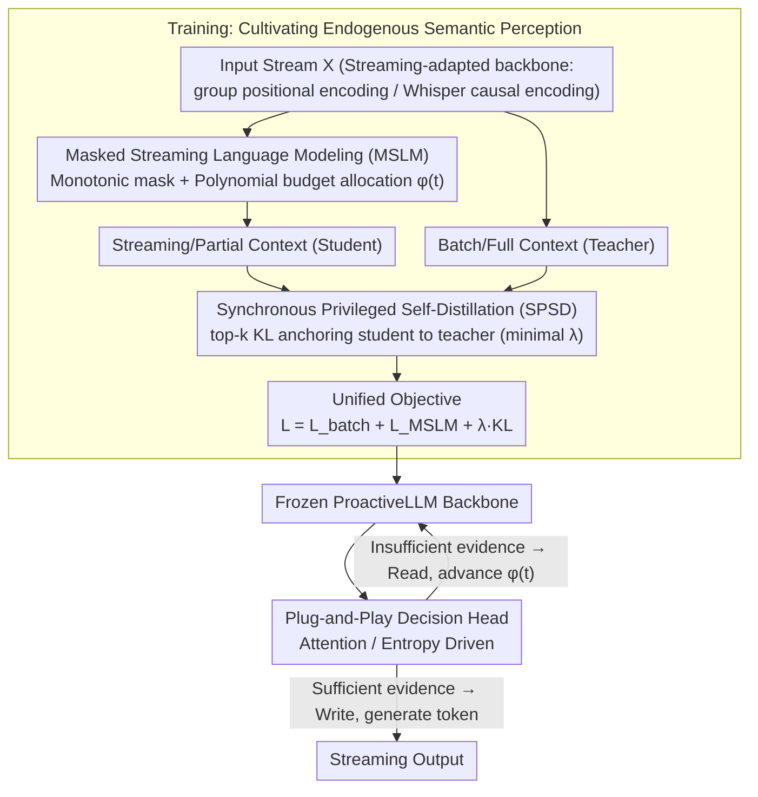

# ProactiveLLM: Learning Active Interaction for Streaming Large Language Models

**Conference**: ICML 2026  
**arXiv**: [2606.00523](https://arxiv.org/abs/2606.00523)  
**Code**: The paper claims it is open-source; the repository link is available at the end of the text.  
**Area**: LLM Efficiency / Streaming Generation  
**Keywords**: Streaming LLM, active interaction, masked streaming modeling, self-distillation, endogenous signals  

## TL;DR
ProactiveLLM enables streaming LLMs to decide "when to speak" using their own internal states (attention or prediction entropy). By leveraging masked streaming modeling and synchronous privileged self-distillation, the model learns to perceive whether the "semantics are sufficient" without relying on any external alignment labels, significantly compressing interaction latency while maintaining performance.

## Background & Motivation
**Background**: Mainstream LLMs follow the "read-then-generate" batch processing paradigm, requiring the entire input stream to be collected before generation starts. Emerging streaming LLMs aim to "write while reading" to reduce response latency in scenarios like audio, video, and simultaneous interpretation.

**Limitations of Prior Work**: The core challenge for streaming LLMs is determining "when to trigger generation." Existing approaches fall into two categories: one uses hard-coded scheduling (wait-$k$, fixed-chunk decoding), which ignores fluctuations in context density and either hallucinates by speaking too early or lags like batch processing in non-monotonic alignment tasks (e.g., QA, summarization); the other trains decision heads using external alignment labels (timestamps, segment labels, reasoning trajectories from strong teachers), requiring re-labeling and re-training for every new task, modality, or latency requirement.

**Key Challenge**: Both existing approaches essentially treat the generator as a passive follower—either following rigid rules or external alignment signals—preventing the model from leading the "write" decision based on its own judgment of semantic sufficiency.

**Goal**: Upgrade the interaction scheduling function $\phi(t)$ from a static rule to a content-aware policy $\phi(t;\theta)$ while completely eliminating the need for external alignment labels.

**Key Insight**: The authors hypothesize that an LLM already well-trained on batch data contains hidden states that implicitly indicate whether the current partial context is sufficient to predict the next token. This latent perception merely needs to be activated by simulating streaming visibility through masking and using an "all-seeing" version of the same model as an implicit teacher.

**Core Idea**: Decouple "streaming capability learning" from "interaction decision-making." First, cultivate endogenous semantic boundary perception via masked streaming modeling and synchronous privileged self-distillation. Then, attach a plug-and-play decision head (attention-driven or entropy-driven) to translate these endogenous signals into read/write decisions.

## Method

### Overall Architecture
ProactiveLLM addresses the problem of "when a streaming LLM should speak" by splitting it into two parts: developing semantic boundary perception during training and extracting this perception using a lightweight decision head during inference. Built on a streaming-adapted LLM backbone (using group positional encoding to decouple input/output indices and a Whisper encoder with causal masks for audio), the training phase jointly optimizes three objectives: standard batch NLL to preserve pre-trained knowledge, Masked Streaming Language Modeling (MSLM) to learn generation under incomplete input, and Synchronous Privileged Self-Distillation (SPSD) using top-$k$ KL to anchor streaming distributions back to the batch-mode logits of the same model. During inference, the LLM backbone is frozen, and a plug-and-play decision head monitors internal states in real-time to dynamically advance the visibility boundary $\phi(t)$.

Formally, streaming generation is defined as $P(\mathbf{Y}|\mathbf{X})=\prod_{t=1}^{L}P(y_t\mid \mathbf{y}_{<t},\mathbf{X}_{1:\phi(t)};\theta)$ with a monotonic constraint $\phi(t+1)\geq \phi(t)$. Evaluation introduces two non-traditional metrics: Read Coverage Rate ($\text{RCO}=\frac{1}{L}\sum_t \phi(t)/M$), which measures cognitive redundancy, and Average Interaction Lag ($\text{AIL}=\frac{1}{L}\sum_t (\phi(t)-\phi_{\text{ideal}}(t))$), which measures latency relative to an ideal schedule.

### Key Designs

**1. Masked Streaming Language Modeling (MSLM) + Polynomial Budget: Forcing Generation with Partial Vision**

The core difficulty of streaming is that models are never trained on "incomplete input" views. MSLM addresses this by sampling a monotonic visibility boundary $\phi$ for each sample during training, masking all attention from output tokens to input tokens beyond $\phi(t)$. The model optimizes $\mathcal{L}_{\text{MSLM}}=-\sum_t \log P(y_t\mid \mathbf{y}_{<t}, \mathbf{x}_{1:\phi(t)};\theta)$. This adopts the masked language modeling concept from BERT for autoregressive streaming, using monotonic causal masks to match "writing while reading" semantics.

To avoid degenerate samples where the model is forced to generate with almost no context, the authors distribute the total reading budget $\mathcal{B}=M$ across $L$ decoding steps using a multinomial distribution $\boldsymbol{\Delta}\sim\text{Multinomial}(\mathcal{B}, \mathbf{w})$, accumulating into a trajectory $\phi(t)=\Delta_0+\sum_{k=1}^t\Delta_k$. This constrains decision trajectories to a reasonable "read rate," mitigating hallucinations while maintaining randomness. The weight $\mathbf{w}$ can be adjusted to favor different latency profiles.

**2. Synchronous Privileged Self-Distillation (SPSD): Using the "Full-Visibility Self" as a Soft Teacher**

Training only on partial context risks distribution drift, where the model loses original semantic capabilities. SPSD provides a stable optimization anchor without an external teacher. Two forward passes are run simultaneously: a batch mode with full $\mathbf{x}$ (teacher) and a streaming mode with $\mathbf{x}_{1:\phi(t)}$ (student). The streaming distribution is pulled toward the batch distribution using top-$k$ truncated KL:

$$\mathcal{L}_{\text{distill}}=\lambda\cdot\sum_{t=1}^{L} D_{\text{KL}}\big(P_{\text{batch}}(\cdot\mid \mathbf{x})\,\|\,P_{\text{stream}}(\cdot\mid \mathbf{x}_{1:\phi(t)})\big)$$

The coefficient $\lambda$ is kept minimal, and top-$k$ truncation anchors only the most confident tokens. This maintains the student's necessary predictive flexibility while preventing drift. Since both passes use the same parameters, the teacher signal evolves with the training, avoiding extra storage or lag associated with EMA or historical checkpoints.

**3. Plug-and-Play Decision Heads: Translating Endogenous Perception to Online Decisions**

ProactiveLLM freezes the backbone and attaches a lightweight controller using two complementary methods. An **Attention-driven head** monitors cumulative attention from output tokens to the input stream; dispersed attention suggests insufficient grounding (read), while focused attention suggests sufficient evidence (write). An **Entropy-driven head** detects the Shannon entropy of the next token distribution $H(P_t)=-\sum_{v\in\mathcal{V}} P(\hat{y}_t\mid C_t)\log P(\hat{y}_t\mid C_t)$; high entropy indicates divergence (read), while low entropy indicates confidence (write).

This decoupling allows a single trained ProactiveLLM to be configured for different latency targets by simply adjusting thresholds in the decision head, with no retraining required.

### Loss & Training
The unified objective $\mathcal{L}=\mathcal{L}_{\text{batch}}+\mathcal{L}_{\text{MSLM}}+\lambda \mathcal{D}_{\text{KL}}$ is optimized jointly. Backbones include Qwen2.5-3B-Instruct / Qwen3-4B (text) and Qwen2-Audio-7B-Instruct (speech) using SFT.

## Key Experimental Results

### Main Results
The evaluation covers both text and speech modalities, including monotonic alignment (IWSLT-17 translation) and non-monotonic alignment (Dialogue Summary, SQuAD QA, MCTest). Representative results for Qwen2.5-3B:

| Task | Method | Quality ↑ | AIL ↓ | RCO ↓ |
|------|------|--------|-------|-------|
| MT En→De | Batch (Full) | 27.34 BLEU | 8.71 | 1.00 |
| MT En→De | Wait-9 | 21.47 | 6.87 | 0.88 |
| MT En→De | Proactive-Entr | 23.62 | 8.36 | 0.88 |
| Short QA | Batch (Full) | 74.79 F1 | 77.55 | 1.00 |
| Short QA | Wait-9 | 15.14 | -21.32 | 0.19 |
| Short QA | Proactive-Attn| 71.69 | 59.17 | 0.89 |
| Choice QA| Batch (Full) | 88.33 Acc | 204.87 | 1.00 |
| Choice QA| Proactive-Attn| 83.15 | 151.62 | 0.74 |

Notably, in non-monotonic QA tasks, the proposed method retains 97.16% of the offline upper bound using only 78% of the context, whereas wait-$k$ methods suffer catastrophic drops in F1 score because hard-coded schedules cannot handle arbitrary evidence locations.

### Comparison with Learning-based Baselines
ProactiveLLM was compared against baselines trained on alignment labels generated by Qwen3-32B and GPT-5.4:

| Latency | Method | MT En→Fr BLEU ↑ | Short QA F1 ↑ |
|---------|------|-----------------|---------------|
| Low | Qwen3-32B Labels | 24.12 | 29.84 |
| Low | GPT-5.4 Labels | 27.18 | 38.12 |
| Low | ProactiveLLM | 26.56 | **48.74** |
| High | Qwen3-32B Labels | 27.62 | 42.88 |
| High | GPT-5.4 Labels | 30.74 | 50.21 |
| High | ProactiveLLM | 30.38 | **58.36** |

While matching strong teacher baselines in translation, ProactiveLLM significantly outperforms them in QA, demonstrating that endogenous signals are more reliable than external alignment labels for non-monotonic tasks.

### Key Findings
- **Head Selection**: Attention-driven heads are more stable for non-monotonic tasks (QA, summarization), while entropy-driven heads excel in monotonic tasks (translation).
- **Transferability**: Results are stable across backbones (Qwen2.5-3B → Qwen3-4B) and modalities (text → speech).
- **Polynomial Budget**: The multinomial distribution $\mathbf{w}$ constrains training to reasonable read rates, effectively mitigating hallucinations under short contexts.

## Highlights & Insights
- **Engineering Value of Endogenous Cues**: Reframing interaction as an internal readout (attention/entropy) rather than a supervised task eliminates the need for expensive external labels.
- **Synchronous Self-Distillation**: Using the "full-context current self" as a teacher is more efficient than using historical checkpoints or EMA, as it evolves naturally with the model and saves memory.
- **MSLM Paradigm**: Adapting BERT's masking concept to autoregressive streaming provides a robust framework for learning predictions under constrained observations, applicable beyond LLMs to tasks like streaming ASR.

## Limitations & Future Work
- The current decision heads rely on heuristic internal states; a lightweight learned classification head could provide more general read/write probabilities.
- The polynomial budget distribution $\mathbf{w}$ remains a hyperparameter; future work should explore "self-adaptive latency" where the model determines the budget per task difficulty.
- Experiments are limited to the Qwen family (3B-7B) and lack verification on very large models (32B+) or multi-turn streaming dialogues.

## Related Work & Insights
- **vs. Wait-$k$ (Ma et al., 2019)**: ProactiveLLM replaces rigid rules with endogenous signals, thriving in non-monotonic tasks where evidence placement is irregular.
- **vs. Learning-based Baselines (Fu et al., 2025)**: ProactiveLLM removes the dependency on teacher-generated timestamps and outperforms them in QA tasks.
- **vs. Streaming Translation (Tong et al., 2025a/b)**: While existing works focus on translation quality under streaming settings, this work internalizes the scheduling strategy itself.

## Rating
- **Novelty**: ⭐⭐⭐⭐ Scaling interaction from static rules to endogenous decisions marks a significant conceptual leap.
- **Experimental Thoroughness**: ⭐⭐⭐⭐ Strong cross-modal and cross-task verification, though lacking 32B+ model tests.
- **Writing Quality**: ⭐⭐⭐⭐ Clear definitions of metrics ($\phi(t)$, RCO, AIL) and intuitive diagrams.
- **Value**: ⭐⭐⭐⭐ Highly practical for real-time AI assistants and simultaneous translation due to the low-cost latency tuning.

<!-- RELATED:START -->

## Related Papers

- [\[ICML 2026\] IR3DE: A Linear Router for Large Language Models](ir3de_a_linear_router_for_large_language_models.md)
- [\[ICLR 2026\] Deep Hierarchical Learning with Nested Subspace Networks for Large Language Models](../../ICLR2026/llm_efficiency/deep_hierarchical_learning_with_nested_subspace_networks_for_large_language_mode.md)
- [\[ICML 2026\] dLLM-Cache: Accelerating Diffusion Large Language Models with Adaptive Caching](dllm-cache_accelerating_diffusion_large_language_models_with_adaptive_caching.md)
- [\[ICLR 2026\] Learning to Parallel: Accelerating Diffusion Large Language Models via Learnable Parallel Decoding](../../ICLR2026/llm_efficiency/learning_to_parallel_accelerating_diffusion_large_language_models_via_learnable_.md)
- [\[ICLR 2026\] Expert Divergence Learning for MoE-based Language Models](../../ICLR2026/llm_efficiency/expert_divergence_learning_for_moe-based_language_models.md)

<!-- RELATED:END -->
