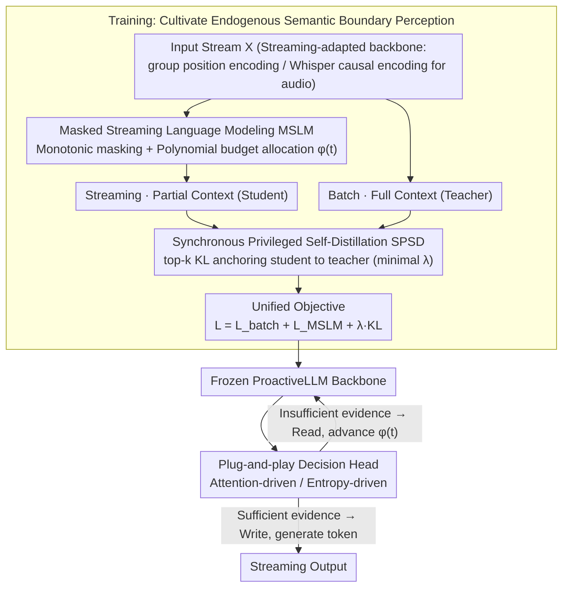

# ProactiveLLM: Learning Active Interaction for Streaming Large Language Models

**Conference**: ICML 2026  
**arXiv**: [2606.00523](https://arxiv.org/abs/2606.00523)  
**Code**: The paper claims to be open-sourced; see the repository link at the end of the text.  
**Area**: LLM Efficiency / Streaming Generation  
**Keywords**: Streaming LLM, Proactive Interaction, Masked Streaming Modeling, Self-distillation, Endogenous Cues  

## TL;DR
ProactiveLLM enables streaming LLMs to use their internal states (attention or prediction entropy) to decide "when to speak." By employing Masked Streaming Modeling + Synchronous Privileged Self-Distillation, it learns to perceive "semantic sufficiency" without relying on any external alignment annotations. This significantly reduces interaction latency with minimal performance degradation.

## Background & Motivation
**Background**: Mainstream LLMs follow a "read-then-generate" batch processing paradigm, requiring the entire input stream to be collected before generation begins. Emerging streaming LLMs aim to "read-while-writing" to reduce response latency in scenarios like audio/video interaction and simultaneous interpretation.

**Limitations of Prior Work**: The core challenge of read-while-writing is determining "when to trigger generation." Existing approaches fall into two categories: one uses hard-coded scheduling (wait-$k$, fixed chunk decoding) which ignores fluctuations in context density, leading to either premature hallucination or batch-like lag in non-monotonic alignment tasks (e.g., QA, summarization); the other trains decision heads using external alignment annotations (timestamps, segmentation labels, reasoning trajectories from strong teachers), requiring re-annotation and re-training for every task, modality, or latency setting.

**Key Challenge**: Both existing categories essentially treat the generator as a passive follower—either following rigid rules or external alignment signals. Models never have the opportunity to lead the "write" decision based on their own judgment of "semantic sufficiency."

**Goal**: Upgrade the interaction scheduling function $\phi(t)$ from static rules to a content-aware policy $\phi(t;\theta)$, while completely eliminating dependence on external alignment annotations.

**Key Insight**: The authors hypothesize that an LLM already well-trained on batch data contains hidden states that implicitly signify whether the "current partial context is sufficient to predict the next token." However, no one has explicitly taught the model to manifest this judgment under "incomplete visibility." The goal is to activate this sensing capability by simulating streaming visibility via masking and using the "full-visibility version" of the same model as an implicit teacher.

**Core Idea**: Decouple "streaming generation learning" from "interaction decision-making." First, cultivate endogenous semantic boundary perception through Masked Streaming Modeling + Synchronous Privileged Self-Distillation, then attach a plug-and-play decision head (attention-driven or entropy-driven) to translate these endogenous signals into read/write decisions.

## Method

### Overall Architecture
ProactiveLLM solves the problem of "when a streaming LLM should speak" by splitting it into two stages: first, nurturing the perception of "semantic sufficiency" during training, and then reading this perception via a lightweight decision head during inference to generate read/write signals. The system is built on a streaming-adapted LLM backbone (using group positional encoding to decouple input/output indices, and a Whisper encoder with forced causal masking for audio). The training phase jointly optimizes three objectives: standard batch NLL to preserve pre-trained knowledge, Masked Streaming Language Modeling (MSLM) to learn generation under incomplete input, and Synchronous Privileged Self-Distillation (SPSD) KL to anchor the streaming distribution back using batch logits from the same model as a soft teacher. During inference, the LLM backbone is frozen, and a plug-and-play decision head—either attention-driven or entropy-driven—monitors internal states in real-time to dynamically advance the visibility boundary $\phi(t)$.

Formally, streaming generation is defined as $P(\mathbf{Y}|\mathbf{X})=\prod_{t=1}^{L}P(y_t\mid \mathbf{y}_{<t},\mathbf{X}_{1:\phi(t)};\theta)$, with a monotonic constraint $\phi(t+1)\geq \phi(t)$ (already read inputs cannot be discarded). Evaluation introduces two non-traditional metrics: Read-Coverage (RCO) $\text{RCO}=\frac{1}{L}\sum_t \phi(t)/M$, which measures cognitive redundancy (average proportion of input read before speaking, lower is more efficient), and Average Interaction Lag (AIL) $\text{AIL}=\frac{1}{L}\sum_t (\phi(t)-\phi_{\text{ideal}}(t))$, which measures latency relative to an ideal schedule.

### Key Designs

**1. Masked Streaming Language Modeling (MSLM) + Polynomial Budget Allocation: Forcing the model to generate with "half-seen" context**

The core difficulty of streaming is that models are never trained on views where the "input is not yet fully collected"; they usually hallucinate when deployed. MSLM addresses this by sampling a monotonic visibility boundary $\phi$ during training for each sample. It masks the attention of output tokens to any input tokens beyond $\phi(t)$, optimizing $\mathcal{L}_{\text{MSLM}}=-\sum_t \log P(y_t\mid \mathbf{y}_{<t}, \mathbf{x}_{1:\phi(t)};\theta)$. This adapts the Masked Language Modeling idea from BERT to autoregressive streaming, where bidirectional masks are replaced with monotonic causal masks to match the "read-while-writing" semantics.

However, pure uniform random sampling of $\phi$ results in many degenerate samples where the model is forced to generate with almost no context, leading to hallucinations. To avoid this, the authors do not cut boundaries randomly. Instead, they distribute the total reading budget $\mathcal{B}=M$ across $L$ decoding steps using a polynomial distribution $\boldsymbol{\Delta}\sim\text{Multinomial}(\mathcal{B}, \mathbf{w})$, then accumulate the trajectory as $\phi(t)=\Delta_0+\sum_{k=1}^t\Delta_k$. This constrains the decision trajectory near a reasonable "read rate," preventing degradation while maintaining enough randomness. The weight $\mathbf{w}$ can be tuned (uniform or polynomial bias) to correspond to different latency preferences, allowing one training objective to cover multiple latency profiles.

**2. Synchronous Privileged Self-Distillation (SPSD): Using "full-context self" as a soft teacher to prevent distribution drift**

Training solely on partial contexts risks having the streaming distribution drift away from the pre-training manifold, making the model prone to hallucination. SPSD provides a stable optimization anchor without external teachers. The same parameters run two forward passes: a batch mode with full $\mathbf{x}$ as teacher, and a streaming mode with $\mathbf{x}_{1:\phi(t)}$ as student. A top-$k$ truncated KL divergence anchors the streaming distribution to the batch distribution:

$$\mathcal{L}_{\text{distill}}=\lambda\cdot\sum_{t=1}^{L} D_{\text{KL}}\big(P_{\text{batch}}(\cdot\mid \mathbf{x})\,\|\,P_{\text{stream}}(\cdot\mid \mathbf{x}_{1:\phi(t)})\big)$$

Crucially, the coefficient $\lambda$ is kept very small, and top-$k$ only anchors the most confident tokens. These two "knobs" keep distillation in the sweet spot: no distillation leads to drift, while excessive distillation stifles the anticipatory capability inherent in streaming (a student with partial evidence *should* behave differently than a teacher with full evidence). Since it is synchronous self-distillation, the teacher signal evolves with training, avoiding extra storage or lag associated with historical checkpoints/EMA, and requires no external strong teachers.

**3. Plug-and-play Decision Head (Attention / Entropy driven): Translating endogenous perception into online read/write**

The previous steps cultivate "semantic boundary perception" during training; at inference, this must be extracted. ProactiveLLM freezes the backbone and attaches a lightweight "gateway controller" using two complementary methods. The attention-driven head monitors the cumulative attention distribution of output tokens over the input stream—dispersed attention suggests insufficient grounding (continue to read), while focus on a specific input position suggests evidence is ready (begin to write). The entropy-driven head probes the Shannon entropy $H(P_t)=-\sum_{v\in\mathcal{V}} P(\hat{y}_t\mid C_t)\log P(\hat{y}_t\mid C_t)$ of the potential next token distribution. High entropy indicates the prediction is still divergent (continue to read), while low entropy indicates convergence to a confident state (begin to write).

This modularity is possible because "capability learning" and "decision learning" are decoupled. The same trained ProactiveLLM can be paired with any decision head or threshold to adjust latency, without re-training the backbone. This is its major practical advantage over learning-based alignment baselines, which require re-labeling and re-training for every latency/task change.

### Loss & Training
The unified objective $\mathcal{L}=\mathcal{L}_{\text{batch}}+\mathcal{L}_{\text{MSLM}}+\lambda \mathcal{D}_{\text{KL}}$ is optimized jointly: the batch term prevents catastrophic forgetting, the MSLM term is the core streaming goal, and the KL term serves as a stable anchor. Backbones used include Qwen2.5-3B-Instruct / Qwen3-4B (text) and Qwen2-Audio-7B-Instruct (audio) for SFT.

## Key Experimental Results

### Main Results
The experiments cover text and audio modalities. The text side evaluates monotonic alignment (IWSLT-17 translation) and non-monotonic alignment (dialogue summarization, SQuAD QA, MCTest multiple choice). The audio side evaluates ASR (LibriSpeech) and Spoken-SQuAD. Representative comparisons on Qwen2.5-3B are shown below:

| Task | Method | Quality ↑ | AIL ↓ | RCO ↓ |
|------|------|--------|-------|-------|
| MT En→De | Batch (Full) | 27.34 BLEU | 8.71 | 1.00 |
| MT En→De | Wait-9 | 21.47 | 6.87 | 0.88 |
| MT En→De | Proactive-Entr | 23.62 | 8.36 | 0.88 |
| Short QA | Batch (Full) | 74.79 F1 | 77.55 | 1.00 |
| Short QA | Wait-9 | 15.14 | -21.32 | 0.19 |
| Short QA | Proactive-Attn | 71.69 | 59.17 | 0.89 |
| Choice QA | Batch (Full) | 88.33 Acc | 204.87 | 1.00 |
| Choice QA | Proactive-Attn | 83.15 | 151.62 | 0.74 |

The most significant results are in non-monotonic alignment QA: using 78% context, it retains 97.16% of the offline upper bound, while the wait-$k$ series drops to an F1 of 8-15 on Short QA—demonstrating the failure of hard-coded scheduling when evidence positions are arbitrary.

### Comparison with Learning-based Baselines
Table 2 in the paper compares with learning-based baselines trained on alignment annotations generated by Qwen3-32B and GPT-5.4 at low and high latency levels:

| Latency Level | Method | MT En→Fr BLEU ↑ | Short QA F1 ↑ |
|--------|------|-----------------|---------------|
| Low Latency | Qwen3-32B Labels | 24.12 | 29.84 |
| Low Latency | GPT-5.4 Labels | 27.18 | 38.12 |
| Low Latency | ProactiveLLM | 26.56 | **48.74** |
| High Latency | Qwen3-32B Labels | 27.62 | 42.88 |
| High Latency | GPT-5.4 Labels | 30.74 | 50.21 |
| High Latency | ProactiveLLM | 30.38 | **58.36** |

While ProactiveLLM is on par with strong teacher labels for translation, it significantly outperforms them on QA tasks. This suggests endogenous signals are more reliable than "external alignment labels" for non-monotonic tasks where evidence location is difficult to label.

### Key Findings
- **Decision Head Selection**: Attention-driven heads are more stable on non-monotonic alignment tasks (QA, summarization), while entropy-driven heads perform slightly better on monotonic alignment tasks (translation). In translation, "prediction divergence" correlates more directly with "how many words to read," whereas in QA, "attention focused on specific evidence fragments" is the ready-to-write signal.
- **Transferability**: Stable transfer across backbones (Qwen2.5-3B → Qwen3-4B) and modalities (text → audio) verifies that "endogenous signals" do not depend on a specific model scale.
- **Polynomial vs. Uniform Sampling**: The former constrains the training distribution to a reasonable read rate, significantly mitigating hallucinations in short contexts.

## Highlights & Insights
- **Engineering Value of "Endogenous Cues"**: Reframing the decision of "when to speak" from a supervised task requiring external labels to a byproduct measurable via the model's own attention/entropy. This means latency can be adjusted by changing decision head thresholds rather than re-training the model.
- **Smart Synchronous Self-Distillation**: Traditional self-distillation using past checkpoints or EMA introduces overhead and lag. Here, the model runs two forward passes (batch + streaming) simultaneously. The teacher is always "the current self with full visibility," saving storage and allowing the teacher signal to evolve with the training.
- **Adapting BERT Concepts to Autoregressive Streaming**: MSLM is a noteworthy paradigm. While BERT's bidirectional masks learn representations, here monotonic masks learn "how to generate under restricted observation." This approach is transferable to any task requiring prediction under limited visibility (streaming ASR, online decision making, etc.).

## Limitations & Future Work
- The decision head still relies on human-designed internal states (attention/entropy). A more general approach would be learning a lightweight classification head to project read/write probabilities from hidden states.
- The choice of polynomial budget distribution $\mathbf{w}$ is essentially a hyperparameter. True "adaptive latency" should allow the model to adjust its budget based on task difficulty.
- Experimental backbones are limited to Qwen 3B-7B. Verification on large-scale models (32B+) and multi-turn interactive streaming scenarios is missing.
- The sensitivity of the KL anchor's $\lambda$ and top-$k$ truncation, as well as the computational overhead of SPSD in long contexts (two forward passes per step), requires further analysis.

## Related Work & Insights
- **vs. Wait-$k$ (Ma et al., 2019)**: Representative of hard-coded scheduling (read $k$, write one). ProactiveLLM replaces fixed steps with endogenous signals, showing the greatest advantage in non-monotonic tasks with irregular evidence positions.
- **vs. Learning-based Alignment Baselines (Fu et al., 2025, etc.)**: Rely on strong teachers for timestamps/segmentation labels. ProactiveLLM requires no external labels and even outperforms GPT-5.4 label-trained baselines in QA.
- **vs. Streaming Interpretation/Translation (Tong et al., 2025a/b; Arora et al., 2025)**: These works focus on translation quality in streaming settings, but scheduling remains exogenous. This work internalizes the scheduling policy, horizontalizing the capabilities of streaming LLMs.
- **vs. BERT-style Masked Modeling**: Shared philosophy (simulating restricted visibility), but the goal shifts from "bidirectional representation" to "monotonic streaming generation" paired with polynomial budget constraints for autoregressive scenarios.

## Rating
- Novelty: ⭐⭐⭐⭐ Reframing "when to interact" from static rules/external supervision to an endogenous model decision is a significant conceptual leap in recent streaming LLM developments.
- Experimental Thoroughness: ⭐⭐⭐⭐ Covers text/audio modalities and monotonic/non-monotonic tasks, including comparisons with strong learning-based baselines. However, lacks verification on ultra-large models and long contexts.
- Writing Quality: ⭐⭐⭐⭐ Preliminaries clearly define $\phi(t)$, RCO, and AIL. Methodology diagrams and mask illustrations are intuitive, though the explanation for "top-$k$ KL" in SPSD is somewhat brief.
- Value: ⭐⭐⭐⭐ Highly relevant for real-time voice assistants, simultaneous interpretation, and streaming video QA. The plug-and-play decision head makes latency adjustment extremely low-cost.

<!-- RELATED:START -->

## Related Papers

- [\[ICLR 2026\] Deep Hierarchical Learning with Nested Subspace Networks for Large Language Models](../../ICLR2026/llm_efficiency/deep_hierarchical_learning_with_nested_subspace_networks_for_large_language_mode.md)
- [\[ICML 2026\] dLLM-Cache: Accelerating Diffusion Large Language Models with Adaptive Caching](dllm-cache_accelerating_diffusion_large_language_models_with_adaptive_caching.md)
- [\[ICLR 2026\] Expert Divergence Learning for MoE-based Language Models](../../ICLR2026/llm_efficiency/expert_divergence_learning_for_moe-based_language_models.md)
- [\[ICML 2026\] Scout: Active Information Foraging for Long-Text Understanding with Decoupled Epistemic States](scout_active_information_foraging_for_long-text_understanding_with_decoupled_epi.md)
- [\[ACL 2026\] Lizard: An Efficient Linearization Framework for Large Language Models](../../ACL2026/llm_efficiency/lizard_an_efficient_linearization_framework_for_large_language_models.md)

<!-- RELATED:END -->
