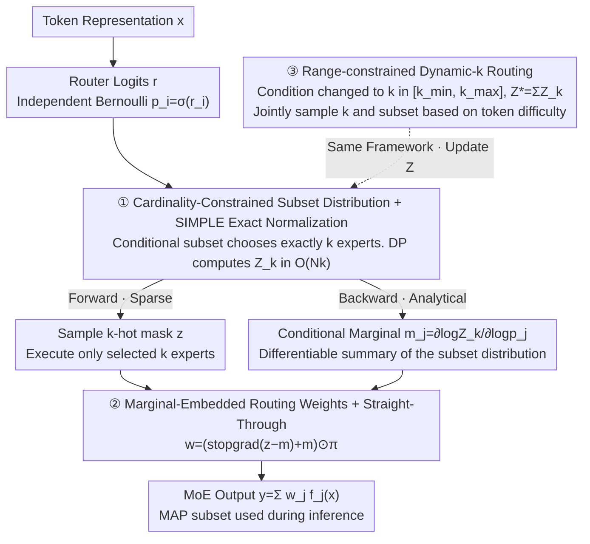

# ProbMoE: Differentiable Probabilistic Routing for Mixture-of-Experts

**Conference**: ICML 2026  
**arXiv**: [2606.01509](https://arxiv.org/abs/2606.01509)  
**Code**: https://github.com/HengHugoZhao/ProbMoE.git (Available)  
**Area**: LLM Efficiency / MoE Routing  
**Keywords**: Mixture-of-Experts, Probabilistic Routing, Subset Sampling, SIMPLE Gradient Estimator, Dynamic Expert Allocation

## TL;DR
ProbMoE reformulates MoE top-$k$ routing as "probabilistic inference over a cardinality-constrained subset distribution." The forward pass uses the SIMPLE estimator to sample from an exact-$k$ subset distribution, while the backward pass uses analytically computed conditional marginal expert probabilities $m_j=\partial \log Z_k/\partial \log p_j$ as a differentiable proxy for discrete selection. It significantly improves GSM/Law/Translation tasks on OLMoE/Qwen1.5-MoE and enhances expert utilization, while naturally extending to a Dynamic-$k$ variant that adaptively activates experts based on token difficulty.

## Background & Motivation
**Background**: Sparse MoE achieves scaling with "parameter count far exceeding activation FLOPs" by activating only $k$ experts per token (e.g., Switch Transformer, GLaM, DeepSeek-MoE). The core component is a softmax router plus a top-$k$ selector.

**Limitations of Prior Work**: The top-$k$ operator is discrete and piecewise constant, resulting in zero gradients almost everywhere for router logits. Standard training treats $S_{\text{top-}k}$ as a forward constant and backpropagates gradients only through the softmax weights $\pi_j$ of selected experts (discarding the "discrete-selection path"). Consequently, the router receives no learning signal regarding "alternative unselected subsets," leading to increasingly peaky routing distributions, reinforced selection of a few experts, expert collapse, and training instability.

**Key Challenge**: The router needs to learn a *discrete combinatorial object* ($k$-subset selection). Existing methods either use heuristic noise/shuffling (Shazeer et al.) or dense STE (DenseMixer) on selected experts. These approaches are "patches" on deterministic top-$k$ and do not explicitly model the "distribution over $k$-subsets," thus failing to systematically explore alternative subsets.

**Goal**: (i) Rewrite the router training objective as the expected loss under a *subset distribution* $\mathcal{J}(\theta)=\mathbb{E}_{S\sim\mathbb{P}_r(\cdot\mid|S|=k)}[\mathcal{L}(y_S(x;r))]$; (ii) Provide gradients reflecting the entire subset distribution to the router while maintaining the activation of only $k$ experts per step; (iii) Naturally generalize the framework to dynamic-$k$ ($k\in[k_{\min},k_{\max}]$).

**Key Insight**: The authors noted that the SIMPLE estimator (Ahmed et al. 2023) can exactly normalize Bernoulli product distributions with "exactly $k$ selections" in $\mathcal{O}(Nk)$ time and provide analytical conditional marginal probabilities $m_j$. By treating each expert selection as an independent Bernoulli $p_i=\sigma(r_i)$ conditioned on $|S|=k$, routing becomes a probabilistic layer with exact normalization and analytical marginals.

**Core Idea**: Replace "deterministic top-$k$ selection" with "sampling from a $k$-cardinality subset distribution + using conditional marginals as a backward proxy." This converts routing into truly differentiable discrete probabilistic inference. The same normalization constant can be replaced by a range-constrained $Z^*=\sum_{k=k_{\min}}^{k_{\max}} Z_k$ to obtain the dynamic-$k$ version with a single summation.

## Method

### Overall Architecture
Given an MoE layer with $N$ experts and token hidden state $x\in\mathbb{R}^d$, the router outputs logits $r=\mathrm{Router}_\theta(x)\in\mathbb{R}^N$ and softmax weights $\pi_i=\exp(r_i)/\sum_j\exp(r_j)$. For a subset $S$, MoE output is $y_S(x;r)=\sum_{j\in S}\pi_j f_j(x)$. The core change in ProbMoE is replacing "deterministic top-$k$ selection" with probabilistic inference: independent Bernoulli trials $p_i=\sigma(r_i)$ are conditioned on cardinality constraints (exact-$k$ or range $[k_{\min},k_{\max}]$) to derive the subset distribution $\mathbb{P}_r(S\mid\cdot)$. During the forward pass, it samples a $k$-hot mask from this distribution to execute only $k$ experts (matching standard MoE compute). During the backward pass, it propagates gradients through analytical conditional marginal probabilities $m_j$, allowing unselected alternative subsets to contribute to learning for the first time.

### Key Designs

**1. Cardinality-Constrained Subset Distribution + SIMPLE Exact Normalization: Replacing Routing with an Exact Probabilistic Layer**

The traditional top-$k$ operator is piecewise constant with zero gradients. To make routing a "learnable discrete object," one must define an exact probability for picking "exactly $k$ experts." ProbMoE conditions an unconstrained product measure of independent Bernoulli trials $p_i=\sigma(r_i)$ on $|S|=k$, yielding the subset distribution $\mathbb{P}_r(S\mid|S|=k)=Z_k^{-1}\prod_{j\in S}p_j\prod_{j\notin S}(1-p_j)$, where $Z_k=\sum_{|S|=k}\prod_{j\in S}p_j\prod_{j\notin S}(1-p_j)$ sums over all $\binom{N}{k}$ subsets. Using the SIMPLE estimator (Ahmed et al. 2023), $Z_k$ is computed via dynamic programming (1D convolution recurrence) in $\mathcal{O}(Nk)$ (or $\mathcal{O}(\log N\log k)$ vectorized), avoiding combinatorial explosion. This is foundational because continuous relaxations like Gumbel-Softmax are either biased or high-variance and cannot express the hard constraint "exactly $k$." SIMPLE enables feasible exact probabilistic inference in MoE routers. Generalization to range constraints simply replaces $Z_k$ with $Z^*=\sum_{k=k_{\min}}^{k_{\max}} Z_k$ (Complexity remains $\mathcal{O}(Nk_{\max})$).

**2. Marginal-Embedded Routing Weights + Straight-Through Backward: Sparse Forward, Distribution-Aware Gradient Backward**

Exact normalization allows sparse forward activation (only $k$ experts) while ensuring gradients reflect the impact of subset alternatives. ProbMoE uses the conditional marginal $m_j=\mathbb{P}_r(j\in S\mid|S|=k)=\partial\log Z_k/\partial\log p_j$ as a differentiable "summary" of the discrete selection, combining the sample mask $z$, marginals $m$, and softmax $\pi$ into routing weights via STE:

$$w=(\operatorname{stopgrad}(z-m)+m)\odot\pi.$$

Forward weights $w_i=z_i\pi_i$ remain sparse, while the backward gradient $\partial\mathcal{L}/\partial r_i=\sum_j\langle\partial\mathcal{L}/\partial y,f_j(x)\rangle(m_j\,\partial\pi_j/\partial r_i+\pi_j\,\partial m_j/\partial r_i)$ includes a new "marginal path" that propagates distribution-level dependencies back to the router. Ablations (Fig. 2) show that only the "Sample (Forward) + Marginal (Backward)" pairing achieves high performance (50.24% EM on OLMoE/GSM); using "Sample + Dense STE" drops performance to 46.6% with high variance, and "Top-$k$ + Marginal" also underperforms. Consistency between the forward and backward passes within the same distribution is critical.

**3. Range-constrained Dynamic-k Routing: Adaptive Expert Count Based on Token Difficulty**

Fixed $k$ treats all tokens equally, even though simple tokens require fewer experts. ProbMoE generalizes exact-$k$ to a distribution allowing $|S|\in[k_{\min},k_{\max}]$ via $\mathbb{P}_r(S\mid k_{\min}\le|S|\le k_{\max})=Z^{*-1}\prod_{j\in S}p_j\prod_{j\notin S}(1-p_j)$. Since $Z^*=\sum_{k=k_{\min}}^{k_{\max}}Z_k$, sampling first picks a cardinality $k$ from the marginal $\mathbb{P}_r(|S|=k\mid\cdot)=Z_k/Z^*$, then calls exact-$k$ sampling to choose the subset. This enables joint inference of $k$ and $S$. Backward pass uses range-constrained marginals $m_j^*=\partial\log Z^*/\partial\log p_j$ with the same STE weights. Unlike previous dynamic methods (DA-MoE, DynMoE) that rely on heuristic thresholds, ProbMoE's dynamic-$k$ is a strictly differentiable probabilistic upgrade. Table 2 shows Dynamic-$k$ achieves comparable or higher EM on OLMoE/Qwen using only 75–84% of experts. Fig. 5/6 show the router allocates more experts to ambiguous tokens (punctuation, `:` , `?`) and fewer to common nouns/numbers.

### Loss & Training
The objective is the expected loss under the subset distribution $\mathcal{J}(\theta)=\mathbb{E}_{S\sim\mathbb{P}_r(\cdot\mid|S|=k)}[\mathcal{L}(y_S(x;r))]$. ProbMoE approximates the gradient using $\nabla_\theta\mathcal{L}(y(x;r))$ with the routing weights from Eq. (7). Note that $p_i=\sigma(r_i)$ and softmax $\pi$ originate from the same router logits but serve different roles (subset sampling vs. weighting). All experiments follow the protocol of DenseMixer (Yao et al. 2026), replacing only the routing module for fair comparison. On Qwen, ProbMoE applies only to routed experts; shared experts remain unchanged.

## Key Experimental Results

### Main Results
MoE backbones: OLMoE-1B-7B (16 layers × 64 experts / $k=8$) and Qwen1.5-MoE-A2.7B (24 layers × 60 routed + 4 shared / $k=4$). Tasks: GSM8K (Math), Law, Machine Translation, Summary (LLM-as-judge), MBPP (Code), MMLU.

| Backbone | Method | GSM | Law | Translation | MBPP | Summary | MMLU |
|---|---|---|---|---|---|---|---|
| OLMoE (k=8) | Conventional | 45.94 | 25.00 | 27.56 | 23.20 | 33.70 | 54.04 |
| OLMoE (k=8) | DenseMixer | 47.00 | 27.90 | 30.32 | **24.40** | 37.50 | 53.95 |
| OLMoE (k=8) | **ProbMoE** | **50.19** | **29.00** | **31.63** | 22.80 | **39.29** | 53.69 |
| Qwen (k=4) | Conventional | 53.30 | 29.50 | 30.00 | 32.80 | 39.00 | 61.03 |
| Qwen (k=4) | DenseMixer | **54.97** | 30.75 | 33.75 | 34.00 | 41.00 | 61.03 |
| Qwen (k=4) | SparseMixer | 1.30 | 3.40 | 3.50 | 0.00 | 2.10 | – |
| Qwen (k=4) | ReMoE | 46.30 | 25.50 | 16.99 | 33.00 | 25.80 | – |
| Qwen (k=4) | **ProbMoE** | 53.29 | **34.40** | **39.23** | **35.00** | **44.40** | **61.05** |

ProbMoE ranked first in 4/6 tasks on OLMoE (GSM/Law/Translation/Summary gains of +2.2 to +5.5) and 4/6 tasks on Qwen (Law +3.65, Translation +5.48, Summary +3.4). Notably, it consistently outperformed DenseMixer while maintaining sparse expert computation during training.

### Ablation Study

| Config (OLMoE/GSM, 3 seeds) | Forward | Backward | EM (%) | Variance σ |
|---|---|---|---|---|
| ProbMoE | Sample ($k$-subset) | Marginal | **50.24** | **0.09** |
| DenseMixer | Top-$k$ | Dense STE | ~47 | Mid |
| Sample + Dense STE | Sample | Dense STE | 46.6 | 0.37 |
| Top-$k$ + Marginal | Top-$k$ | Marginal | < ProbMoE | – |

| Setting | Dataset | $\Delta$EM vs Exact-$k$ | Avg. Expert Usage |
|---|---|---|---|
| Dynamic-$k$ (OLMoE) | GSM | −1.82 | 80.00% |
| Dynamic-$k$ (OLMoE) | Law | −0.04 | 84.50% |
| Dynamic-$k$ (OLMoE) | Translation | +0.36 | 82.00% |
| Dynamic-$k$ (Qwen1.5) | GSM | −4.29 | 75.00% |
| Dynamic-$k$ (Qwen1.5) | Law | **+2.70** | 75.00% |
| Dynamic-$k$ (Qwen1.5) | Translation | **+3.22** | 75.00% |

### Key Findings
- **Forward-Backward Alignment**: Gains come from the self-consistency of "Forward Sampling + Backward Analytical Marginals" within the same $k$-subset distribution. Breaking this alignment (e.g., Sample + Dense STE) drops EM by 4 points and quadruples variance.
- **Improved Expert Utilization**: ProbMoE results in higher entropy in routing distributions (Fig. 4) and lower Top-4 cumulative mass (Fig. 3). This indicates more diverse expert selection and specialization, consistent with findings from DeepSeek-MoE.
- **Train/Inference Cardinality Mismatch**: Traditionally trained Exact-$k$ models (at $k=8$) only pick ~5 experts when using dynamic MAP inference, suggesting peaky learned distributions. ProbMoE achieves higher EM in dynamic inference (44.50 vs 38.59) due to explicit cardinality modeling.
- **Semantic Adaptive Compute**: Dynamic-$k$ assigns more experts to punctuation/affixes/context-sensitive symbols (`:`, `?`, `ons`) and fewer to numbers/nouns (Fig. 6). Overall expert usage reflects task difficulty (Law > Translation > GSM).
- **Failure of Heuristic Baselines**: SparseMixer failed completely on Qwen (GSM 1.30), showing that dynamic sparse-gradient routing is unstable on large backbones. ReMoE's ReLU-based routing also lagged behind, validating the necessity of an explicit $k$-subset distribution.

## Highlights & Insights
- **"The fundamental deficit of router gradients is modeling, not estimation"**: ProbMoE shifts focus to what should be modeled—the parameters of a $k$-subset distribution, not just the softmax weights of selected experts. This naturally provides signals for alternative subsets.
- **First application of SIMPLE in MoE**: Successfully adapts 1D DP normalization for combinatorial learning to MoE routers. This framework is reusable for any hard-cardinality sparse forward scenarios (e.g., sparse attention, active learning).
- **Free Dynamic-k**: Extending exact-$k$ to dynamic range via $Z^* = \sum Z_k$ is a rare instance where theoretical unification leads to engineering simplicity.
- **Transferable Trick**: The STE weights in Eq. (7) provide a robust "sparse-forward, distribution-backward" pattern superior to plain STE, potentially applicable to tokens or depth selection.

## Limitations & Future Work
- **Scale**: Experiments focused on SFT stages; pre-training scale verification is pending. System-level wall-clock acceleration for dynamic-$k$ (kernel-level speedup) is yet to be fully implemented.
- **MMLU Saturates**: Gains on MMLU/MMLU-Stem were minimal (< 0.5), suggesting marginal benefits for general knowledge retrieval compared to reasoning/generation.
- **GSM Dynamic Regression**: Math tasks suffered a drop in dynamic mode (up to -4.29). These tasks may require a stable, fixed expert set; dynamic variation might introduce inconsistency.
- **Hyperparameter Sensitivity**: The impact of $[k_{\min}, k_{\max}]$ ranges and whether they require per-layer tuning was not systematically ablated.
- **Complexity Constant**: While $\mathcal{O}(Nk)$ is asymptotic, the DP is serial per token. Training wall-clock overhead compared to standard MoE was not detailed.

## Related Work & Insights
- **vs DenseMixer (Yao 2026)**: DenseMixer uses top-$k$ forward but dense STE backward (requiring dense expert compute during training). ProbMoE uses sparse forward and distribution-aware backward, keeping experts sparse throughout.
- **vs SparseMixer (Liu 2023) / ReMoE (Wang 2025)**: These failed on large Qwen backbones, whereas ProbMoE's "discrete selection + distribution-level differentiability" remained stable.
- **vs Gumbel-Softmax**: Standard relaxations cannot accurately normalize "exactly $k$" constraints and suffer from high variance; ProbMoE uses exact DP normalization.
- **vs DA-MoE / DynMoE**: ProbMoE maintains a closed-form probabilistic framework, enabling rigorous differentiable optimization compared to heuristic gating.

## Rating
- Novelty: ⭐⭐⭐⭐⭐ First to formalize MoE routing as cardinality-constrained probabilistic inference.
- Experimental Thoroughness: ⭐⭐⭐⭐ Extensive tasks and backbones, though missing pre-training scale wall-clock data.
- Writing Quality: ⭐⭐⭐⭐⭐ Clear derivations and intuitive visualization of the routing gap.
- Value: ⭐⭐⭐⭐⭐ Provides a principled, stackable routing component for MoE; Dynamic-$k$ extension is immediately useful for efficiency.

<!-- RELATED:START -->

## Related Papers

- [\[ICML 2026\] SoftMoE: Soft Differentiable Routing for Mixture-of-Experts in LLMs](softmoe_soft_differentiable_routing_for_mixture-of-experts_in_llms.md)
- [\[ICML 2026\] Hyperparameter Transfer with Mixture-of-Experts Layers](hyperparameter_transfer_with_mixture-of-expert_layers.md)
- [\[ICML 2026\] Skill-Based Mixture-of-Experts: Adaptive Routing for Heterogeneous Reasoning via Inferred Skills](skill-based_mixture-of-experts_adaptive_routing_for_heterogeneous_reasoning_via_.md)
- [\[ICML 2026\] STAR: Rethinking MoE Routing as Structure-Aware Subspace Learning](star_rethinking_moe_routing_as_structure-aware_subspace_learning.md)
- [\[ICML 2026\] Variational Routing: A Scalable Bayesian Framework for Calibrated MoE Transformers](variational_routing_a_scalable_bayesian_framework_for_calibrated_mixture-of-expe.md)

<!-- RELATED:END -->
