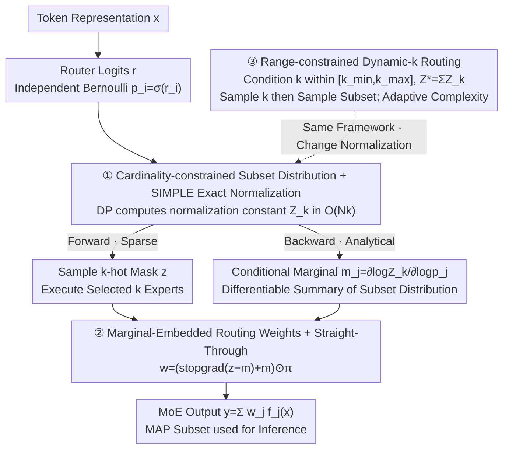

# ProbMoE: Differentiable Probabilistic Routing for Mixture-of-Experts

**Conference**: ICML 2026  
**arXiv**: [2606.01509](https://arxiv.org/abs/2606.01509)  
**Code**: https://github.com/HengHugoZhao/ProbMoE.git (Available)  
**Area**: LLM Efficiency / MoE Routing  
**Keywords**: Mixture-of-Experts, Probabilistic Routing, Subset Sampling, SIMPLE Gradient Estimator, Dynamic Expert Allocation

## TL;DR
ProbMoE reformulates MoE top-$k$ routing as "probabilistic inference over a cardinality-constrained subset distribution." It employs the SIMPLE estimator for sampling from an exact-$k$ subset distribution during the forward pass and uses analytically computed conditional marginal probabilities $m_j=\partial \log Z_k/\partial \log p_j$ as a differentiable proxy for discrete selection during the backward pass. This approach significantly improves performance on tasks like GSM8K, Law, and Translation for OLMoE and Qwen1.5-MoE while enhancing expert utilization. It also naturally extends to a Dynamic-$k$ variant that adaptively activates the number of experts based on token difficulty.

## Background & Motivation
**Background**: Sparse MoE models achieve scaling where "total parameters far exceed active compute" by activating only $k$ experts per token (e.g., Switch Transformer, GLaM, DeepSeek-MoE). The core component is a softmax router combined with a top-$k$ selector.

**Limitations of Prior Work**: The top-$k$ operator is discrete and piecewise constant, yielding zero gradients with respect to router logits almost everywhere. Standard training treats the selected subset $S_{\text{top-}k}$ as a forward-pass constant and backpropagates gradients only through the softmax weights $\pi_j$ of selected experts, discarding the "discrete-selection path." Consequently, the router receives no learning signal regarding unselected alternatives, leading to increasingly peaky routing distributions, reinforced selection of a few experts, expert collapse, and training instability.

**Key Challenge**: The router needs to learn a *discrete combinatorial object* ($k$-subset selection). Existing methods either use heuristic noise/rearrangement to approximate stochasticity (e.g., Shazeer et al.) or use dense STE (e.g., DenseMixer) to provide gradients over selected experts. These approaches "patch" deterministic top-$k$ selection rather than explicitly modeling the "distribution over $k$-subsets," failing to systematically explore alternative subsets.

**Goal**: (i) Rewrite the router training objective as the expected loss under a *subset distribution* $\mathcal{J}(\theta)=\mathbb{E}_{S\sim\mathbb{P}_r(\cdot\mid|S|=k)}[\mathcal{L}(y_S(x;r))]$; (ii) provide gradients reflecting the entire subset distribution while maintaining the activation of only $k$ experts; (iii) generalize the framework to dynamic-$k$ ($k\in[k_{\min},k_{\max}]$).

**Key Insight**: The author notes that the SIMPLE estimator (Ahmed et al. 2023) can compute exact normalization for a Bernoulli product distribution constrained to "exactly $k$ selections" in $\mathcal{O}(Nk)$ time and provide analytical conditional marginal probabilities $m_j$. By treating each expert selection as an independent Bernoulli variable $p_i=\sigma(r_i)$ conditioned on $|S|=k$, routing becomes an "exactly normalizable probabilistic layer with analytical marginals."

**Core Idea**: Replace "top-$k$ + softmax-only gradient path" with *"sampling from a $k$-cardinality subset distribution + backward proxy via conditional marginals."* This transforms routing into truly differentiable discrete probabilistic inference. The same normalization constant can be extended to range-constrained $Z^*=\sum_{k=k_{\min}}^{k_{\max}} Z_k$ to derive the Dynamic-$k$ version.

## Method

### Overall Architecture
Given $N$ experts, token hidden state $x\in\mathbb{R}^d$, router logits $r=\mathrm{Router}_\theta(x)\in\mathbb{R}^N$, and softmax weights $\pi_i=\exp(r_i)/\sum_j\exp(r_j)$, the MoE output for a subset $S$ is $y_S(x;r)=\sum_{j\in S}\pi_j f_j(x)$. ProbMoE replaces deterministic top-$k$ selection with probabilistic inference: independent Bernoulli variables $p_i=\sigma(r_i)$ are conditioned on cardinality constraints (exact-$k$ or range $[k_{\min},k_{\max}]$) to form the subset distribution $\mathbb{P}_r(S\mid\cdot)$. Forward pass samples a $k$-hot mask to activate exactly $k$ experts (equivalent compute to standard MoE). Backward pass transmits the dependence of the whole distribution on each logit via analytical marginals $m_j$, enabling alternative subsets to participate in learning.

### Key Designs

**1. Cardinality-constrained Subset Distribution + SIMPLE Normalization: Converting Routing to an Exactly Normalizable Probabilistic Layer**

The traditional top-$k$ operator is piecewise constant with zero gradients. To make routing a "learnable discrete object," the probability of "selecting exactly $k$ experts" must be defined explicitly. ProbMoE constructs a product measure from independent Bernoulli $p_i=\sigma(r_i)$ and conditions it on $|S|=k$, yielding $\mathbb{P}_r(S\mid|S|=k)=Z_k^{-1}\prod_{j\in S}p_j\prod_{j\notin S}(1-p_j)$, where $Z_k=\sum_{|S|=k}\prod_{j\in S}p_j\prod_{j\notin S}(1-p_j)$ sums over all $\binom{N}{k}$ subsets. Enumeration is avoided using the SIMPLE estimator, which utilizes 1D convolutional dynamic programming to compute $Z_k$ recursively in $\mathcal{O}(Nk)$ (vectorized $\mathcal{O}(\log N\log k)$). Unlike Gumbel-Softmax or Concrete relaxations, which are biased or high-variance and cannot enforce hard cardinality, SIMPLE's DP normalization makes "exact probabilistic inference over combinatorial spaces" feasible for MoE routers. Generalization to range constraints simply replaces $Z_k$ with $Z^*=\sum_{k=k_{\min}}^{k_{\max}} Z_k$.

**2. Marginal-Embedded Routing Weights + Straight-Through Backward: Forward Sparsity with Distribution-wide Gradients**

ProbMoE uses conditional marginals $m_j=\mathbb{P}_r(j\in S\mid|S|=k)=\partial\log Z_k/\partial\log p_j$ as a differentiable "summary" of discrete selection. Through STE, the sampling mask $z$, marginal $m$, and softmax $\pi$ are combined into routing weights:

$$w=(\operatorname{stopgrad}(z-m)+m)\odot\pi.$$

Forward weights $w_i=z_i\pi_i$ are non-zero only for sampled experts, maintaining sparsity. Backward gradients decompose into $\partial\mathcal{L}/\partial r_i=\sum_j\langle\partial\mathcal{L}/\partial y,f_j(x)\rangle(m_j\,\partial\pi_j/\partial r_i+\pi_j\,\partial m_j/\partial r_i)$, where the "marginal path" backpropagates the subset distribution's dependency on logits. Ablations (Fig. 2) show that only the consistent "Sample (Forward) + Marginal (Backward)" pair achieves optimal results (e.g., 50.24% EM on GSM for OLMoE); using "Sample + Dense STE" drops performance to 46.6% with high variance, highlighting the importance of consistency in the probabilistic framework.

**3. Range-constrained Dynamic-$k$ Routing: Adaptive Expert Allocation via the Same Framework**

Fixed $k$ treats all tokens equally, though simpler tokens require fewer experts. ProbMoE generalizes exact-$k$ to a conditional distribution allowing $|S|\in[k_{\min},k_{\max}]$. Since $Z^*=\sum_{k=k_{\min}}^{k_{\max}}Z_k$, sampling first selects cardinality $k$ from the marginal $\mathbb{P}_r(|S|=k\mid\cdot)=Z_k/Z^*$ and then samples the subset. The backward pass uses the range-constrained marginal $m_j^*=\partial\log Z^*/\partial\log p_j$. Table 2 demonstrates that Dynamic-$k$ on OLMoE/Qwen achieves comparable or higher EM than Exact-$k$ while activating only 75–84% of experts. Fig. 5/6 reveal that the router adaptively assigns more experts to ambiguous or rare tokens (e.g., punctuation, suffixes like `ons`) and fewer to common nouns/numbers.

## Loss & Training
The objective is the expected loss over the subset distribution $\mathcal{J}(\theta)=\mathbb{E}_{S\sim\mathbb{P}_r}[\mathcal{L}(y_S(x;r))]$. ProbMoE approximates the gradient using weights from Eq. (7). While $p_i=\sigma(r_i)$ and softmax $\pi$ originate from the same logits, they serve distinct roles in subset sampling and weight scaling. Experiments follow the protocol of DenseMixer (Yao et al. 2026), replacing only the routing module for fair comparison.

## Key Experimental Results

### Main Results
Evaluated on OLMoE-1B-7B (16 layers, 64 experts, top-8) and Qwen1.5-MoE-A2.7B (24 layers, 60 routed + 4 shared experts, top-4).

| Backbone | Method | GSM | Law | Translation | MBPP | Summary | MMLU |
|---|---|---|---|---|---|---|---|
| OLMoE (k=8) | Conventional | 45.94 | 25.00 | 27.56 | 23.20 | 33.70 | 54.04 |
| OLMoE (k=8) | DenseMixer | 47.00 | 27.90 | 30.32 | **24.40** | 37.50 | 53.95 |
| OLMoE (k=8) | **ProbMoE** | **50.19** | **29.00** | **31.63** | 22.80 | **39.29** | 53.69 |
| Qwen (k=4) | Conventional | 53.30 | 29.50 | 30.00 | 32.80 | 39.00 | 61.03 |
| Qwen (k=4) | DenseMixer | **54.97** | 30.75 | 33.75 | 34.00 | 41.00 | 61.03 |
| Qwen (k=4) | SparseMixer | 1.30 | 3.40 | 3.50 | 0.00 | 2.10 | – |
| Qwen (k=4) | ReMoE | 46.30 | 25.50 | 16.99 | 33.00 | 25.80 | – |
| Qwen (k=4) | **ProbMoE** | 53.29 | **34.40** | **39.23** | **35.00** | **44.40** | **61.05** |

ProbMoE outperformed baselines in 4/6 tasks on OLMoE and 4/6 tasks on Qwen (notably improving Law and Translation by >5 points). It consistently beats DenseMixer without requiring dense expert computation during training.

### Ablation Study

| Config (OLMoE/GSM) | Forward | Backward | EM (%) | Var σ |
|---|---|---|---|---|
| ProbMoE | Sample ($k$-subset) | Marginal | **50.24** | **0.09** |
| DenseMixer | Top-$k$ | Dense STE | ~47 | Mid |
| Sample + Dense STE | Sample | Dense STE | 46.6 | 0.37 |

| Setting | Dataset | $\Delta$EM vs Exact-$k$ | Avg Expert Usage |
|---|---|---|---|
| Dynamic-$k$ (OLMoE) | Translation | +0.36 | 82.00% |
| Dynamic-$k$ (Qwen1.5) | Law | **+2.70** | 75.00% |

### Key Findings
- **Forward-Backward Alignment**: Gains stem from the self-consistency of "Forward Sampling + Backward Marginal Inference" from the same distribution, rather than randomness alone.
- **Expert Utilization**: ProbMoE exhibits higher routing entropy and lower Top-4 mass (Fig. 4), indicating more distributed routing and better specialization.
- **Training/Inference Mismatch**: Conventional models trained with fixed $k$ exhibit peaky distributions that perform poorly under dynamic MAP inference. ProbMoE's explicit modeling maintains performance in adaptive settings.
- **Semantic Computing**: Dynamic-$k$ allocates more experts to difficult/context-sensitive tokens (punctuation) and fewer to concrete nouns, matching human intuition of task difficulty.

## Highlights & Insights
- **"Modelling over Estimation"**: The bottleneck in routing gradients is modeling the $k$-subset as a distribution parameter rather than just scaling selected outputs.
- **SIMPLE Landing**: First application of cardinality-constrained Bernoulli DP normalization in MoE, offering a "probabilistic layer" that could generalize to sparse attention or active learning.
- **"Free" Dynamic-$k$**: Converting exact constraints to range constraints is mathematically elegant and architecturally simple within this framework.

## Limitations & Future Work
- **Lack of Pre-training**: Experiments were performed during SFT; pre-training scale verification is pending.
- **System-level Speedup**: While expert activation is reduced, wall-clock speedup depends on specialized kernel support for dynamic expert parallelism.
- **Task Specificity**: Marginal gains on MMLU suggest ProbMoE is more effective for reasoning/generation than knowledge retrieval.

## Related Work & Insights
- **vs DenseMixer (2026)**: DenseMixer uses top-$k$ forward with dense expert backward. ProbMoE maintains sparse experts throughout, using the subset distribution to provide "dense" signals to the router.
- **vs SparseMixer / ReMoE**: SparseMixer's sparse-gradient mask and ReMoE's ReLU routing proved unstable on larger backbones, whereas ProbMoE's discrete-yet-differentiable approach remained robust.
- **vs Gumbel-Softmax**: SIMPLE provides exact normalization and marginals for hard cardinality constraints, which continuous relaxations cannot achieve cleanly.

## Rating
- Novelty: ⭐⭐⭐⭐⭐ (Formulates MoE as subset distribution inference).
- Experimental Thoroughness: ⭐⭐⭐⭐ (Extensive tasks and analysis, but lacks large-scale pre-training).
- Writing Quality: ⭐⭐⭐⭐⭐ (Clear derivations and intuitions).
- Value: ⭐⭐⭐⭐⭐ (Provides a principled, stackable routing component).

<!-- RELATED:START -->

## Related Papers

- [\[ICML 2026\] Skill-Based Mixture-of-Experts: Adaptive Routing for Heterogeneous Reasoning via Inferred Skills](skill-based_mixture-of-experts_adaptive_routing_for_heterogeneous_reasoning_via_.md)
- [\[ICML 2026\] Hyperparameter Transfer with Mixture-of-Experts Layers](hyperparameter_transfer_with_mixture-of-expert_layers.md)
- [\[ICML 2025\] Mixture of Lookup Experts](../../ICML2025/llm_efficiency/mixture_of_lookup_experts.md)
- [\[AAAI 2026\] How Many Experts Are Enough? Towards Optimal Semantic Specialization for Mixture-of-Experts](../../AAAI2026/llm_efficiency/how_many_experts_are_enough_towards_optimal_semantic_specialization_for_mixture-.md)
- [\[ICML 2026\] RepetitionCurse: Measuring and Understanding Router Imbalance in Mixture-of-Experts LLMs under DoS Stress](repetitioncurse_measuring_and_understanding_router_imbalance_in_mixture-of-exper.md)

<!-- RELATED:END -->
