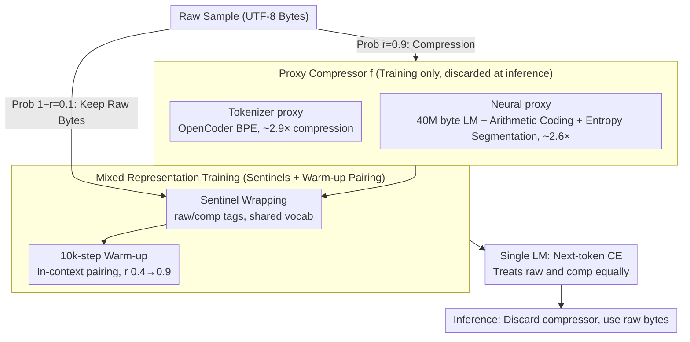

# Proxy Compression for Language Modeling

**Conference**: ICML 2026  
**arXiv**: [2602.04289](https://arxiv.org/abs/2602.04289)  
**Code**: https://github.com/LZhengisme/proxy-compression (Available)  
**Area**: LLM Efficiency / Byte-level Modeling / Tokenization Alternatives  
**Keywords**: byte-level LM, tokenizer-free inference, mixed-representation training, arithmetic coding, neural compressor

## TL;DR
The authors propose "proxy compression"—training where 90% of data is fed as short sequences produced by a tokenizer/neural compressor and 10% as raw UTF-8 bytes, coupled with sentinel tokens and a brief in-context translation warm-up. During inference, all compressors are discarded, and the model processes only raw bytes; yet, it significantly outperforms pure byte-level models under fixed compute and matches or exceeds tokenizer baselines at larger scales.

## Background & Motivation
**Background**: Modern LMs are almost entirely built on "fixed external tokenizers"—BPE/SentencePiece compresses UTF-8 bytes into tokens to keep training lengths manageable. Arithmetic coding with small byte LMs falls into the same category of compression. While tokenizers maximize training efficiency, tokens are permanently welded into the model interface.

**Limitations of Prior Work**: This hard-coupling brings well-documented side effects: prompt-boundary issues, retokenization drift, "glitch tokens" (e.g., "SolidGoldMagikarp"), bias against low-resource languages, and poor adversarial robustness. More fundamentally, the model only learns the statistics of the token space rather than being a true end-to-end byte modeler. Pure byte training solves these issues, but sequence lengths increase severalfold, causing a massive reduction in the amount of data processed under the same compute budget and poor convergence compared to tokenizer models.

**Key Challenge**: Training efficiency (short sequences) $\leftrightarrow$ Inference flexibility (byte-level interface) $\leftrightarrow$ Robustness—existing solutions can only achieve two out of three. Tokenizer models take the first two; pure byte models take the last two. No current approach achieves all three.

**Goal**: Retain the training efficiency of "compressed short sequences" while allowing the inference side to run entirely on raw UTF-8 without architectural modifications (same parameters, no tokenizer, same attention), with the benefit scaling as the model size increases.

**Key Insight**: Treat external compressors as "training proxies" rather than permanent interfaces. During training, a single model learns both representations simultaneously and establishes an internal mapping; during inference, the compressor is discarded, leaving only bytes. The critical observation is that large models are capable of internalizing this cross-representation alignment into their weights.

**Core Idea**: Use a shared vocabulary with `<comp>/<raw>` sentinels, perform mixed-representation next-token prediction, and use in-context translation pairing as a warm-up for the first 10k steps; inference is pure byte-level.

## Method

### Overall Architecture
The core idea is to let the same model ingest both "compressed short sequences" and "raw bytes" during training to establish an internal mapping in the weights. This allows the compressor to be completely removed during inference. The pipeline is as follows: for every sample $x_{\text{raw}}$, it is replaced with a compressed stream $x_{\text{comp}}=f(x_{\text{raw}})$ with probability $r$ (default 0.9), or otherwise kept as raw bytes. Each segment is wrapped with `<raw>/<comp>` sentinels to indicate the representation type. The first 10k steps serve as a warm-up, where two views of the same sample are concatenated in-context for pairing, and $r$ linearly increases from 0.4 to 0.9. After warm-up, pairing is disabled, and $r$ is fixed at 0.9. Inference is fed only raw bytes. All three components share a single vocabulary: the first 64 indices are for sentinels, the next 256 for UTF-8 bytes, and the rest for compressed symbols (OpenCoder BPE uses 96,640, neural uses 16-bit packs for 65,536 symbols, and gzip uses 256).

### Key Designs

**1. Tokenizer-based proxy: Treating existing BPE as a simple training compressor**

The most direct instantiation is putting a standard BPE tokenizer as the training proxy. Raw bytes are compressed offline into token indices to serve as $x_{\text{comp}}$. OpenCoder BPE is used here, providing an average compression ratio of $\sim 2.9\times$. These tokens are fed into the model just like a standard tokenizer model, with the only difference being their appearance within `<comp>` tags and the 10% probability of being replaced by raw bytes. Tokenizers are chosen as the first candidate because their output is extremely stable—perturbations like 10% character deletion barely affect Levenshtein distance—making it easy for the LM to learn the "comp $\leftrightarrow$ raw" mapping.

**2. Neural proxy + Entropy windowing: Better entropy coding with parallel feasibility**

While tokenizers are heuristic BPE products, neural compressors can theoretically perform better. The second proxy uses a 40M byte-level LM with arithmetic coding to achieve near-optimal entropy coding, reaching a $\sim 2.6\times$ compression ratio. However, serial byte-by-byte encoding is too slow for 3.3 TB of data. To solve this, "entropy windowing" is introduced: the LM calculates per-byte entropy, and high-entropy positions are used as boundaries to split the stream into segments for independent parallel compression. Notably, while the mapping is a deterministic injection for raw $\to$ comp, it is not perfectly injective in reverse: different raw chunks might map to the same comp segment (i.e., "fuzzy"). However, 90%+ of colliding raw chunks share an $\text{LCP} \geq 0.8$, with differences usually in low-entropy tails like whitespace. This "structured fuzziness" acts as a regularizer, improving robustness.

**3. In-context pairing + Sentinels + High-$r$ warm-up: Internalizing alignment without inference dependency**

The challenge is internalizing the comp $\leftrightarrow$ raw alignment without making inference dependent on seeing the compressed form. Three mechanisms work together: first, sentinels explicitly signal the representation type, allowing next-token prediction to be conditioned on it. Second, the warm-up phase concatenates $[\langle\text{raw}\rangle x_{\text{raw}}\langle/\text{raw}\rangle\langle\text{comp}\rangle x_{\text{comp}}\langle/\text{comp}\rangle]$ in the same context to force the model to see both views. Third, pairing is disabled immediately after warm-up to prevent the model from developing a dependence on seeing the compressed prefix. Increasing $r$ from 0.4 to 0.9 prevents the model from seeing too few raw bytes early on, which would hinder alignment learning. This compromise was found through ablation: without pairing, oracle-translation Pass@1 is only 30-46%; with always-on pairing, it exceeds 95% but harms raw-byte performance as the model becomes dependent on the pairing.

### Loss & Training
The loss function is standard next-token cross-entropy (CE), applied uniformly to both raw and compressed segments. The architecture uses EvaByte (efficient multi-byte prediction). Training runs for 50k steps with a 2M symbol batch size, covering 0.5B, 1.5B, 4B, 7B, and 14B parameter scales.

## Key Experimental Results

### Main Results
Under a fixed 100B symbol training budget (roughly matched compute), Pass@1 on HumanEval-Plus / MBPP-Plus:

| Task | Model | 0.5B | 1.5B | 4B | 7B | 14B |
|------|------|------|------|----|----|-----|
| HumanEval-Plus | Tokenizer | 17.7 | 18.3 | 28.0 | 28.7 | 29.3 |
|  | Byte-level | 15.9 | 18.3 | 22.0 | 23.8 | 24.4 |
|  | Proxy (Neural) | 13.4 | 18.3 | 22.6 | 26.8 | 29.9 |
|  | Proxy (Tokenizer) | 12.2 | 20.7 | 24.4 | 26.2 | **30.5** |
| MBPP-Plus | Tokenizer | 29.4 | 41.0 | 46.3 | 45.2 | 48.1 |
|  | Byte-level | 25.9 | 33.6 | 41.8 | 41.3 | 42.1 |
|  | Proxy (Neural) | 22.0 | 29.6 | 41.8 | 41.8 | **49.2** |
|  | Proxy (Tokenizer) | 25.4 | 38.4 | 44.4 | 45.5 | **49.5** |

Proxy models overtake pure byte-level models at $\geq 1.5$B and surpass tokenizer baselines at 14B, showing that transfer efficiency scales with size.

### Ablation Study

| Configuration | HumanEval-Plus Pass@1 (1.5B) | Remarks |
|------|-------------------------------|------|
| Always-on pairing | 17.0 | Oracle-translation 96%, but ordinary performance drops |
| Warmup-only (Default) | **20.7** | Ensures alignment without creating dependency |
| No pairs | 17.0 | No explicit cross-rep signal |
| Gzip proxy | < Byte-level | Unstable stream, impossible to transfer |
| Tokenizer / Neural proxy | Significant gain | Stable + structured |

### Key Findings
- **Scale Correlation**: Proxy gain is strongly positively correlated with model size. At 0.5B, transfer is weak or negative; at 14B, it crushes both byte-level and tokenizer baselines.
- **Compressor Stability**: Stability is the key to transfer. Tokenizers have the lowest Levenshtein distance under noise, followed by neural proxies; gzip has the highest and fails completely.
- **Inherited Robustness**: On ReCode perturbations (function rewrite/format/syntax/docstring), the 7B proxy model achieves a Robust Pass@1 of 19.1 (neural) vs the tokenizer baseline of 14.9.
- **Internalization vs. Context**: Always-on pairing boosts context-based translation to 95%+ but lowers raw-byte performance—suggesting "translating in context" and "internalizing in weights" are distinct paths, with the latter being the key to downstream raw-byte success.

## Highlights & Insights
- Decoupling the external compressor as a "training proxy" that is discarded at inference is a brilliant idea. This paradigm can be extended to any "external encoder + internal modeler" structure, such as VAEs in latent diffusion or codecs in audio.
- Using sentinel tokens to explicitly mark different representations for the model is far simpler than designing multi-branch or multi-decoder architectures.
- "Structured fuzziness" is a counter-intuitive discovery: the slight irreversibility of neural compressors acts as a form of regularization, abstracting away format noise and yielding robustness exceeding that of lossless tokenizers.

## Limitations & Future Work
- Experiments were primarily conducted on code corpora (RefineCode). While 1.5B results were verified on natural language, the transfer effect in multilingual and low-resource settings needs further study.
- Total vocabulary size is byte (256) + tokenizer (96K) + sentinels, which increases embedding table memory overhead. The neural proxy also requires training and maintaining an additional 40M byte LM.
- Inference speed comparison is missing: while the tokenizer is removed, pure byte inference sequences are longer ($\sim 2.9\times$). Whether EvaByte's multi-byte prediction fully offsets this needs quantification.
- The model sees fewer total bytes than a pure byte model during training—while fixed-FLOPs comparison is fair, performance under fixed data volume constraints remains to be investigated.

## Related Work & Insights
- **vs. Lester 2024 (Neural arithmetic coding LM)**: They use neural compressed streams as the final training + inference representation; this paper uses them only as a training proxy.
- **vs. EvaByte / ByT5 / MegaByte**: Extensions of pure byte-level modeling. This work shares byte-level inference but improves training efficiency by orders of magnitude.
- **vs. Tokenizer + Raw mixing**: It resembles token-byte mixed training, but the combination of sentinels, warm-up pairing, and high $r$ is the critical differentiator.

## Rating
- **Novelty**: ⭐⭐⭐⭐ The perspective of "compressor as a training proxy only" is fresh and practical.
- **Experimental Thoroughness**: ⭐⭐⭐⭐ Spans 5 scales, 3 types of proxies, and multiple robustness probes.
- **Writing Quality**: ⭐⭐⭐⭐ Clear storyline with intuitive scaling curves.
- **Value**: ⭐⭐⭐⭐ Opens a viable path for the byte-level inference direction, which has long been suppressed by efficiency concerns.

<!-- RELATED:START -->

## Related Papers

- [\[ICLR 2026\] KnowProxy: Adapting Large Language Models by Knowledge-guided Proxy](../../ICLR2026/llm_efficiency/knowproxy_adapting_large_language_models_by_knowledge-guided_proxy.md)
- [\[ICLR 2026\] Autoencoding-Free Context Compression for LLMs via Contextual Semantic Anchors](../../ICLR2026/llm_efficiency/autoencoding-free_context_compression_for_llms_via_contextual_semantic_anchors.md)
- [\[ICLR 2026\] ThinKV: Thought-Adaptive KV Cache Compression for Efficient Reasoning Models](../../ICLR2026/llm_efficiency/thinkv_thought-adaptive_kv_cache_compression_for_efficient_reasoning_models.md)
- [\[ICLR 2026\] RMAAT: Astrocyte-Inspired Memory Compression and Replay for Efficient Long-Context Transformers](../../ICLR2026/llm_efficiency/rmaat_astrocyte-inspired_memory_compression_and_replay_for_efficient_long-contex.md)
- [\[ICML 2026\] RePo: Language Models with Context Re-Positioning](repo_language_models_with_context_re-positioning.md)

<!-- RELATED:END -->
