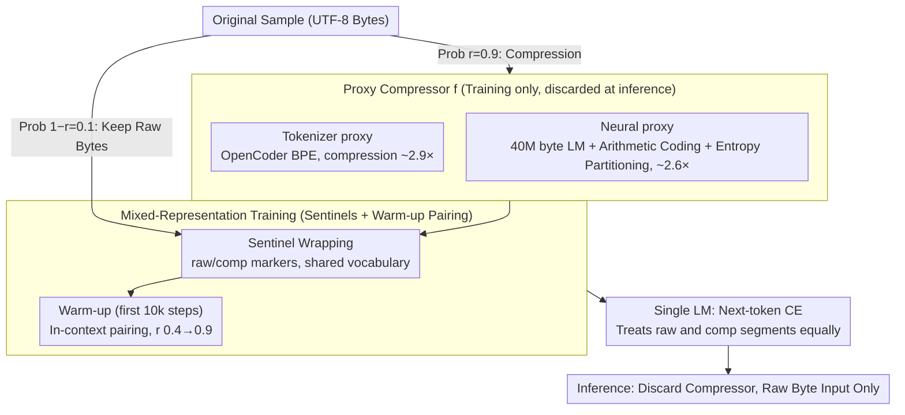

# Proxy Compression for Language Modeling

**Conference**: ICML 2026  
**arXiv**: [2602.04289](https://arxiv.org/abs/2602.04289)  
**Code**: https://github.com/LZhengisme/proxy-compression (Available)  
**Area**: LLM Efficiency / Byte-level Modeling / Tokenizer Replacement  
**Keywords**: byte-level LM, tokenizer-free inference, mixed-representation training, arithmetic coding, neural compressor

## TL;DR
The authors propose "proxy compression"—training a model where 90% of the data is fed as short sequences produced by a tokenizer or neural compressor and 10% as raw UTF-8 bytes, combined with sentinel tokens and a brief in-context translation warm-up. During inference, all compressors are discarded, and the model operates solely on raw bytes. This approach significantly outperforms pure byte-level models under fixed compute and matches or exceeds tokenizer baselines at large scales.

## Background & Motivation
**Background**: Modern LMs are almost entirely built on "external fixed tokenizers." Methods like BPE or SentencePiece compress UTF-8 bytes into tokens to keep training sequence lengths manageable. Arithmetic coding combined with small byte-level LMs follows a similar compression logic. While tokenizers maximize training efficiency, they permanently bind the token space to the model interface.

**Limitations of Prior Work**: Hardwired tokenizers cause numerous documented side effects: prompt-boundary issues, retokenization drift, "glitch tokens" (e.g., "SolidGoldMagikarp"), low-resource language bias, and poor adversarial robustness. Fundamentally, these models learn the statistics of the token space rather than acting as true end-to-end byte modelers. While pure byte-level training solves these issues, it multiplies sequence lengths, significantly reducing data throughput and convergence speed under a fixed compute budget.

**Key Challenge**: There is a three-way trade-off between training efficiency (short sequences), inference flexibility (byte-level interface), and robustness. Existing solutions typically only satisfy two: tokenizer models provide efficiency and flexibility at the cost of robustness, while pure byte models provide flexibility and robustness at the cost of efficiency. No prior scheme achieves all three simultaneously.

**Goal**: Retain the training efficiency of "compressed short sequences" while allowing the inference side to run entirely on raw UTF-8 bytes. The objective is to achieve this without architectural modifications (no changes to the transformer, tokenizer, or attention mechanism) and to ensure that benefits scale with model size.

**Key Insight**: External compressors should be treated as "training-time proxies" rather than permanent interfaces. During training, a single model learns both representations concurrently to establish internal mappings. At inference, the compressor is discarded. The core observation is that large-scale models are capable of internalizing this cross-representation alignment within their weights.

**Core Idea**: Use a shared vocabulary with `<comp>/<raw>` sentinels to perform mixed-representation next-token prediction. An in-context translation pairing warm-up is conducted for the first 10k steps, while inference remains purely byte-based.

## Method

### Overall Architecture
The core concept is to have the same model process both "compressed short sequences" and "raw bytes" during training. By establishing an internal mapping in the weights, the compressor can be discarded at inference, allowing the model to run on raw UTF-8. The pipeline is as follows: for each sample $x_{\text{raw}}$, it is replaced by a compressed stream $x_{\text{comp}}=f(x_{\text{raw}})$ with probability $r$ (default 0.9); otherwise, the raw bytes are kept. Each segment is wrapped in `<raw>` or `<comp>` sentinels. During the first 10k steps (warm-up), both views of the same sample are concatenated in-context for pairing, with $r$ linearly increasing from 0.4 to 0.9. After warm-up, pairing is disabled, and $r$ is fixed at 0.9. Inference only uses raw bytes. All representations share a single vocabulary: indices 0–63 for sentinels, 64–319 for UTF-8 bytes, and the remainder for compressed symbols (e.g., 96,640 for BPE or 65,536 for 16-bit neural packs).

### Key Designs

**1. Tokenizer-based proxy: Using BPE as the simplest training-time compressor**
The most straightforward implementation is to use an existing tokenizer to compress raw bytes into token indices as $x_{\text{comp}}$. This utilizes the OpenCoder BPE with an average compression ratio of $\sim 2.9\times$. The tokens are fed into the model under the `<comp>` tag. This proxy is highly stable; perturbations like 10% character deletion result in minimal Levenshtein distance changes, making it easy for the LM to learn the "comp $\leftrightarrow$ raw" mapping. It can be preprocessed offline with zero additional training cost.

**2. Neural proxy + Entropy Partitioning: Optimal entropy coding via neural compressors**
While BPE is heuristic, a neural compressor can achieve better optimality. This proxy uses a 40M byte-level LM with arithmetic coding to perform near-optimal entropy coding ($\sim 2.6\times$ compression). To overcome the bottleneck of serial byte-by-byte encoding for large corpora (3.3 TB), the authors introduce "entropy partitioning." High-entropy positions identified by the small LM act as segment boundaries for independent parallel compression. Notably, this "fuzzy" mapping (where different raw chunks might map to similar comp segments in low-entropy regions like whitespace) acts as a form of structural regularization, improving robustness.

**3. In-context pairing + sentinel + high $r$ warm-up: Internalizing alignment**
To ensure the model internalizes the alignment without becoming dependent on the compressor at inference, three mechanisms are used: 1) `<raw>/<comp>` sentinels condition next-token prediction on the representation type; 2) The warm-up phase concatenates $[\langle\text{raw}\rangle x_{\text{raw}}\langle/\text{raw}\rangle\langle\text{comp}\rangle x_{\text{comp}}\langle/\text{comp}\rangle]$ in the same context to force cross-view learning; 3) Pairing is disabled immediately after warm-up to prevent dependency. Increasing $r$ from 0.4 to 0.9 prevents the model from seeing too few raw bytes early on. Ablations show that "warm-up only" is optimal, as "always-on pairing" makes the model reliant on the compressed prefix during inference.

### Loss & Training
The objective is standard next-token cross-entropy (CE) loss, applied equally to raw and compressed segments. The architecture uses EvaByte (efficient multi-byte prediction). Training runs for 50k steps with a 2M symbol batch size, across scales of 0.5B, 1.5B, 4B, 7B, and 14B parameters.

## Key Experimental Results

### Main Results
Using a fixed 100B symbol training budget (matched compute), the pass@1 results for HumanEval-Plus / MBPP-Plus are:

| Task | Model | 0.5B | 1.5B | 4B | 7B | 14B |
|------|------|------|------|----|----|-----|
| HumanEval-Plus | Tokenizer | 17.7 | 18.3 | 28.0 | 28.7 | 29.3 |
|  | Byte-level | 15.9 | 18.3 | 22.0 | 23.8 | 24.4 |
|  | Proxy (Neural) | 13.4 | 18.3 | 22.6 | 26.8 | 29.9 |
|  | Proxy (Tokenizer) | 12.2 | 20.7 | 24.4 | 26.2 | **30.5** |
| MBPP-Plus | Tokenizer | 29.4 | 41.0 | 46.3 | 45.2 | 48.1 |
|  | Byte-level | 25.9 | 33.6 | 41.8 | 41.3 | 42.1 |
|  | Proxy (Neural) | 22.0 | 29.6 | 41.8 | 41.8 | **49.2** |
|  | Proxy (Tokenizer) | 25.4 | 38.4 | 44.4 | 45.5 | **49.5** |

Proxy models outperform pure byte models starting at 1.5B parameters and exceed tokenizer baselines at the 14B scale, demonstrating that transfer efficiency increases with model size.

### Ablation Study

| Configuration | HumanEval-Plus pass@1 (1.5B) | Remarks |
|------|-------------------------------|------|
| Always-on pairing | 17.0 | High oracle-translation (96%), but lower ordinary pass@1 |
| Warmup-only (Default) | **20.7** | Ensures alignment without creating dependency |
| No pairs | 17.0 | No explicit cross-representation signal |
| Gzip proxy | < Byte-level | Unstable stream; transfer fails |
| Tokenizer / Neural proxy | Significant gain | Stable and structured |

### Key Findings
- **Scaling Correlation**: Proxy gains are strongly correlated with model size. While 0.5B models show weak or negative transfer, 14B models crush both byte and tokenizer baselines.
- **Compressor Stability**: Stability is the prerequisite for transfer. Tokenizers have the lowest Levenshtein distance variance, neural compressors are intermediate, and Gzip is the highest. Only the former two succeed.
- **Inherited Robustness**: On ReCode perturbations (format/syntax/docstring changes), the 7B proxy (Neural) achieves a Robust Pass@1 of 19.1 compared to 14.9 for the tokenizer baseline, showing almost no degradation on format/docstring tasks.
- **Context vs. Weights**: Always-on pairing improves in-context translation but hurts raw-byte downstream performance, suggesting that "internalizing in weights" and "translating in context" are distinct learning paths.

## Highlights & Insights
- The decoupling of training efficiency from the inference interface is a powerful concept that can be generalized to latent diffusion VAEs or audio codecs.
- Using sentinels to explicitly mark representations is significantly simpler than multi-branch or multi-decoder architectures for multi-modal or multi-representation training.
- "Structured fuzziness" in neural compressors acts as a useful regularizer, abstracting away formatting noise and potentially making the model more robust than lossless tokenizers.

## Limitations & Future Work
- The experiments primarily focus on code (RefineCode). The effectiveness for low-resource languages or broader natural language tasks requires more validation at scale.
- Memory overhead for the shared vocabulary (token indices + raw bytes + sentinels) is slightly higher.
- Final inference speed was not extensively detailed; while the tokenizer is removed, raw byte sequences are $\sim 2.9\times$ longer. The extent to which multi-byte prediction (EvaByte) offsets this remains to be quantified.
- In fixed FLOPs comparisons, the model sees fewer total bytes than a pure byte model. Its performance in purely data-constrained scenarios is still an open question.

## Related Work & Insights
- **vs. Lester 2024**: That work uses neural compressed streams as the final representation for both training and inference. This paper uses them only as a training proxy.
- **vs. EvaByte / ByT5 / MegaByte**: These are advancements in pure byte-level modeling; this work achieves order-of-magnitude better training efficiency.
- **vs. Token-Byte Mixed Training**: While appearing similar to simple mixing, this work demonstrates that the sentinel system, warm-up pairing, and specific $r$ ratios are critical to performance.

## Rating
- **Novelty**: ⭐⭐⭐⭐ Discarding compressors at inference is a fresh and practical perspective.
- **Experimental Thoroughness**: ⭐⭐⭐⭐ Covers 5 scales, 3 proxy types, and multiple robustness probes.
- **Writing Quality**: ⭐⭐⭐⭐ Clear narrative and intuitive scaling curves.
- **Value**: ⭐⭐⭐⭐ Provides a viable path for byte-level modeling to overcome efficiency barriers.

<!-- RELATED:START -->

## Related Papers

- [\[ACL 2025\] GigaChat Family: Efficient Russian Language Modeling Through Mixture of Experts Architecture](../../ACL2025/llm_efficiency/gigachat_family_efficient_russian_language_modeling_through_mixture_of_experts_a.md)
- [\[ICML 2025\] Efficient Length-Generalizable Attention via Causal Retrieval for Long-Context Language Modeling](../../ICML2025/llm_efficiency/efficient_length-generalizable_attention_via_causal_retrieval_for_long-context_l.md)
- [\[ACL 2026\] Native Hybrid Attention for Efficient Sequence Modeling](../../ACL2026/llm_efficiency/native_hybrid_attention_for_efficient_sequence_modeling.md)
- [\[ACL 2026\] CoMeT: Collaborative Memory Transformer for Efficient Long Context Modeling](../../ACL2026/llm_efficiency/comet_collaborative_memory_transformer_for_efficient_long_context_modeling.md)
- [\[ICML 2026\] ProactiveLLM: Learning Active Interaction for Streaming Large Language Models](proactivellm_learning_active_interaction_for_streaming_large_language_models.md)

<!-- RELATED:END -->
