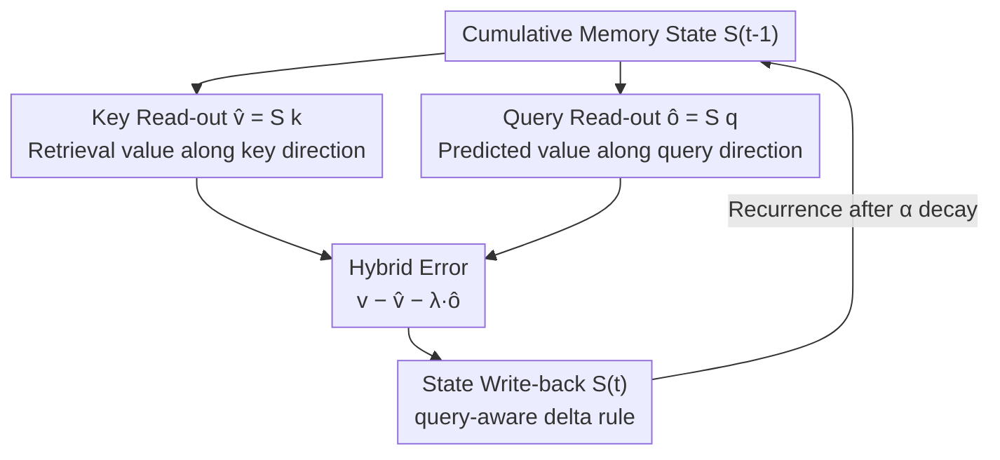

# Q-Delta: Beyond Key–Value Associative State Evolution

**Conference**: ICML2026  
**arXiv**: [2606.08804](https://arxiv.org/abs/2606.08804)  
**Code**: https://github.com/psmiz/Q-Delta  
**Area**: LLM Efficiency · Linear Attention / State Space Models  
**Keywords**: Linear attention, delta rule, query-conditioned feedback, state evolution, long-context retrieval

## TL;DR
This paper challenges the implicit assumption in linear attention that "queries are only responsible for read-out and do not participate in state evolution." It demonstrates that query read-out $\hat{o}_t=S_{t-1}q_t$ itself constitutes a structured value prediction (complementary to key retrieval). Based on this, it proposes **Q-Delta**, which injects the hybrid prediction errors of both keys and queries into the delta rule state update. While maintaining linear time complexity and chunkwise parallel efficiency, Q-Delta consistently outperforms strong baselines such as DeltaNet and GatedDeltaNet in language modeling and long-context retrieval (S-NIAH average 90.0% vs. GatedDeltaNet 83.5%).

## Background & Motivation

**Background**: The softmax self-attention in Transformers has quadratic complexity with respect to sequence length. Linear attention uses a kernel function $\phi(\cdot)$ to rearrange the attention as $\phi(Q)(\phi(K)^\top V)$, thereby maintaining $\phi(K)^\top V$ as an incrementally updated state $S_t=\sum_{i=1}^{t}v_i\phi(k_i)^\top$, with the read-out defined as $o_t=S_t\phi(q_t)$. This is essentially an "associative memory" where information is written via key-value outer products and retrieved via queries.

**Limitations of Prior Work**: Pure additive updates lack a mechanism to "selectively modify or delete stored information." As sequences lengthen, key collisions intensify, and retrieval accuracy degrades. The delta rule (DeltaNet/GatedDeltaNet/Longhorn) mitigates this by using **retrieval error** (the difference between the observed value and the current key-retrieved value) to correct the state, interpreting the update as an online regression for key-value prediction targets.

**Key Challenge**: However, all these linear RNNs share a **structural assumption**: state evolution is dominated exclusively by key-value interactions, while queries are used only once during read-out. This division of labor originates from the original attention formula but implicitly assumes that queries provide no informative contribution to shaping the state dynamics. The authors question: Is the query truly just a passive read-out probe?

**Goal**: To re-evaluate the role of query read-out in recurrent state updates, clarify exactly "what information the query read-out encodes," and design an update rule where the query actively participates in state evolution without compromising the linear efficiency of the delta rule.

**Key Insight**: The authors discovered that the query read-out from the previous state, $\hat{o}_t=S_{t-1}q_t$, can be expressed as a weighted aggregation of **all historical values**, which is formally an "attention over cumulative memory." It exists in the same value space as the key retrieval $\hat{v}_t=S_{t-1}k_t$ but utilizes a different weighting direction. Furthermore, a query is not an arbitrary probe—it represents the direction in which the state is ultimately read ($o_t=S_tq_t$). Thus, $\hat{o}_t$ is a self-prediction made by the model along the "direction where memory is actually consumed by downstream layers."

**Core Idea**: Given that traditional delta rules only correct for key retrieval errors while ignoring "prediction errors in the read-out direction," both key and query **hybrid errors** should be injected into the state update.

## Method

### Overall Architecture
The core of Q-Delta is a modification of the delta rule recurrence. At each step, the cumulative memory state $S_{t-1}$ simultaneously generates two value estimates: the retrieved value along the key direction $\hat{v}_t=S_{t-1}k_t$ and the predicted value along the query direction $\hat{o}_t=S_{t-1}q_t$. These are combined into a **hybrid correction signal** $v_t-\hat{v}_t-\lambda_t\hat{o}_t$, which is then written back to the state using the delta rule. The methodology encompasses four components: theoretical proof that $\hat{o}_t$ is a structured value prediction complementary to $\hat{v}_t$, the Q-Delta update rule, the derivation of a chunkwise parallel form (with a Triton kernel) to preserve hardware efficiency, and the proof of stable convergence for these dynamics.

### Key Designs

**1. Query as Value Prediction: Revealing query read-out as structured aggregation of cumulative memory**

To justify the query's involvement in the update, it must be proven to carry independent information. Considering a general recurrence $S_t=S_{t-1}P_t+\eta_t v_t k_t^\top$ (encompassing linear attention where $P_t=I$, delta rule where $P_t=I-\beta_t k_t k_t^\top$, and gated delta where $P_t=\alpha_t(I-\beta_t k_t k_t^\top)$), expanding the state as a linear combination of historical values yields the query read-out of the previous state:

$$\hat{o}_t=S_{t-1}q_t=\sum_{\tau=1}^{t-1}\langle q_t,\tilde{k}_{\tau,t}\rangle_{\eta_\tau}\,v_\tau,\qquad \tilde{k}_{\tau,t}=\Big(\prod_{j=\tau+1}^{t-1}P_j^\top\Big)k_\tau$$

This implies $\hat{o}_t$ resides in the space spanned by historical values, taking the form of **unnormalized attention**: the current query matches "time-evolved keys" $\tilde{k}_{\tau,t}$ reshaped by subsequent state transitions to mix historical values. It belongs to the same value space as the key read-out $\hat{v}_t=S_{t-1}k_t$ but utilizes query-key similarity rather than key-key self-similarity—providing information "unattainable by key retrieval." Empirical analysis (average cosine similarity between $\hat{o}$ and $\hat{v}$ is $\approx0.07$ on a 340M model) confirms that they are nearly orthogonal and complementary.

**2. Q-Delta Update Rule: Injecting hybrid key–query error into state evolution**

Based on the above, Q-Delta corrects both key retrieval and query prediction errors simultaneously. The sequence recurrence is:

$$S_t=S_{t-1}+\beta_t\big(v_t-\hat{v}_t-\lambda_t\hat{o}_t\big)k_t^\top$$

where $\beta_t\in[0,1]$ controls the write intensity and $\lambda_t\in[0,1]$ modulates the influence of query feedback. After equivalent rewriting and adding a forget gate $\alpha_t$, the final rule is:

$$S_t=\alpha_t S_{t-1}\big(I-\beta_t(k_t k_t^\top+\lambda_t q_t k_t^\top)\big)+\beta_t v_t k_t^\top,\qquad o_t=S_t q_t$$

Compared to GatedDeltaNet, the only addition is the term $\lambda_t q_t k_t^\top$, which allows the state to erase old values in the key direction while performing a correction along the "read-out direction." $\lambda_t$ is a **learnable per-head** query feedback coefficient. Notably, this update does **not** strictly correspond to a gradient descent step of $\|v_t-S_{t-1}(k_t+\lambda q_t)\|^2$, necessitating a separate stability analysis.

**3. Chunkwise Parallelism and Triton Implementation: Preserving hardware efficiency**

While linear recurrence is $\mathcal{O}(LD^2)$, sequential execution is inefficient on GPUs. By defining a hybrid input $x_t:=k_t+\lambda_t q_t$, the Q-Delta recurrence is rewritten as $S_t=\alpha_t S_{t-1}(I-\beta_t x_t k_t^\top)+\beta_t v_t k_t^\top$. This is structurally isomorphic to GatedDeltaNet with $k_t$ replaced by $x_t$. Consequently, the extended WY representation and UT transformation from GatedDeltaNet can be reused to parallelize intra-chunk computation while maintaining inter-chunk recurrence. The provided **Triton kernel** supports both full recurrence and chunkwise parallelism, ensuring throughput remains on par with pure delta baselines.

**4. Stability Guarantees: Proving geometric contraction and global boundedness**

**Lemma 3.1 (One-step Contraction)**: Define hybrid input $x_t=k_t+\lambda_t q_t$ and alignment scalar $a_t=k_t^\top x_t$. If $\beta_t a_t\in(0,2)$, the hybrid prediction error contracts: $\|v_t-S_t x_t\|\le\rho\|v_t-S_{t-1}x_t\|$, where $\rho=\sup_t|1-\beta_t a_t|\in(0,1)$. **Theorem 3.2 (Global Stability)**: Under one-step contraction, the error decays geometrically and is bounded by the residual drift $r_t=\Delta_t v-\Delta_t p$: $\|e_t\|\le\rho^t\|e_0\|+\tfrac{1-\rho^t}{1-\rho}\rho r$. Empirically, $\beta_t a_t$ stays within the contraction interval (mean 0.043) throughout the $15B$ token training of the 340M model, confirming the stability of the online learner.

### Loss & Training
Implemented using the flash-linear-attention framework. Scales: 340M (15B tokens) and 1.3B (30B tokens) on FineWeb-Edu; 4×RTX Pro 6000 (Blackwell) with bf16 mixed precision. AdamW + cosine scheduler + gradient clipping; peak learning rates $1\times10^{-3}$ (340M) and $4\times10^{-4}$ (1.3B). All baselines (RetNet/Mamba/Mamba2/DeltaNet/GatedDeltaNet) were reproduced under identical settings for fairness.

## Key Experimental Results

### Main Results
Zero-shot language modeling average accuracy and synthetic long-context retrieval S-NIAH (1.3B). Q-Delta achieved the highest averages across both scales and tasks.

| Model | 340M Avg Acc ↑ | 1.3B Avg Acc ↑ | S-NIAH Avg (1.3B) ↑ |
|------|----------------|----------------|---------------------|
| RetNet | 44.55 | 50.31 | 38.09 |
| Mamba | 46.64 | 52.39 | 62.62 |
| Mamba2 | 46.27 | 52.46 | 76.58 |
| DeltaNet | 43.82 | 52.53 | 81.29 |
| GatedDeltaNet | 46.01 | 52.77 | 83.51 |
| **Ours (Q-Delta)** | **47.24** | **53.47** | **90.02** |

### Ablation Study
Ablation of query feedback coefficient $\lambda$ and gating (340M). Learnable $\lambda_t$ yields the best comprehensive performance.

| Configuration | Wiki ppl ↓ | Lamb ppl ↓ | Avg Acc (8 tasks) ↑ |
|------|-----------|-----------|---------------------|
| Learnable $\lambda_t$ (Ours) | 26.89 | 32.67 | **47.24** |
| Fixed $\lambda=0.2$ | 26.96 | 35.39 | 46.99 |
| Fixed $\lambda=0.5$ | 26.86 | 33.31 | 47.20 |
| Fixed $\lambda=0.8$ | 26.61 | 33.58 | 46.42 |
| No decay ($\alpha_t=1$) | 26.52 | 32.97 | 45.86 |
| No gating ($\lambda_t=1$) | 26.55 | 35.21 | 46.36 |

### Key Findings
- **Query feedback gains are most prominent in long-context retrieval**: Q-Delta reaches 90.02% average on S-NIAH, significantly higher than GatedDeltaNet's 83.51%. The improvement is particularly noticeable in difficult tasks like number-in-haystack (S-NIAH-2) and UUID-in-haystack (S-NIAH-3), as well as longer 4K contexts, suggesting that read-out direction correction enhances the robustness of sparse information retrieval.
- **Learnable $\lambda_t$ > any fixed $\lambda$**: While $\lambda=0.5$ performed best among fixed scalars (47.20), end-to-end learning of $\lambda_t$ achieved 47.24 and maintained optimal perplexity, indicating the benefits of adaptive query feedback modulation.
- **Query feedback works independently of gating**: Removing the decay gate ($\alpha_t=1$) dropped accuracy to 45.86, which remains significantly higher than the direct non-gated baseline DeltaNet (43.82), proving that gains stem from the query feedback rather than just the gating mechanism.
- **Efficiency is maintained**: Single-card throughput across sequence lengths from 2048 to 16,384 is on par with the delta baseline. Training loss curves were stable, with early convergence comparable to or faster than baselines.

## Highlights & Insights
- **Reinterpreting a default assumption**: The most significant insight is that the query read-out direction $\hat{o}_t=S_{t-1}q_t$ is the exact direction in which the state is consumed downstream. Therefore, it serves as a "read-out-aligned" state correction signal that traditional delta rules ignore. This perspective deconstructs the industry-standard assumption that "queries are passive."
- **Minimal modification, clear gains**: Adding only $\lambda_t q_t k_t^\top$ allows seamless integration with existing chunkwise/WY mechanisms via $x_t$. The design is "one line of formula improvement + direct compatibility with existing kernels," making it easy for future work to adopt.
- **Theory-empirical loop**: The paper provides both stability theorems and empirical validation (using $\beta_t a_t$ distribution and drift norms), ensuring that theoretical assumptions are grounded in actual training dynamics.

## Limitations & Future Work
- **Empirical stability**: Contraction guarantees depend on $\beta_t a_t\in(0,2)$, which is data-dependent and time-varying. The paper relies on empirical measurements to show it "usually" falls within the interval, lacking an analytical guarantee for extreme distributions.
- **Limited scale**: The experiments are limited to 1.3B parameters and 30B tokens, which is small compared to contemporary LLMs. Whether query feedback gains persist at larger scales and much longer contexts (>4K) remains unverified.
- **Observational nature of complementarity**: The low cosine similarity ($\approx0.07$) was observed in specific layers (5/10/15) of a specific model. A more systematic characterization across architectures and tasks is needed.

## Related Work & Insights
- **vs. DeltaNet**: DeltaNet uses $S_t=S_{t-1}(I-\beta_t k_t k_t^\top)+\beta_t v_t k_t^\top$ to erase and write along the key direction, correcting only key retrieval errors. Q-Delta additionally corrects query prediction errors, leading to superior long-context retrieval (S-NIAH 81.29 → 90.02).
- **vs. GatedDeltaNet**: GatedDeltaNet introduces a multiplicative decay gate $\alpha_t$. Q-Delta is isomorphic to it but replaces $k_t$ with the hybrid input $x_t=k_t+\lambda_t q_t$, thereby inheriting its parallel implementation. It essentially overlays query feedback orthogonally onto gated delta rules.
- **vs. TTT / Titans (Explicit Memory + Test-time Training)**: These treat memory as an explicit module updated via test-time online gradients (e.g., TTT performs gradient descent on key-value prediction loss). Q-Delta follows an implicit recurrence path, achieving "read-out-aligned" correction within a standard delta framework without test-time optimization.

## Rating
- Novelty: ⭐⭐⭐⭐⭐ "Query read-out as structured value prediction" substantially challenges core linear attention assumptions.
- Experimental Thoroughness: ⭐⭐⭐⭐ Solid across two scales, diverse tasks, and ablations, with theoretical-empirical alignment; however, the scale is small and context is limited to 4K.
- Writing Quality: ⭐⭐⭐⭐⭐ Rigorous logic from insight to stability proof, with specific motivations.
- Value: ⭐⭐⭐⭐⭐ Minimal modification, highly compatible with existing kernels, and significant gains in long-context retrieval make it easy to adopt.

<!-- RELATED:START -->

## Related Papers

- [\[CVPR 2025\] Associative Transformer](../../CVPR2025/llm_efficiency/associative_transformer.md)
- [\[ICML 2026\] Kalman Linear Attention: Parallel Bayesian Filtering For Efficient Language Modelling and State Tracking](kalman_linear_attention_parallel_bayesian_filtering_for_efficient_language_model.md)
- [\[ICLR 2026\] Scaling Linear Attention Capacity with Sparse State Expansion](../../ICLR2026/llm_efficiency/scaling_linear_attention_capacity_with_sparse_state_expansion.md)
- [\[ICLR 2026\] MeSH: Memory-as-State-Highways for Recursive Transformers](../../ICLR2026/llm_efficiency/mesh_memory-as-state-highways_for_recursive_transformers.md)
- [\[ICML 2026\] Beyond Sunk Costs: Boosting LLM Pre-training Efficiency via Orthogonal Growth of Mixture-of-Experts](beyond_sunk_costs_boosting_llm_pre-training_efficiency_via_orthogonal_growth_of_.md)

<!-- RELATED:END -->
