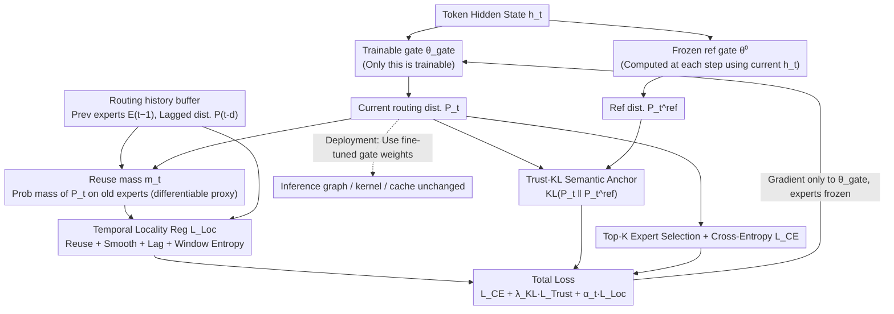

# ReMoE: Boosting Expert Reuse through Router Fine-Tuning in Memory-Constrained MoE LLM Inference

**Conference**: ICML 2026  
**arXiv**: [2605.27081](https://arxiv.org/abs/2605.27081)  
**Code**: https://github.com/BUAA-OSCAR/ReMoE (Available)  
**Area**: LLM Efficiency / MoE Inference / Edge Deployment  
**Keywords**: Fine-grained MoE, Expert Offloading, Temporal Locality, Router Fine-tuning, Cache Hit Rate

## TL;DR
ReMoE freezes all non-router parameters and fine-tunes only the gates using a composite loss of "Temporal Locality Regularization + Trust-KL Semantic Anchor." This shapes the routing trajectories to be more "cache-friendly," increasing the expert reuse rate of adjacent tokens by approximately 26% without changing the architecture or adding runtime overhead. It reduces TPOT by 43.6–49.8% (achieving 1.77–1.99× decoding acceleration) on Jetson Orin NX.

## Background & Motivation

**Background**: Fine-grained MoEs like DeepSeek-V2/V3 and Qwen-MoE increase the number of experts per layer to dozens or hundreds, with only Top-$K$ activated per token. The large parameter size but small activation volume makes them ideal for edge devices with abundant UFS/SSD but limited DRAM (e.g., Samsung UFS 4.0 provides 4 GB/s read bandwidth and 1 TB capacity). Standard systems like MoE-Infinity, HOBBIT, Fiddler, and KTransformers utilize expert caching and prefetching between CPU/GPU.

**Limitations of Prior Work**: During decoding, each token may hit a completely different set of experts, causing frequent cache invalidation and severe I/O jitter. In interactive inference with $B{=}1$, there is no batching to amortize I/O, making expert migration the bottleneck for end-to-end latency.

**Key Challenge**: The load-balancing loss $L_{\text{aux}}$ added during training for expert parallelism forces tokens to be distributed uniformly across all experts. This directly conflicts with the requirements of single-request inference, which favors "fewer cache slots + high reuse rate of expert working sets across adjacent tokens"—a *training–deployment mismatch*.

**Goal**: Without modifying expert weights, inference graphs, or adding new runtime strategies, shape the router output trajectory $\{E_t\}$ to be more "reusable within a short window," thereby reducing the number of distinct expert loads at the trace level.

**Key Insight**: Observations of the routing trajectory for DeepSeek-V2-Lite layer 21 (Figure 2) show that the baseline router already exhibits short reuse streaks, which are interrupted by frequent "minor switches." This suggests that natural locality exists and only requires lightweight shaping to be amplified, rather than a full architectural redesign and pre-training from scratch like Oracle-MoE.

**Core Idea**: Translate "cache hit" into a differentiable optimization objective for the router layer. Specifically, freeze the entire model and fine-tune only the gate parameters $\theta_{\text{gate}}$ to favor experts selected in recent steps, while using a KL anchor to pull the distribution back toward the pre-trained router to avoid semantic drift.

## Method

### Overall Architecture
ReMoE is a post-training router fine-tuning framework. The inference pipeline remains identical to the baseline: input token → hidden state $h_t$ → router calculation $P_t = \mathrm{Softmax}(h_t^\top \theta_{\text{gate}})$ → Top-$K$ expert selection → expert forward pass. Modifications occur only during training: two gates run in parallel within each MoE layer—a frozen pre-trained snapshot $\theta_{\text{gate}}^0$ provides the reference distribution $P_t^{\text{ref}}$, while a trainable gate produces $P_t$. Gradients are backpropagated only to $\theta_{\text{gate}}$; expert FFNs, attention, and embeddings are frozen. A small routing history buffer is maintained during training for temporal regularization. At deployment, only the fine-tuned gate weights are updated; the inference graph, kernels, and cache strategies remain unchanged. Total loss: $\mathcal{L}=L_{\text{CE}}+\lambda_{\text{KL}}\,L_{\text{Trust}}+\alpha_t\,L_{\text{Loc}}$, where $\alpha_t = \min(1, t/T_{\text{warm}})$ linearly warms up the locality regularization. The dispersion-encouraging $L_{\text{aux}}$ is explicitly disabled during fine-tuning.

### Key Designs

**1. Gate-only Fine-tuning + Reuse Mass Differentiable Proxy: Translating "Cache Hit" into an Optimizable Objective**

The number of overlapping experts between step $t$ and $t-1$ is a discrete, non-differentiable quantity, making SGD inapplicable. ReMoE defines $\tilde{E}_{t-1} = \texttt{stop\_gradient}(E_{t-1})$, treating the indices of experts selected in the previous step as constants. The reuse mass is then defined as $m_t = \frac{1}{K}\sum_{k\in\tilde{E}_{t-1}} P_t^{(k)}$, representing the probability mass the current router places on the $K$ experts used in the previous step. The `stop_gradient` ensures that gradients flow only to the current $P_t$, signaling the model to "catch up" to the previous step. Increasing $m_t$ raises the probability of Top-$K$ falling back to old experts, effectively increasing the expected overlap rate $\mathrm{IR}_t = |E_t \cap E_{t-1}|/K$. Proposition 3.1 anchors this signal to physical I/O: under standard LRU and request isolation, the average fetch count satisfies $\bar{N}_{\text{fetch}} \le K(1 - \mathrm{EOR})$. Thus, reuse mass serves as a smooth lower bound for Top-$K$ overlap, allowing "cache hits" to guide gradient descent. Because only router parameters are tuned, fine-tuning is extremely lightweight (100k samples, 2000 steps on OpenHermes-2.5).

**2. Temporal Locality Regularization $L_{\text{Loc}}$: Multi-scale Shaping of Routing Trajectories**

Reuse mass alone only targets the "adjacent step," which may leave residual misses such as cumulative slow drifts or expert diffusion within a local window. Thus, $L_{\text{Loc}}$ is decomposed into four sub-terms: $L_{\text{Loc}} = \lambda_{\text{Reuse}} L_{\text{Reuse}} + \lambda_{\text{Smooth}} L_{\text{Smooth}} + \lambda_{\text{Lag}} L_{\text{Lag}} + \lambda_{\text{WS}} L_{\text{WS}}$. $L_{\text{Reuse}} = -\log(\rho + 10^{-8})$ increases average reuse mass $\rho$ for short-window overlap. $L_{\text{Smooth}} = \frac{1}{T-1}\sum \text{SymKL}(P_t, P_{t-1})$ uses symmetric KL to suppress distribution jitter between adjacent steps (without `stop_gradient` to allow mutual coupling). $L_{\text{Lag}}$ applies SymKL over a lag set $\mathcal{D} = \{1,2,4,8,16\}$ to prevent multi-step drift. $L_{\text{WS}}$ minimizes the entropy $H(\bar{P}_b)$ of the average distribution over $W$ steps, encouraging only a few experts to be active within any local window, aligning with small cache capacities.

**3. Trust-KL Semantic Anchor: Safeguarding Radical Locality Optimization**

Optimizing solely for locality could drive the router to a degenerate solution that is cache-friendly but suffers from perplexity collapse. ReMoE uses an FP32 frozen gate snapshot $\theta_{\text{gate}}^0$ to compute $P_t^{\text{ref}}$ based on the **current** $h_t$ (ensuring the reference distribution adapts to context). The fine-tuned distribution is pulled back via $L_{\text{Trust}} = \frac{1}{T}\sum_t D_{\text{KL}}(P_t \,\|\, \texttt{stop\_gradient}(P_t^{\text{ref}}))$. KL divergence is chosen over L2 or cosine because it naturally weights high-probability experts, covering the dominant Top-$K$ decision region. Computing the reference with the current $h_t$ is crucial: when encountering abrupt semantic changes, locality bias will not forcibly suppress necessary expert switches, ensuring that performance on OOD domains merely degrades to baseline acceleration without accuracy loss.

### Loss & Training
Fine-tuning was performed on DeepSeek-V2-Lite (15.7B/2.4B, 27 layers, 64 routed + 2 shared experts per layer, Top-$K{=}6$) for 2000 steps using AdamW ($lr=5\times 10^{-5}$, 200-step linear warmup). Standard BF16 precision, gradient clipping at 1.0, sequence length of 2048, micro-batch size of 1, and gradient accumulation of 8 were used. Data consisted of 100k samples from OpenHermes-2.5 for training and 1k for evaluation. Locality terms were introduced via linear warmup $\alpha_t = \min(1, t/T_{\text{warm}})$.

## Key Experimental Results

### Main Results

| Dataset / Platform | Metric | Baseline | ReMoE | Gain |
|--------|------|------|----------|------|
| DeepSeek-V2-Lite, $B{=}1$ | EOR ↑ | 27.3% | 34.5% | +7.2 pp (+26.4%) |
| Same as above | Routing Entropy ↓ | 0.9998 | 0.9971 | −0.27% |
| Same as above | Load-balance CV ↑ | 0.0409 | 0.1608 | +293% |
| Cache $C{=}6$, LRU | uHR ↑ | 0.3187 | 0.3687 | +0.0500 |
| Same as above | #uMiss (M) ↓ | 0.8707 | 0.8068 | −0.0639 |
| vLLM, RTX 3090, ShareGPT | Output Throughput (tok/s) | 3.58 | 3.88 | +8.4% |
| Same as above | TPOT (ms) ↓ | 254.31 | 242.99 | −4.5% |
| Jetson Orin NX, ShareGPT | TPOT (ms) ↓ | 554.69 | 306.27 | −44.8% (1.81×) |
| Jetson, GSM8K | TPOT (ms) ↓ | 613.73 | 346.04 | −43.6% (1.77×) |
| Jetson, HumanEval | TPOT (ms) ↓ | 672.68 | 337.61 | −49.8% (1.99×) |

CE-only training (fine-tuning the router only with $L_{\text{CE}}$) served as a control; its EOR dropped to 22.9% and vLLM throughput decreased to 2.95 tok/s, ruling out the possibility that any router fine-tuning would yield benefits.

### Ablation Study

| Config / Benchmark | Key Metric | Description |
|------|---------|------|
| Full ReMoE | EOR 34.5% / uHR@6 0.369 | Full model performance |
| w/o Trust ($\lambda_{\text{KL}}{=}0$) | Higher EOR, PPL degrades | More radical routing but lower language model quality |
| w/o Reuse | EOR declines significantly | Primary overlap signal comes from the reuse term |
| w/o Consistency (smooth/lag/ws=0) | EOR declines | Consistency terms suppress slow drift and diffusion |
| GSM8K (EM, strict) | 38.89 → 38.13 | −0.76 pp, within variance |
| HumanEval (pass@1) | 26.83 → 29.27 | +2.44 pp, improvement observed |
| MMLU (acc) | 57.72 → 57.81 | +0.09 pp, virtually identical |
| IFEval (prompt loose) | 17.93 → 17.93 | No change |

### Key Findings
- **3x Increase in CV with Stable Global Diversity**: The number of distinct experts visited across a sequence changed from 64.000 to 63.997. This indicates that ReMoE induces step-level concentration (repeated use within short windows) rather than global routing collapse, which is the ideal pattern for caching.
- **vLLM Acceleration < Jetson Acceleration**: Since PCIe Gen3 ×16 can partially hide misses, the 8.4% gain is a "conservative upper bound." On Jetson, where the SSD-backed path has high miss penalties, cache hits translate directly into 1.77–1.99× speedup, showing ReMoE's utility scales with hardware miss penalties.
- **CE-only as a Negative Control**: Despite identical training conditions, CE-only resulted in lower EOR and an 18% throughput drop compared to the baseline, proving gains stem from the locality objective itself.

## Highlights & Insights
- **Clean Paradigm for KPI Translation**: Proposition 3.1 links EOR to fetch counts, and reuse mass provides a smooth lower bound for EOR. This "Hardware KPI → Discrete Routing Metric → Differentiable Proxy" pipeline can be applied to any dispatch-style module.
- **Effective Division of Labor**: Quantization reduces the "cost per fetch," while ReMoE reduces "fetch frequency." These are orthogonal and stackable. Since only the router is modified, fine-tuning costs are negligible and user-friendly for community checkpoints.
- **Dynamic Reference via current $h_t$**: Using the current hidden state for the Trust-KL anchor allows the router to switch experts when semantic changes require it. This is why OOD performance never falls below the baseline.
- **Multi-scale Locality Recipe**: The combination of SymKL for jitter, lagged-SymKL for drift, and window entropy for diffusion is a robust template for any sparse activation module with a history buffer.

## Limitations & Future Work
- The locality regularization increases inference-time CV, which targets $B{=}1$ edge inference; its effect on expert load balancing in high-concurrency datacenter scenarios remains unaddressed.
- Full pipeline experiments were limited to DeepSeek-V2-Lite. Systematic scanning across larger scales (e.g., DeepSeek-V3, Mixtral 8×22B) and different Top-$K$ values is needed.
- The assumption of a "request-isolated cold-start cache" is idealized. Multi-session cache sharing might amplify or dilute ReMoE's gains.
- A slight drop in IFEval prompt strict scores (−1.11 pp) suggests locality fine-tuning may marginally impact long-tail instruction following. Task-aware scheduling for $\lambda_{\text{KL}}$ is a potential next step.
- Future work could extend reuse mass to prefetch-aware objectives (rewarding not just "previously used" but also "ready in window") or explore RL-based policy tuning with actual cache states as observations.

## Related Work & Insights
- **vs Oracle-MoE (Zhou et al., 2025)**: Oracle-MoE targets locality via architectural redesign and pre-training; ReMoE uses post-training fine-tuning of gates, maintaining expert weights and architecture at a much lower cost.
- **vs Mixture of Cache-Conditional Experts (Skliar et al., 2025)**: The latter biases selection *at runtime* based on cache residency, requiring model graph changes; ReMoE shapes trajectories offline to work with any standard cache policy.
- **vs System-level Methods (MoE-Infinity/Fiddler/KTransformers)**: These optimize "how to move" when a miss occurs; ReMoE optimizes "how to avoid sending miss requests" at the source. They are complementary.
- **vs Load-balancing / Z-loss**: Traditional objectives encourage dispersion for expert parallelism. ReMoE demonstrates that for edge inference, the objective should be the opposite, highlighting the need for deployment-aware training targets.

## Rating
- Novelty: ⭐⭐⭐⭐ High marks for formalizing cache locality as an optimizable router objective; reuse mass and KL anchors have precedents in RL/distillation but are well-applied here.
- Experimental Thoroughness: ⭐⭐⭐⭐ Three-tier validation (Trace simulation, vLLM, Jetson) and a clear CE-only negative control; full pipeline on only one model is a minor drawback.
- Writing Quality: ⭐⭐⭐⭐ The structure (Motivation → Proxy → Regularization → Anchor → Evaluation) is logical and clear.
- Value: ⭐⭐⭐⭐⭐ Vital for on-device MoE deployment, offering 1.77–1.99× speedup with zero runtime modifications.

<!-- RELATED:START -->

## Related Papers

- [\[ICLR 2026\] FreeKV: Boosting KV Cache Retrieval for Efficient LLM Inference](../../ICLR2026/llm_efficiency/freekv_boosting_kv_cache_retrieval_for_efficient_llm_inference.md)
- [\[ICML 2026\] Stochastic Sparse Attention for Memory-Bound Inference](stochastic_sparse_attention_for_memory-bound_inference.md)
- [\[ICLR 2026\] Explainable Token-level Noise Filtering for LLM Fine-tuning Datasets](../../ICLR2026/llm_efficiency/explainable_token-level_noise_filtering_for_llm_fine-tuning_datasets.md)
- [\[ICLR 2026\] Difficulty–Diversity Collaborative Filtering for Data-Efficient LLM Fine-Tuning](../../ICLR2026/llm_efficiency/difficultydiversity_collaborative_filtering_for_data-efficient_llm_fine-tuning.md)
- [\[ICLR 2026\] Influence-Preserving Proxies for Gradient-Based Data Selection in LLM Fine-Tuning](../../ICLR2026/llm_efficiency/influence-preserving_proxies_for_gradient-based_data_selection_in_llm_finetuning.md)

<!-- RELATED:END -->
