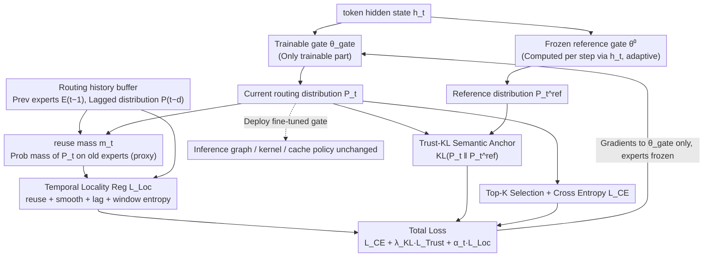

# ReMoE: Boosting Expert Reuse through Router Fine-Tuning in Memory-Constrained MoE LLM Inference

**Conference**: ICML 2026  
**arXiv**: [2605.27081](https://arxiv.org/abs/2605.27081)  
**Code**: https://github.com/BUAA-OSCAR/ReMoE (Available)  
**Area**: LLM Efficiency / MoE Inference / Edge Deployment  
**Keywords**: Fine-grained MoE, Expert Offloading, Temporal Locality, Router Fine-tuning, Cache Hit

## TL;DR
ReMoE freezes all non-router parameters and fine-tunes only the gate using a compound loss of "temporal locality regularization + Trust-KL semantic anchor." This shapes the routing trajectory to be more "cache-friendly." Without changing the architecture or adding runtime overhead, it improves the expert reuse rate of adjacent tokens by approximately 26% and reduces TPOT by 43.6–49.8% on Jetson Orin NX (achieving a 1.77–1.99× decoding speedup).

## Background & Motivation

**Background**: Fine-grained MoEs like DeepSeek-V2/V3 and Qwen-MoE increase the number of experts per layer to dozens or hundreds. Each token activates only Top-$K$ experts. While the total parameter count is large, the active parameters are few, making them highly suitable for edge devices with abundant UFS/SSD but limited DRAM (e.g., Samsung UFS 4.0 offers 4 GB/s read bandwidth and 1 TB capacity). Systems like MoE-Infinity, HOBBIT, Fiddler, and KTransformers typically manage expert caching and prefetching between CPU and GPU at runtime.

**Limitations of Prior Work**: During the decoding phase, each token may hit a completely different set of experts, leading to frequent cache misses and severe I/O jitter. Especially in $B{=}1$ interactive inference, there is no batching to amortize I/O, and expert movement directly determines end-to-end latency.

**Key Challenge**: The load-balancing loss $L_{\text{aux}}$ added during training to support expert parallelism forces tokens to be distributed evenly across all experts. This is diametrically opposed to the requirement of "limited cache slots + expectation of adjacent tokens reusing the same expert working set" in single-request inference—this represents a *training–deployment mismatch*.

**Goal**: Without modifying expert weights, changing the inference graph, or introducing new runtime strategies, shape the router's output trajectory $\{E_t\}$ to be more "short-window reusable." This reduces the number of distinct experts loaded from the upstream (trace layer).

**Key Insight**: Observations of the routing trajectory for DeepSeek-V2-Lite Layer 21 (Figure 2) show that the baseline router already exhibits short reuse streaks, which are merely interrupted by frequent "small switches." This suggests that natural locality exists and only requires lightweight shaping to be amplified, rather than redesigning the architecture from scratch like Oracle-MoE.

**Core Idea**: Translate "cache hit" into a differentiable optimization objective for the router layer. Freeze the entire model and fine-tune only the gate parameters $\theta_{\text{gate}}$ to encourage the router to reuse recently selected experts. Simultaneously, apply a KL anchor to pull the distribution back to the pre-trained router to prevent semantic drift.

## Method

### Overall Architecture
ReMoE is a post-training router fine-tuning framework where the inference pipeline remains identical to the baseline: Input token → Hidden state $h_t$ → Router computes $P_t = \mathrm{Softmax}(h_t^\top \theta_{\text{gate}})$ → Top-$K$ expert selection → Expert forward pass. Modifications occur only on the training side. Within each MoE layer, two gates run in parallel: a frozen pre-trained snapshot $\theta_{\text{gate}}^0$ provides a reference distribution $P_t^{\text{ref}}$, and a trainable gate produces $P_t$. Gradients flow only back to $\theta_{\text{gate}}$; expert FFNs, attention, and embeddings are all frozen. During training, a small routing history buffer is maintained for the temporal regularization. For deployment, the fine-tuned gate weights are swapped in without changing the inference graph, kernels, or caching strategies. The total loss is $\mathcal{L}=L_{\text{CE}}+\lambda_{\text{KL}}\,L_{\text{Trust}}+\alpha_t\,L_{\text{Loc}}$, where $\alpha_t = \min(1, t/T_{\text{warm}})$ defines a linear warmup for the locality regularization. During fine-tuning, the $L_{\text{aux}}$ used to encourage dispersion during training is explicitly disabled.

### Key Designs

**1. Gate-only fine-tuning + reuse mass differentiable proxy: Translating "cache hits" into a continuous objective**

A significant pain point is that "the number of overlapping experts between step $t$ and $t-1$" is a discrete, non-differentiable value, making it unsuitable for SGD. ReMoE addresses this by defining $\tilde{E}_{t-1} = \texttt{stop\_gradient}(E_{t-1})$, treating the indices of experts selected in the previous step as constants. It then calculates the reuse mass $m_t = \frac{1}{K}\sum_{k\in\tilde{E}_{t-1}} P_t^{(k)}$, which represents the probability mass assigned by the current router to experts used in the previous step. The `stop_gradient` ensures that the signal encourages the current $P_t$ to "catch up" to the previous choice. Increasing $m_t$ raises the probability of Top-$K$ selection falling back to old experts, effectively increasing the expected overlap rate $\mathrm{IR}_t = |E_t \cap E_{t-1}|/K$. Proposition 3.1 anchors this signal to physical I/O: under standard LRU cache semantics, the average fetch count satisfies $\bar{N}_{\text{fetch}} \le K(1 - \mathrm{EOR})$. This allows "cache hits" to be directly integrated into gradient backpropagation for the first time. Since only router parameters are tuned, the fine-tuning is extremely lightweight (100k samples, 2000 steps on OpenHermes-2.5).

**2. Temporal Locality Regularization $L_{\text{Loc}}$: Shaping routing trajectories across four time scales**

Optimizing only reuse mass handles adjacent steps but leaves two types of misses: cumulative slow drift and expert set diffusion within a local window. $L_{\text{Loc}}$ is decomposed into four terms: $L_{\text{Loc}} = \lambda_{\text{Reuse}} L_{\text{Reuse}} + \lambda_{\text{Smooth}} L_{\text{Smooth}} + \lambda_{\text{Lag}} L_{\text{Lag}} + \lambda_{\text{WS}} L_{\text{WS}}$. $L_{\text{Reuse}} = -\log(\rho + 10^{-8})$ directly increases the average reuse mass $\rho$. $L_{\text{Smooth}} = \frac{1}{T-1}\sum \text{SymKL}(P_t, P_{t-1})$ uses symmetric KL to suppress distribution jitter (without `stop_gradient` to allow bidirectional coupling). $L_{\text{Lag}}$ applies SymKL over a lag set $\mathcal{D} = \{1,2,4,8,16\}$ to capture slow drift across multiple steps. $L_{\text{WS}}$ minimizes the entropy $H(\bar{P}_b)$ of the average distribution over every $W$ steps, encouraging only a few experts to be active within any local window, aligning with small cache capacities.

**3. Trust-KL Semantic Anchor: Providing a safety guardrail for aggressive locality optimization**

Aggressive locality optimization can push the router toward degenerate solutions that are cache-friendly but suffer from perplexity degradation. ReMoE utilizes a frozen FP32 gate snapshot $\theta_{\text{gate}}^0$ to calculate $P_t^{\text{ref}}$ based on the **current** $h_t$. Since the reference distribution adapts with the context, it ensures the model remains grounded. The $L_{\text{Trust}} = \frac{1}{T}\sum_t D_{\text{KL}}(P_t \,\|\, \texttt{stop\_gradient}(P_t^{\text{ref}}))$ pulls the fine-tuned distribution back toward the pre-trained distribution. KL divergence is chosen over L2 or cosine distance because it naturally weights high-probability experts more heavily, covering the dominant regions of Top-$K$ decisions. This ensures that even during sharp semantic transitions, the locality bias does not override necessary expert switching, allowing OOD performance to degrade gracefully to the baseline speed without losing accuracy.

### Loss & Training
Fine-tuning was performed on DeepSeek-V2-Lite (15.7B/2.4B, 27 layers, 64 routed + 2 shared experts per layer, Top-$K{=}6$) for 2000 steps using AdamW with a learning rate of $5\times 10^{-5}$. A linear warmup of 200 steps was used in BF16 with a gradient clip of 1.0, sequence length of 2048, micro-batch size of 1, and gradient accumulation of 8. The training data consisted of 100k samples from OpenHermes-2.5. Locality terms were warmed up via $\alpha_t = \min(1, t/T_{\text{warm}})$.

## Key Experimental Results

### Main Results

| Dataset / Platform | Metric | Baseline | ReMoE | Gain |
|--------|------|------|----------|------|
| DeepSeek-V2-Lite, $B{=}1$ | EOR ↑ | 27.3% | 34.5% | +7.2 pp (+26.4%) |
| Same as above | Route Entropy ↓ | 0.9998 | 0.9971 | −0.27% |
| Same as above | Load-balance CV ↑ | 0.0409 | 0.1608 | +293% |
| Cache $C{=}6$, LRU | uHR ↑ | 0.3187 | 0.3687 | +0.0500 |
| Same as above | #uMiss (M) ↓ | 0.8707 | 0.8068 | −0.0639 |
| vLLM, RTX 3090, ShareGPT | Output Throughput (tok/s) | 3.58 | 3.88 | +8.4% |
| Same as above | TPOT (ms) ↓ | 254.31 | 242.99 | −4.5% |
| Jetson Orin NX, ShareGPT | TPOT (ms) ↓ | 554.69 | 306.27 | −44.8% (1.81×) |
| Jetson, GSM8K | TPOT (ms) ↓ | 613.73 | 346.04 | −43.6% (1.77×) |
| Jetson, HumanEval | TPOT (ms) ↓ | 672.68 | 337.61 | −49.8% (1.99×) |

As a control, CE-only fine-tuning (using only $L_{\text{CE}}$) resulted in an EOR drop to 22.9% and a reduction in vLLM throughput to 2.95 tok/s, ruling out the hypothesis that any continued router fine-tuning would yield benefits.

### Ablation Study

| Configuration / Benchmark | Key Metric | Description |
|------|---------|------|
| Full ReMoE | EOR 34.5% / uHR@6 0.369 | Full model performance |
| w/o Trust ($\lambda_{\text{KL}}{=}0$) | Higher EOR, PPL degradation | Aggressive routing but language quality drops |
| w/o Reuse | EOR drops significantly | Main overlap signal comes from reuse term |
| w/o Consistency | EOR drops | Smooth/lag/ws jointly suppress drift |
| GSM8K (EM, strict) | 38.89 → 38.13 | −0.76 pp, within fluctuation range |
| HumanEval (pass@1) | 26.83 → 29.27 | +2.44 pp, slight improvement |
| MMLU (acc) | 57.72 → 57.81 | +0.09 pp, essentially equal |
| IFEval (prompt loose) | 17.93 → 17.93 | No change |

### Key Findings
- **3× CV increase with minimal change in global diversity**: The number of unique experts visited in a sequence shifted from 64.000 to 63.997. This indicates that ReMoE creates step-level concentration (repeated use in short windows) rather than global routing collapse, which is the ideal pattern for caching.
- **vLLM speedup is much smaller than Jetson**: On PCIe Gen3 ×16, the host-device path partially hides misses, making 8.4% a "conservative upper bound." On SSD-backed paths like Jetson, where miss penalties are high, cache hit improvements directly translate to 1.77–1.99× decoding acceleration.
- **CE-only serves as a valid negative control**: Under identical training conditions, CE-only resulted in lower EOR than the baseline and an 18% throughput decrease, proving acceleration stems from the locality objective itself.

## Highlights & Insights
- **Clean paradigm of translating hardware KPIs to differentiable objectives**: Proposition 3.1 provides the upper bound for EOR↔fetch counts, and reuse mass is the smooth lower bound for EOR. This "Hardware KPI → Discrete Routing Metric → Differentiable Proxy" chain can be applied to any dispatch-style module.
- **Effective division of labor between gate-tuning and frozen experts**: Parameter space optimizations (e.g., quantization) reduce the "cost per fetch," while ReMoE reduces the "frequency of fetches." These are orthogonal and stackable. Gate-only tuning is also computationally negligible.
- **Importance of computing reference distribution with current $h_t$**: The adaptive reference distribution ensures that when the semantic context changes rapidly, the locality bias does not override the necessary expert switch, which is why OOD performance at worst reverts to baseline speeds.
- **Modular time-scale synchronization**: Using different terms for high-frequency jitter (SymKL), mid-frequency drift (Lag-SymKL), and window diffusion (Window Entropy) is significantly more robust than a single regularization term.

## Limitations & Future Work
- The locality regularization increases inference-time CV, making it unsuitable for large-batch datacenter expert parallelism where load balancing is critical; the method is explicitly targeted at $B{=}1$ edge inference.
- Lack of systematic evaluation on larger MoEs (e.g., DeepSeek-V3, Mixtral 8×22B) and different Top-$K$ values.
- The assumption of a "request-isolated cold-start cache" is idealized for real-world serving where multi-session shared caches may dilute or amplify ReMoE's gains.
- A drop of 1.11 pp in IFEval prompt strict suggests that locality fine-tuning might slightly harm strict instruction following; task-aware scheduling of $\lambda_{\text{KL}}$ is a potential next step.
- Future work could explore prefetch-aware objectives or RL-based router policies that incorporate real-time cache states as observations.

## Related Work & Insights
- **vs Oracle-MoE (Zhou et al., 2025)**: Oracle-MoE addresses locality by redesigning the architecture and pre-training from scratch; ReMoE uses post-training fine-tuning of the gate only, which is magnitudes cheaper but potentially has a lower performance ceiling.
- **vs Mixture of Cache-Conditional Experts (Skliar et al., 2025)**: The latter biases expert selection at *inference time* based on cache residency, which requires modifying the inference graph and checking cache states at every step. ReMoE shapes the trajectory offline.
- **vs MoE-Infinity / HOBBIT / Fiddler / KTransformers**: These are system-side runtime optimizations dealing with "how to move experts when a miss occurs." ReMoE deals with "how to issue fewer miss requests."
- **vs Load-balancing loss / router z-loss**: Conventional training objectives encourage dispersion for expert parallelism. ReMoE argues for the opposite in edge inference, highlighting that training objectives should be aware of the deployment environment.

## Rating
- Novelty: ⭐⭐⭐⭐ Formalizing cache locality as a differentiable router objective is a fresh perspective.
- Experimental Thoroughness: ⭐⭐⭐⭐ Three layers of verification (trace simulation, vLLM, and Jetson) with clean negative controls.
- Writing Quality: ⭐⭐⭐⭐ Very well-structured logic from motivation to differentiable proxies and anchors.
- Value: ⭐⭐⭐⭐⭐ Providing 1.77–1.99× edge decoding speedup with zero runtime changes is highly valuable for on-device MoE deployment.

<!-- RELATED:START -->

## Related Papers

- [\[ICLR 2026\] TokenSeek: Memory Efficient Fine Tuning via Instance-Aware Token Selection](../../ICLR2026/llm_efficiency/tokenseek_memory_efficient_fine_tuning_via_instance-aware_token_selection.md)
- [\[ICML 2026\] DOT-MoE: 用可微 optimal transport 把 dense LLM 转成 MoE](dot-moe_differentiable_optimal_transport_for_moefication.md)
- [\[ICML 2026\] Stochastic Sparse Attention for Memory-Bound Inference](stochastic_sparse_attention_for_memory-bound_inference.md)
- [\[ICML 2026\] Ekka: Automated Diagnosis of Silent Errors in LLM Inference](ekka_automated_diagnosis_of_silent_errors_in_llm_inference.md)
- [\[ICML 2026\] Beyond Sunk Costs: Boosting LLM Pre-training Efficiency via Orthogonal Growth of Mixture-of-Experts](beyond_sunk_costs_boosting_llm_pre-training_efficiency_via_orthogonal_growth_of_.md)

<!-- RELATED:END -->
