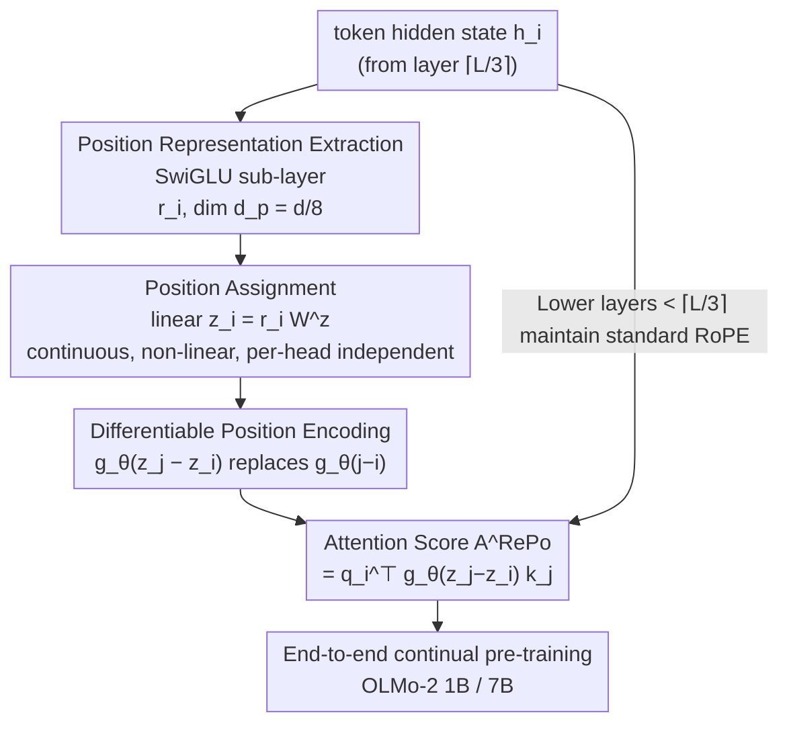

# RePo: Language Models with Context Re-Positioning

**Conference**: ICML 2026  
**arXiv**: [2512.14391](https://arxiv.org/abs/2512.14391)  
**Code**: https://github.com/SakanaAI/repo  
**Area**: LLM Efficiency / Position Encoding / Long Context  
**Keywords**: Position encoding, Context Re-positioning, RoPE, Long context, Attention allocation

## TL;DR
Existing LLMs force tokens into linear integer indices $0 \dots L-1$, making the attention layers bear the heavy burden of "organizing context structure." RePo introduces a lightweight differentiable module $f_\phi$ that assigns **continuous, non-linear** position values based on token hidden states. This offloads the "extra cognitive load," leading to consistent gains in noisy contexts, structured data, and long-context tasks, with almost no degradation in standard short-context tasks.

## Background & Motivation
**Background**: Context processing in modern LLMs relies heavily on position encoding schemes. The vast majority of models assign tokens sequential integer indices $0$ to $L-1$ (e.g., RoPE) or assign all tokens a constant index $a$ (e.g., NoPE), injecting this **rigid context organization** into the attention mechanism through a position encoding function.

**Limitations of Prior Work**: Although fixed position assignment is the de facto standard, it deviates from how human working memory processes information—humans utilize structural information (headings, paragraphing) to accelerate comprehension. The ability to **reorganize linearized text into structured representations** is missing in modern LLM architectures. Consequently, the attention mechanism must **independently** handle the understanding of linguistic structures behind linearized text. This burden consumes computational capacity intended for context reasoning, leading to significant performance drops in tasks requiring strong long-range or fine-grained dependencies, such as needle-in-a-haystack (NIAH) and Q&A with highly diluted contexts.

**Key Challenge**: The authors characterize this using **Cognitive Load Theory (CLT)**—working memory capacity is divided between "extraneous load" (how information is organized and presented) and "germane load" (the actual learning process). When task difficulty and model capacity are fixed, attention layers must simultaneously "understand the structure of the input sequence" and "process the input." When the former (extraneous load) consumes too much capacity, the latter (actual reasoning) degrades. Rigid linear positioning is the source of this extraneous load.

**Goal + Core Idea**: Rather than forcing attention layers to "infer structure from linear order," the model should have an **internal mechanism to reorganize token positions**, thereby reducing extraneous load and saving limited working memory capacity for beneficial reasoning. The specific approach is to introduce a differentiable module $f_\phi:\mathbb{R}^d\to\mathbb{R}$ that assigns each token a **real-valued position in continuous space** based on its hidden state (i.e., its relevance in context), bypassing traditional constraints like monotonicity and integers. Leveraging the continuous differentiability of modern position encodings (RoPE, ALiBi), these new positions can be jointly optimized end-to-end with the LLM.

## Method

### Overall Architecture
RePo does not modify the attention mechanism itself but inserts a re-positioning step before "position encoding." For each token $x_i$, a lightweight SwiGLU sub-layer is first used to **explicitly extract a position representation** $\bm{r}_i$ from its hidden state $\bm{h}_i$. Then, a linear transformation maps $\bm{r}_i$ to a **real-valued position value** $z_i$. Subsequently, encoding functions like RoPE are used as usual, but the original integer distance $j-i$ is replaced by $z_j-z_i$ to calculate attention scores. The entire $f_\phi$ is differentiable and can learn to "reorder positions by relevance" through continual pre-training on general data with the LLM. For efficiency, RePo is applied only from layer $\lceil L/3\rceil$ (lower layers maintain standard RoPE) and **only allows $z$ to affect position encoding without changing the autoregressive order of tokens**, thus not breaking the KV cache.

### Key Designs

**1. Context Re-positioning Module $f_\phi$: Extracting position representations from hidden states to assign continuous real-valued positions**

This is the core of RePo. The module consists of two steps. First, **position representation extraction**: existing research suggests that position information may be entangled in the original hidden states, so a lightweight SwiGLU sub-layer is used to extract it explicitly—

$$\bm{r}_i=\mathrm{Swish}(\bm{h}_i\mathbf{W}^g)\odot(\bm{h}_i\mathbf{W}^c),$$

where $\bm{r}_i\in\mathbb{R}^{d_p}$, and $\mathbf{W}^g,\mathbf{W}^c\in\mathbb{R}^{d\times d_p}$ are gating and content projections respectively, with $d_p<d$ (experimentally $d_p=d/8$, assuming position information is "thinner" than the original hidden state). Second, **position assignment**: a linear transformation compresses $\bm{r}_i$ into a single scalar position $z_i=\bm{r}_i\mathbf{W}^z$ ($\mathbf{W}^z\in\mathbb{R}^{d_p\times 1}$). The authors tested using full/restricted attention to process $\bm{r}_{<i}$ but found that **a single linear transformation achieves comparable performance with much lower latency**. Collectively, $f_\phi(\bm{h}_i)=\big(\mathrm{Swish}(\bm{h}_i\mathbf{W}^g)\odot(\bm{h}_i\mathbf{W}^c)\big)\mathbf{W}^z$. Key point: the assigned $z_i$ is in a **continuous, non-linear space**, breaking constraints like integers, monotonicity, and equal spacing, allowing "high-relevance tokens" to be pulled closer in position space—this is the mechanism that reduces extraneous load. Notably, the authors **intentionally do not feed in the original linear position $i$**, as preliminary experiments showed that once $i$ is an additional feature, the RoPE pre-trained LLM quickly biases toward it, regressing to trivial linear assignment.

**2. Seamless Integration with Differentiable Position Encoding: Replacing $j-i$ with $z_j-z_i$ while maintaining autoregressive order for efficiency**

RePo does not provide its own encoding function; instead, it reuses the continuous differentiability of modern position encodings. Taking RoPE as an example, where the original attention score is $\mathbf{A}_{i,j}^{\text{RoPE}}=\bm{q}_i^\top g_\theta(j-i)\bm{k}_j$, RePo simply replaces the integer distance with the re-positioned real-valued distance:

$$\mathbf{A}^{\text{RePo}}_{i,j}=\bm{q}_i^\top g_\theta\big(f_\phi(\bm{h}_j)-f_\phi(\bm{h}_i)\big)\bm{k}_j=\bm{q}_i^\top g_\theta(z_j-z_i)\bm{k}_j.$$

Since $g_\theta$ is continuously differentiable, the entire $f_\phi$ can be optimized via end-to-end backpropagation. It is not limited to RoPE and can be applied to any differentiable encoding such as ALiBi. **Key efficiency trade-off**: in principle, one could re-sort queries/keys for each head based on $z$, but in autoregressive generation, this would require recomputing the KV cache at every step, incurring massive overhead. Therefore, the authors **only use $z_i, z_j$ to affect position encoding within attention calculations while keeping the autoregressive order of $\bm{q}/\bm{k}$ unchanged**. This allows the KV cache to be fully reused, meaning RePo adds almost zero inference overhead. The position representation module is shared across layers, and the position assignment module is independent per head to further control parameter count.

**3. Layer-selective Application: Re-positioning only from layer $\lceil L/3\rceil$, leaving lower layers for local syntax**

Not all layers should be re-positioned. Previous research indicates that the **lower layers of LLMs primarily capture surface features relying on local information** (POS tagging, syntax); reorganizing context does little to help them. Thus, RePo is applied starting from layer $\lceil L/3\rceil$, while lower layers maintain standard RoPE (e.g., from layer 5 for 1B models, layer 10 for 7B models). Preliminary experiments corroborated this design: using RePo in too few layers led to behavior regressing to standard RoPE; conversely, using RePo in the bottom 1/3 and standard RoPE in the top 2/3 made training **unstable**. This confirms that the division of labor—"lower layers for local, upper layers for reorganization"—is effective and necessary.

### Loss & Training
No additional loss terms are introduced; the standard language modeling objective is used. $f_\phi$ learns position assignment through continual pre-training. Starting from OLMo-2 1B / 7B stage-1 checkpoints (4T tokens), the model is further pre-trained on 50B tokens of stage-2 data with a context length of 4096 using 4 H100 GPUs. Training configurations and codebases are consistent with the official OLMo-2 release, only replacing the position mechanism.

## Key Experimental Results

### Main Results
Evaluation specifically uses the fully open-source OLMo-2 (training data/weights/code all open) to avoid bias from data contamination. Tasks are divided into three categories: **Noisy Context** (RULER NIAH, within 4K), **Structured Data** (HybridQA Table Q&A, EM), and **Long Context** (RULER/LongBench 4K–16K, using YaRN extrapolation for RoPE layers).

| Task Dimension | Benchmark | Metric | RoPE (Ours) | RePo (Ours) | Gain (Δ) |
|----------|------|------|------|------|---|
| Noisy Context (1B) | RULER NIAH | AVG | 85.9 | **91.3** | +5.4 |
| Noisy Context (7B) | RULER NIAH | AVG | 97.3 | **97.9** | +0.6 |
| Structured Data (1B) | HybridQA-Table | EM | 24.43 | **26.70** | +2.27 |
| Structured Data (7B) | HybridQA-Table | EM | 33.52 | **37.61** | +4.09 |

At the 1B scale, RePo exceeds RoPE by at least 5.4 / 2.2 / 6.9 points in noisy context, structured data, and long-context benchmarks respectively. Consistent gains are also achieved at 7B, indicating that RePo **remains effective as model scale increases**. Performance on short-context general benchmarks (e.g., ARC, HellaSwag, MMLU, which require little reorganization) remains comparable with no significant regression.

### Ablation Study

| Configuration | NIAH AVG (1B) | Description |
|------|---------------|------|
| RoPE | 85.9 | Linear integer positions, baseline |
| NoPE | 80.2 (−5.7) | Equivalent to constant positions, worst long-range dependency |
| R2N1 | 90.5 (+4.6) | Mixed: 2 layers RoPE + 1 layer NoPE |
| N2R1 | 88.3 (+2.4) | Reverse of R2N1 |
| **RePo** | **91.3 (+5.4)** | Learnable continuous non-linear positions, optimal |

On LongBench (1B, YaRN extrapolated to 16K), RoPE averaged 20.93, while NoPE plummeted to 6.98 (−13.95). RePo and R2N1 were significantly superior, confirming that position encoding schemes significantly impact long-context extrapolation and that simply removing position (NoPE) is non-viable.

### Key Findings
- **RePo breaks local bias**: In NIAH analysis, RePo allocated **more** attention mass to the critical "needle" tokens and **less** to the recent "query" tokens, dynamically adjusting based on context rather than naturally biasing toward adjacent tokens like RoPE/ALiBi—this is the direct reason it excels at long-range dependencies.
- **Positions fall in a denser, more non-linear space**: Positions assigned by RePo are no longer equally spaced integers. This dense non-linear distribution is crucial for long-context generalization when extrapolating from 4K to 16K.
- **Learned hybrid position strategies**: RePo spontaneously learns a **hybrid** of "NoPE-like constant positions $a\pm\epsilon$" and "RoPE-like local monotonic sequences"—monotonic within a context segment and near-constant across segments, enabling it to capture the inherent structure of the input (e.g., automatic segmentation of few-shot examples).
- **Layer position is crucial**: Using RePo in only a few layers regresses to RoPE behavior; using RePo in lower layers and RoPE in upper layers results in training instability—the "lower-local, upper-reorganization" hierarchy is essential.

## Highlights & Insights
- **New motivation for position encoding via CLT**: Diagnosing "linear position" as "extraneous cognitive load" and aiming to free attention from "understanding structure" is a novel cognitive science perspective that explains why gains are largest in noisy/structured/long-context scenarios.
- **Pragmatic "Differentiable re-positioning + fixed autoregressive order"**: This allows positions to be learned end-to-end while sidestepping the fatal overhead of KV cache recomputation by "only changing position encoding, not q/k order," making RePo viable for autoregressive inference rather than just a theoretical toy.
- **Learned "hybrid strategies" as transferable priors**: RePo spontaneously converges to a NoPE+RoPE hybrid (monotonic within segments, near-constant across segments). This suggests that **explicitly constructing** such segmented position priors might approximate some of RePo's benefits directly.
- **Extremely low overhead**: With $d_p=d/8$, layer-shared representations, head-independent assignment, and application limited to the top 2/3 layers, the additional parameters and latency are negligible.

## Limitations & Future Work
- **Requirement for continual pre-training**: RePo is not plug-and-play; it requires training on ~50B tokens to learn position assignment, which involves migration costs for already deployed models.
- **Validated only up to 7B / 16K**: Scalability and extrapolation capabilities for larger models (70B+) and longer contexts (128K+) have not yet been verified.
- **Limited interpretability of position assignment**: While attention allocation and "hybrid strategies" are analyzed, the specific reason why $f_\phi$ is particularly effective for certain structures (tables, few-shot) remains somewhat empirical.
- **Dependency on differentiable position encoding**: The method assumes the continuous differentiability of schemes like RoPE/ALiBi and is not directly applicable to non-differentiable or discrete position schemes.

## Related Work & Insights
- **vs RoPE (Linear Integer Positions)**: RoPE uses a fixed $g_\theta(j-i)$ to encode relative distance, placing the entire burden of structure organization on attention. RePo replaces $j-i$ with learnable $z_j-z_i$, letting the positions themselves handle part of the structural organization so attention can focus on reasoning.
- **vs NoPE (Constant Positions)**: NoPE removes explicit positioning. This paper proves it is equivalent to assigning all tokens a constant position $a$, which is worst for long-range dependencies (NIAH −5.7, LongBench −13.95). RePo instead incorporates "near-constant" as one of its learnable local patterns within a hybrid strategy.
- **vs R2N1 / N2R1 (Static Layer-wise Hybrids)**: These methods alternate RoPE and NoPE across layers based on fixed rules. RePo learns hybrid positions in a **data-adaptive** manner within each head and overall outperforms R2N1 (NIAH 91.3 vs 90.5).

## Rating
- Novelty: ⭐⭐⭐⭐⭐ "Differentiable learning of continuous non-linear token positions" is a clean and rare direction in position encoding research.
- Experimental Thoroughness: ⭐⭐⭐⭐ Dual scale (1B/7B), three task categories + multiple baselines + attention/position space analysis; lacks larger models and ultra-long context.
- Writing Quality: ⭐⭐⭐⭐ The CLT motivation-method-analysis logic flows smoothly; formulas and mechanisms are clearly explained.
- Value: ⭐⭐⭐⭐ Directly valuable for long-context/structured input scenarios, with open-source code for reproducibility.

<!-- RELATED:START -->

## Related Papers

- [\[CVPR 2025\] LOCORE: Image Re-ranking with Long-Context Sequence Modeling](../../CVPR2025/llm_efficiency/locore_image_re-ranking_with_long-context_sequence_modeling.md)
- [\[ICML 2026\] IR3DE: A Linear Router for Large Language Models](ir3de_a_linear_router_for_large_language_models.md)
- [\[AAAI 2026\] Harnessing the Unseen: The Hidden Influence of Intrinsic Knowledge in Long-Context Language Models](../../AAAI2026/llm_efficiency/harnessing_the_unseen_the_hidden_influence_of_intrinsic_knowledge_in_long-contex.md)
- [\[ACL 2025\] Literary Evidence Retrieval via Long-Context Language Models](../../ACL2025/llm_efficiency/literary_evidence_retrieval_via_long-context_language_models.md)
- [\[ACL 2025\] How to Train Long-Context Language Models (Effectively)](../../ACL2025/llm_efficiency/train_long_context_effectively.md)

<!-- RELATED:END -->
