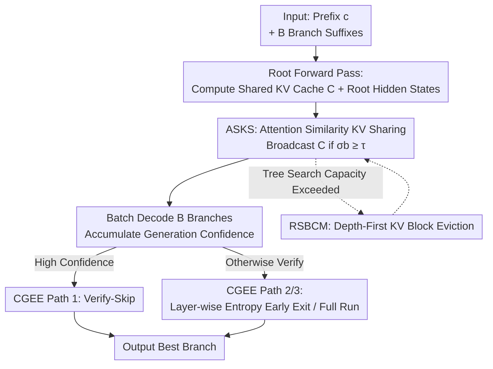

# RKSC: Reasoning-Aware KV Cache Sharing and Confident Early Exit for Multi-Step LLM Inference

**Conference**: ICML2026  
**arXiv**: [2606.09937](https://arxiv.org/abs/2606.09937)  
**Code**: https://github.com/AnirudhSekar/RKSC  
**Area**: LLM Efficiency  
**Keywords**: KV Cache, Inference Acceleration, Multi-branch Inference, Early Exit, Training-free

## TL;DR
RKSC is a **training-free** inference framework addressing two types of structural waste in "multi-branch inference" (running multiple reasoning trajectories followed by voting/verification). By employing "KV sharing via hidden state similarity" and "dual-level confidence early exit," it eliminates redundant prefix KV computations and excessive verification forwards. It achieves an average speedup of $3.008\times$ compared to a no-cache baseline across 5 models (7B–10B) and 4 benchmarks, with an early-exit-induced error rate of only $0.37\%$.

## Background & Motivation
**Background**: Standard practice for inference-time scaling systems like DeepSeek-R1, Qwen3, and o1 involve generating $B$ reasoning branches in parallel and then using a process-reward verifier to score all branches and select the best answer. In most cases, the first trajectory is already correct, yet the system must still complete all branches.

**Limitations of Prior Work**: This workflow contains two types of redundancy overlooked by production systems. First is **cross-branch KV waste**: parallel branches share the vast majority of the prefix (problem statement) but independently recompute its KV cache. Taking Tree of Thoughts (branch factor 4, depth 3, bifurcating at depth 2) as an example, branches naturally share $66\%$ of KV computation. Prefix caching in vLLM and SGLang only reuses KV when tokens are **byte-level identical**, failing to exploit semantic similarity across branches. Second is **excessive verification**: process-reward verification runs the full network depth even when the model is already confident, lacking a system to utilize the fact that "logit entropy collapses in later layers" for hierarchical early exit.

**Key Challenge**: Existing KV reuse mechanisms tie "reuse" strictly to "lexical identity," whereas the true determinant should be "semantic/hidden state consistency." Similarly, verification compute is locked into "running all $L$ layers," even though the actual required depth is often much smaller than $L$.

**Goal**: To eliminate both types of redundancy without **finetuning or architectural changes**, creating a plug-and-play wrapper for any multi-branch inference pipeline.

**Key Insight**: The authors observe three inherent structures in reasoning workloads: shared prefixes, concentrated generation confidence, and late-layer entropy collapse. RKSC does not introduce new computations; it simply "exploits" these structures.

**Core Idea**: Use hidden state cosine similarity as a gate for KV reuse (strictly generalizing token-exact caching) and use a dual-layer gate of generation confidence + layer-wise entropy to decide "whether to run verification / how deep to run it."

## Method

### Overall Architecture
RKSC deconstructs a multi-branch inference solve into three independently toggleable mechanisms with zero learnable parameters: First, a **single** root forward calculates the shared prefix KV cache $\mathcal{C}$ and root hidden states. ASKS then broadcasts $\mathcal{C}$ only to branches semantically similar to the root ($\sigma_b \geq \tau$). All $B$ branches are decoded in a batched forward while accumulating generation confidence. After decoding, CGEE selects one of three paths: skip verification entirely (verify-skip) if confidence is overwhelming; otherwise, run verification but exit early at a layer where entropy stabilizes; or otherwise, run the full verification. RSBCM assigns importance scores to KV blocks based on "branch score/depth" during depth-first tree search, prioritizing the eviction of deep and weak blocks when capacity is exceeded.

### Key Designs

**1. ASKS: Gating KV Sharing by Hidden State Similarity to Decouple "Reuse" from Lexical Identity**

The pain point is straightforward: vLLM/SGLang only reuse prefix KV when branch tokens are **byte-level identical** to the root. However, reasoning branches often just rephrase the same problem; if tokens diverge at the first position, the reuse rate drops to zero. ASKS performs a root forward and stores KV and hidden states $\mathbf{H}_{\text{root}}$ for each layer (root hidden states are normalized to unit vectors once to avoid redundant computations during $B$ comparisons). After each branch processes its own suffix tokens, it calculates a **weighted cosine similarity** with the root hidden states:

$$\sigma_b=\sum_{l=1}^{L}w_l\cdot\frac{\mathbf{h}^{(l)}_b\cdot\mathbf{h}^{(l)}_{\text{root}}}{\|\mathbf{h}^{(l)}_b\|\,\|\mathbf{h}^{(l)}_{\text{root}}\|},\qquad w_l=\frac{\exp(\alpha l/L)}{\sum_{l'}\exp(\alpha l'/L)},\ \alpha=1.5$$

Weights $w_l$ are **exponentially weighted toward later layers**, as later layers carry more task-relevant information and are more sensitive to "true semantic divergence" ($\alpha=1.5$ was selected via grid search over $\{0.5, 1.0, 1.5, 2.0\}$ on 30 GPQA Diamond problems). Branches with $\sigma_b \geq \tau$ receive the shared cache, while those below $\tau$ fall back to independent recomputation. This design **strictly generalizes** token-exact caching: any lexically identical prefix necessarily has $\sigma_b=1$, so ASKS will reuse any branch that vLLM would. Conversely, ASKS recovers branches that are "token-distinct but hidden-state-close to the root"—reusing $28.6\%$ more in diversified phrasing stress tests (where token-exact is $0\%$). Reuse is implemented via zero-copy `repeat_interleave` of K/V tensors to batch size $B$ (followed by a `.clone()` to ensure memory contiguity for SDPA kernels), saving $O(n^2)$ prefix attention for $B-1$ branches. Additionally, ASKS includes a **runtime probe**: it measures "full recompute" vs. "single prefix forward + shared decode" on the first call of each 64-token prefix bucket, only enabling sharing if the latter is faster. On A100 + SDPA, sharing was deemed beneficial for all 5 models when $n \geq 512$.

**2. CGEE: Using Confidence for Dual-Level Gating to Decide "Whether to Verify / How Deep"**

The verification forward is the second major waste. CGEE uses two levels. **Level 1 (verify-skip)** determines whether to run verification: during decoding, it records the top-1 softmax probability for each step (already computed, zero overhead) and takes the mean as generation confidence $p^{(b)}=\frac{1}{t}\sum_{j=1}^{t}\max_v\Pr[y_j^{(b)}=v]$. The gate requires both **high absolute confidence and a large relative margin**:

$$\max_b p^{(b)}\geq\tau_{\text{conf}}\quad\text{and}\quad\frac{\max_b p^{(b)}-\text{2nd-max}_b\,p^{(b)}}{\max_b p^{(b)}}\geq r_{\text{gap}}$$

Dual conditions prevent two types of misjudgments: "one branch has moderate confidence but a close rival" (absolute threshold only would misfire) and "two branches have a large gap but both are unconfident" (gap threshold only would misfire). If triggered, the entire $\delta$-cost verification is skipped, and branches are ranked by $p^{(b)}$. **Level 2 (Layer-wise Entropy Early Exit)** intervenes when verification is actually run: a lightweight hook at each layer takes the hidden state of the last token, passes it through the cached unembedding matrix $W_u$ to logit space, and calculates entropy $H^{(l)}=-\sum_v \text{softmax}(\mathbf{h}^{(l)}W_u^\top)_v\log\text{softmax}(\mathbf{h}^{(l)}W_u^\top)_v$. An exit is triggered when three conditions are met: depth $l^* \geq l_{\min}$ (default 2), $H^{(l^*)} < \theta$ (entropy is low/logits concentrated), and $|H^{(l^*)} - H^{(l^*-1)}| < \epsilon$ (entropy is stable across two layers, excluding transient dips). This is caught as an internal exception by the solver. On Qwen2.5-7B (28 layers), Level 2 triggered in $100\%$ of verification forwards with an average exit layer of 18.4, meaning logits stabilized before the last $34\%$ of layers. Thresholds $\tau_{\text{conf}}/r_{\text{gap}}/\theta$ are calibrated per model on 30 held-out GPQA Diamond problems.

**3. RSBCM: Evicting KV Blocks by "Branch Score/Depth" to Cap Cache Growth in Tree Search**

In deep tree search, shared KV can expand boundlessly. RSBCM assigns an importance score $\omega = \text{branch score} / (\text{depth} + 1)$ to each cache block. The denominator penalizes blocks deep in the tree that are unlikely to be revisited, while the numerator protects blocks on high-confidence trajectories. When the number of allocated blocks exceeds capacity (default 2000), blocks are evicted in ascending order of $\omega$. In stress tests with `max_blocks=4 < B=8`, RSBCM correctly evicted $B-4=4$ blocks per problem with $100\%$ answer consistency and $\sim1.5$ ms overhead. In the single-depth experiments of this paper, RSBCM remains largely dormant but serves as a mechanism for multi-depth search.

### Loss & Training
None. RKSC is entirely **training-free**: no finetuning, no structural changes, and zero learnable parameters. The three mechanisms act as a plug-and-play wrapper for any multi-branch inference pipeline.

## Key Experimental Results

Experiments were conducted on a single A100-80GB (bf16 + TF32 + SDPA) using 5 models (Qwen2.5-7B, Mistral-7B, Falcon3-7B, Falcon3-10B, Llama-3-8B) across 4 benchmarks (GPQA Diamond, MMLU-STEM, ARC-Challenge, GSM8K) with $B=8$ branches and $\sim1024$ token prefixes. Baselines: **No-KV** (independent prefix recomputation) and **vLLM-equivalent** (token-exact prefix caching).

### Main Results
Extended evaluation ($t=8$ decoding steps, $N=50$ per dataset, 1000 total problems):

| Configuration | Avg. Latency (ms) | Speedup vs No-KV | Note |
|---------------|-------------------|------------------|------|
| No-KV (Baseline) | 1,301 | $1.000\times$ | Independent prefix recompute |
| vLLM-equivalent | 719 | $1.808\times$ | Token-exact prefix caching |
| **RKSC (KV+CGEE)** | **452** | **$3.008\times$** | Peak $3.990\times$ (Llama-3-8B/MMLU) |

RKSC is $+61.2\%$ faster than vLLM-equivalent. The vLLM-equivalent gain was highly stable ($1.78\times$–$1.83\times$) across all 20 model-dataset pairs, confirming that KV gain depends only on $n$ and $B$, independent of model family.

### Ablation Study
Latency breakdown (GPQA Diamond, Qwen2.5-7B, $t=32$) and isolated ASKS testing:

| Configuration | Key Metric | Description |
|---------------|------------|-------------|
| KV only | $1.343\times$ (25.5% saved) | Prefix sharing only, CV=1% (very stable) |
| KV + CGEE (RKSC) | $1.622\times$ (38.3% saved) | CGEE introduces bimodal distribution, CV=28% |
| CGEE Verify Isolated ($t=128$) | $1.258\times$ | Verification forward 315 $\to$ 251 ms, $p < 0.0001$ |
| ASKS vs token-exact | +28.6% reuse | Under diversified phrasing (token-exact = 0%) |

### Key Findings
- **KV sharing is the primary and most stable driver** (CV < 2%), while CGEE provides "difficulty-adaptive" incremental gains. Verify-skip trigger rates correlate with difficulty: $\sim42\%$ on GPQA Diamond (hard) vs. $60\%–92\%$ on ARC-C/MMLU (easier), because harder problems have narrower confidence gaps. This allows CGEE to contribute most where verification is least needed, acting as a self-correcting property.
- **Larger models yield higher savings**: Falcon3-10B averaged $3.619\times$ speedup (saving 1179 ms/problem), while 7B–8B models ranged from $2.57\times$–$3.17\times$. This aligns with a latency model where saving a fixed number of layers is more valuable in larger models.
- **Negligible accuracy loss**: Across 1616 verification calls, CGEE introduced only 6 errors ($0.37\%$), with an average accuracy change of $-0.2\%$. All 6 errors occurred in Level 1 verify-skip on multiple-choice questions (ARC-C), where generation confidence occasionally reflects "token fluency" rather than semantic correctness.

## Highlights & Insights
- **The "Strict Generalization" Argument**: By ensuring $\sigma_b=1$ for identical tokens, ASKS proves itself as a **strict superset** of vLLM prefix caching. It reuses everything old systems can, while capturing semantically similar branches, posing no risk to existing scenarios.
- **Zero-Overhead Confidence**: Reusing the softmax from decoding provides a "free" early-exit signal. Level 2 early exit simply makes "what the model already knows" explicit, a concept transferable to any scenario involving redundant deep scoring (reranking, RM scoring).
- **Runtime Probe vs. Analytical Thresholds**: The authors opted for empirical measurement of two paths instead of relying on theoretical $n^* \approx 90$, accounting for real-world kernel launch and memory allocation overheads that linear models miss.

## Limitations & Future Work
- **Small Sample Size**: $N=50$ per dataset leads to high 95% CIs for CGEE trigger rates ($\pm10$–$18\%$). While the dominant KV gain is stable (CV < 2%), $N \geq 200$ is needed to tighten CGEE statistics.
- **Scale and Parallelism**: Tested only on single-card 7B–10B. Larger 14B+ models and tensor parallelism introduce communication overhead that might alter the relative benefit of prefix sharing vs. verification.
- **Domain Migration**: Entropy thresholds $\theta$ were calibrated on GPQA; other domains might require a quick recalibration scan. Level 2 relies on hooks and accessible unembeddings, which may require adapters for tied embeddings or MoE architectures.
- **Critical Scenarios**: For tasks requiring zero verification error, Level 1 should be disabled, keeping only Level 2 (which maintains full verification integrity by construction), though this reduces speed gains.

## Related Work & Insights
- **vs vLLM / SGLang Prefix Caching**: These require byte-level identity. ASKS decouples reuse from lexical identity via hidden state similarity, acting as a strict superset. Under diverse phrasing, ASKS maintains $1.131\times$ speedup where others achieve $0\%$.
- **vs MemShare**: MemShare deduplicates KV via step delimiters within a **single** chain. ASKS operates **across parallel branches**, making them complementary.
- **vs Speculative Decoding (SpecInfer / Medusa)**: These use draft models to accelerate the **decode phase** while maintaining distribution. CGEE accelerates the **verification phase** (scoring) via entropy-gated forward truncation. They are orthogonal.
- **vs Layer Early Exit**: Most early exit occurs at token or chain transition points. CGEE Level 2 is a **hierarchical early exit within a single verification forward**, an orthogonal mechanism.

## Rating
- Novelty: ⭐⭐⭐⭐ The combination of hidden state similarity gating and dual-level confidence early exit is clear, with a strong argument for strict generalization.
- Experimental Thoroughness: ⭐⭐⭐⭐ Extensive testing across 5 models and 4 datasets with proper ablation; limited only by sample size $N=50$.
- Writing Quality: ⭐⭐⭐⭐ Mechanisms, formulas, and operational regimes are disclosed clearly, including CV/CI reporting.
- Value: ⭐⭐⭐⭐ Training-free, plug-and-play, $3\times$ speedup with near-zero accuracy loss—highly practical for multi-branch inference deployment.

<!-- RELATED:START -->

## Related Papers

- [\[ICML 2026\] OBCache: Optimal Brain KV Cache Pruning for Efficient Long-Context LLM Inference](obcache_optimal_brain_kv_cache_pruning_for_efficient_long-context_llm_inference.md)
- [\[ICML 2026\] CriticalKV: Optimizing KV Cache Eviction from an Output Perturbation Perspective](criticalkv_optimizing_kv_cache_eviction_from_an_output_perturbation_perspective.md)
- [\[ACL 2025\] KV-Latent: Dimensional-level KV Cache Reduction with Frequency-aware Rotary Positional Embedding](../../ACL2025/llm_efficiency/kv_latent_cache_reduction.md)
- [\[ICLR 2026\] Cache What Lasts: Token Retention for Memory-Bounded KV Cache in LLMs](../../ICLR2026/llm_efficiency/cache_what_lasts_token_retention_for_memory-bounded_kv_cache_in_llms.md)
- [\[ACL 2026\] MTRouter: Cost-Aware Multi-Turn LLM Routing with History-Model Joint Embeddings](../../ACL2026/llm_efficiency/mtrouter_cost-aware_multi-turn_llm_routing_with_history-model_joint_embeddings.md)

<!-- RELATED:END -->
