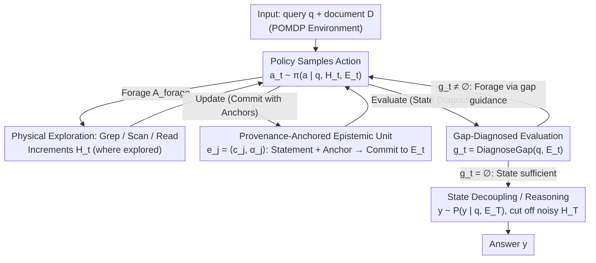

# Scout: Active Information Foraging for Long-Text Understanding with Decoupled Epistemic States

**Conference**: ICML 2026  
**arXiv**: [2605.04496](https://arxiv.org/abs/2605.04496)  
**Code**: Available on Project Page  
**Area**: LLM Efficiency / Long-Text Understanding / Agent  
**Keywords**: Long-Text Understanding, Information Foraging, Agent, Epistemic State, ReAct Decoupling

## TL;DR
Scout remodels million-token long-text understanding (LTU) as an "active information foraging" process. It introduces a provenance-anchored epistemic state $\mathcal{E}_t$, decoupled from the interaction trajectory, as the sole base for reasoning. Through gap-diagnosed self-evaluation, it iteratively converges to a sufficient subset of information. On LooGLE-v2 and $\infty$Bench, Scout matches or exceeds frontier models like Gemini-3-Pro while reducing token costs to approximately $1/8$.

## Background & Motivation

**Background**: Current long-text understanding (LTU) approaches generally fall into three categories: native long-context LLMs (e.g., Gemini-3-Pro, GPT-5) that process the entire document at once; RAG-based methods that chunk documents and retrieve segments; and specialized LTU agents (ReadAgent, GraphReader, MemAgent) that navigate via graphs, indices, or hierarchical summaries. While effective for NIAH-style tasks, they struggle with complex reasoning over million-token contexts.

**Limitations of Prior Work**: Native long-context models suffer from explosive costs and attention dilution, where critical information is submerged in ten orders of magnitude of context. RAG methods lose global dependencies during chunking, resulting in poor performance on multi-hop aggregation tasks. Agentic approaches often rely on task-agnostic preprocessing (mapping, indexing, gist compression); once details are discarded during preprocessing, they cannot be recovered. Furthermore, the "history-as-state" nature of ReAct causes interaction histories to become noisy, serving as a poor foundation for reasoning.

**Key Challenge**: The authors summarize this as the "LTU Trilemma"—the difficulty of simultaneously satisfying scalability, information fidelity, and reasoning efficiency. The root cause is the "Task-Agnostic Processing Trap": performing fixed abstractions on the entire document before seeing the query, which wastes budget on irrelevant regions while losing position-anchoring clues.

**Goal**: (R1) Consistently filter information from noisy observations that aligns with the oracle sufficient set $\mathcal{F}^{\star}_q$ and retain it in a stable form; (R2) Explicitly track what is "known" and "missing" to guide subsequent exploration; (R3) Transform "readiness to answer" into a decidable state property.

**Key Insight**: This work is based on the "Information Sparsity Hypothesis": for any query $q$, $|\mathcal{F}^{\star}_q| \ll |\mathcal{F}(\mathcal{D})|$. Thus, LTU is modeled as a POMDP where the document is an explorable environment rather than a passive sequence, emphasizing "foraging" on demand over exhaustive reading.

**Core Idea**: An epistemic state $\mathcal{E}_t$, anchored by provenance and decoupled from the interaction history $\mathcal{H}_t$, carries all knowledge used for final reasoning. State-level gap diagnosis of $\mathcal{E}_t$ drives the next round of foraging and commitment until $\mathcal{E}_t \approx \mathcal{F}^{\star}_q$.

## Method

### Overall Architecture
Scout models long-text understanding as a POMDP, allowing the agent to forage for evidence in cycles rather than reading it all at once. At each step $t$, controlled by the query $q$, interaction trajectory $\mathcal{H}_t$, and epistemic state $\mathcal{E}_t$, the agent samples an action $a_t \sim \pi(a \mid q, \mathcal{H}_t, \mathcal{E}_t)$. Actions are categorized into $\mathcal{A}_{\text{forage}}$ for physical exploration (Grep / Scan / Read at varying granularities) and $\mathcal{A}_{\text{state}}$ for state operations (Update to commit new units to $\mathcal{E}_t$, Evaluate for gap diagnosis). While $\mathcal{H}_t$ grows to record "where has been explored," $\mathcal{E}_t$ only changes during Update to store "confirmed query-relevant facts." Once diagnosis determines the state is sufficient, the agent performs "decoupled reasoning" $y \sim P(y \mid q, \mathcal{E}_T)$, intentionally cutting off access to $\mathcal{H}_T$ to prevent noise from entering the answer.

> The dual states $\mathcal{H}_t$ (exploration control) and $\mathcal{E}_t$ (reasoning base) persist throughout the loop: foraging only affects $\mathcal{H}_t$, Update only writes anchored facts to $\mathcal{E}_t$, and Evaluate only reads $\mathcal{E}_t$ to determine stopping.

### Key Designs

**1. State Decoupling: Splitting Exploration History from Confirmed Knowledge**

Standard ReAct uses a single history for both control and reasoning. In long contexts, most observations are noise; if they remain in the reasoning context, LTU becomes brittle. Scout splits this into $\mathcal{H}_t$ (tracking "where" was explored) and $\mathcal{E}_t$ (tracking "what" was confirmed). The policy reads both $(\mathcal{H}_t, \mathcal{E}_t)$ to avoid redundant actions, but the final answering stage is forced to switch from $P(y \mid q, \mathcal{H}_T)$ to $P(y \mid q, \mathcal{E}_T)$. Consequently, cognitive load scales with $|\mathcal{E}_T|$ rather than document length $|\mathcal{D}|$. This addresses (R1) by stabilizing sufficient information against noise.

**2. Provenance-Anchored Epistemic Units: Facts with Source Anchors**

To prevent the epistemic state from drifting or being contaminated by hallucinations, Scout composes $\mathcal{E}_t = \{e_1, \dots, e_{M_t}\}$ where each unit $e_j = \langle c_j, \alpha_j\rangle$. Here, $c_j$ is an atomic statement distilled from observations, and $\alpha_j$ is a provenance anchor pointing to a unique span in $\mathcal{D}$. New units are only committed to $\mathcal{E}_t$ when the agent explicitly chooses "Update." Every statement used in the final answer can be traced back to the source text via $\alpha_j$. This forces the state to be evidence-based, suppressing hallucinations and grounding self-evaluation.

**3. Gap-Diagnosed Epistemic Convergence: State-Level Stopping Criteria**

Scout introduces an Evaluate operator that calculates a gap $g_{t+1} = \text{DiagnoseGap}(q, \mathcal{E}_t)$, explicitly identifying what categories of information are missing relative to an oracle sufficient set. If $g_t = \emptyset$, processing stops; otherwise, the next round of foraging and commitment is guided by this specific gap. By monitoring distilled state rather than behavioral history, the stopping criterion is decoupled from trajectory length, satisfying both (R2) and (R3).

### Loss & Training
The inference phase does not require training and can use off-the-shelf backbones (Claude-Sonnet-4.5 was used as a unified backend for comparison). Evaluate is implemented by calling the backbone with a constrained prompt and fixed output schema. For open-source models, the authors conducted post-training experiments on Qwen2.5-72B-Instruct and Qwen3-32B using SFT and DAPO under the Scout paradigm. Results show that gains from Scout-specific post-training significantly exceed those from standard plain LLM SFT, suggesting the paradigm makes training signals denser and more learnable.

## Key Experimental Results

### Main Results
Comparison with frontier long-context LLMs and recent agent frameworks under a unified backend, using accuracy (%) and token cost (k).

| Benchmark | Method | Accuracy | Token Cost (k) | Token Eff. |
|-----------|------|--------|---------------|------------|
| LooGLE-v2 | Gemini-3-Pro | 68.5 | 273.9 | 0.25 |
| LooGLE-v2 | GPT-5.1-chat | 58.6 | 135.9 | 0.43 |
| LooGLE-v2 | MemAgent | 46.0 | 302.2 | 0.15 |
| LooGLE-v2 | **Scout** | **78.7** | **29.7** | **2.63** |
| $\infty$Bench | Gemini-3-Pro | 83.9 | 259.1 | 0.32 |
| $\infty$Bench | GraphReader | 43.1 | 327.4 | 0.13 |
| $\infty$Bench | **Scout** | **85.6** | **21.4** | **4.01** |

Scout achieves the highest accuracy across both benchmarks while reducing token costs to $~1/8$ of competitors, with Token Efficiency an order of magnitude higher than the best baseline.

### Ablation Study
Ablations on LooGLE-v2 for core components.

| Configuration | Acc (%) | $\Delta$ | Cost (k) |
|------|---------|----------|----------|
| Scout (Full) | 78.2 | – | 29.7 |
| w/o $\mathcal{E}_t$ (Degrades to ReAct) | 70.5 | $-7.7$ | 28.3 |
| w/o $\mathcal{A}_{\text{forage}}$ (No access to $\mathcal{D}$) | 17.7 | $-60.5$ | 27.4 |
| w/o File Tools | 74.2 | $-4.0$ | 31.4 |
| w/o Grounding (No $\alpha$ anchors) | 75.5 | $-2.7$ | 29.7 |

### Key Findings
- Removing the epistemic state (returning to ReAct) drops accuracy by 7.7 points with similar token costs, proving gains come from a cleaner reasoning base, not just token volume.
- As the context window expands from 64K to 1M+, Scout’s accuracy and cost remain nearly constant, whereas native models decline after 256K while costs grow exponentially. This confirms the "Information Sparsity Hypothesis."
- Removing the anchor $\alpha$ causes a modest 2.7-point drop, but its impact is significantly higher in multi-hop aggregation tasks, where anchors prevent hallucination drift in long-range reasoning.

## Highlights & Insights
- Scout transforms the "Information Sparsity Hypothesis" into a core system design principle. Rather than just using sparsity to justify RAG, Scout enforces it by ensuring the reasoning context remains proportionally sparse.
- While "history-as-state" works for short-horizon tool use, Scout highlights its failure in long horizons: the signal-to-noise ratio decreases monotonically with $|\mathcal{H}_t|$. Splitting exploration from reasoning is a transferable lesson for all long-horizon agents.
- Gap diagnosis elevates self-evaluation from behavioral ("What do I do next?") to epistemic ("What fact category is missing?"), making "when to stop" a decidable question.

## Limitations & Future Work
- "Efficiency" refers primarily to token cost; wall-clock time may be higher due to multi-turn latency, as noted in the Appendix E.4 analysis.
- The quality of Evaluate depends on the backbone's metacognitive abilities; weaker backbones might produce overly optimistic gap reports, leading to early termination.
- Currently, the action space is manual (Grep/Scan/Read). Moving to structured documents (PDF tables, code AST) might require more specialized foraging primitives.
- Anchors $\alpha_j$ assume stable span identifiers, which are not directly applicable to real-time streams, dynamic pages, or streaming audio.

## Related Work & Insights
- **vs ReAct**: Scout retains the loop but cuts access to $\mathcal{H}_T$ during answering to prevent degradation from long histories.
- **vs MemAgent / ReSum**: These use lossy compression which may discard anchoring cues; Scout maintains a separate clean $\mathcal{E}_t$ instead of compressing $\mathcal{H}_t$.
- **vs GraphReader / ReadAgent**: These use task-agnostic preprocessing; Scout insists on "query-aware foraging" to avoid losing crucial details before seeing the question.

## Rating
- Novelty: ⭐⭐⭐⭐⭐ Upgrades sparsity hypothesis to a strong constraint via decoupled state and gap diagnosis.
- Experimental Thoroughness: ⭐⭐⭐⭐⭐ Comprehensive coverage across LooGLE/$\infty$Bench, scaling analysis, and post-training.
- Writing Quality: ⭐⭐⭐⭐⭐ Clear hierarchy; POMDP formalization and R1-R3 requirements explain the motivation effectively.
- Value: ⭐⭐⭐⭐⭐ Achieves SOTA on million-token tasks while reducing costs by an order of magnitude; provides a paradigm shift for long-text agents.

<!-- RELATED:START -->

## Related Papers

- [\[ICML 2026\] ProactiveLLM: Learning Active Interaction for Streaming Large Language Models](proactivellm_learning_active_interaction_for_streaming_large_language_models.md)
- [\[ACL 2025\] FocusLLM: Precise Understanding of Long Context by Dynamic Condensing](../../ACL2025/llm_efficiency/focusllm_precise_understanding_of_long_context_by_dynamic_condensing.md)
- [\[ICML 2026\] RepetitionCurse: Measuring and Understanding Router Imbalance in Mixture-of-Experts LLMs under DoS Stress](repetitioncurse_measuring_and_understanding_router_imbalance_in_mixture-of-exper.md)
- [\[ICLR 2026\] Universe Routing: Why Self-Evolving Agents Need Epistemic Control](../../ICLR2026/llm_efficiency/universe_routing_why_self-evolving_agents_need_epistemic_control.md)
- [\[ACL 2025\] LongBench v2: Towards Deeper Understanding and Reasoning on Realistic Long-context Multitasks](../../ACL2025/llm_efficiency/longbench_v2_towards_deeper_understanding_and_reasoning_on_realistic_long-contex.md)

<!-- RELATED:END -->
