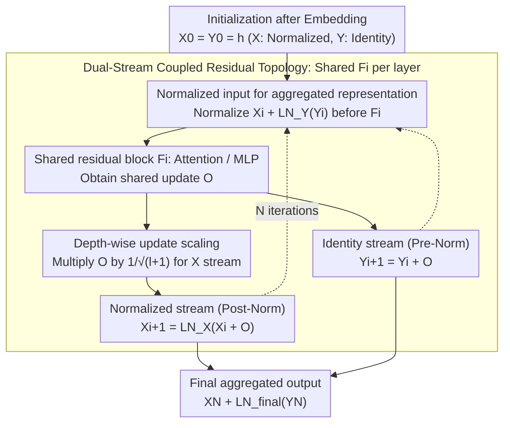

# SiameseNorm: Breaking the Barrier to Reconciling Pre/Post-Norm

**Conference**: ICML 2026  
**arXiv**: [2602.08064](https://arxiv.org/abs/2602.08064)  
**Code**: https://github.com/Qwen-Applications/SiameseNorm  
**Area**: LLM Efficiency / Transformer Architecture / Normalization  
**Keywords**: SiameseNorm, Pre-Norm, Post-Norm, Dual-stream Residual, Training Stability

## TL;DR
To address the structural conflict where Pre-Norm and Post-Norm cannot coexist within a single-stream architecture, the authors propose SiameseNorm, a dual-stream residual architecture. It maintains an unnormalized stream as an identity gradient highway (Pre-Norm) and a normalized stream for main-path representation control (Post-Norm). By coupling these two streams via shared residual blocks, SiameseNorm consistently outperforms Pre-Norm baselines across 400M~15B dense/MoE language models, ViT, and DiT with negligible overhead.

## Background & Motivation

**Background**: Modern Transformers (GPT-3, LLaMA, DeepSeek-V3, Qwen3, ViT) almost exclusively adopt Pre-Norm because it places LayerNorm inside the residual branch, keeping the main path as a clean identity connection. This naturally provides a "gradient highway," enabling stable training of networks with hundreds of layers. Post-Norm places LN after the residual addition, periodically normalizing the main path representations. While it offers stronger per-layer expressivity and often higher final performance, its training is extremely unstable.

**Limitations of Prior Work**: Although Pre-Norm enables stable training, recent research has identified a "deep layer collapse" issue—removing several deep layers barely impacts performance. This reflects that the Pre-Norm main path representation $\|X_i\|_2$ grows near-exponentially with depth (as shown in Fig.2(a), reaching $\sim 10^3$ in a 1.3B model), while each layer $F_i$ receives a normalized input (constant magnitude). Consequently, residual updates become increasingly specialized/diluted relative to the massive main path, leading to low utilization of deep layers and limited effective depth. Post-Norm, however, requires multiplying by the LN Jacobian $\mathbf{J}_{\mathrm{LN}}$ in backpropagation, easily causing gradient explosion or vanishing after multiple layers, leading to divergence under high learning rates ($\eta=10^{-3}$ or $2\times 10^{-3}$).

**Key Challenge**: The two paradigms demand conflicting attributes on the **same residual main path**: Pre-Norm requires an "unnormalized identity path for gradient stability," while Post-Norm requires a "normalized main path for representation scale control." Existing hybrid schemes (HybridNorm, Mix-LN, SpanNorm) assign different layers to different paradigms, but all updates still accumulate on a single main path, thus failing to satisfy both requirements simultaneously; both HybridNorm and SpanNorm diverge under high learning rates.

**Goal**: Design an architecture that simultaneously enjoys the optimization stability of Pre-Norm and the representation control of Post-Norm, while being fully compatible with existing Pre-Norm training recipes (learning rate, warm-up, initialization) without requiring re-tuning.

**Key Insight**: Since the two requirements are irreconcilable in a single stream, they should be **structurally decoupled into two streams**. By maintaining two independently evolving residual states $X_i$ and $Y_i$, one acts as a Post-Norm main path and the other as a Pre-Norm identity path. Sharing the same residual block $F_i$ allows it to receive gradient signals from both paths with zero parameter overhead.

**Core Idea**: Replace the "normalization position debate" in single-stream architectures with "Siamese dual-streams"—two streams share computation modules, each undertaking a specific normalization semantics.

## Method

### Overall Architecture
SiameseNorm moves beyond the choice of placing LN before or after the residual. Instead, the network maintains two independently evolving residual streams: a Post-Norm normalized main path $X$ and a Pre-Norm identity highway $Y$. After Embedding, both streams are initialized to the same value $X_0=Y_0=h$. Thereafter, each layer shares a single residual block $F_i$ (i.e., Attention or MLP), with each stream updating according to its own normalization semantics. Specifically, for layer $i$ (see Algorithm 1): first, the two streams are added in the normalized space to serve as the input for the shared block: $O = F_i(X_i + \mathrm{LN}_i^Y(Y_i))$. Then, $O$ is used to update the normalized stream $X_{i+1} = \mathrm{LN}_i^X(X_i + O)$ and the identity stream $Y_{i+1} = Y_i + O$. At the end of the network, the two streams are aggregated: $X_N + \mathrm{LN}_{\mathrm{final}}(Y_N)$. This structure adds only two lightweight operators, $\mathrm{LN}_i^X$ and $\mathrm{LN}_i^Y$, per layer. Parameter and FLOPs increases are both $<0.1\%$. On a 15B MoE model, the training speed is reduced by only 0.5%, and activation memory increases by only 2%.

### Key Designs

**1. Dual-stream coupled residual topology: Splitting the normalization debate into two physical paths**

The conflict between Pre-Norm and Post-Norm exists because they impose mutually exclusive requirements on the **same main path**. SiameseNorm assigns these semantics to two streams, $X$ and $Y$, and stitches them together using a shared $F_i$. The ingenuity lies in the gradients: by stacking the streams into a state $S_i=[X_i,Y_i]^\top$, the dual-stream transition Jacobian $\partial S_{j+1}/\partial S_j$ reveals that its diagonal blocks are **exactly** the Pre-Norm transition $\mathbf{I}+\mathbf{J}_{F_j}\mathbf{J}_{\mathrm{LN}_j^Y}$ and the Post-Norm transition $\mathbf{J}_{\mathrm{LN}_j^X}(\mathbf{I}+\mathbf{J}_{F_j})$. Thus, $F_i$ receives both the "identity highway" gradient from the $Y$ stream and the "normalized main path" gradient from the $X$ stream. These signals converge at the parameters of $F_i$, preserving the stable gradient channel of Pre-Norm while benefiting from the periodic representation constraints of Post-Norm. This topology also possesses degradation capabilities: setting $\mathrm{LN}^X=0$ reverts to Pre-Norm, and setting $\mathrm{LN}^Y=0$ reverts to Post-Norm.

**2. Normalized Input: Ensuring stable input distribution for shared blocks**

While $X_i$ (already Post-Norm) and $\mathrm{LN}_i^Y(Y_i)$ are individually normalized, their sum may shift. If fed directly to $F_i$, the input distribution for Attention/MLP becomes unstable. Therefore, before entering the shared block, the aggregated representation $X_i + \mathrm{LN}_i^Y(Y_i)$ is normalized. This ensures module inputs align with standard Transformer training conventions. Though not a primary innovation, this "glue" is essential for compatibility with modern Transformers; removing it increases PPL from 10.43 to 10.51~10.88 (Table 3).

**3. Depth-wise Scaling: Preventing scale mismatch between deep streams**

As the two streams evolve, scale imbalance occurs: the Pre-Norm stream $\|Y_i\|_2$ grows naturally with depth, while the Post-Norm stream $\|X_i\|_2$ remains bounded. Consequently, the shared update $O$ becomes negligible relative to $Y$ yet remains large relative to $X$, making the deep $X$ stream overly sensitive. Borrowing from DeepNorm, the authors apply a $1/\sqrt{l+1}$ scaling (where $l$ is the layer index) only to the update injected into the $X$ stream. This suppresses optimization sensitivity in deeper Post-Norm layers. The direct benefit is full compatibility with existing Pre-Norm recipes—aggressive settings like $\eta=2\times 10^{-3}$ can be used without divergence, enabling drop-in replacement with no additional hyperparameter tuning.

### Loss & Training
The architecture follows the standard Pre-Norm training recipe: AdamW optimizer, cosine learning rate schedule, and a 2K-step warm-up, with no additional hyperparameters. All $\mathrm{LN}$ scales are initialized to 1.0 (unlike Hyper-Connections which relies on Pre-Norm-biased initialization) to test the intrinsic stability of the architecture. Language modeling was trained from scratch on OLMo + FineWeb-Edu, and MoE experiments were based on OLMoE, totaling over 60,000 A100 hours.

## Key Experimental Results

### Main Results: 1.3B Dense Model, Comparison across 8 Normalization Schemes

| Learning Rate $\eta$ | Training Tokens | Pre-Norm PPL | HybridNorm PPL | SpanNorm PPL | SiameseNorm PPL | Avg. Downstream Score |
|----------------------|-----------------|--------------|----------------|--------------|-----------------|-----------------------|
| $4\times 10^{-4}$ (Low) | 100B | 11.21 | 10.91 | 11.00 | **10.57** | 52.26 |
| $1\times 10^{-3}$ (Mid) | 100B | 10.84 | **diverge** | 10.86 | **10.43** | 53.53 |
| $2\times 10^{-3}$ (High) | 100B | 10.89 | **diverge** | **diverge** | **10.48** | 55.63 |
| $2\times 10^{-3}$ (High) | 350B | 9.67 | — | — | **9.42** | 58.70 |
| MoE 15A2B $\eta=10^{-3}$ | 100B | 7.92 | — | — | **7.76** | 63.07 |

Key observation: HybridNorm and SpanNorm are competitive at low learning rates but diverge as the rate increases. SiameseNorm is the only method that converges stably across all learning rates while consistently achieving the lowest PPL. At an aggressive learning rate on 100B tokens, SiameseNorm's Arithmetic accuracy reached 39.6%, a 41% relative gain over Pre-Norm (27.0%), highlighting the reasoning benefits of Post-Norm representation control.

### Cross-depth and Cross-modal Generalization (390M params, 12B tokens, $\eta=10^{-3}$)

| Configuration | Pre-Norm | SiameseNorm | Gain |
|---------------|----------|-------------|------|
| 10 layers / d=1280 | 17.47 PPL | 16.15 | -1.32 |
| 17 layers / d=1024 | 17.23 | 15.69 | -1.54 |
| 33 layers / d=768 | 17.29 | **15.64** | -1.65 |
| 80 layers / d=512 | 18.02 | 15.98 | **-2.04** |
| DeiT-S (ImageNet) | 79.8 Acc | **81.3** | +1.5 |
| DiT-L/4 (FID) | 45.21 | **41.34** | -3.87 |

Pre-Norm starts to degrade significantly at 33 layers, while SiameseNorm achieves its best PPL at that depth. The gain increases with depth, verifying that SiameseNorm mitigates the "deep layer dilution" of Pre-Norm.

### Ablation Study (Table 3, $\eta=10^{-3}$)

| Normalized Input | Depth-Scaling | Topology | Avg. PPL |
|------------------|---------------|----------|----------|
| ✓ | × | Original (HybridNorm) | **diverge** |
| ✓ | ✓ | Original | 10.65 |
| ✓ | × | ResiDual | 11.68* |
| × | × | Siamese | 10.88 |
| ✓ | × | Siamese | 10.68 |
| × | ✓ | Siamese | 10.51 |
| ✓ | ✓ | Siamese | **10.43** |

### Key Findings
- **Siamese Topology is Central to Stability**: HybridNorm diverges without Depth-Scaling, whereas the Siamese topology reaches 10.68 PPL even without it and supports training with zero warm-up.
- **Synergy between Depth-wise Scaling and Siamese**: While scaling is a known technique, it further improves SiameseNorm from 10.68 to 10.43.
- **Gradient Statistics Verify Mechanism**: At high learning rates, HybridNorm's gradient norms spike above 100, while SiameseNorm and Pre-Norm remain stable below 0.5.
- **Improved Deep Layer Utilization**: Pruning deep layers in Pre-Norm results in almost no performance drop (indicating uselessness), whereas pruning in SiameseNorm leads to significant drops, confirming deep layer contribution.

## Highlights & Insights
- **Value of "Structural Decoupling"**: When a long-standing issue (Pre vs. Post-Norm) is irreconcilable in a single-stream framework, decoupling conflicting requirements into two physical paths is more effective than optimizing normalization positions. This "coupled dual-stream" concept is transferable to other trade-offs (e.g., BatchNorm vs. LayerNorm).
- **Jacobian Derivation as a "Compass"**: By deriving the block matrix for $\partial S_{j+1}/\partial S_j$, the architecture becomes "configurable by demand"—zeroing $\mathrm{LN}^X$ yields Pre-Norm, and zeroing $\mathrm{LN}^Y$ yields Post-Norm.
- **Drop-in Compatibility**: In industrial models like Qwen3, "no hyperparameter tuning" is a critical adoption requirement. The $1/\sqrt{l+1}$ depth-wise scaling is the key to fulfilling this promise.

## Limitations & Future Work
- SiameseNorm increases activation memory by ~2%, which may be a bottleneck for memory-constrained large models, requiring activation checkpointing.
- The maximum scale tested was 15B MoE / 100B tokens; performance on 70B+ dense models or trillion-token scales is unverified.
- The $1/\sqrt{l+1}$ scaling is empirical; theoretical analysis for optimal scaling factors is absent.
- ViT/DiT experiments were relatively small-scale (DeiT-S, DiT-L/4); scalability to SD3-level DiT or ViT-22B remains to be seen.

## Related Work & Insights
- **vs. HybridNorm / SpanNorm / Mix-LN**: These stack normalization semantics on one path, leading to instability at high learning rates. SiameseNorm avoids this via physical separation.
- **vs. ResiDual**: ResiDual also uses dual branches but fuses them at the end. SiameseNorm couples them at every layer via shared blocks.
- **vs. Hyper-Connections**: Hyper-Connections relies on biased initialization for stability; SiameseNorm proves stability stems from the topology itself.
- **vs. DeepNorm**: DeepNorm uses residual scaling for single-stream Post-Norm; SiameseNorm adapts this as an auxiliary mechanism for a dual-stream setting.

## Rating
- Novelty: ⭐⭐⭐⭐⭐ Reframes the "normalization position" debate as a topology design problem.
- Experimental Thoroughness: ⭐⭐⭐⭐⭐ Comprehensive coverage across models (400M to 15B MoE), modalities, depths, and learning rates.
- Writing Quality: ⭐⭐⭐⭐ Clear Jacobian derivations and Algorithm 1; however, descriptions of some figures are fragmented.
- Value: ⭐⭐⭐⭐⭐ High industrial potential due to Pre-Norm recipe compatibility and minimal overhead.

<!-- RELATED:START -->

## Related Papers

- [\[ICML 2026\] Beyond Sunk Costs: Boosting LLM Pre-training Efficiency via Orthogonal Growth of Mixture-of-Experts](beyond_sunk_costs_boosting_llm_pre-training_efficiency_via_orthogonal_growth_of_.md)
- [\[ICML 2026\] A Risk Decomposition Framework for Pre-Hoc Fine-Tuning Prediction](a_risk_decomposition_framework_for_pre-hoc_fine-tuning_prediction.md)
- [\[ACL 2026\] Breaking Block Boundaries: Anchor-based History-stable Decoding for Diffusion Large Language Models](../../ACL2026/llm_efficiency/breaking_block_boundaries_anchor-based_history-stable_decoding_for_diffusion_lar.md)
- [\[NeurIPS 2025\] Jet-Nemotron: Efficient Language Model with Post Neural Architecture Search](../../NeurIPS2025/llm_efficiency/jet-nemotron_efficient_language_model_with_post_neural_architecture_search.md)
- [\[ICML 2026\] Efficient Training-Free Multi-Token Prediction via Embedding-Space Probing](efficient_training-free_multi-token_prediction_via_embedding-space_probing.md)

<!-- RELATED:END -->
