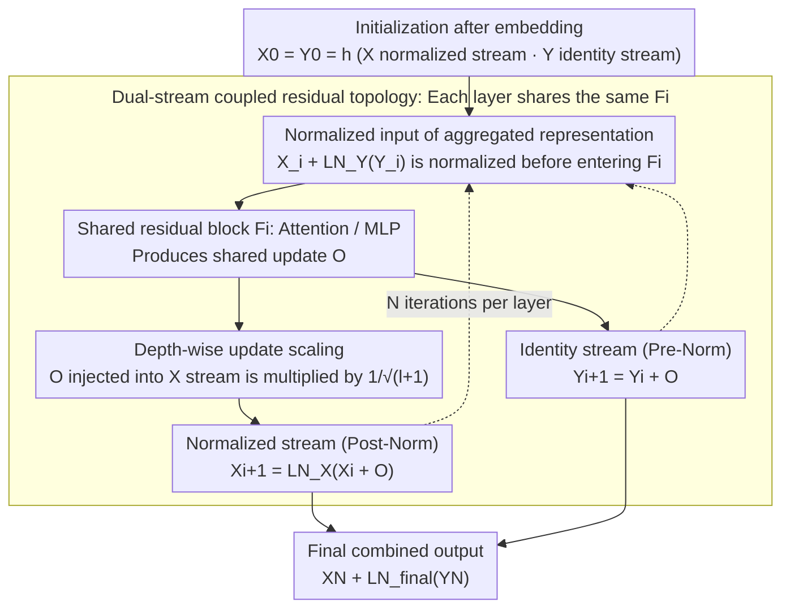

# SiameseNorm: Breaking the Barrier to Reconciling Pre/Post-Norm

**Conference**: ICML 2026  
**arXiv**: [2602.08064](https://arxiv.org/abs/2602.08064)  
**Code**: https://github.com/Qwen-Applications/SiameseNorm  
**Area**: LLM Efficiency / Transformer Architecture / Normalization  
**Keywords**: SiameseNorm, Pre-Norm, Post-Norm, Dual-stream Residual, Training Stability

## TL;DR
Addressing the structural conflict where Pre-Norm and Post-Norm cannot coexist within a single-stream architecture, the authors propose SiameseNorm, a dual-stream residual architecture. It maintains one unnormalized stream to preserve the Pre-Norm identity gradient highway and one normalized stream to retain Post-Norm representation control. By coupling these streams through shared residual blocks, it consistently outperforms Pre-Norm baselines across 400M~15B dense/MoE language models, ViT, and DiT with negligible overhead.

## Background & Motivation

**Background**: Modern Transformers (GPT-3, LLaMA, DeepSeek-V3, Qwen3, ViT) almost exclusively use Pre-Norm. By placing LayerNorm inside the residual branch, the main path maintains clean identity connections, providing a natural "gradient highway" that enables stable training for networks with hundreds of layers. Post-Norm places LN after the residual addition, periodically normalizing the main path representation. While this offers stronger single-layer expressiveness and often higher final performance, training is notoriously unstable.

**Limitations of Prior Work**: Although Pre-Norm enables stable training, recent research identifies a "depth decay" problem—removing several deep layers results in almost no performance loss. This reflects that the Pre-Norm main path representation $\|X_i\|_2$ grows near-exponentially with depth (as shown in Fig.2(a), reaching $\sim 10^3$ in a 1.3B model), while each layer $F_i$ receives a normalized input of constant magnitude. Consequently, deep residual updates become increasingly "diluted" relative to the massive main path, leading to low utilization of deep layers and limited effective depth. Post-Norm, however, requires multiplying by the LN Jacobian $\mathbf{J}_{\mathrm{LN}}$ at every layer, making gradients highly susceptible to exploding or vanishing after multiple multiplications during backpropagation, causing divergence at high learning rates ($\eta=10^{-3}$ or $2\times 10^{-3}$).

**Key Challenge**: These two paradigms demand conflicting properties for the **same residual main path**: Pre-Norm requires an "unnormalized identity path for gradient stability," while Post-Norm requires a "normalized main path for representation scale control." Existing hybrid schemes (HybridNorm, Mix-LN, SpanNorm) assign different paradigms to different layers, yet all updates still accumulate on a single main path. Thus, they inherently fail to satisfy both requirements simultaneously; HybridNorm and SpanNorm both diverge under high learning rates ($\eta=10^{-3}$ or $2\times 10^{-3}$).

**Goal**: Design an architecture that simultaneously enjoys the optimization stability of Pre-Norm and the representation control of Post-Norm, while remaining fully compatible with existing Pre-Norm training recipes (learning rate, warm-up, initialization) without requiring re-tuning.

**Key Insight**: Since the two requirements are irreconcilable in a single stream, they should be **structurally decoupled into two streams**. By maintaining two independently evolving residual states $X_i$ and $Y_i$, one acts as the Post-Norm-style normalized main path and the other as the Pre-Norm-style identity path. Sharing the same residual block $F_i$ allows $F_i$ to receive gradient signals from both paths simultaneously at zero parameter overhead.

**Core Idea**: Replace the "single-stream normalization placement debate" with a "Siamese dual-stream" approach—where two streams share computation modules, each serving a specific normalization semantic.

## Method

### Overall Architecture
SiameseNorm avoids the dilemma of "LN before or after the residual" by maintaining two independently evolving residual streams: a Post-Norm-style normalized main path $X$ and a Pre-Norm-style identity highway $Y$. After embedding, both streams are initialized to the same value $X_0=Y_0=h$. Subsequently, each layer shares a single residual block $F_i$ (i.e., Attention or MLP) but updates according to its own normalization semantics. Specifically for layer $i$ (see Algorithm 1): first, the two streams are added in the normalized space to serve as the shared block input $O = F_i(X_i + \mathrm{LN}_i^Y(Y_i))$; then, $O$ is used to update the normalized stream $X_{i+1} = \mathrm{LN}_i^X(X_i + O)$ and the identity stream $Y_{i+1} = Y_i + O$ respectively. At the end of the network, the streams are combined as $X_N + \mathrm{LN}_{\mathrm{final}}(Y_N)$. This structure adds only two lightweight operators $\mathrm{LN}_i^X$ and $\mathrm{LN}_i^Y$ per layer, with parameter and FLOP increases $<0.1\%$. In a 15B MoE model, the measured training speed decreased by only 0.5% with a 2% increase in activation memory.

### Key Designs

**1. Dual-stream coupled residual topology: Splitting the normalization debate into two physical paths**

Pre-Norm and Post-Norm are irreconcilable because they impose mutually exclusive requirements on the **same main path**. SiameseNorm simply assigns these two semantics to streams $X$ and $Y$ and stitches them together with a shared $F_i$. The elegance lies in the gradients: stacking the streams into a state $S_i=[X_i,Y_i]^\top$, the dual-stream transition Jacobian $\partial S_{j+1}/\partial S_j$ reveals that its diagonal blocks correspond **exactly** to the pure Pre-Norm transition $\mathbf{I}+\mathbf{J}_{F_j}\mathbf{J}_{\mathrm{LN}_j^Y}$ and pure Post-Norm transition $\mathbf{J}_{\mathrm{LN}_j^X}(\mathbf{I}+\mathbf{J}_{F_j})$. Thus, during backpropagation, $F_i$ simultaneously receives the "identity highway" gradient from the $Y$ stream and the "normalized main path" gradient from the $X$ stream. These optimization signals converge at the parameters of $F_i$—preserving the stable gradient channel of Pre-Norm while gaining the periodic representation scale constraints of Post-Norm. This topology also possesses degradation capabilities: setting $\mathrm{LN}^X=0$ reverts to Pre-Norm, and setting $\mathrm{LN}^Y=0$ reverts to Post-Norm. Intermediate states cover layer-wise mixtures like Mix-LN, effectively encapsulating the entire hybrid normalization design space within one parameterized framework.

**2. Normalized Input: Ensuring distributionally stable inputs for shared blocks**

While $X_i$ (already a Post-Norm result) and $\mathrm{LN}_i^Y(Y_i)$ are individually normalized, their fusion can result in distribution drift. If fed directly to $F_i$, the input distribution for Attention/MLP would be unstable. Therefore, before entering the shared block, the aggregated representation $X_i + \mathrm{LN}_i^Y(Y_i)$ is normalized (noting $X_i$ is already normalized), keeping the module input aligned with standard Transformer training habits. This step is a necessary "glue" for compatibility; the ablation study (Table 3) shows that removing it increases PPL from 10.43 to 10.51~10.88.

**3. Depth-wise Scaling: Balancing the scales of the two streams in deep layers**

Since each stream evolves independently, scale imbalance can occur in deep layers: the Pre-Norm stream $\|Y_i\|_2$ grows naturally, whereas the Post-Norm stream $\|X_i\|_2$ remains bounded. Consequently, the shared update $O$ becomes relatively small for the $Y$ stream but too large for the $X$ stream, making the deep $X$ stream overly sensitive. Borrowing from DeepNorm, the authors apply a $1/\sqrt{l+1}$ decay (where $l$ is the layer index) to the update specifically injected into the $X$ stream, reducing optimization sensitivity in deep Post-Norm streams. This design allows full compatibility with existing Pre-Norm learning rates and warm-ups—enabling aggressive settings like $\eta=2\times 10^{-3}$ without divergence. This drop-in capability eliminates the need for new hyperparameter tuning.

### Loss & Training
Ours strictly follows the Pre-Norm training recipe: standard AdamW, cosine learning rate, and 2K-step warm-up with no additional hyperparameters. All $\mathrm{LN}$ scales are initialized to 1.0 (unlike Hyper-Connections, which relies on Pre-Norm-biased initialization), testing the intrinsic stability of the architecture. Language modeling was trained from scratch on OLMo + FineWeb-Edu, and MoE experiments were based on OLMoE, totaling 60,000+ A100 hours.

## Key Experimental Results

### Main Results: 1.3B dense model, comparison with 8 normalization schemes across different learning rates

| Learning Rate $\eta$ | Training Tokens | Pre-Norm PPL | HybridNorm PPL | SpanNorm PPL | SiameseNorm PPL | Avg. Downstream Score |
|----------------------|-----------------|--------------|----------------|--------------|-----------------|-----------------------|
| $4\times 10^{-4}$ (Conservative) | 100B | 11.21 | 10.91 | 11.00 | **10.57** | 52.26 |
| $1\times 10^{-3}$ (High) | 100B | 10.84 | **diverge** | 10.86 | **10.43** | 53.53 |
| $2\times 10^{-3}$ (Aggressive) | 100B | 10.89 | **diverge** | **diverge** | **10.48** | 55.63 |
| $2\times 10^{-3}$ (Aggressive) | 350B | 9.67 | — | — | **9.42** | 58.70 |
| MoE 15A2B $\eta=10^{-3}$ | 100B | 7.92 | — | — | **7.76** | 63.07 |

Key observation: While HybridNorm and SpanNorm approach SiameseNorm at conservative learning rates, they diverge once the learning rate increases. SiameseNorm is the only method that stably converges and maintains the lowest PPL across all learning rates. At an aggressive learning rate in the 100B setting, SiameseNorm achieves an Arithmetic accuracy of 39.6%, a 41% relative Gain over Pre-Norm (27.0%), demonstrating the sequence reasoning dividends brought by Post-Norm representation control.

### Cross-depth and cross-modal generalization (390M params fixed, 12B tokens, $\eta=10^{-3}$)

| Configuration | Pre-Norm | SiameseNorm | Gain |
|---------------|----------|-------------|------|
| 10 layers / d=1280 | 17.47 PPL | 16.15 | -1.32 |
| 17 layers / d=1024 | 17.23 | 15.69 | -1.54 |
| 33 layers / d=768 | 17.29 | **15.64** | -1.65 |
| 80 layers / d=512 | 18.02 | 15.98 | **-2.04** |
| DeiT-S (ImageNet) | 79.8 Acc | **81.3** | +1.5 |
| DiT-L/4 (FID) | 45.21 | **41.34** | -3.87 |

Pre-Norm begins to degrade at 33 layers, while SiameseNorm achieves its best PPL at 33 layers. The gain increases with depth, directly validating that SiameseNorm mitigates the "depth dilution" issue of Pre-Norm.

### Ablation Study (Table 3, $\eta=10^{-3}$)

| Normalized Input | Depth-Scaling | Topology | Avg. PPL |
|------------------|---------------|----------|----------|
| ✓ | × | Original (HybridNorm) | **diverge** |
| ✓ | ✓ | Original | 10.65 |
| ✓ | × | ResiDual | 11.68* |
| × | × | Siamese | 10.88 |
| ✓ | × | Siamese | 10.68 |
| × | ✓ | Siamese | 10.51 |
| ✓ | ✓ | Siamese | **10.43** |

### Key Findings
- **Siamese topology as the core of stability**: HybridNorm diverges without Depth-Scaling, whereas the Siamese topology reaches 10.68 PPL even without Depth-Scaling and can train with 0 warm-up (HybridNorm diverges even when warm-up is reduced to 300 steps).
- **Synergy between Depth-wise Scaling and Siamese**: Although Depth-wise Scaling is an existing technique, within the SiameseNorm framework, it further reduces PPL from 10.68 to 10.43.
- **Gradient statistics validate the mechanism**: Under high learning rates, HybridNorm's gradient norm spikes exceed 100, while SiameseNorm and Pre-Norm both remain stable below 0.5—confirming that SiameseNorm inherits Pre-Norm’s optimization stability.
- **Improved deep layer utilization**: When pruning deep layers, Pre-Norm shows almost no performance drop (indicating useless deep layers), whereas SiameseNorm shows significant drops, proving that deep layers actively contribute to representations.

## Highlights & Insights
- **Methodological value of "structural decoupling"**: When a long-standing open problem (Pre vs. Post-Norm) cannot be reconciled within a single-stream framework, rather than continuing to optimize the normalization position, it is better to split the conflicting requirements into two physical paths. This "dual-stream coupling" approach can be transferred to other design trade-offs (e.g., BatchNorm vs. LayerNorm, sparse vs. dense routing).
- **Jacobian derivation as both "proof" and "compass"**: By representing the block matrix of $\partial S_{j+1}/\partial S_j$, where diagonal blocks correspond to Pre/Post-Norm transitions, the architecture can be "configured on demand"—zeroing $\mathrm{LN}^X$ yields Pre-Norm, while zeroing $\mathrm{LN}^Y$ yields Post-Norm, covering the entire hybrid normalization design space.
- **Drop-in compatibility as product value**: In industrial-scale models like Qwen3, the requirement to "change architecture without re-tuning hyperparameters" is a critical threshold for adoption. The $1/\sqrt{l+1}$ scaling of Depth-wise Scaling is key to delivering this, as it prevents scale imbalance in deep streams that would otherwise necessitate searching for a new LR.

## Limitations & Future Work
- The authors acknowledge that SiameseNorm increases activation memory by approximately 2% (due to two stream states), which may become a bottleneck for ultra-large models with tight memory constraints, requiring activation checkpointing.
- The maximum experimental scale is 15B MoE / 100B tokens; the performance on 70B+ dense models or trillion-token long training sessions has not yet been verified. Whether the relative scales of the two streams will re-balance over long training periods remains to be seen.
- The $1/\sqrt{l+1}$ Depth-wise Scaling factor is empirical; a theoretical analysis of the optimal scaling factor is missing, and better layer-dependent scaling strategies may exist.
- Experiments on ViT/DiT are relatively small-scale (DeiT-S, DiT-L/4) and do not verify scalability on SD3-level DiT or ViT-22B.

## Related Work & Insights
- **vs. HybridNorm / SpanNorm / Mix-LN (Single-stream hybrid normalization)**: These methods still stack different normalization semantics on one main path, failing to resolve Post-Norm instability at high learning rates. SiameseNorm avoids this conflict via physical separation, remaining stable at $\eta=10^{-3}$ while HybridNorm diverges.
- **vs. ResiDual**: ResiDual also employs dual residual branches but fuses them at the end. SiameseNorm couples the streams at every layer through shared $F_i$, combined with Normalized Input and Depth-wise Scaling. In ablations, ResiDual still exhibited loss spikes while Siamese remained stable.
- **vs. Hyper-Connections (Multi-path residual)**: Hyper-Connections relies on Pre-Norm-biased initialization for stability. This work initializes all LN scales to 1.0, proving SiameseNorm's stability stems from the topology itself rather than initialization tricks.
- **vs. DeepNorm**: DeepNorm uses residual scaling to enable Post-Norm in deep networks but remains single-stream. SiameseNorm adapts the $1/\sqrt{l+1}$ concept from DeepNorm as an auxiliary mechanism to make Post-Norm-style streams compatible with Pre-Norm recipes.

## Rating
- Novelty: ⭐⭐⭐⭐⭐ Reframing the "normalization position debate" as "dual-stream topological design" is a paradigmatic rather than incremental improvement.
- Experimental Thoroughness: ⭐⭐⭐⭐⭐ Covers 400M / 1.3B / 15B MoE, ViT, DiT, 4 learning rates, and 5 depth configurations using 60K A100 hours.
- Writing Quality: ⭐⭐⭐⭐ Clear Jacobian derivation and concise Algorithm 1; however, descriptions for some figures (Fig.2, Fig.4) are somewhat scattered.
- Value: ⭐⭐⭐⭐⭐ Fully compatible with Pre-Norm recipes, <2% overhead, and already engineered by the Qwen application team, making the barrier for industrial adoption extremely low.

<!-- RELATED:START -->

## Related Papers

- [\[ICML 2026\] Beyond Sunk Costs: Boosting LLM Pre-training Efficiency via Orthogonal Growth of Mixture-of-Experts](beyond_sunk_costs_boosting_llm_pre-training_efficiency_via_orthogonal_growth_of_.md)
- [\[ACL 2026\] Breaking Block Boundaries: Anchor-based History-stable Decoding for Diffusion Large Language Models](../../ACL2026/llm_efficiency/breaking_block_boundaries_anchor-based_history-stable_decoding_for_diffusion_lar.md)
- [\[NeurIPS 2025\] Jet-Nemotron: Efficient Language Model with Post Neural Architecture Search](../../NeurIPS2025/llm_efficiency/jet-nemotron_efficient_language_model_with_post_neural_architecture_search.md)
- [\[ICML 2026\] Efficient Training-Free Multi-Token Prediction via Embedding-Space Probing](efficient_training-free_multi-token_prediction_via_embedding-space_probing.md)
- [\[ICML 2026\] L$^3$: Large Lookup Layers](l3_large_lookup_layers.md)

<!-- RELATED:END -->
