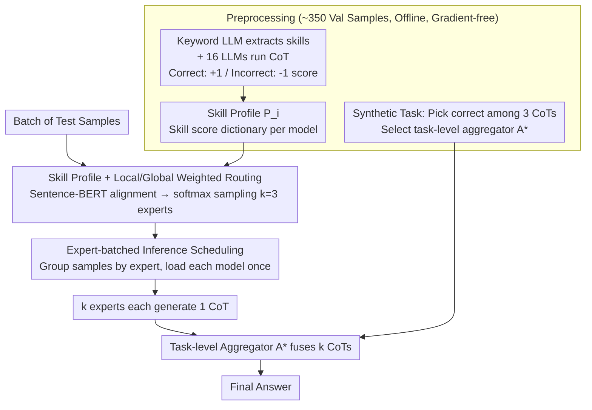

# Skill-Based Mixture-of-Experts: Adaptive Routing for Heterogeneous Reasoning via Inferred Skills

**Conference**: ICML2026  
**arXiv**: [2503.05641](https://arxiv.org/abs/2503.05641)  
**Code**: https://github.com/dinobby/Skill-MoE (Available)  
**Area**: LLM Efficiency / Mixture-of-Experts / Multi-agent Reasoning  
**Keywords**: Symbolic MoE, Skill Routing, Instance-level Expert Selection, Aggregator Selection, Batch Inference

## TL;DR
SKILL-MOE proposes a training-free symbolic MoE framework that uses "skills" as routing signals. It extracts required skills for each problem, dynamically recruits $k$ experts from 16 pre-trained LLMs based on skill-model profiles, and fuses multiple CoT responses via a task-level optimal aggregator. Combined with expert-batched inference, it runs 16 7-8B models on a single GPU, outperforming the strongest multi-agent baseline by 8.15% on average.

## Background & Motivation

**Background**: Current approaches for solving reasoning problems with multiple pre-trained LLMs follow two main paths: multi-agent debate (Debate / ReConcile / MoA / Self-MoA), which uses fixed models in multi-round discussions; or training MoEs into a single large model where experts are parameter subsets requiring end-to-end joint training. The former locks "which models to use" at the task level, while the latter cannot directly reuse existing LLM pools.

**Limitations of Prior Work**: Task-level model selection is too coarse—within mathematics, an algebra problem and a probability problem require different experts. Multi-round discussions are also prohibitively expensive, requiring 6-9 LLM calls per sample. Furthermore, deploying a pool of 16 7-8B models typically requires multiple GPUs, making it difficult to deploy on a single card.

**Key Challenge**: To balance "instance-level dynamic expert recruitment for fine-grained capability matching" with "running a large heterogeneous model pool on a single GPU." Fixed expert sets sacrifice granularity, while naive dynamic scheduling suffers from high latency due to frequent model loading and unloading.

**Goal**:
(1) Design a training-free routing mechanism capable of selecting experts at the instance level based on skills;
(2) Design an inference scheduling strategy that allows 16 7-8B models to run on a single card with throughput comparable to 4-GPU MoA;
(3) Determine the optimal aggregator selection and whether multi-round discussion can be eliminated.

**Key Insight**: Instead of training a router in the parameter space, use "natural language" as a common protocol for LLM information exchange. Use a lightweight "skill vector"—accumulated scores of each model across various skills—as a symbolic router. Skill descriptions can be inferred from questions via a keyword LLM or aligned using Sentence-BERT.

**Core Idea**: Shift MoE routing from "hidden states" to "discrete skills" and replace "parameter subsets" with "complete pre-trained LLMs," enabling dynamic recruitment on a single card via expert-batched inference.

## Method

### Overall Architecture
SKILL-MOE utilizes 16 independently trained 7-8B heterogeneous LLMs. It dynamically selects the most suitable experts for each reasoning problem and fuses their solutions into a final answer. This entire process requires no parameter training and fits into a single GPU. It consists of two stages: The preprocessing stage performs offline statistics on ~350 validation samples, using Qwen2.5-7B-Instruct as a "Keyword LLM" to extract skills. Each of the 16 models generates CoT solutions; a $+1$ score is given for correct answers and $-1$ for incorrect answers for the involved skills to build a skill profile $P_i$ (e.g., $\{\text{Algebra}: 10, \text{Biology}: 3, \dots\}$). Additionally, a "synthetic task" of picking the correct CoT among three candidates is used to identify the task-level optimal aggregator $A^*$. The inference stage extracts skills for test samples, performs cosine alignment with profile skills via Sentence-BERT, samples $k=3$ experts based on matching scores, and uses $A^*$ to fuse the $k$ generated CoTs—supported by an expert-batched inference system.

### Key Designs

**1. Skill Profile + Local/Global Weighted Instance-level Routing: Matching the right expert to the specific problem**

Task-level selection is too coarse. SKILL-MOE brings routing down to the instance level: for sample $q$ with skills $K_q$, model $M_i$'s "local adaptation score" is its accumulated skill score $S(M_i, q) = \sum_{k_j \in K_q} s^{(i)}_{k_j}$. To prevent weak models from being selected due to a single outlier skill score, this is multiplied by a "global competency" $\gamma_i$ (the ratio of the model's total profile score to the pool total). The final relevance score $w^{(i)}_q = \gamma_i \cdot S(M_i, q)$ passes through a softmax ($\tau=0.5$) for replacement sampling of $k$ experts, filtering out low-frequency experts ($<5\%$). This balances relative advantage on the sample with overall task strength. Ablations on GPQA show accuracy drops from 57.78% (Instance-level) to 52.86% (Top-3 fixed) or 42.61% (Random) (Table 5).

**2. Task-level Aggregator Selection: Using a fixed "best judge" rather than instance-level switching or majority voting**

After selecting experts, the $k$ heterogeneous CoTs must be fused. SKILL-MOE creates synthetic tasks (1 correct $+ 2$ incorrect CoTs) on the validation set to rank models by their ability to pick the correct answer, selecting the task-level best $A^*$. During inference, $y = A^*(\bigoplus_{i=1}^k y_0^{(i)})$. A counter-intuitive discovery is that "models good at reasoning are not necessarily good at aggregating." The task-specific aggregator achieved 63.71% on MMLU-Pro, outperforming Random (52.29%) and instance-level Adaptive (57.12%) aggregators (Table 3). Crucially, Table 7 shows that with the right aggregator, the gain from multi-round debate is near zero (63.83 vs. 63.71), allowing for the removal of expensive interactions.

**3. Expert-batched Inference Scheduling: Parallelizing dynamic recruitment on a single GPU**

Dynamic recruitment usually incurs high system costs due to frequent model swaps. If handled naively, GPQA latency reaches 196.92 s/sample. SKILL-MOE's engineering solution pre-calculates routing for all samples in a batch, then groups all samples required by the same expert. Each expert is loaded only once per batch. This reduces single-card latency to 25.76 s/sample, which is 44% lower than 1-GPU MoA (45.98 s) and comparable to 4-GPU MoA (21.66 s). With 4 GPUs, it drops further to 10.85 s (Table 6). This assumes samples arrive in batches, which is compatible with standard inference services like vLLM.

### Loss & Training
Completely gradient-free. All experts, aggregators, and Keyword LLMs are frozen pre-trained LLMs. "Training" consists of collecting skill scores and aggregation accuracy on ~350 validation samples. Each test sample involves $k=3$ experts $+ 1$ aggregator (4 total LLM calls), similar in scale to Self-Consistency $\times 5$ and cheaper than MoA (6 calls) or ReConcile (9 calls).

## Key Experimental Results

### Main Results
Evaluation conducted on four heterogeneous reasoning datasets: MMLU-Pro (14 subjects, 2100 problems), AIME 2024 (Math Olympiad), GPQA Diamond (Science), and MedMCQA (Medical exams). The pool consists of 16 LLMs (3.5B–12B), mostly 7-8B.

| Dataset | Metric | SKILL-MOE | Strongest Multi-agent Baseline | Gain |
|---------|--------|-----------|-------------------------------|------|
| AIME 2024 | Acc. | 68.88 | 55.56 (Self-MoA) | +13.32 |
| MMLU-Pro | Acc. | 63.71 | 61.78 (MoA) | +1.93 |
| MedMCQA | Acc. | 59.35 | 60.74 (ReConcile) | −1.39 |
| GPQA Diamond | Acc. | 57.78 | 52.86 (MoA / Self-MoA) | +4.92 |
| **Average** | Acc. | **62.43** | 54.28 (Strongest baseline avg.) | **+8.15** |

SKILL-MOE demonstrates robustness across datasets. Its average score exceeds Qwen2.5-72B (54.28) and Llama3.3-70B (53.18), and it is more stable than QwenR1-32B (56.94), which excels at AIME (76.67%) but fails at MedMCQA (24.70%).

### Ablation Study

| Configuration | Metric (GPQA) | Description |
|---------------|---------------|-------------|
| Full SKILL-MOE | 57.78 | Skill profile routing + task-level aggregator |
| Random Aggregator + Recruited Experts | 51.52 | Aggregator quality is critical |
| Task-specific Aggregator + Random Experts | 31.82 | Weak experts drag down strong aggregators (Table 4) |
| Majority Vote + Recruited Experts | 53.54 | Fallback when no aggregator is available |
| Top-3 Fixed Experts | 52.86 | Task-level vs. instance-level routing −4.92 |
| Top-5 Fixed Experts | 47.68 | Larger pools prone to noise from weak models |
| Adaptive Aggregator (MMLU-Pro) | 57.12 | Instance-level aggregator switching −6.59 |
| Task-specific Aggregator + 3-round Debate | 63.83/57.72 | Negligible gain from added discussion (Table 7) |

### Key Findings
- **Expert and Aggregator Selection Synergy**: Random experts + strong aggregator yields only 31.82%; strong experts + random aggregator yields 51.52%. Performance peaks only when both are optimized.
- **Task-level Aggregator Superiority**: The ability to reason does not equate to the ability to judge CoT correctness. Task-level selection of the "best judge" outperforms instance-level adaptive selection.
- **Strong Cross-domain Generalization**: Using skill profiles from MMLU-Pro on OmniMATH yields 49.32%, outperforming the Debate baseline by 14.81%. Skills are more transferable than task-model bindings.
- **Efficiency without Performance Loss**: Single-card latency of 25.76 s/sample is faster and more accurate than 1-GPU MoA.

## Highlights & Insights
- **Symbolic vs. Hidden State Routing**: Replacing neural routers with "skill dictionary weighted sampling" allows 16 independent LLMs to fit into an MoE framework without joint training. Profiles can be updated simply by re-running the validation set.
- **Batching as a System Enabler**: While dynamic recruitment has been attempted algorithmically, system constraints (VRAM/loading) were the bottleneck. Expert-batched inference makes running 16 7-8B models on one card viable, offering a blueprint for on-demand model cluster calls.
- **Aggregator Counter-intuition**: Results prove reasoning and aggregation capabilities are distinct. Furthermore, once an aggregator is correctly selected, multi-round discussion provides near-zero returns, suggesting many multi-agent benefits actually stem from implicit aggregation.

## Limitations & Future Work
- **Validation Set Sensitivity**: Model profiles and aggregator rankings depend on ~350 validation samples. Bias in the validation set directly affects routing.
- **Batch Arrival Requirement**: Batched inference requires a group of test samples, making it less suitable for single-stream / real-time low-latency scenarios (e.g., live chat).
- **Keyword LLM Bias**: Although switching Keyword LLMs shows minimal impact, the current reliance on Qwen series requires further validation in highly specialized domains (e.g., Law, Finance).
- **Sub-optimal Performance on MedMCQA**: Outperformed by ReConcile (59.35 vs. 60.74). Multi-round discussion likely compensates for expert uncertainty in narrow domains where expert coverage is sparse.

## Related Work & Insights
- **vs. MoA / Self-MoA**: MoA uses fixed top-k models and 2 rounds of discussion. SKILL-MOE selects experts per instance and eliminates discussion (reducing 4-9 LLM calls to 4), achieving 8.15% higher accuracy and 44% faster single-GPU speed.
- **vs. ReConcile / Multi-Agent Debate**: These rely on 6-9 iterations for consensus. SKILL-MOE replaces debate with a symbolic router and a high-quality aggregator for efficiency.
- **vs. LLM-Blender / Router-R1 / DER**: These focus on ranking/routing but require training (RL or ranking models). SKILL-MOE is gradient-free and allows hot-swappable models.
- **vs. Traditional Sparse MoE**: Traditional MoEs use parameter subsets and joint training. SKILL-MOE uses full models and natural language communication, scaling MoE concepts to the "complete agent" level.

## Rating
- Novelty: ⭐⭐⭐⭐ Shifting MoE routing to symbolic skill spaces and experts to full LLMs is a clear innovation, though individual components (skill extraction, batching) have precedents.
- Experimental Thoroughness: ⭐⭐⭐⭐⭐ 4 datasets, 8 baselines, extensive ablations, and zero-shot transfer tests on OmniMATH.
- Writing Quality: ⭐⭐⭐⭐ Clear framework diagrams and motivation; precise algorithm descriptions.
- Value: ⭐⭐⭐⭐⭐ Highly practical for researchers with limited resources; the engineering scheme is directly reusable for "on-demand LLM clusters."

<!-- RELATED:START -->

## Related Papers

- [\[ICML 2026\] SoftMoE: Soft Differentiable Routing for Mixture-of-Experts in LLMs](softmoe_soft_differentiable_routing_for_mixture-of-experts_in_llms.md)
- [\[ICML 2026\] ProbMoE: Differentiable Probabilistic Routing for Mixture-of-Experts](probmoe_differentiable_probabilistic_routing_for_mixture-of-experts.md)
- [\[ICLR 2026\] MoL: Adaptive Mixture-of-Length Reasoning for Efficient Question Answering with Context](../../ICLR2026/llm_efficiency/mol_adaptive_mixture-of-length_reasoning_for_efficient_question_answering_with_c.md)
- [\[ICLR 2026\] Routing Manifold Alignment Improves Generalization of Mixture-of-Experts LLMs](../../ICLR2026/llm_efficiency/routing_manifold_alignment_improves_generalization_of_mixture-of-experts_llms.md)
- [\[ICML 2026\] Hyperparameter Transfer with Mixture-of-Experts Layers](hyperparameter_transfer_with_mixture-of-expert_layers.md)

<!-- RELATED:END -->
## Related Papers

- [\[ICML 2026\] ProbMoE: Differentiable Probabilistic Routing for Mixture-of-Experts](probmoe_differentiable_probabilistic_routing_for_mixture-of-experts.md)
- [\[ICML 2026\] SoftMoE: Soft Differentiable Routing for Mixture-of-Experts in LLMs](softmoe_soft_differentiable_routing_for_mixture-of-experts_in_llms.md)
- [\[ICML 2026\] Hyperparameter Transfer with Mixture-of-Experts Layers](hyperparameter_transfer_with_mixture-of-expert_layers.md)
- [\[ICML 2025\] Cooperation of Experts: Fusing Heterogeneous Information with Large Margin](../../ICML2025/llm_efficiency/cooperation_of_experts_fusing_heterogeneous_information_with_large_margin.md)
- [\[AAAI 2026\] How Many Experts Are Enough? Towards Optimal Semantic Specialization for Mixture-of-Experts](../../AAAI2026/llm_efficiency/how_many_experts_are_enough_towards_optimal_semantic_specialization_for_mixture-.md)

<!-- RELATED:END -->
