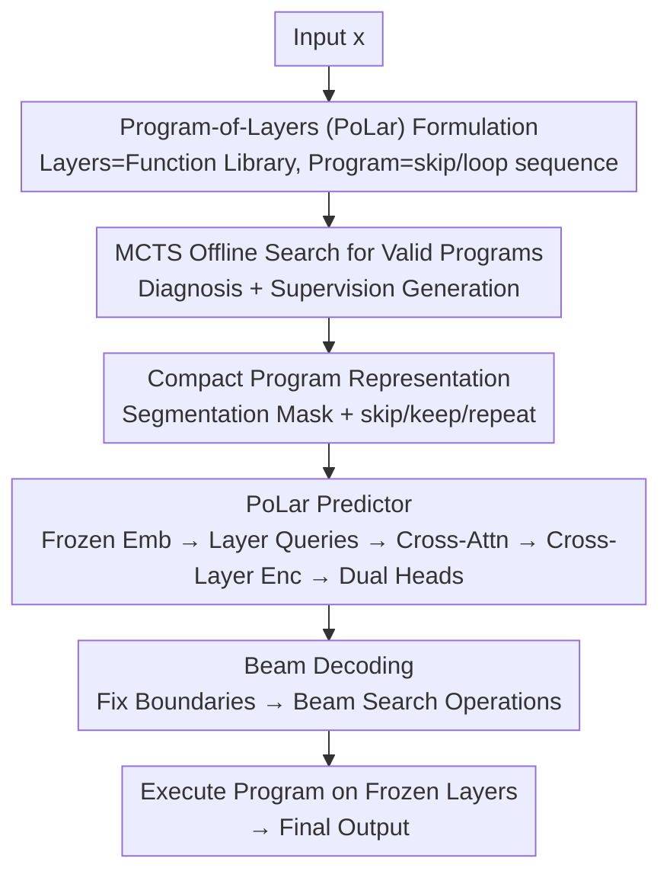

# Skip a Layer or Loop It? Learning Program-of-Layers in LLMs

**Conference**: ICML2026  
**arXiv**: [2606.06574](https://arxiv.org/abs/2606.06574)  
**Code**: https://github.com/tianyi-lab/PoLar  
**Area**: LLM Efficiency / Dynamic Depth Inference / Test-time Compute  
**Keywords**: Program-of-Layers, Layer Skipping and Looping, Dynamic Depth, Test-time Scaling, Latent Reasoning

## TL;DR
This paper treats each layer of a pre-trained LLM as an "atomic function" that can be arbitrarily invoked. It proposes "Program-of-Layers" (PoLar)—customizing an execution program for each input that can **skip or loop** layers. The authors first empirically demonstrate via MCTS that such optimal programs exist training-free for almost every input. They then train a lightweight predictor to produce the execution program in a single shot. On mathematical reasoning benchmarks, PoLar achieves higher accuracy than standard forward passes and existing dynamic depth methods, often while executing fewer layers.

## Background & Motivation
**Background**: LLM inference typically follows a **fixed depth and fixed order**: regardless of input difficulty, all $D$ layers are executed from $f_0 \to f_{D-1}$. Conversely, humans solve programs adaptively—skipping steps for simple problems and adding complexity for difficult ones.

**Limitations of Prior Work**: Existing dynamic depth methods like layer skipping, early exiting, or recurrent Transformers **adopt only a single operation** (either skipping or repeating). They produce limited architectures that are simply "shallower or deeper," failing to cover the truly diverse potential computation paths.

**Key Challenge**: Is the fixed forward pass optimal for all inputs? The authors hypothesize that **correct reasoning requires input-dependent computation**, which can occur either in token space (longer Chains-of-Thought) or within hidden states (the **latent reasoning** focused on here). Fixed-depth execution only captures a narrow subset of an LLM's potential reasoning capabilities.

**Goal**: (1) Empirically verify whether an execution program exists for each input that is superior (more accurate or shorter) to the standard forward pass; (2) Efficiently generate such programs at inference time **without expensive searching**.

**Key Insight**: Treat the $D$ layers as a library of functions $\{f_0, \dots, f_{D-1}\}$. A "program" is a sequence of layer indices $\pi=(i_1, \dots, i_K)$, inducing a composite computation $F_\pi=f_{i_K} \circ \cdots \circ f_{i_1}$. By allowing skipping and repetition, the program space becomes far larger than the single point of a "fixed forward pass." MCTS is used to search this joint space to verify the existence and structural patterns of superior programs.

**Core Idea**: Use a lightweight prediction network to **predict in one shot** an input-specific execution program (deciding which segments to skip, keep, or loop). This transforms "online program searching" into "one-time program prediction," effectively bringing the potential program dividends revealed by MCTS into practical inference.

## Method

### Overall Architecture
PoLar consists of two phases. **Phase 1 (Offline Diagnosis)**: Reformulates inference as executing a "layer program" and uses MCTS in the joint skip/loop space to search for valid programs (layer sequences that yield correct predictions) for each input. This acts as a **diagnostic tool** to verify the prevalence of superior programs and extract structural regularities; these found programs also serve as supervision signals. **Phase 2 (Online Prediction)**: Trains a lightweight PoLar predictor that directly outputs a "program representation"—a segmentation mask partitioning layers into modules, plus operation labels (skip/keep/repeat) for each module. At inference, this is decoded into a specific execution path and run once on **completely frozen** pre-trained layers. No pre-trained parameters are updated.

### Key Designs

**1. Program-of-Layers Formulation + MCTS Verification: Proving Superior Programs Exist Training-free**

This serves as the foundation. Treating each layer as a fixed function $f_i: \mathbb{R}^{T \times d} \to \mathbb{R}^{T \times d}$, inference is the execution of a layer program $\pi$. The authors use MCTS (selection-expansion-simulation-backpropagation) to search for valid programs in the joint skip/repeat space **for diagnostic purposes only**. Across five difficulty levels of DART-Math and four models, key conclusions include: searching in the **joint space** (Skip & Loop) is significantly better than skipping or looping alone; for 75.5% of inputs already answered correctly, shorter valid programs exist; 36.2% of incorrect inputs can be corrected by shorter programs, suggesting standard forward passes **frequently involve over-computation**. Harder inputs rely more on looping and skipping; valid programs are structurally "local"—54.5% of segments contain only a single layer, over 2/3 contain at most 2 consecutive layers, and each segment is repeated at most once. These patterns prove the existence of dividends and constrain the subsequent representation design.

**2. Compact Program Representation (Packed modules: segment mask + skip/keep/repeat, $K_{\max}=4$): Compressing Exponential Space**

The programs found by MCTS are variable-length, discrete, and highly non-convex, making them difficult to learn directly. Based on the "local segments + max one repetition" empirical rule, the authors compress programs into two discrete structures: a **binary boundary mask** $\mathbf{z}^{\text{seg}}(x) \in \{0,1\}^D$, where $\mathbf{z}^{\text{seg}}_i=1$ starts a new segment with a length upper bound $s_{j+1}-s_j \le K_{\max}=4$; and an **operation label vector** $\mathbf{z}^{\text{op}}(x) \in \{\textsf{skip}, \textsf{keep}, \textsf{repeat}\}^D$ (valid only at segment start), where skip removes the segment, keep executes it once, and repeat runs it twice. This collapses "arbitrary layer sequences" into "segmenting consecutive layers + choosing one of three operations per segment," covering major empirical patterns while keeping the space learnable.

**3. PoLar Predictor: Replacing Expensive Search with One-Shot Prediction**

To avoid the online cost of MCTS, a lightweight predictor is trained to output program logits. The process: input goes through a **frozen** embedding model (Qwen3-Embedding-0.6B) to get token representations $\mathbf{H}=E(x)$, linearly projected to $\tilde{\mathbf{H}}=\mathbf{H}\mathbf{W}_h$. Each layer index is assigned a **learnable layer query embedding** $\mathbf{E} \in \mathbb{R}^{D \times d}$. **Multi-head cross-attention** $\mathbf{X}=\text{MHA}(\mathbf{Q}{=}\mathbf{E}, \mathbf{K}{=}\tilde{\mathbf{H}}, \mathbf{V}{=}\tilde{\mathbf{H}})$ allows each layer to obtain an "input-conditional" representation. A **cross-layer Transformer encoder** $\mathbf{X}'=\text{Enc}_{\text{layer}}(\mathbf{X})$ then performs self-attention along the depth dimension, allowing layer decisions to see global context. Finally, two linear heads output segmentation logits $\ell^{\text{seg}} \in \mathbb{R}^D$ and operation logits $\ell^{\text{op}} \in \mathbb{R}^{D \times 3}$. Supervision comes from offline MCTS programs. When multiple valid programs exist, the **loss weight for the full-depth program is reduced** if shorter alternatives exist.

**4. Two-Stage Beam Decoding: Enabling Test-time Scaling**

If operations were chosen via independent argmax for each segment, non-local interactions would be ignored. PoLar uses a two-step decoding: first, threshold $\ell^{\text{seg}}$ to fix segment boundaries (inserting boundaries if a segment exceeds $K_{\max}$) to get start points $\{s_j\}$. Under this segmentation, operation log-probabilities are calculated, and a **small-scale beam search** is performed over segment-level operation choices to ensure global consistency, producing a ranked list of candidate programs $\pi(x)$. Increasing the number of candidates naturally allows for test-time scaling in a pass@k format.

### Loss & Training
Segmentation uses binary cross-entropy: $\mathcal{L}_{\text{seg}}=-\sum_i[\mathbf{z}^{\text{seg}*}_i \log p^{\text{seg}}_i + (1-\mathbf{z}^{\text{seg}*}_i)\log(1-p^{\text{seg}}_i)]$, where $p^{\text{seg}}_i=\sigma(\ell^{\text{seg}}_i)$. Operations use **masked cross-entropy valid only at segment starts**: $\mathcal{L}_{\text{op}}=-\sum_i m_i \log \mathbf{p}^{\text{op}}_i[\mathbf{z}^{\text{op}*}_i]$, where $m_i=\mathbf{z}^{\text{seg}*}_i$. Total objective: $\mathcal{L}=\mathcal{L}_{\text{seg}} + \mathcal{L}_{\text{op}}$. The predictor is lightweight, and the pre-trained LLM remains frozen.

## Key Experimental Results

### Main Results
Evaluation was performed on DART-Math (DM-1 to DM-5) across LLaMA-3.2-3B-Instruct, Qwen1.5-MoE-A2.7B, Qwen2.5-3B, and Qwen3-8B. The table below shows **MCTS program accuracy under different search spaces** (Base=Standard Forward, Skip=Skip only, Loop=Loop only, Skip&Loop=Joint), confirming massive dividends from the joint space (values in accuracy %).

| Model / Difficulty | Base | Skip | Loop | Skip&Loop | Gain |
| :--- | :---: | :---: | :---: | :---: | :---: |
| Qwen2.5-3B · DM-1 | 25.4 | 47.0 | 60.2 | **87.4** | +62.0 |
| Qwen2.5-3B · DM-3 | 4.3 | 25.1 | 35.5 | **65.0** | +60.7 |
| Qwen3-8B · DM-1 | 40.7 | 66.0 | 68.5 | **91.3** | +50.6 |
| LLaMA-3.2-3B · DM-1 | 37.9 | 45.7 | 54.9 | **84.7** | +46.8 |

Note: These are **existence upper bounds** (for diagnosis), showing that "better programs" exist for nearly every input.

### Main Results and OOD
The table below compares the **actual PoLar predictor** against dynamic depth baselines (ShortGPT, MindSkip, FlexiDepth, DR.LLM) on LLaMA-3.2-3B using pass@k and OOD generalization (pass@1) on Qwen1.5-MoE.

| Config | DM-1 | DM-3 | DM-5 | Note |
| :--- | :---: | :---: | :---: | :--- |
| Base (Sampling) p@1 | 40.6 | 27.4 | 29.2 | Standard forward |
| DR.LLM p@1 | 41.6 | 27.0 | 28.4 | Strongest baseline |
| **PoLar p@1** | **46.2** | **28.2** | **30.2** | Outperforms base with 1 candidate |
| **PoLar p@5** | **68.4** | **46.0** | **45.8** | Test-time scaling |
| Δ vs Base p@5 | +20.8 | +13.2 | +10.2 | Gain from more candidates |

| OOD (Qwen1.5-MoE, p@1) | ASDiv | MAWPS | MMLU-Pro·Math | Note |
| :--- | :---: | :---: | :---: | :--- |
| Base ($\tau=0$) | 59.1 | 41.7 | 13.9 | Standard forward |
| DR.LLM | 59.1 | 41.3 | 14.6 | Strongest baseline |
| **PoLar** | **63.8** | **46.7** | **18.5** | Programs learned on ID transfer to OOD |

### Key Findings
- **Skip and Loop are complementary; Looping is critical**: Loop generally outperforms Skip, but the Skip&Loop joint space achieves the highest scores, indicating complementary roles.
- **Base often over-calculates**: 75.5% of correctly answered inputs have shorter valid programs; PoLar thus often **executes fewer layers on average** while improving accuracy.
- **Hard problems require more compute**: Dependency on loop/skip increases with difficulty. Increasing candidate count at test time (segment recurrence) monotonically improves the probability of finding a valid program—revealing "test-time scaling in latent reasoning."
- **Cold start failure for baselines**: ShortGPT/MindSkip/FlexiDepth accuracies drop to single digits on math reasoning, while PoLar/DR.LLM maintain or exceed the base, suggesting improper layer operations severely disrupt reasoning.
- **OOD Robustness**: Programs learned on ID (math) generalize to ASDiv/MAWPS/MMLU-Pro across multiple domains without performance degradation.

## Highlights & Insights
- **Impactful reformulation of "layers as a library and inference as a program"**: Visualizing the fixed forward pass as a single point in program space leads naturally to the joint skip+loop space, revealing that fixed depth utilizes only a narrow subset of LLM potential.
- **Diagnosis-then-distillation paradigm**: Proving dividends exist and extracting structural priors (locality, single repeat) via expensive search, then feeding these into a compact representation for a learnable network is a highly reusable pattern.
- **Completely frozen backbone**: PoLar acts as an external lightweight scheduler without updating pre-trained weights, making it easy to deploy for existing models.
- **Candidates as Test-time Budget**: Beam decoding naturally provides a candidate set; pass@k scaling does not require model modifications and adaptively allocates compute based on difficulty.

## Limitations & Future Work
- **Dependence on MCTS supervision**: The signal comes from expensive offline MCTS searches; search quality/coverage limits the predictor. New models or tasks require re-searching.
- **Structural prior constraints**: $K_{\max}=4$, single repeat, and consecutive segments are heuristics from math reasoning that may not fit tasks requiring long-range jumps.
- **Task focus on math reasoning**: Primary results are on DART-Math; gains in generation or long-context tasks have not been verified.
- **Practical cost of pass@k**: The gains in p@5 depend on running multiple programs; single-sample latency benefits are diluted by the number of candidates.

## Related Work & Insights
- **vs ShortGPT / MindSkip**: These utilize only a single skip operation and fail on math reasoning. PoLar learns programs in a joint space, maintaining accuracy while reducing depth.
- **vs FlexiDepth / Recurrent Transformers**: These are single-operation dynamic depth methods. PoLar generalizes these by supporting joint execution controls.
- **vs DR.LLM**: DR.LLM roughly matches or slightly exceeds the base. PoLar significantly outperforms it in both p@1 and p@k scenarios with superior OOD performance.
- **vs Online MCTS / Path Enumeration**: MCTS reveals potential but is impractical for inference; PoLar replaces search with one-shot prediction, retaining dividends without the search overhead.

## Rating
- Novelty: ⭐⭐⭐⭐⭐ "Layers as library" reformulation + joint space is highly novel and empirically solid.
- Experimental Thoroughness: ⭐⭐⭐⭐ 4 models × 5 difficulties + multiple baselines + OOD. Solid, though focused on reasoning.
- Writing Quality: ⭐⭐⭐⭐⭐ Two-stage diagnostic-to-implementation narrative is clear and logical.
- Value: ⭐⭐⭐⭐ Provides a deployable paradigm for difficulty-adaptive latent reasoning on frozen models.

<!-- RELATED:START -->

## Related Papers

- [\[ACL 2025\] CLaSp: In-Context Layer Skip for Self-Speculative Decoding](../../ACL2025/llm_efficiency/clasp_self_speculative_decoding.md)
- [\[ICML 2026\] L$^3$: Large Lookup Layers](l3_large_lookup_layers.md)
- [\[ICML 2026\] Hyperparameter Transfer with Mixture-of-Experts Layers](hyperparameter_transfer_with_mixture-of-expert_layers.md)
- [\[ICML 2026\] SoftMoE: Soft Differentiable Routing for Mixture-of-Experts in LLMs](softmoe_soft_differentiable_routing_for_mixture-of-experts_in_llms.md)
- [\[ICML 2026\] KnapSpec: Self-Speculative Decoding via Adaptive Layer Selection as a Knapsack Problem](knapspec_self-speculative_decoding_via_adaptive_layer_selection_as_a_knapsack_pr.md)

<!-- RELATED:END -->
