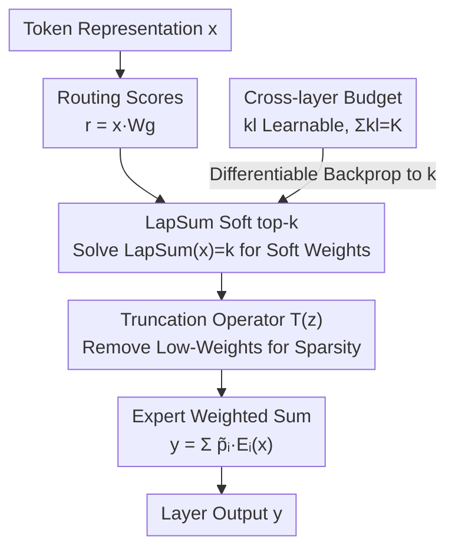

# SoftMoE: Soft Differentiable Routing for Mixture-of-Experts in LLMs

**Conference**: ICML2026  
**arXiv**: [2606.17952](https://arxiv.org/abs/2606.17952)  
**Code**: https://github.com/dlcuda/SoftMoE  
**Area**: LLM Efficiency / Mixture-of-Experts  
**Keywords**: Mixture-of-Experts, Differentiable Routing, Soft top-k, LapSum, Expert Allocation, Autoregressive

## TL;DR
SoftMoE replaces the non-differentiable hard top-$k$ selection in MoE with a LapSum-based differentiable "soft top-$k$" operator. This enables gradient optimization for routing and allows the number of activated experts to adapt per token. Furthermore, a global budget constraint allows the model to **self-learn the optimal expert allocation per layer**. Results show that SoftMoE matches or exceeds sparse MoE while using experts more efficiently, revealing an intriguing pattern: **deeper layers tend to activate more experts**.

## Background & Motivation

**Background**: Sparse Mixture-of-Experts (MoE) is a dominant method for scaling LLM parameter counts without increasing inference costs. Each token activates only the top $k$ experts (hard top-$k$ routing), maintaining autoregressive causality and strong empirical performance, with Switch Transformer as the de facto standard.

**Limitations of Prior Work**: The hard top-$k$ operator is **discrete and non-differentiable**. Gradients cannot propagate through the expert selection process, resulting in: ① The number of activated experts per token being **fixed a priori** (predefined $k$); ② Inability to adaptively allocate expert capacity across layers or tokens, often leading to inefficient compute utilization; ③ Potential instability in training dynamics. The gating matrix $\mathbf{W}_g$ is trained using "surrogate gradients" from pre-selection softmax scores, causing a mismatch between training objectives and inference-time top-$k$ selection.

**Key Challenge**: Existing alternative routing methods either break autoregressive compatibility (e.g., mixing tokens from different positions/inputs for soft routing), decouple inference routing from the training pipeline, or lead to skewed expert loads. **No current solution simultaneously achieves: adaptive capacity allocation across layers/tokens + preservation of causality + computational efficiency.**

**Goal**: To develop a two-step solution—first, a differentiable soft top-$k$ router suitable for large-scale MoEs; second, a learnable expert budget with global constraints to let the model determine the number of activated experts per layer.

**Key Insight**: The authors utilize the LapSum differentiable rank statistics operator proposed by Struski et al. (2025). It formulates the top-$k$ threshold problem as a closed-form solvable equation with **linear time/memory complexity and no sorting requirement**, making it ideal for large MoEs with 32–64 experts. Crucially, it is differentiable with respect to both routing scores $r$ **and** the selection parameter $k$—the latter being the key to learning per-layer expert counts.

**Core Idea**: Replace hard top-$k$ with LapSum soft top-$k$, processing each token independently (no token mixing, preserving autoregressivity). Combined with a differentiable $k$ and global budget constraints, "per-layer expert allocation" is transformed from a hyperparameter into a learnable parameter.

## Method

### Overall Architecture

The objective of SoftMoE is to replace the non-differentiable $\operatorname{Top_k}$ gating in standard sparse MoE with a differentiable version. This unlocks two capabilities: **per-token adaptive expert activation** and **cross-layer learned expert budget allocation**. The pipeline consists of: a routing network scoring $n$ experts $\mathbf{r}=\mathbf{x}\mathbf{W}_g$ → the LapSum soft top-$k$ operator converting scores into $[0,1]$ soft selection weights → a truncation operator removing low-contribution weights to restore sparsity → weighted summation of expert outputs. A "cross-layer budget" mechanism is layered on top, treating average activation $k_l$ as a learnable parameter constrained by a fixed global budget $K$ via softmax reparameterization.

### Key Designs

**1. LapSum Soft top-$k$ Operator: Differentiable Thresholding**

Hard top-$k$ is non-differentiable; SoftMoE relaxes it via LapSum. Given routing scores $\mathbf{r}=(r_i)$ for $n$ experts, the relaxation produces continuous weights $\tilde{\mathbf{p}}\in[0,1]^n$ such that $\sum_i \tilde{p}_i=k$. The top-$k$ threshold is found by solving:

$$\mathrm{LapSum}(x)=\sum_{i=1}^{n}F_{\text{Lap}}(r_i-x)=k,$$

where $F_{\text{Lap}}$ is the Laplace CDF. This equation has a **unique solution** $\tilde{x}$ that can be found in **closed form without sorting or iteration**, ensuring linear complexity relative to the number of experts. Intuitively, $\mathrm{LapSum}(x)$ is a smooth approximation of the counting function $\sum_i \mathbf{1}[r_i\ge x]$. The soft weights $F_{\text{Lap}}(r_i-\tilde{x})$ act as differentiable approximations of the 0/1 mask. Unlike softmax which sums to 1, LapSum outputs **sum exactly to $k$** with elements in $[0,1]$, preserving sparse semantics while enabling gradient flow for both $r$ and $k$.

**2. ReLU-style Truncation for Sparsity: Per-token Adaptive Activation**

While soft top-$k$ provides differentiability, calculating all $n$ experts would be computationally expensive. A truncation operator is used to remove low-contribution weights:

$$\mathcal{T}(z)=z\,\mathbb{I}_{z>\tau},$$

setting soft weights below threshold $\tau$ to zero. This ensures only experts with $z>\tau$ consume compute and receive gradients. Since truncation is based on a **threshold rather than a fixed rank**, the number of activated experts **depends on the token**. Simple tokens concentrate weights on fewer experts, while complex tokens distribute weights more broadly, achieving per-token compute adaptivity.

**3. Learnable Cross-layer Allocation under Global Budget**

Standard MoEs activate the same number of experts per layer, but different depths may require different capacities. By making $k$ differentiable, the average activated experts for $L$ layers is represented as a learnable vector $\mathbf{k}=(k_l)_{l=1}^L$ subject to $k_l\ge 1$ and $\sum_{l=1}^L k_l=K$. Reparameterization is used for unconstrained optimization:

$$\bm{\pi}=\operatorname{softmax}(\bm{\eta}),\quad k_l=\pi_l\cdot(K-L)+1.$$

The softmax ensures $\sum_l \pi_l=1$, and the affine transformation maps the probability simplex to the feasible region. This allows the model to optimize per-layer算力 allocation via gradient descent. A global budget $K$ (e.g., $K=2L$) induces **inter-layer competition**, forcing the model to move capacity to the most beneficial layers.

### Loss & Training

The model uses a decoder-only GPT-2 architecture (10 blocks, 32 experts per block, 5M params per expert, 1.63B total params). Dense MLPs are replaced with Switch-style sparse MoE or SoftMoE layers. All models include the Switch auxiliary load balancing loss to maintain expert balance and use small noise on gate pre-activations to encourage exploration. Training was conducted for 164k steps on C4 and 18k steps on OWT using Megatron-LM.

## Key Experimental Results

### Main Results

The table compares performance grouped by "average activated expert budget" (Train-AE/Infer-AE represent average activated experts during training/inference; lower Loss is better):

| Dataset | Model | Budget | Train-AE | Infer-AE | Loss | HellaSwag |
|---------|-------|--------|----------|----------|------|-----------|
| OWT | Sparse MoE (k=2) | ≤2 | 2 | 2 | 2.79 | 31.50 |
| OWT | SoftMoE* (k=1.5) | ≤2 | **1.53** | **1.73** | **2.78** | 32.13 |
| OWT | SoftMoE (k=1.5) | ≤2 | 1.63 | 1.96 | **2.76** | **32.12** |
| C4 | Sparse MoE (k=2) | ≤2 | 2 | 2 | 2.24 | 45.41 |
| C4 | SoftMoE* (k=1.5) | ≤2 | **1.65** | 1.81 | **2.23** | **45.49** |
| C4 | Sparse MoE (k=4) | ≤4 | 4 | 4 | 2.20 | 47.23 |
| C4 | SoftMoE* (k=1, α=4) | ≤4 | 3.60 | 3.82 | **2.19** | **48.48** |

In the ≤2 budget category, SoftMoE* achieves lower loss while **activating 17% (C4) to 24% (OWT) fewer experts during training**. Soft routing consistently outperforms sparse MoE on HellaSwag across all configurations.

### Ablation Study

| Configuration | Key Difference | Effect |
|---------------|----------------|--------|
| Sparse MoE | Hard top-$k$, fixed $k$ per layer | Baseline |
| SoftMoE* | Soft top-$k$, no learnable allocation | Lower loss with fewer experts; validates differentiable routing |
| SoftMoE | Soft top-$k$ + Learnable allocation | Further reduced loss; capacity migrates towards later layers |

### Key Findings

- **Differentiable routing is inherently valuable**: SoftMoE* (soft top-$k$ only) outperforms the baseline with fewer experts, suggesting gains primarily stem from letting tokens adaptively decide their own activation counts.
- **Learned allocation is highly non-uniform and favors later layers**: Under global budget constraints, SoftMoE shifts capacity from early/middle layers to the final layers—**the last 3 transformer blocks consume approx. 50% of the total expert budget**.
- **Alignment with representation depth research**: The preference for more experts in deeper layers aligns with findings that deep layers encode high-level semantics while shallow layers handle syntax. This suggests that **depth-aware expert allocation is more rational than uniform allocation**.
- **Downstream task gains**: Soft routing dominates on HellaSwag and performs better or comparably on PIQA. The best pre-training loss configurations typically result in the strongest downstream performance.

## Highlights & Insights
- **Hyperparameters to Learnable Parameters**: Expert activation counts, previously a manually tuned hyperparameter, are now optimized end-to-end via LapSum's differentiability w.r.t $k$.
- **Autoregressive-Safe Soft Routing**: Unlike previous soft routing methods (token mixing/aggregation) that break causality or risk leakage, SoftMoE processes tokens independently, making it fully compatible with autoregressive LMs.
- **"Later Layers Need More Experts" as an Engineering Insight**: This discovery challenges the industry convention of uniform allocation, suggesting that shifting budget to deeper layers can provide performance gains for free.
- **Closed-form + Linear Complexity**: LapSum's $O(n)$ complexity makes soft routing feasible for real-world MoEs with 32–64 experts, rather than being limited to small-scale toys.

## Limitations & Future Work
- **Small Scale**: Testing was limited to 1.63B parameters and 10 layers; whether findings (e.g., the 50% budget shift) generalize to massive models remains unknown.
- **Limited Modalities**: Evaluated only on English text; performance in multilingual or multimodal settings is untested.
- **Boundary Non-differentiability & OOM Patches**: Truncation remains non-differentiable at the threshold boundary, and an expansion factor $\alpha$ is required to cap activations and prevent OOM, indicating per-token adaptivity still requires hard limits in practice.
- **Cost of Learned Allocation**: While SoftMoE (with learning) achieves lower loss, it also slightly increases average activation; it is not always a "pure gain" under extremely strict compute budgets.

## Related Work & Insights
- **vs Switch Transformer (Fedus et al. 2022)**: Switch uses hard routing and uniform allocation; SoftMoE provides a differentiable upgrade that matches/exceeds it with fewer experts.
- **vs Soft MoE / Mixture of Tokens (Puigcerver 2024, Antoniak 2024)**: These methods rely on token mixing/aggregation, breaking causality; SoftMoE's independence per token is a key differentiator for LMs.
- **vs LapSum Original (Struski et al. 2025)**: This work applies the LapSum operator to large-scale MoE routing and uniquely exploits its differentiability w.r.t $k$ for cross-layer budget learning.

## Rating
- Novelty: ⭐⭐⭐⭐ Applying differentiable top-$k$ to autoregressive MoE and enabling learnable budgets is a solid, novel contribution.
- Experimental Thoroughness: ⭐⭐⭐ Good variety of datasets and ablations, but lacks validation on larger scales or multi-modal tasks.
- Writing Quality: ⭐⭐⭐⭐ Clear derivation from hard to soft routing; well-structured explanation of LapSum and budget mechanisms.
- Value: ⭐⭐⭐⭐ The "later layer budget" and "learnable allocation" concepts offer direct, practical insights for MoE architecture design. Code is open-sourced.

## Related Papers

- [\[ICML 2026\] ProbMoE: Differentiable Probabilistic Routing for Mixture-of-Experts](probmoe_differentiable_probabilistic_routing_for_mixture-of-experts.md)
- [\[ICML 2026\] Skill-Based Mixture-of-Experts: Adaptive Routing for Heterogeneous Reasoning via Inferred Skills](skill-based_mixture-of-experts_adaptive_routing_for_heterogeneous_reasoning_via_.md)
- [\[ICML 2026\] RepetitionCurse: Measuring and Understanding Router Imbalance in Mixture-of-Experts LLMs under DoS Stress](repetitioncurse_measuring_and_understanding_router_imbalance_in_mixture-of-exper.md)
- [\[ICML 2026\] Hyperparameter Transfer with Mixture-of-Experts Layers](hyperparameter_transfer_with_mixture-of-expert_layers.md)
- [\[ICML 2026\] Beyond Sunk Costs: Boosting LLM Pre-training Efficiency via Orthogonal Growth of Mixture-of-Experts](beyond_sunk_costs_boosting_llm_pre-training_efficiency_via_orthogonal_growth_of_.md)

<!-- RELATED:END -->

<!-- RELATED:START -->

## Related Papers

- [\[ICML 2026\] ProbMoE: Differentiable Probabilistic Routing for Mixture-of-Experts](probmoe_differentiable_probabilistic_routing_for_mixture-of-experts.md)
- [\[ICML 2026\] Skill-Based Mixture-of-Experts: Adaptive Routing for Heterogeneous Reasoning via Inferred Skills](skill-based_mixture-of-experts_adaptive_routing_for_heterogeneous_reasoning_via_.md)
- [\[ICML 2026\] RepetitionCurse: Measuring and Understanding Router Imbalance in Mixture-of-Experts LLMs under DoS Stress](repetitioncurse_measuring_and_understanding_router_imbalance_in_mixture-of-exper.md)
- [\[ICML 2026\] Beyond Sunk Costs: Boosting LLM Pre-training Efficiency via Orthogonal Growth of Mixture-of-Experts](beyond_sunk_costs_boosting_llm_pre-training_efficiency_via_orthogonal_growth_of_.md)
- [\[ICML 2026\] Variational Routing: A Scalable Bayesian Framework for Calibrated MoE Transformers](variational_routing_a_scalable_bayesian_framework_for_calibrated_mixture-of-expe.md)

<!-- RELATED:END -->
