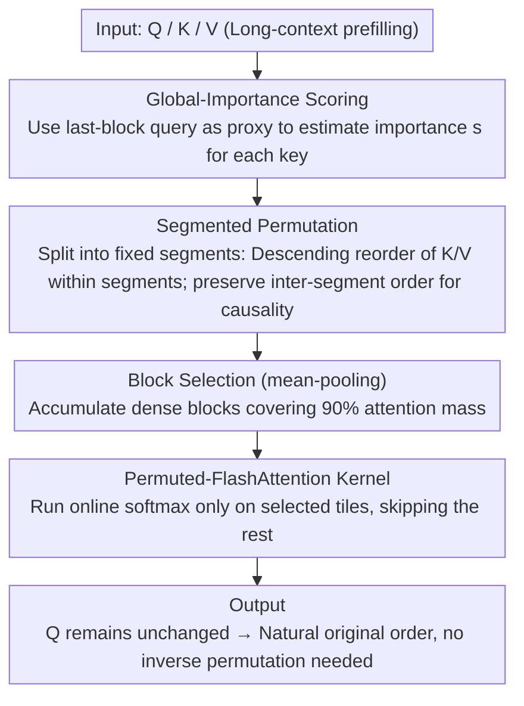

# Sparser Block-Sparse Attention via Token Permutation

**Conference**: ICML 2026  
**arXiv**: [2510.21270](https://arxiv.org/abs/2510.21270)  
**Code**: https://github.com/xinghaow99/pbs-attn (Available)  
**Area**: LLM Efficiency / Long Context / Sparse Attention  
**Keywords**: Block-sparse attention, Token Permutation, Long-context Prefilling, FlashAttention, Heavy Hitter

## TL;DR
Ours proposes PBS-Attn, which leverages the permutation invariance of attention to rearrange Keys within segments based on "global importance." This clusters scattered "heavy hitters" into continuous high-density blocks before performing block-sparse computation, achieving up to 2.75x end-to-end acceleration for long-context prefilling while nearly matching full attention accuracy.

## Background & Motivation

**Background**: The bottleneck of long-context LLMs is the $O(N^2)$ complexity of self-attention. FlashAttention addresses memory issues via tiling and online softmax, but FLOPs remain quadratic. Block-sparse attention (MInference / FlexPrefill / XAttention, etc.) adds a "block mask" atop FlashAttention tiling to skip entire blocks predicted to have low weights, serving as the current mainstream acceleration path.

**Limitations of Prior Work**: Block-sparse methods are constrained by the **original structure** of the attention matrix. Key tokens that a query focuses on in a specific block ("heavy hitters") are actually scattered across the sequence following a heavy-tailed distribution. To cover them, many blocks must be selected, yet each selected block contains very few truly useful tokens, leading to significant computational waste.

**Key Challenge**: Existing methods only passively select blocks within a **given chaotic matrix** (optimizing $\mathbb{C}_{\text{sel}}$), while no work has optimized the architecture of the attention matrix itself. This represents an overlooked axis of optimization.

**Goal**: Actively reshape the permutation of Q/K/V to increase block-level sparsity from 30%-40% to over 60% and achieve wall-clock end-to-end acceleration while maintaining model accuracy and causality.

**Key Insight**: Attention is **permutation invariant** with respect to Key-Value pairs ($\text{Attn}(Q, P_\pi K, P_\pi V) = \text{Attn}(Q, K, V)$). This allows for the free rearrangement of key order to physically cluster scattered heavy hitters without changing the mathematical output. The remaining challenges are: ① defining "importance" for sorting; ② coexisting with the causal mask.

**Core Idea**: Use the last query block as a proxy to estimate the global importance score of each key, then rearrange keys in descending order of scores **within segments** while maintaining original inter-segment order to preserve causality — transforming "block selection" into "organize first, then select."

## Method

### Overall Architecture

PBS-Attn is a plug-and-play acceleration module for long-context prefilling. Its core mechanism shifts block-sparse attention from "passive selection" to "clustering important keys before selection." In a single forward pass, it performs four steps: first, it uses the last query block of the sequence as a proxy to estimate a global importance score for each key; next, it partitions the sequence into fixed-length segments and rearranges K (and corresponding V) in descending order of scores within segments while maintaining inter-segment order for causality; then, it uses mean-pooling on the rearranged tensors to select truly dense blocks and runs FlashAttention online softmax only on these blocks; finally, since the queries remain unchanged throughout, the output naturally follows the original order without requiring inverse permutation. The entire process does not alter the mathematical output but reshapes the sparsity structure of the attention matrix.

### Key Designs

**1. Global-Importance-based Key Permutation: Using last-block queries as a proxy to rank heavy hitters**

To cluster scattered heavy hitters, a metric for "key importance" is required. This design provides a computable definition: score vector $\mathbf{s} = \text{mean}_{\text{rows}}(\text{softmax}(\mathbf{Q}_{\text{last\_block}} \mathbf{K}^T / \sqrt{d}))$, after which keys are sorted in descending order. Since sorting the full $QK^T$ requires $O(N^2)$, which is counterproductive, only the last $B$ queries are used as a proxy, reducing the cost to linear $O(NBd)$. Empirical results show this is nearly identical to "all-query averaging." Why is a small set of queries sufficient? Because heavy hitters (attention sinks, vertical line patterns, etc.) are consistently important across different queries. Controlled experiments on 16K context (Figure 1) show that random permutation degrades performance (indicating local structures must be respected), while fine-grained greedy local alignment is slightly better but inferior to global importance sorting. This shifts the explanation of "why permutation works" from empirical observation to an interpretable inductive bias: the key to sparse attention is clustering globally important tokens.

**2. Segmented Permutation: Rearranging keys without breaking the causal mask**

Applying a one-time global rearrangement based on importance scores violates causality — a global permutation completely scatters the causal triangle, forcing the calculation of upper triangular blocks that would otherwise be skipped (increasing block density from $\frac{T_c+1}{2T_c}$ to 1), leading to negative gains. The solution is segmentation: partition the first $\lfloor N/S \rfloor \cdot S$ tokens into $G$ segments of length $S$. The global permutation matrix is written in block-diagonal form $\mathbf{P}_\pi = \text{diag}(\mathbf{P}_{\pi_1}, \dots, \mathbf{P}_{\pi_G}, \mathbf{I})$: keys are rearranged in descending order of $\mathbf{s}$ within segments ($\pi_i = \text{argsort}(-\mathbf{s}_{[(i-1)S+1 : iS]})$), while relative segment order remains unchanged. Thus, query $q_i$ can still only "see" its own segment and all preceding segments — which remain within its visible range regardless of internal rearrangement. Diagonal segments (query segment = key segment) retain the causal triangle, and off-diagonal blocks are either entirely selected or skipped. Segmentation is the minimal compromise between "preserving causality" and "enhancing sparsity."

**3. Permuted-FlashAttention Kernel: Rearranging only K/V to avoid GQA duplication overhead**

Permutation alone is insufficient; it must translate to wall-clock acceleration without interrupting online softmax in SRAM. The kernel first performs a one-time rearrangement of $\mathbf{K}' = \mathbf{P}_\pi \mathbf{K}$ and $\mathbf{V}' = \mathbf{P}_\pi \mathbf{V}$ in HBM. A block selection mask $\mathbf{M}$ then dictates which $(i,j)$ tiles to skip: selected tiles undergo the standard FlashAttention process to update $\mathbf{m}_i^{(j)}, \mathbf{l}_i^{(j)}, \mathbf{O}_i^{(j)}$, while skipped tiles inherit the previous state. A key trade-off is "rearranging K/V only, leaving Q unchanged": the gains from query permutation are marginal (Figure 6a) but require an additional inverse permutation of the output and re-organization of query tiles under GQA, which is inefficient. Keeping queries stationary offers a hidden benefit: under GQA, where one query head corresponds to multiple key heads, permutation can either be independent (default, maximizing sparsity) or shared (Appendix G, saving memory). Rearranging only K/V is the most cost-effective approach.

### Loss & Training

PBS-Attn is a **training-free** inference acceleration method that introduces no additional parameters. The default configuration uses $B=128$, $S=256$, and a block selection threshold of 0.9 (stopping block selection once 90% of accumulated attention mass is covered). Combining segmented permutation with antidiagonal scoring (the block selection strategy of XAttention) yields the enhanced PBS-Attn+.

## Key Experimental Results

### Main Results

Average LongBench scores (Llama-3.1-8B-Instruct, closer to Full is better):

| Method | Single-Doc QA | Multi-Doc QA | Few-shot | Synthetic | Avg | Note |
|------|---------------|--------------|----------|-----------|-----|------|
| Full Attention | 48.80 | 41.80 | 29.73 | 66.82 | **38.28** | Upper bound oracle |
| MInference | 47.21 | 40.93 | 29.36 | 62.36 | 37.06 | Offline pattern search |
| FlexPrefill | 47.03 | 38.57 | 30.38 | 24.71 | 30.56 | Failed on Synthetic task |
| XAttention | 48.26 | 40.23 | 31.35 | 54.64 | 36.42 | Antidiagonal scoring |
| MeanPooling (No perm) | 46.61 | 40.66 | 30.64 | 58.14 | 36.67 | Same selector, no reorder |
| **PBS-Attn** | 48.00 | **42.09** | 28.36 | **63.80** | **37.37** | Only 0.91 below Full |

Average scores on RULER 128K for Llama-3.1-8B-Instruct: Full 75.30 / MeanPooling 59.32 / PBS-Attn 66.98 / PBS-Attn+ 72.09 — the relative gains of permutation increase with context length (7.66 point improvement over MeanPooling at 128K).

Efficiency: TTFT measured on H100 shows PBS-Attn achieves **2.75×** end-to-end acceleration relative to FlashAttention at 256K context, remaining the fastest or tied for fastest across 8K-512K. In contrast, MInference only shows acceleration starting at 128K, and XAttention growth plateaus after 128K.

### Ablation Study

| Configuration | Observation | Explanation |
|------|------|------|
| Permute K only (Default) | Optimal performance-density curve | Main design |
| Permute Q only | Marginal gains, low efficiency under GQA | Not adopted |
| Permute both Q and K | No significant improvement | Excluded |
| Large segment $S$ | Flatter performance-density curve | Better intra-segment sorting, but higher diagonal computation |
| No permutation (MeanPooling) | 31% relative score drop on LongBenchv2-Qwen | Validates value of permutation |
| Random Permutation | Significant performance drop | Confirms local structures must be respected |
| Greedy local alignment | Inferior to global heavy-hitter sorting | Global clusters $\succ$ Local fine-tuning |

### Key Findings

- **Gains scale with length**: Sparsity absolute increase is 7% at 8K, while selected blocks decrease by 14.4% at 128K. Permutation is more valuable as fragmentation worsens in longer contexts.
- **Heavy hitters are query-agnostic**: Utilizing a random query subset vs. the last block as a proxy shows negligible difference. This suggests important keys are intrinsic sequence properties rather than strongly query-dependent, justifying the $O(NBd)$ proxy overhead.
- **Permutation is orthogonal to block selection algorithms**: Replacing the selector in PBS-Attn with antidiagonal scoring (XAttention) yields PBS-Attn+, pushing RULER scores closer to full attention (only 3.21 difference on Llama). Gains are structural and not coupled to specific selectors.
- **Bounded failure modes**: Across 1024 heads of Llama-3.1-8B, permutation improves sparsity for 70.8% of heads at 97.5% coverage and only degrades 5.2% of heads, typically those with naturally "diagonal" or "neatly vertical" patterns.

## Highlights & Insights

- **Shifting from "selection" to "organize then select" is an elegant perspective shift**: While prior block-sparse works focused on selection strategies, ours changes the optimization axis — the attention matrix itself can be losslessly rewritten. Opening a new optimization dimension is often more valuable than exhausting an old one.
- **Causal handling of Permutation is transferable**: Segmented permutation + inter-segment preservation provides a general framework for local rearrangement in scenarios requiring global order. This could be applied to KV cache eviction, prefix caching, or verification stages in speculative decoding.
- **The proxy estimation logic is highly efficient**: The $O(NBd)$ cost of using the last-block query as a proxy is minimal compared to the ~30% structural optimization it provides. This paradigm—spending 1% compute for 30% structural gain—could be applied to KV quantization, token pruning, or layer skipping.

## Limitations & Future Work

- **Focuses only on prefilling, not decoding**. The proxy sorting logic is less applicable to decoding where only one query is produced per step; KV cache permutation would require more complex incremental maintenance.
- **Proxy reliance on last-block query** may be distorted in ultra-long sequences where the final segment's semantics are detached from the prefix (e.g., mixed multi-documents).
- **Manual block selection threshold (0.9)**; different tasks (like KV retrieval in RULER) require switching to antidiagonal scoring to avoid performance drops, indicating a "one-size-fits-all" threshold remains elusive for synthetic tasks.
- **Memory overhead in GQA**: Defaulting to K/V duplication within groups to maximize sparsity increases HBM usage. The shared-permutation scheme reduces memory but sacrifices sparsity, lacking an adaptive compromise.

## Related Work & Insights

- **vs MInference**: MInference uses offline search for fixed attention patterns; PBS-Attn decides permutations online based on input, offering better generalization.
- **vs FlexPrefill**: FlexPrefill uses dynamic thresholds for fast selection but suffers severe accuracy drops on synthetic tasks. This highlights that "selection speed" is insufficient if the selected content is not dense.
- **vs XAttention**: XAttention uses antidiagonal scoring and is a strong baseline; PBS-Attn’s permutation is orthogonal. PBS-Attn+ achieves higher scores on LongBench, proving permutation provides plug-in gains.

## Rating
- Novelty: ⭐⭐⭐⭐⭐ First to use the permutation invariance of attention as an active optimization axis for block-sparse acceleration.
- Experimental Thoroughness: ⭐⭐⭐⭐ Extensive evaluation across three benchmarks, two models, and end-to-end TTFT measurements, though exploration of 70B+ models is missing.
- Writing Quality: ⭐⭐⭐⭐⭐ Logical flow from the observation of information fragmentation to theoretical lemmas and algorithm design.
- Value: ⭐⭐⭐⭐⭐ Training-free, plug-and-play, with 2.75x end-to-end acceleration; the permutation concept is likely to be reused in future KV cache and decoding acceleration work.

<!-- RELATED:START -->

## Related Papers

- [\[ICML 2026\] Prism: Spectral-Aware Block-Sparse Attention](prism_spectral-aware_block-sparse_attention.md)
- [\[ACL 2025\] Efficient Many-Shot In-Context Learning with Dynamic Block-Sparse Attention](../../ACL2025/llm_efficiency/efficient_many-shot_in-context_learning_with_dynamic_block-sparse_attention.md)
- [\[ICML 2026\] Stochastic Sparse Attention for Memory-Bound Inference](stochastic_sparse_attention_for_memory-bound_inference.md)
- [\[ICLR 2026\] Understanding and Improving Length Generalization in Hierarchical Sparse Attention Models](../../ICLR2026/llm_efficiency/understanding_and_improving_length_generalization_in_hierarchical_sparse_attenti.md)
- [\[ICML 2026\] Efficient Training-Free Multi-Token Prediction via Embedding-Space Probing](efficient_training-free_multi-token_prediction_via_embedding-space_probing.md)

<!-- RELATED:END -->
