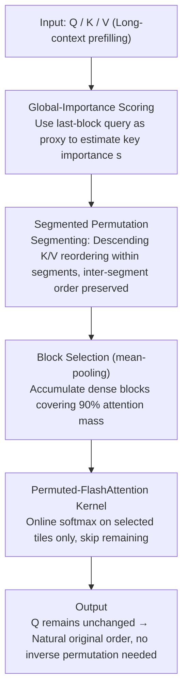

# Sparser Block-Sparse Attention via Token Permutation

**Conference**: ICML 2026  
**arXiv**: [2510.21270](https://arxiv.org/abs/2510.21270)  
**Code**: https://github.com/xinghaow99/pbs-attn (Available)  
**Area**: LLM Efficiency / Long Context / Sparse Attention  
**Keywords**: Block-Sparse Attention, Token Permutation, Long-Context Prefilling, FlashAttention, Heavy Hitter

## TL;DR
This paper proposes PBS-Attn, which leverages the permutation invariance of attention to reorder keys within segments based on "global importance." This聚拢 (gathers) scattered heavy hitters into continuous high-density blocks before performing block-sparse computation, achieving up to 2.75x end-to-end acceleration for long-context prefilling while maintaining accuracy nearly equal to full attention.

## Background & Motivation

**Background**: The bottleneck for long-context LLMs is the $O(N^2)$ complexity of self-attention. FlashAttention addresses memory issues through tiling and online softmax, but FLOPs remain quadratic. Block-sparse attention (e.g., MInference, FlexPrefill, XAttention) adds a "block mask" layer on top of FlashAttention's tiling to skip blocks predicted as low-weight, representing a primary acceleration path.

**Limitations of Prior Work**: Block-sparse methods are constrained by the **original structure** of the attention matrix. Key "heavy hitters" that a query cares about in a block are scattered across the sequence following a heavy-tailed distribution. To cover them, many blocks must be selected, but most tokens in those blocks are minimally useful, leading to inefficient "mining for a few gold nuggets in a basket of rocks."

**Key Challenge**: existing methods only passively select blocks within a **given chaotic matrix** (optimizing $\mathbb{C}_{\text{sel}}$), without optimizing the structure of the attention matrix itself. This is an overlooked axis of optimization.

**Goal**: Actively reshape the arrangement of Q/K/V to increase block-level sparsity from 30%-40% to over 60% and translate this into wall-clock acceleration without sacrificing model accuracy or causality.

**Key Insight**: Attention is **invariant to permutations** of key-values ($\text{Attn}(Q, P_\pi K, P_\pi V) = \text{Attn}(Q, K, V)$). This implies the order of keys can be freely rearranged to physically cluster scattered heavy hitters without altering the mathematical output. The remaining challenges are defining "importance" for sorting and coexisting with causal masking.

**Core Idea**: Use the last query block as a proxy to estimate the global importance score of each key, then reorder keys in descending score order **within segments**. Inter-segment order is preserved to maintain causality—transforming "block selection" into "organize first, then select."

## Method

### Overall Architecture

PBS-Attn is a plug-and-play acceleration module for long-context prefilling. Its core mechanism shifts block-sparse attention from "passive block selection" to "clustering important keys before selection." During a forward pass, it executes four steps: first, it uses the last query block as a proxy to estimate a global importance score for each key; then, it partitions the sequence into fixed-length segments and reorders K (and corresponding V) in descending score order within each segment while maintaining inter-segment order for causality; next, it uses mean-pooling on the permuted tensors to select dense blocks, executing FlashAttention online softmax only on these blocks; finally, since queries remain in their original order, the output is naturally in the original order, requiring no inverse permutation. This process preserves the mathematical output while reshaping the sparsity structure.

### Key Designs

**1. Global-Importance-based Key Permutation: Using last-block queries as a proxy to rank heavy hitters**

To cluster scattered heavy hitters, a metric for "key importance" is required. This design defines a computable importance score vector as $\mathbf{s} = \text{mean}_{\text{rows}}(\text{softmax}(\mathbf{Q}_{\text{last\_block}} \mathbf{K}^T / \sqrt{d}))$, followed by descending sorting of keys. Since global $QK^T$ sorting costs $O(N^2)$, only the last $B$ queries are used as a proxy, reducing the cost to linear $O(NBd)$. Empirical results show this matches "full query average" scores. Only a few queries are needed because heavy hitters (attention sinks, vertical line patterns, etc.) are consistent across different queries. Controlled experiments on 16K sequences (Figure 1) show that random permutation degrades performance (indicating local structures in the original order merit respect), while fine-grained greedy local alignment is slightly better but inferior to global importance sorting. This shifts the understanding of "why permutation works" from empirical observation to an interpretable inductive bias: the key to sparse attention is clustering globally important tokens.

**2. Segmented Permutation: Reordering keys without breaking causal masking**

Applying a global reorder based on importance scores conflicts with causality because global permutation disrupts the causal triangle, forcing the calculation of upper-triangular blocks that are usually skipped (increasing block density from $\frac{T_c+1}{2T_c}$ to 1), resulting in negative gains. The solution is segmentation: partitioning the first $\lfloor N/S \rfloor \cdot S$ tokens into $G$ segments of length $S$. The global permutation matrix is structured as block-diagonal $\mathbf{P}_\pi = \text{diag}(\mathbf{P}_{\pi_1}, \dots, \mathbf{P}_{\pi_G}, \mathbf{I})$, where tokens are reordered in descending score order within segments ($\pi_i = \text{argsort}(-\mathbf{s}_{[(i-1)S+1 : iS]})$) while relative order between segments remains fixed. Thus, query $q_i$ still "sees" its segment and all preceding segments, which remain in view regardless of internal reordering. Diagonal segments (query segment = key segment) preserve the causal triangle, while sub-diagonal blocks are either fully selected or fully skipped. Segmentation is the minimal compromise between "preserving causality" and "increasing sparsity."

**3. Permuted-FlashAttention Kernel: Reordering only K/V to avoid GQA duplication overhead**

Permutation alone is insufficient; it must translate to wall-clock speedup without interrupting the SRAM-based online softmax. The kernel performs a one-time reordering of $\mathbf{K}' = \mathbf{P}_\pi \mathbf{K}$ and $\mathbf{V}' = \mathbf{P}_\pi \mathbf{V}$ in HBM. A block selection mask $\mathbf{M}$ guides which $(i,j)$ tiles to skip. Selected tiles follow standard FlashAttention procedures to update $\mathbf{m}_i^{(j)}, \mathbf{l}_i^{(j)}, \mathbf{O}_i^{(j)}$, while skipped tiles inherit the previous state. A critical trade-off is "moving K/V but not Q." Query permutation yields marginal gains (Figure 6a) but requires an inverse output permutation and reorganization of query tiles under GQA, which is inefficient. Keeping Q stationary offers hidden benefits: when one query head maps to multiple key heads in GQA, permutation strategies can be either independent (default, maximizing sparsity) or shared (Appendix G, saving memory). Reordering only K/V is the most cost-effective approach.

### Loss & Training

PBS-Attn is a **training-free** inference acceleration method that introduces no additional parameters. Default configurations use $B=128$, $S=256$, and a block selection threshold of 0.9 (stopping when cumulative attention mass reaches 90%). Combining segmented permutation with antidiagonal scoring (XAttention's strategy) produces the enhanced PBS-Attn+.

## Key Experimental Results

### Main Results

LongBench Average Scores (Llama-3.1-8B-Instruct, closer to Full is better):

| Method | Single-Doc QA | Multi-Doc QA | Few-shot | Synthetic | Avg | Note |
|------|---------------|--------------|----------|-----------|-----|------|
| Full Attention | 48.80 | 41.80 | 29.73 | 66.82 | **38.28** | Upper bound oracle |
| MInference | 47.21 | 40.93 | 29.36 | 62.36 | 37.06 | Offline pattern search |
| FlexPrefill | 47.03 | 38.57 | 30.38 | 24.71 | 30.56 | Failed on Synthetic |
| XAttention | 48.26 | 40.23 | 31.35 | 54.64 | 36.42 | Antidiagonal scoring |
| MeanPooling (No perm) | 46.61 | 40.66 | 30.64 | 58.14 | 36.67 | Same selector, no perm |
| **Ours (PBS-Attn)** | 48.00 | **42.09** | 28.36 | **63.80** | **37.37** | Only 0.91 below Full |

Average scores on RULER 128K for Llama-3.1-8B-Instruct: Full 75.30 / MeanPooling 59.32 / PBS-Attn 66.98 / PBS-Attn+ 72.09. The relative Gain of permutation increases with context length (提升 7.66 points over MeanPooling at 128K).

Efficiency: TTFT measured on H100 shows PBS-Attn achieves **2.75×** end-to-end acceleration relative to FlashAttention at 256K context, remaining the fastest or tied for fastest across 8K-512K. In contrast, MInference only accelerates after 128K, and XAttention gains plateau after 128K.

### Ablation Study

| Configuration | Phenomenon | Note |
|------|------|------|
| Permute K only (Default) | Optimal performance-density curve | Main design |
| Permute Q only | Marginal gains, inefficient under GQA | Not adopted |
| Permute both Q and K | No significant improvement | Excluded |
| Large segment $S$ | Flatter performance-density curve | Better sorting info, but higher diagonal cost |
| No permutation (MeanPooling) | 31% relative drop on LongBenchv2-Qwen | Validates permutation value |
| Random Permutation | Significant performance drop | Confirms original order has local structure |
| Greedy local alignment | Inferior to global heavy-hitter sorting | Global cluster ≻ Local precision |

### Key Findings

- **Gains with length**: Sparsity improves by a 7% absolute margin at 8K, and selected blocks decrease by 14.4% at 128K. On RULER 128K, it improves over MeanPooling by 7.66 points. Permutation is more valuable as fragmentation increases in longer contexts.
- **Heavy hitters are query-agnostic**: Results using a random query subset vs. the last block as proxy are nearly identical. This suggests important keys are intrinsic properties of the sequence rather than strongly query-dependent, justifying the $O(NBd)$ proxy cost.
- **Orthogonality to block selection**: Integrating antidiagonal scoring (XAttention) into PBS-Attn (forming PBS-Attn+) pulls RULER scores closer to full attention (only 3.21 difference on Llama). This proves permutation gains are structural and independent of specific selectors.
- **Bounded failure modes**: Across 1024 heads of Llama-3.1-8B, permutation improves sparsity for 70.8% of heads at 97.5% coverage, while only 5.2% of heads (typically those with "diagonal bands" or "neat vertical lines") perform worse.

## Highlights & Insights

- **Shifting from "selecting" to "organizing then selecting" is an elegant perspective change**: Previous block-sparse works focused on selection strategies; this work introduces a new optimization axis—the attention matrix itself can be losslessly rewritten. Opening a new dimension is often more valuable than exhaustive optimization of existing ones.
- **Segmented permutation's causality handling is generalizable**: Segment-internal reordering plus segment-external preservation provides a framework for reordering tokens where global order is required. This could be applied to KV cache eviction, prefix caching, or speculative decoding verification.
- **Cheap global importance estimation via minimal proxies is transferable**: The last-block proxy costs only $O(NBd)$ but stably identifies heavy hitters. This paradigm of "1% compute for 30% structural optimization" could be applied to KV quantization, token pruning, or layer skipping.

## Limitations & Future Work

- **Supports prefilling only, not decoding**. Decoding generates one query per step, making the proxy sorting logic inapplicable. Decodding KV cache permutation would require sophisticated incremental maintenance.
- **Scoring relies on the last-block query proxy**, which might fail for extremely long sequences where final segment semantics diverge from early text (e.g., mixed documents). Robustness analysis for extreme mismatch scenarios is missing.
- **The block selection threshold 0.9 is manual**; different tasks (like KV retrieval in RULER) require switching to antidiagonal scoring to maintain accuracy, indicating a "one size fits all" threshold is insufficient for synthetic tasks.
- **GQA necessitates K/V duplication within groups to maximize sparsity**, increasing HBM usage. The share-permutation scheme in Appendix G saves memory but reduces sparsity; an adaptive trade-off is not yet explored.
- **Future Improvements**: 1. Replace last-block proxy with a robust "union of dynamic query samples"; 2. Make segment size $S$ adaptive per layer/head; 3. Extend permutation to decoding with incremental re-sorting for segmented KV caches.

## Related Work & Insights

- **vs MInference**: MInference uses offline search for fixed attention patterns; PBS-Attn determines permutation online based on input, offering better generalization (MInference drops to 70.47 on RULER 128K, while PBS-Attn+ reaches 72.09).
- **vs FlexPrefill**: FlexPrefill uses dynamic thresholds but suffers significant accuracy loss (LongBench Synthetic 24.71 vs Full 66.82). This highlights that speed is useless if the selected content is not truly dense.
- **vs XAttention**: XAttention uses diagonal scoring and is a strong baseline. PBS-Attn's permutation is orthogonal; PBS-Attn+ uses XAttention as a selector with permutation, pushing LongBench to 36.87 (0.45 higher than XAttention).
- **vs Heavy Hitter Oracle (H2O)**: H2O keeps important tokens during decoding; ours clusters them for full calculation during prefilling. They represent different phase-specific utilizations of the "heavy hitter" belief—one for "who to keep," the other for "how to arrange."

## Rating
- **Novelty**: ⭐⭐⭐⭐⭐ First to use attention permutation invariance as an active optimization axis for block-sparse acceleration, with clean causality handling.
- **Experimental Thoroughness**: ⭐⭐⭐⭐ Comprehensive testing on LongBench/RULER with multiple models and end-to-end TTFT; lacks 70B+ scale testing and decoding discussion.
- **Writing Quality**: ⭐⭐⭐⭐⭐ Logical flow from information fragmentation to theory (lemmas/theorems) and then algorithm/experiments. Figure 1 clearly illustrates the core motivation.
- **Value**: ⭐⭐⭐⭐⭐ Training-free, plug-and-play, with open-source Triton kernels. 2.75× speedup has direct utility for long-context inference services; the permutation concept is likely to be reused in KV cache compression and decoding.

<!-- RELATED:START -->

## Related Papers

- [\[ICML 2026\] Prism: Spectral-Aware Block-Sparse Attention](prism_spectral-aware_block-sparse_attention.md)
- [\[ACL 2025\] Efficient Many-Shot In-Context Learning with Dynamic Block-Sparse Attention](../../ACL2025/llm_efficiency/efficient_many-shot_in-context_learning_with_dynamic_block-sparse_attention.md)
- [\[ICML 2026\] Stochastic Sparse Attention for Memory-Bound Inference](stochastic_sparse_attention_for_memory-bound_inference.md)
- [\[ICLR 2026\] InfLLM-V2: Dense-Sparse Switchable Attention for Seamless Short-to-Long Adaptation](../../ICLR2026/llm_efficiency/infllm-v2_dense-sparse_switchable_attention_for_seamless_short-to-long_adaptatio.md)
- [\[ICML 2026\] Efficient Training-Free Multi-Token Prediction via Embedding-Space Probing](efficient_training-free_multi-token_prediction_via_embedding-space_probing.md)

<!-- RELATED:END -->
