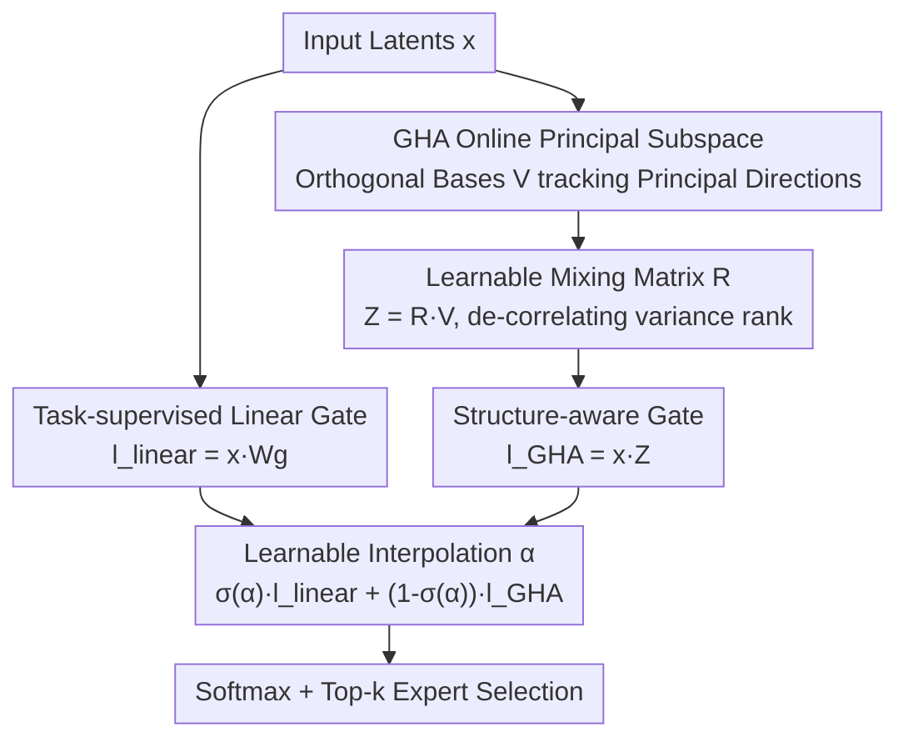

# STAR: Rethinking MoE Routing as Structure-Aware Subspace Learning

**Conference**: ICML 2026  
**arXiv**: [2606.08814](https://arxiv.org/abs/2606.08814)  
**Code**: https://github.com/psmiz/STAR  
**Area**: LLM Efficiency / MoE Routing  
**Keywords**: Mixture-of-Experts, Routing, Principal Subspace, Generalized Hebbian Algorithm, Expert Specialization

## TL;DR
STAR reinterprets MoE routing as a "subspace learning" problem. Beyond the traditional shallow linear router, it employs the Generalized Hebbian Algorithm (GHA) to online-learn a set of orthogonal bases tracking the principal directions of the input. This aligns routing decisions directly with the input structure, achieving more stable expert specialization and superior downstream performance across synthetic tasks, LLaMA-MoE pre-training, BERT-GLUE fine-tuning, and ViT ImageNet-C.

## Background & Motivation
**Background**: Mixture-of-Experts (MoE) expands model capacity with negligible computational increase by sending each input to only a few experts. The routing (gating) network determines expert assignment. Currently, most mainstream MoE models (Switch, Mixtral, DeepSeek, Qwen) utilize simple **shallow linear projections + softmax/sigmoid** for routers.

**Limitations of Prior Work**: These minimalist routers lack expressivity and fail to capture complex variations in input distributions. This leads to unstable and imbalanced expert specialization—where some experts are overloaded while others are never selected (expert collapse).

**Key Challenge**: Previous studies predominantly treat "routing imbalance" as the primary issue, addressing it through various load-balancing regularizations (e.g., Switch's load-balancing loss, GShard loss) or expert-choice routing. However, load balancing only ensures experts are used uniformly; it does not guarantee that routing decisions reflect intrinsic input differences. Essentially, the field has overlooked an orthogonal dimension: **whether the router truly "understands" the input structure.**

**Goal**: Facilitate a data-aware router capable of sensing and responding to meaningful variations in inputs to promote stable input-expert specialization. This mechanism should coexist with existing balance losses rather than replacing them.

**Key Insight**: The authors observe that the "principal directions of variation" in input hidden representations constitute its principal subspace (top-K components). If a router explicitly assigns experts along these principal directions, specialization naturally becomes more stable. Since standard PCA requires explicit covariance calculation and is unsuitable for streaming training, an alternative is needed.

**Core Idea**: Use the Generalized Hebbian Algorithm (GHA) to incrementally estimate the top-K principal subspace of inputs online. Integrate this as a "structure-aware" routing branch and perform learnable interpolation with the traditional "task-supervised" linear branch—effectively **treating MoE routing as principal subspace learning.**

## Method

### Overall Architecture
STAR's input and output remain identical to standard MoE: given a hidden representation $x\in\mathbb{R}^d$, it outputs routing scores $s\in\mathbb{R}^K$ for top-k expert selection. The difference lies in the score calculation. STAR maintains **two routing branches**: a task-supervised linear gate $l_\text{linear}=xW_g^\top$ (learned via gradients but insensitive to input structure), and a structure-aware gate $l_\text{GHA}=xZ^\top$, where $Z=RV$ is derived from a set of principal subspace bases $V$ tracked online via GHA. These branches are merged via element-wise interpolation using a learnable coefficient $\alpha$ before the softmax. GHA bases are updated during each forward pass, ensuring the subspace evolves with the distribution of representations.

### Key Designs

**1. GHA Online Principal Subspace: Enabling the Router to "See" Structure**

To address the structure-insensitivity of linear routers, STAR introduces orthogonal bases $V\in\mathbb{R}^{K\times d}$ to explicitly characterize the input's principal structure. This structure is formally defined as the rank-K principal subspace $S_K^*=\arg\min_{P^\top P=I}\mathbb{E}\|x-PP^\top x\|_2^2$, whose columns are the top-K eigenvectors of the input covariance $\Sigma_x=\mathbb{E}[xx^\top]$. Since direct PCA is computationally intensive for mini-batch training, STAR uses the Generalized Hebbian Algorithm (GHA). For each forward pass, it iterates $m$ steps for each component:

$$v_k \leftarrow v_k + \eta\, y_k\Big(x - \sum_{i=1}^{k} y_i v_i\Big),\quad y_k = v_k^\top x,$$

followed by normalization $v_k\leftarrow v_k/\|v_k\|_2$. This rule maintains orthogonality while aligning components with directions of maximum variance **without explicitly constructing the covariance matrix**. The authors demonstrate that GHA approximates true SVD closely even with $m=1$. This branch yields $l_\text{GHA}=xZ^\top$, anchoring routing decisions to principal input directions.

**2. Learnable Mixing Matrix R: De-correlating Variance Rank to Prevent Expert Collapse**

Using $V$ directly as routing vectors (i.e., $Z=RV$ where $R=I$) causes experts to **inherit the variance ranking of principal components**. Experts aligned with high-variance components would dominate, while those aligned with low-variance directions would be ignored, leading back to expert collapse. STAR introduces a learnable mixing matrix $R\in\mathbb{R}^{K\times K}$ to linearly recombine principal directions into expert-specific routing vectors $Z=RV$. This decouples expert selection from component variance while keeping $Z$ rooted in the structure spanned by $V$. Theoretically, for routing energy $L_k=\mathbb{E}_x[\ell_k(x)^2]=\sum_i\lambda_i r_{k,i}^2$, $R=I$ leads to imbalance ($\hat L_k=\hat\lambda_k$), whereas a random orthogonal $R$ yields $\mathbb{E}[\hat L_k]=\frac1K\sum_i\hat\lambda_i$ (equalized energy).

**3. Learnable Interpolation α and Optional Test-Time Updates**

The two gates—task-aware and structure-aware—are fused using element-wise learnable coefficients $\alpha\in\mathbb{R}^K$:

$$s = \mathrm{Softmax}\big(\sigma(\alpha)\odot l_\text{linear} + (1-\sigma(\alpha))\odot l_\text{GHA}\big),$$

where $\sigma(\cdot)$ is the sigmoid function. This preserves gradient-based optimization while injecting structural awareness. Observations show that $\sigma(\alpha)$ monotonically decreases during training, indicating the model **increasingly relies on the GHA structure gate** as hidden representations stabilize. Furthermore, because GHA is unsupervised and online, STAR supports **Test-Time Adaptation (TTA)**, allowing the subspace to adapt to distribution shifts without updating task parameters.

### Loss & Training
STAR does not introduce additional routing losses and follows the standard MoE training objectives. In large-scale LLaMA-MoE pre-training, all methods (including STAR) include Switch’s load-balancing auxiliary loss, demonstrating that STAR is **complementary** to explicit balancing regularizers. In other experiments, STAR operates without balancing loss. For large-scale pre-training, GHA iterations are set to $m=1$.

## Key Experimental Results

### Main Results
On synthetic HMM/GINC sequence modeling tasks, STAR achieves lower test loss than Standard MoE across all expert counts $K\in\{10,20,30,40\}$ and top-k configurations. Core results for large-scale tasks are below:

| Task / Setup | Metric | Standard MoE | Best Baseline | STAR |
|------|------|------|----------|------|
| LLaMA-MoE 182M Pre-training (Avg 7-task Zero-shot) | Acc | 40.65 | 40.13 (EC) | **41.31** |
| LLaMA-MoE 469M Pre-training (Avg 7-task Zero-shot) | Acc | 42.69 | 43.29 (ReMoE) | **43.93** |
| BERT-GLUE Fine-tuning (8,4) (Avg 5-task) | Acc | — | 81.77 (Cosine) | **82.24** |
| BERT-GLUE Fine-tuning (16,4) | Acc | — | 81.69 (Cosine) | **82.11** |

On ViT-S/32 ImageNet-C (15 corruptions), STAR outperforms Standard MoE and shows further gains with TTA, validating its robustness to distribution shifts.

### Ablation Study
Based on GLUE (8,4), removing key components of STAR:

| Configuration | GLUE Avg | Description |
|------|---------|------|
| STAR (8,4) Full | 82.24 | Dual-gate + Learnable R + Interpolation |
| No R | 81.23 | No mixing matrix; routing inherits variance rank → ~1 pt drop |
| No Interpolation | 81.60 | No α interpolation → ~0.6 pt drop |
| Random basis | 79.59 | Random bases instead of GHA → MNLI crashes to 75.52 |

### Key Findings
- **Mixing Matrix R is critical for stability**: In synthetic experiments, Standard MoE mutual information $I(e,s)$ and load entropy $H_\text{norm}$ collapse as $K$ increases, whereas STAR remains stable.
- **GHA bases are irreplaceable**: Replacing GHA with random bases leads to significant performance degradation (e.g., -2.6 pts on GLUE), proving that bases must track the input's principal directions.
- **α spontaneously favors the structure gate**: $\sigma(\alpha)$ decreases monotonically, showing increasing trust in structure-aware routing.
- **Scaling advantage**: Performance gaps widen as the expert pool grows, mitigating the typical degradation seen when adding more experts.

## Highlights & Insights
- **Perspective Shift**: Reframing MoE routing as a principal subspace learning problem distinguishes the "load balancing" dimension from "input structure awareness," explaining the complementarity with existing auxiliary losses.
- **Elegant Use of Classical Tools**: Leveraging the 1989 Generalized Hebbian Algorithm for online PCA avoids explicit covariance matrices and adds "structural sensors" to the router with minimal cost.
- **Transferable Design**: The use of matrix $R$ to "decouple variance rank" is applicable to any scenario where components are selected based on principal directions without variance-driven dominance; test-time unsupervised updates offer a plug-and-play OOD adaptation trick.

## Limitations & Future Work
- **Lack of theoretical guarantees for learnable R**: Dynamics of learnable $R$ are hard to analyze formally; reliance is currently empirical (via CV and energy distribution).
- **Hyperparameters and Overhead**: Introducing GHA iteration $m$, interpolation initialization, and subspace dimension $K$ adds complexity; actual throughput impact at extreme scales is not fully quantified.
- **Model Scale**: Experiments reached 469M active parameters with E=8 experts, which is smaller than production-grade MoE models. Verification on larger expert pools is needed.

## Related Work & Insights
- **Vs. Load-balancing (Switch / GShard / Expert-Choice)**: These focus on uniform usage; STAR focuses on structural reflection. They are orthogonal and can be combined.
- **Vs. Cosine Router / DynMoE**: While Cosine Router improves stability through similarity, STAR injects online-learned principal subspaces, outperforming them across GLUE $(K,k)$ settings.
- **Vs. ReMoE**: While ReMoE improves routing forms, STAR approaches the problem through structure awareness, achieving higher zero-shot averages at the 469M scale (43.93 vs 43.29).

## Rating
- Novelty: ⭐⭐⭐⭐⭐ High. Reinterpreting MoE as subspace learning is an insightful and theoretically grounded shift.
- Experimental Thoroughness: ⭐⭐⭐⭐ Good. Covers synthetic, LLM, BERT, and ViT tasks; however, maximum model scale remains modest.
- Writing Quality: ⭐⭐⭐⭐⭐ Excellent. Clear motivation, well-supported by both theory (Lemmas/Props) and empirical data.
- Value: ⭐⭐⭐⭐ Useful plug-and-play improvement likely beneficial to the MoE community.

<!-- RELATED:START -->

## Related Papers

- [\[ICML 2026\] Variational Routing: A Scalable Bayesian Framework for Calibrated MoE Transformers](variational_routing_a_scalable_bayesian_framework_for_calibrated_mixture-of-expe.md)
- [\[ICLR 2026\] LoRAGen: Structure-Aware Weight Space Learning for LoRA Generation](../../ICLR2026/llm_efficiency/loragen_structure-aware_weight_space_learning_for_lora_generation.md)
- [\[ICML 2026\] ProbMoE: Differentiable Probabilistic Routing for Mixture-of-Experts](probmoe_differentiable_probabilistic_routing_for_mixture-of-experts.md)
- [\[ICLR 2026\] Expert Divergence Learning for MoE-based Language Models](../../ICLR2026/llm_efficiency/expert_divergence_learning_for_moe-based_language_models.md)
- [\[ICLR 2026\] Deep Hierarchical Learning with Nested Subspace Networks for Large Language Models](../../ICLR2026/llm_efficiency/deep_hierarchical_learning_with_nested_subspace_networks_for_large_language_mode.md)

<!-- RELATED:END -->
