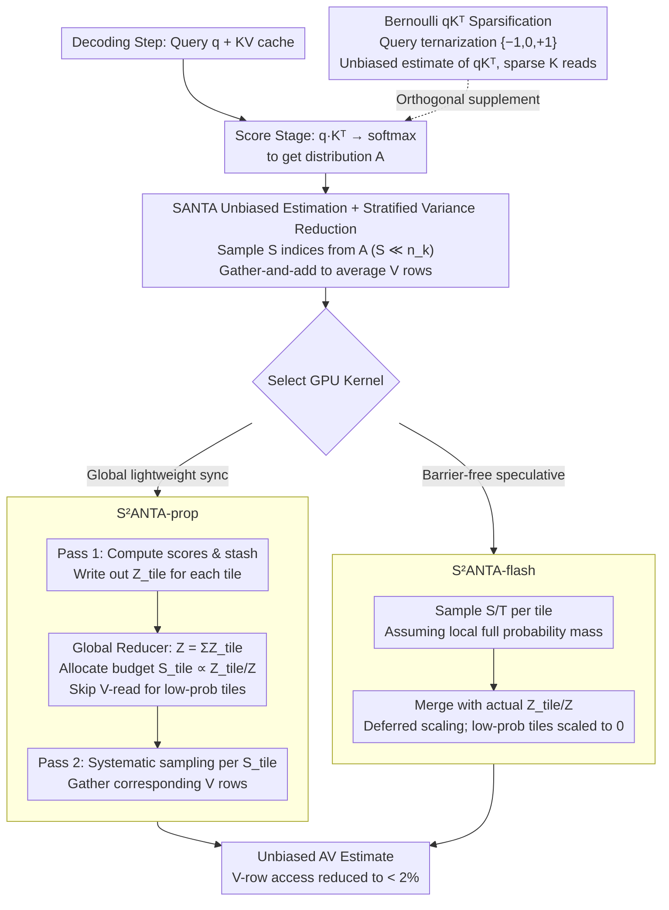

# Stochastic Sparse Attention for Memory-Bound Inference

**Conference**: ICML 2026  
**arXiv**: [2605.01910](https://arxiv.org/abs/2605.01910)  
**Code**: <https://github.com/OPUSLab/SANTA.git>  
**Area**: Model Compression / LLM Inference Acceleration / Attention Optimization  
**Keywords**: Sparse Attention, Stochastic Sampling, KV-cache, Stratified Sampling, GPU kernel

## TL;DR
SANTA reinterprets the value aggregation $AV$ of attention as "weighted summation of value rows $V$ based on softmax probabilities $A$." It transforms this into an unbiased estimate by sampling $S \ll n_k$ indices from $A$ without replacement and directly averaging the corresponding $V$ rows. By utilizing stratified/systematic sampling to reduce variance and implementing a GPU kernel aligned with FlashDecoding, it achieves a 1.5× end-to-end speedup over FlashInfer/FlashDecoding under 32k context without accuracy degradation.

## Background & Motivation

**Background**: Long-context autoregressive decoding is a bottleneck for LLM deployment. Each generated token requires streaming the entire KV cache, making bandwidth the primary constraint (e.g., Llama-3.1-8B with 32k context requires transferring ~128 MB per layer per token). Existing mitigation strategies include: KV quantization/compression (KIVI, etc.), cache management (Quest, H2O), structured sparse attention (Longformer, BigBird), and kernel optimization (FlashAttention, FlashDecoding), often combined with GQA. However, even the most optimized exact kernels must touch the entire KV state at every step, meaning the bandwidth wall persists.

**Limitations of Prior Work**: Top-$k$ or threshold-based sparse methods are **biased estimators** and typically require sorting. Quantization/compression damages KV numerical precision. Structured sparsity (e.g., sliding window) sacrifices expressiveness. FlashDecoding has nearly exhausted IO locality; further acceleration requires **reducing the number of V rows read**, rather than just optimizing the reading process.

**Key Challenge**: The attention output $AV$ is an **expectation**—$A$ itself is a probability distribution. Why treat it as a deterministic weighted sum? A Monte Carlo approach could compute only the sum of samples. However, random sampling on GPUs disrupts parallelism (requiring a global CDF), which presents a significant engineering challenge.

**Goal**: (a) Rewrite $AV$ as an unbiased Monte Carlo estimate, reducing $V$ row accesses from $n_k$ to $S \ll n_k$ and eliminating all multiplications after softmax; (b) reduce variance to match SDPA precision; (c) implement a GPU kernel to achieve real wall-clock acceleration; (d) provide a sparsification scheme for the score stage (Bernoulli $qK^T$).

**Key Insight**: View attention from a probabilistic perspective—treating $A$ as a categorical distribution and replacing matrix multiplication with sampling. Combine "per-head independent CDFs" with FlashDecoding's tiling strategy, using two schemes (proportional/flash) to resolve the "global CDF vs. global synchronization" contradiction.

**Core Idea**: $\widehat{AV}=\frac1S\sum_{s=1}^S V_{i_s}$, where $i_s\sim A$ i.i.d., is an unbiased estimate of $AV$ with variance $O(1/S)$. Variance is further reduced using stratified/systematic sampling. On GPU, serial CDF dependencies are avoided via "lightweight global sync + per-tile probability mass-based budget allocation."

## Method

### Overall Architecture
SANTA is an attention replacement scheme for the **decoding phase** (usable in prefill but with smaller gains). It splits attention into two stages: the score stage, where $qK^T$ and softmax produce the probability distribution $A$, and the value stage, where $AV$ aggregates the values. This work applies stochastic sparsification to both, but the **focus is on the value stage**, as the bandwidth wall for long-context decoding stems from repeatedly reading the entire $V$. The main value stage pipeline uses **SANTA unbiased estimation + stratified variance reduction** to change $AV$ from a "full $n_k$ row weighted multiply-accumulate" to a "direct average of $S \ll n_k$ sampled rows," implemented in two GPU kernels: **S²ANTA-prop** (lightweight global sync, exact budget allocation) and **S²ANTA-flash** (barrier-free, speculative local sampling). The score stage is an orthogonal supplement using **Bernoulli $qK^T$** to ternarize queries and sparsely read $K$. Prefill still uses SDPA; only decoding steps are replaced, remaining orthogonal to and stackable with GQA, FlashInfer, quantization, and cache compression.

### Key Designs

**1. SANTA Unbiased Estimation + Stratified/Systematic Variance Reduction**

The value stage $AV$ is essentially a weighted sum of $V$ rows according to softmax probability $A$, i.e., an expectation. Since $A$ is already a probability distribution, it is unnecessary to perform a full $n_k$ row multiply-accumulate. SANTA replaces this with a Monte Carlo estimate: sample $S \ll n_k$ indices $i_s$ independently from the categorical distribution $A$, outputting $\widehat{AV}=\frac1S\sum_{s=1}^S V_{i_s}$. This is an unbiased estimate ($\mathbb E[\widehat{AV}]=AV$, variance $\propto 1/S$), which simultaneously cuts $V$ row reads to $S$ and eliminates all multiplications after softmax, leaving only gather-and-add operations. However, naive i.i.d. sampling has high variance—at $S=16$, GSM8K accuracy collapses to 5.5%. Thus, S²ANTA introduces stratified sampling: splitting the CDF into $S$ equal probability segments and sampling once per segment to ensure more uniform coverage. **S²ANTA-strat** draws an independent offset $T_m\sim\mathrm{Unif}(I_m)$ for each segment, while **S²ANTA-sys** draws a single global offset $U\sim\mathrm{Unif}[0,1/S)$ to generate all $S$ samples via thresholds $T_m=U+m/S$. Both provide significant variance reduction, with systematic sampling being hardware-friendly as it requires only one random number.

**2. S²ANTA-prop: Exact Budget Allocation with Global Lightweight Sync**

Mapping the sampler to GPU is difficult because determining which $V$ rows to sample requires a global CDF—a serial dependency that breaks FlashDecoding-style Split-KV parallelism. The "prop" kernel resolves this by making global normalization "lightweight," synchronizing only $T$ scalars. It splits the attention into $T$ tiles and runs two passes: **Pass 1** computes exact scores and stashes exponentiated scores (scalars requiring only $1/d_k$ bandwidth) along with local partition functions $Z_{tile}$. A **global reducer** sums $Z=\sum Z_{tile}$ and allocates the sampling budget $S_{tile}\propto S\cdot(Z_{tile}/Z)$ precisely. Low-probability tiles ($S_{tile}=0$) skip the expensive V-reads entirely. **Pass 2** uses the stashed scores and allocated $S_{tile}$ for systematic sampling. The barrier only synchronizes $T$ scalars, making the cost negligible while enabling precise load balancing. Under a 32k context with $S=128$ (0.39% of KV), it aligns with SDPA accuracy while reducing $V$ row access below 1.56%, running 1.50× faster than FlashInfer.

**3. S²ANTA-flash: Speculative Sampling + Deferred Normalization**

For scenarios where any global barrier is unacceptable, S²ANTA-flash follows the FlashDecoding philosophy without synchronization. Each tile assumes it holds the total probability mass and samples $S/T$ local samples. The reducer later computes the actual $Z$ and $Z_{tile}/Z$, scale-shifting low-probability partial sums toward 0. The penalty is "sample waste"—sampling and V-reads in low-probability tiles are essentially wasted—requiring a larger total budget ($S=2048$ vs. $S=128$ for prop) to match SDPA accuracy. However, because it eliminates the barrier, it still achieves a 1.51× wall-clock speedup. This demonstrates that in skewed probability distributions like attention, **a small investment in global synchronization is more efficient than speculative execution.**

**4. Bernoulli $qK^T$: Orthogonal Sparsification of the Score Stage**

While the previous designs sparsify the value stage ($AV$), the score stage ($qK^T$) still requires streaming the entire $K$. Bernoulli $qK^T$ is an orthogonal supplement: it normalizes query elements to $[-1,1]$ as Bernoulli probabilities, sampling them into ternary values $\{-1,0,+1\}$. This creates a sparse ternary query that provides an unbiased estimate of $qK^T$, allowing feature-wise sparse access to $K$. On BitNet-2B with $B=4$, it reads only 67.5% of $K$ features with 64.5% accuracy (SDPA 65.7%). While primary speedups come from the value stage, Bernoulli serves as a mechanism validator, particularly for BitNet-style models.

### Loss & Training
Ours is a **purely inference-time method** that requires no retraining, introduces no losses, and acts as a plug-and-play replacement for attention operators. It is orthogonal to and stackable with quantization, GQA, and cache compression.

## Key Experimental Results

### Main Results

**32k Context RULER (Llama-3.1-8B-Instruct)** Table 1: SDPA used for prefill, replacement only for decoding.

| Kernel | $S$ | FWE | NIAH | QA1 | QA2 |
|---|---|---|---|---|---|
| SDPA (baseline) | – | 95.60 | 98.35 | 64.00 | 58.80 |
| **S²ANTA-prop** | **128** | **95.40** | **98.25** | **64.40** | **60.20** |
| S²ANTA-prop | 256 | 95.47 | 98.50 | 63.40 | 60.60 |
| **S²ANTA-flash** | **2048** | **94.13** | **98.25** | **64.60** | **60.00** |
| S²ANTA-flash | 256 | 66.20 | 88.95 | 63.00 | 57.20 |

Prop achieves SDPA-level accuracy at $S=128$ (0.39% of $n_k$), while flash requires $S=2048$ (6.25%). Kernel latency (Fig 4): prop 1.50× / flash 1.51× speedup vs. FlashInfer.

**GSM8K (Llama 8B)** Table 2: Accuracy comparison of SANTA / S²ANTA-strat / S²ANTA-sys across different $S$.

| $S$ | S²ANTA-sys | S²ANTA-strat | SANTA |
|---|---|---|---|
| 16 | 44.63 | 39.12 | 5.51 |
| 128 | **77.33** | 75.64 | 70.23 |
| SDPA | – | – | 78.06 |

Variance reduction is critical: at $S=16$, sys outperforms basic SANTA by 39 percentage points.

### Ablation Study

| Config | Key Finding |
|------|---------|
| SANTA vs. S²ANTA-strat vs. S²ANTA-sys | Stratified series significantly leads when $S \le 64$, validating the variance reduction. |
| Prop vs. Flash kernel | Similar speedup, but prop uses 1/16th of the samples, minimizing "sample waste." |
| Bernoulli $qK^T$ on BitNet 2B | At $B=4$, reads 67.5% of K, accuracy 64.5% (SDPA 65.7%). |

### Key Findings
- **Sampling provides more than just multiplication elimination**: In long-context decoding, the gain primarily comes from reduced V-read bandwidth (< 2% at 32k). Multiplication elimination (1.1 pJ → 0.4 pJ per op) is a benefit that will be fully realized by future adder-centric hardware.
- **Stratified variance reduction is mandatory**: Standard SANTA at $S=16$ on GSM8K is unusable (5.5%). Adding stratified/systematic sampling makes it immediately viable.
- **Systematic vs. Stratified**: Performance is nearly identical, but systematic sampling's single-random-number requirement is highly production-friendly.
- **Sample waste in flash is real**: To achieve the same speedup, flash needs 16× more samples than prop, proving that global sync is more economical for skewed attention distributions.

## Highlights & Insights
- **Probabilistic Attention View**: Treating attention as an expectation to be sampled is elegant and generalizable to other softmax-based operations like MoE gating or retrieval ranking.
- **Eliminating Multiplications**: The energy consumption ratio between adders and multipliers (~0.36×) aligns with trends like BitNet, positioning this work for sparse, adder-centric accelerators.
- **Prop Kernel Design**: The use of lightweight sync to break the CDF serial dependency provides a template for any sparsification task requiring global normalization.
- **Plug-and-play**: No retraining, no accuracy loss, and compatible with existing KV-cache optimization techniques.

## Limitations & Future Work
- Wall-clock speedups on current GPUs primarily come from bandwidth reduction; multiplication elimination is less significant due to optimized NVIDIA FMA units.
- No gains in the prefill stage as row-wise sparsification is "eaten" by the union of queries.
- Sampling quality depends on the "well-behavedness" of the softmax distribution; accuracy in extremely flat distributions was not analyzed.
- Bernoulli $qK^T$ performance on non-BitNet models remains unknown.

## Related Work & Insights
- **vs. FlashDecoding / FlashInfer**: These optimize IO for exact attention. SANTA is an orthogonal direction that reduces the rows actually accessed.
- **vs. Top-$k$ Attention (Quest, H2O)**: Top-$k$ is biased and requires sorting. SANTA is unbiased and reaches SDPA accuracy with $S=128$.
- **vs. KV Quantization (KIVI)**: Quantization reduces bytes per element; SANTA reduces the number of elements. They are complementary.

## Rating
- Novelty: ⭐⭐⭐⭐ Reinterpreting the value stage through Monte Carlo is elegant and well-supported by kernels.
- Experimental Thoroughness: ⭐⭐⭐⭐ Covers various benchmarks including long-context RULER and real latency metrics.
- Writing Quality: ⭐⭐⭐⭐⭐ Clear concepts and intuitive diagrams.
- Value: ⭐⭐⭐⭐⭐ Vital for teams working on long-context LLM inference; open-sourced kernels provide 1.5× acceleration.

<!-- RELATED:START -->

## Related Papers

- [\[ICML 2026\] Prism: Spectral-Aware Block-Sparse Attention](prism_spectral-aware_block-sparse_attention.md)
- [\[ICML 2026\] Sparser Block-Sparse Attention via Token Permutation](sparser_block-sparse_attention_via_token_permutation.md)
- [\[ACL 2025\] Native Sparse Attention: Hardware-Aligned and Natively Trainable Sparse Attention](../../ACL2025/llm_efficiency/native_sparse_attention.md)
- [\[ICML 2026\] ReMoE: Boosting Expert Reuse through Router Fine-Tuning in Memory-Constrained MoE LLM Inference](remoe_boosting_expert_reuse_through_router_fine-tuning_in_memory-constrained_moe.md)
- [\[ICCV 2025\] MixANT: Observation-dependent Memory Propagation for Stochastic Dense Action Anticipation](../../ICCV2025/llm_efficiency/mixant_observation-dependent_memory_propagation_for_stochastic_dense_action_anti.md)

<!-- RELATED:END -->
