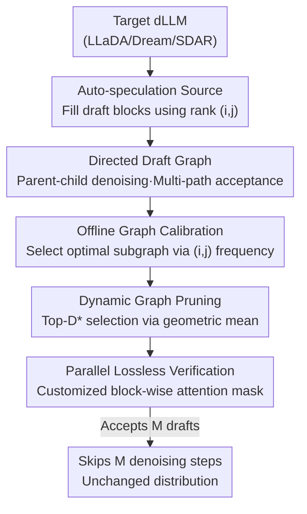

# Structuring The Future: Diffusion LLM Speculative Decoding via Calibrated Draft Graphs

**Conference**: ICML2026  
**arXiv**: [2509.18085](https://arxiv.org/abs/2509.18085)  
**Code**: To be confirmed  
**Area**: LLM Efficiency  
**Keywords**: Diffusion Language Models, Speculative Decoding, Directed Draft Graphs, Lossless Acceleration, Offline Calibration

## TL;DR
Spiffy adapts speculative decoding for Diffusion Language Models (dLLMs): instead of training a separate draft model, it utilizes the target model's own distribution for "auto-speculation." It organizes multi-step denoising states into a **Directed Draft Graph** and maximizes the acceptance rate using an offline-calibrated graph structure. This achieves up to a 8.6× reduction in model forward passes and a 6.3× speedup in token throughput on LLaDA / Dream / SDAR, while provably maintaining lossless output distributions.

## Background & Motivation
**Background**: Diffusion Language Models (dLLMs, such as LLaDA, Dream, and SDAR) serve as a new alternative to autoregressive LLMs. Rather than following a strict left-to-right causal factorization, they model the joint distribution of a block of tokens using bidirectional attention. Theoretically, they can solve an entire block in parallel, offering speed potential far exceeding autoregressive models.

**Limitations of Prior Work**: Unfortunately, to preserve generation quality, open-source dLLMs typically unmask only one token per model inference by default. This effectively degrades the "parallel" advantage into token-by-token serial generation, leaving speed potential underutilized. Existing acceleration methods (KV caching, confidence-threshold-based dynamic unmasking) only partially alleviate the bottleneck, and throughput remains limited by the number of denoising steps.

**Key Challenge**: Autoregressive LLMs have long benefited from speculative decoding as a fast and lossless tool, but it relies on "causal factorization + draft trees." The distributions in dLLMs **lack causal factorization**, meaning naive verification is no longer lossless. Furthermore, draft trees assume unidirectional dependency, which is wasteful for bidirectional attention. Direct migration is therefore infeasible.

**Goal**: To define a speculative decoding framework for dLLMs that is (1) lossless, (2) independent of separate draft models, and (3) capable of exploiting bidirectional properties.

**Key Insight**: The authors observe that the denoising process of a dLLM is inherently a step-by-step unmasking of tokens. Since the target distribution $p_\theta(X_k(t-1)\mid X';X_k(t))$ at each step is already available, instead of predicting the next single token, one can **guess the states of a block across multiple future denoising timestamps**, skipping several steps with a single model call.

**Core Idea**: Construct draft blocks using the target model’s own distribution (auto-speculation) and organize these draft blocks into a **Directed Draft Graph** (rather than a tree) based on "parent-child" denoising relationships. This allows each draft state to have multiple paths to acceptance. By calibrating the optimal graph structure offline and dynamically pruning it during inference, multiple denoising steps can be skipped while remaining lossless.

## Method

### Overall Architecture
Spiffy reformulates dLLM denoising within a speculative decoding framework: the object of speculation is not a single token, but the **state of a block on the denoising timeline**. Given the $k$-th block currently being solved, its state at time $t$ is denoted as $X_k(t)$, and the rest of the sequence as $X'$. During one iteration, Spiffy simultaneously computes the "next-step target distribution" $p_{\text{TD}}(t-1)$ for the true state and the draft distributions for several **draft blocks** $\hat{X}_k^m$—all within **one** parallel model call using a customized attention mask. After unmasking $S_{t-1}$ tokens using the target distribution to obtain $X_k(t-1)$, any matching draft blocks are accepted. Since the draft distributions of those accepted blocks were already computed, the process can immediately jump forward and verify their children. Accepting $M$ drafts reduces the number of model inferences from $T$ to $T-M$.

The pipeline consists of: Offline **Calibration** to determine the draft graph structure → Filling draft block tokens using the current target distribution during inference → Dynamic **Pruning** to a smaller graph within a budget → Parallel **Verification** to accept draft states and skip steps.

### Key Designs

**1. Directed Draft Graphs: Utilizing Bidirectionality for Multi-Path Acceptance**
Autoregressive speculation uses a draft **tree** because, under unidirectional dependency, each draft has only one unique prefix path. dLLMs are bidirectional—a block state with specific unmasked positions can be reached from multiple different preceding states in one step. Spiffy defines parent-child relationships accordingly: block $A$ (at $t_a$) is the parent of block $B$ (at $t_b$) if and only if $t_b=t_a-1$, $|unmasked(A)|+S_{t_b}=|unmasked(B)|$, and $unmasked(A)\subset unmasked(B)$. Connecting multi-level draft blocks creates a **directed graph** where each node can have multiple parents. This provides a unique advantage over autoregressive trees: if any parent on any path is accepted, its child has the chance to be accepted as well, allowing for more steps skipped per call.

**2. Auto-speculation Source: Utilizing Target Distributions via (i,j) Ranks**
Speculative decoding typically requires a separate small draft model. Spiffy avoids this by generating draft blocks directly from the current target distribution $p_{\text{TD}}$. For each position in a block, the top-1 probability is calculated to rank the **position rank** $i$ (which position is most likely to be unmasked); for each position, the vocabulary probabilities are ranked to get the **vocabulary rank** $j$ (which word should fill that position). Any candidate token is uniquely identified as $c_{ij}$. A draft block is defined as the "current state + a set of extra tokens unmasked by $(i,j)$." Encoding drafts as $(i,j)$ formulas rather than specific tokens allows the structure to be fixed offline and instantiated with real tokens during inference, decoupling calibration from execution.

**3. Offline Calibration + Dynamic Pruning: Selecting High-Frequency Structures**
Since the number of possible draft states is massive, Spiffy uses Offline Calibration (Algorithm 2) on a small set of samples (25 from MATH500 + 25 from MBPP). It replays denoising trajectories, counts the frequency of various $(i,j)$ sequences, and selects the connected subgraph of size $D$ with the maximum cumulative frequency as the draft graph $G^*$. During inference, Spiffy applies **Dynamic Pruning** using a geometric mean score: a node's local score is $localScore(q_i)=\big(\prod_j p_{ij}\big)^{1/k}$, which is then aggregated with its children's scores to get $score=GM(localScore, childScore)$. The top-$D^*$ ($D^*<D$) nodes are selected. Pruning significantly reduces computation with minimal impact on acceptance rates.

**4. Lossless Verification: Customized Block-wise Attention Mask**
To ensure "acceleration without altering the output distribution," $D$ draft blocks are appended to the sequence. A **block-wise tree-attention mask** allows the original sequence to attend normally while each draft block attends to itself and all blocks in the real sequence except the one it is replacing. This computes the target distribution and all draft distributions in a single forward pass. After unmasking the real tokens and comparing them with the drafts, accepted drafts' pre-calculated distributions are used to recursively verify children (Algorithm 1).

## Key Experimental Results

### Main Results
Evaluated on LLaDA-8B-Instruct, Dream-7B-Instruct, and SDAR-8B-Chat-b32 across GSM8K, HumanEval, MATH500, and MBPP. The baseline uses "static unmasking (one token per step) + prefix KV cache." The intermediate comparison adds threshold-based ($\tau=0.9$) dynamic unmasking, and Spiffy is layered on top.

| Model / Task | Baseline (TPS, acc) | + Dynamic unmask | + Spiffy (Ours) | Accuracy |
|------|------|------|------|------|
| LLaDA / MBPP | 1.00×, 0.36 | 5.73× | **8.58× (NFE 5.23×)** | 0.36 (Unchanged) |
| LLaDA / GSM8K | 1.00×, 0.79 | 3.31× | **4.97×** | 0.79 (Unchanged) |
| SDAR / GSM8K | 1.00×, 0.90 | 6.71× | **8.25× (NFE 6.28×)** | 0.88 |
| SDAR / HumanEval | 1.00×, 0.68 | 5.54× | **6.96×** | 0.71 |
| Dream / HumanEval | 1.00×, 0.54 | 2.68× | **4.42×** | 0.55 |

Spiffy provides a 1.3–1.6× Gain over dynamic unmasking, with NFE reduction up to 8.6× and TPS speedup up to 6.3×, while maintaining baseline accuracy.

### Ablation Study

| Configuration | Observation | Explanation |
|------|------|------|
| Variation of $D^*$ | $D^*$↑ → Higher acceptance, lower NFE; $D^*$↓ → Lower compute | Pruning budget allows a trade-off between throughput and compute cost. |
| Geo-Mean Pruning vs. Full Graph | Nearly matches full graph acceptance with lower cost | Validates the effectiveness of the scoring metric in §4.4.4. |
| Temperature 0.0 → High | Acceptance drops but TPS remains > baseline | The calibrated graph is robust; recalibration can further improve performance. |
| Calibration Set Shift | Shared performance across MATH/MBPP and ShareGPT | Calibration is insensitive to the specific data domain. |

### Key Findings
- **Adjustable Throughput**: The pruning budget $D^*$ acts as a knob to balance speed and computational overhead during deployment.
- **Max Gain on SDAR**: The block-causal structure allows Spiffy to achieve strict losslessness and high acceleration (8.25× on GSM8K).
- **Robustness**: The method remains faster than the baseline even at higher temperatures without recalibration, showing the graph captures general unmasking dynamics.

## Highlights & Insights
- **"Graphs > Trees" is a Bidirectional Dividend**: While autoregressive models are restricted to trees by unidirectional dependency, dLLMs naturally allow multiple prefixes for a state. Moving from trees to directed graphs is a tailored innovation for diffusion models.
- **Drafting via (i,j) Ranks**: Defining drafts using position and vocabulary ranks rather than concrete tokens cleanly decouples structural search from online decoding.
- **Zero-Training Auto-Speculation**: By borrowing the target model's own distribution, Spiffy eliminates the training and deployment costs of auxiliary draft models, making it highly accessible.
- **Geometric Mean Scoring**: Using geometric means for pruning respects the multiplicative nature of probabilities, preventing the selection from being skewed by single high-probability outliers.

## Limitations & Future Work
- **Calibration Frequency**: The graph structure is derived from small-sample trajectories. Significant distribution shifts between calibration and deployment might lower the acceptance rate.
- **Lossless Conditions**: For fully bidirectional models like LLaDA, the simplified mask is "near-lossless"; strict losslessness requires dual-caching or block-causal structures.
- **Verification Overhead**: The TPS gain is smaller than the NFE reduction, indicating that the parallel verification itself adds non-negligible computational cost.
- **Future Directions**: Exploring alternative calibration metrics or integrating auxiliary draft models to complement auto-speculation.

## Related Work & Insights
- **vs. Autoregressive Speculative Decoding**: While EAGLE/Medusa/SpecInfer use trees and causal verification, Spiffy identifies the need for graph-based structures to leverage dLLM bidirectionality.
- **vs. dLLM Acceleration**: Unlike threshold-based dynamic unmasking or step distillation which reduce redundant steps, Spiffy acts as an orthogonal speculative layer that provides additional speedup.
- **vs. Image Diffusion Speculation**: Unlike methods for continuous diffusion that modify rejection sampling, Spiffy addresses the discrete masking dynamics of language models.

## Rating
- Novelty: ⭐⭐⭐⭐⭐ First systematic migration of speculative decoding to dLLMs with a dedicated DAG structure.
- Experimental Thoroughness: ⭐⭐⭐⭐ Covered three dLLM families; however, speedups were primarily verified on math and code tasks.
- Writing Quality: ⭐⭐⭐⭐ Clear formalization with well-matched algorithms and figures.
- Value: ⭐⭐⭐⭐⭐ Zero-training, provably lossless, and orthogonal to existing optimizations.

<!-- RELATED:START -->

## Related Papers

- [\[ICML 2026\] Fast-dLLM++: Fréchet Profile Decoding for Faster Diffusion LLM Inference](fast-dllm_fréchet_profile_decoding_for_faster_diffusion_llm_inference.md)
- [\[ICLR 2026\] Bridging Draft Policy Misalignment: Group Tree Optimization for Speculative Decoding](../../ICLR2026/llm_efficiency/bridging_draft_policy_misalignment_group_tree_optimization_for_speculative_decod.md)
- [\[ACL 2025\] Accelerating Speculative Decoding via Efficient Context-Aware Draft Generation](../../ACL2025/llm_efficiency/accelerating_speculative_decoding_via_efficient_context-aware_draft_generation.md)
- [\[ACL 2025\] Tetris: Optimal Draft Token Selection for Batch Speculative Decoding](../../ACL2025/llm_efficiency/tetris_optimal_draft_token_selection_for_batch_speculative_decoding.md)
- [\[ICML 2026\] Diffusion Language Model Parallel Decoding via Product-of-Experts Bridge](diffusion_language_model_parallel_decoding_via_product-of-experts_bridge.md)

<!-- RELATED:END -->
