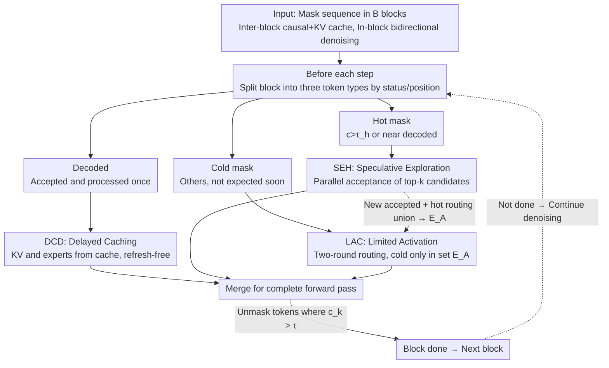

# TEAM: Temporal-Spatial Consistency Guided Expert Activation for MoE Diffusion Language Model Acceleration

**Conference**: ICML2026  
**arXiv**: [2602.08404](https://arxiv.org/abs/2602.08404)  
**Code**: https://github.com/PKU-SEC-Lab/TEAM-MoE-dLLM  
**Area**: LLM Efficiency / Diffusion Language Models / MoE  
**Keywords**: Diffusion Language Models, MoE, Expert Activation, Temporal-Spatial Consistency, Inference Acceleration

## TL;DR
TEAM addresses the inherent mismatch in MoE Diffusion Language Models (dLLM) where "a large number of experts are activated but only a few tokens are accepted." By leveraging the temporal and spatial consistency of in-block decoding, TEAM designs differentiated expert activation and decoding strategies for three types of tokens: decoded, hot, and cold. This achieves up to a 2.2× speedup on SDAR 30B-A3B with near-zero precision loss.

## Background & Motivation

**Background**: Diffusion Language Models (dLLM) utilize bidirectional attention to "denoise" an entire response simultaneously, naturally supporting parallel decoding. Recent works like SDAR and LLaDA 2.0 use Autoregressive (AR) initialization and replace FFNs with Mixture-of-Experts (MoE), allowing dLLMs to approach mainstream AR LLMs in both efficiency and accuracy. This is seen as a next-generation paradigm that inherits AR priors while breaking the serial bottleneck of AR.

**Limitations of Prior Work**: Directly grafting MoE onto dLLMs can lead to "reverse degradation" of inference efficiency. In each denoising iteration of a block, all tokens (including those already accepted) undergo forward passes in parallel with bidirectional attention, with each token independently routing its own top-$k$ experts. However, only a few tokens with confidence exceeding a threshold $\tau$ are actually unmasked. Consequently, the "number of activated experts is far greater than the number of tokens accepted per step"—in SDAR, where each token routes to 8 experts, the ratio of activated experts to accepted tokens is significantly higher than 8. This eliminates the sparse activation advantage of MoE, effectively degrading it to a dense model.

**Key Challenge**: There is a structural mismatch between dLLM block-parallelism and MoE sparse activation. In-block parallelism often means the compute does not reach the GPU's compute–bandwidth equilibrium, making the entire decoding process memory-bound. In this state, every additional expert activated requires extra expert parameter movement, increasing latency. Thus, "activating fewer experts while accepting more tokens" is the true direction for optimization, yet vanilla routing fails to exploit the in-block structure of dLLMs.

**Goal**: To reduce inference latency by **activating fewer experts** while **accepting more tokens** per forward pass, without retraining the MoE dLLM. The problem is decomposed into three categories of tokens: (a) already accepted **decoded tokens** that still participate in the forward pass; (b) soon-to-be-accepted **hot tokens**; (c) **cold tokens** that will not be accepted in the short term.

**Key Insight**: Through empirical testing on SDAR 30B-A3B, the authors found two levels of consistency in block-wise decoding. **Temporal consistency**: The hidden states of accepted tokens tend to stabilize after the subsequent forward pass (consistent with findings in dKV-Cache), yet vanilla routing still triggers their expert activation at every step. **Spatial consistency**: Mask token routing is highly concentrated—a few experts handle almost all mask token decoding. Furthermore, the acceptance order approximates AR, with newly accepted tokens clustering spatially near decoded tokens. Together, these points imply that tokens at different positions can be handled with differentiated strategies.

**Core Idea**: Differentiate the management of "decoded, hot, and cold" tokens—decoded tokens use KV cache and no longer activate experts; hot tokens undergo proactive speculative exploration to accept multiple tokens at once; cold tokens are forced to reuse the set of experts already activated by hot/decoded tokens. This removes redundant activations and invests "saved compute" into positions more likely to succeed.

## Method

### Overall Architecture
TEAM solves the mismatch where "the number of activated experts exceeds the number of accepted tokens" after grafting MoE onto dLLMs. Its approach is to split the entire block into three groups based on token status and position before each forward pass and then merge them for a single forward—without changing weights or retraining. Specifically, the input is a mask sequence divided into $B$ blocks of $L$ tokens. Causal attention and KV cache are used between blocks, while in-block bidirectional attention performs multi-step denoising, unmasking tokens where confidence $c_k > \tau$. Before each forward, TEAM classifies in-block tokens into: **decoded** (already unmasked and processed at least once), **hot mask** (expected to be accepted, satisfying $c_k > \tau_h$ or located distance $< L_h$ from any decoded position, i.e., $y_i^{k\text{-}hot}=\{y_i^k \mid (c_k > \tau_h)\ \text{or}\ (\forall j,\ |k-j|<L_h)\}$), and **cold mask** (others). These are processed via DCD, SEH, and LAC paths respectively, merged for a complete forward, and looped until the block is fully decoded.

### Key Designs

**1. DCD — Decoded-delayed Caching: Eliminating the largest waste of "re-calculating decoded tokens"**

The primary culprit for activation inflation is decoded tokens that are still recalculated in every vanilla forward pass. Their routed expert sets rarely intersect with mask tokens, leading to useless activations. DCD allows decoded tokens to exit subsequent calculations after they are accepted and processed once more; their KV pairs and expert activations are then retrieved from cache. This "one-step delay" is intentional: empirical results show hidden states stabilize only in the step following acceptance. Crucially, since dLLMs use block-diffusion (inter-block causality, in-block bidirectional, and native KV cache), the in-block parallel scale is small enough that it is not compute-bound. Combined with the near-AR acceptance order, this cache **does not require periodic refreshes** to maintain accuracy—a fundamental difference from dKV-Cache. Table 3 confirms that "Refresh-free" is faster and more accurate than "Refresh-4/8."

**2. SEH — Speculative Exploration for Hot Tokens: Reinvesting saved compute into high-probability positions**

DCD saves bandwidth, but MoE inference is memory-bound with idle compute. SEH targets "hot tokens" likely to be accepted—defined by $c_k > \tau_h$ or spatial proximity to decoded regions. It proactively accepts their top-$k$ confidence candidates and constructs multiple decoding branches for parallel verification within the same forward pass. Because tokens across branches are highly similar, they rarely activate new experts. On dense models, multiple branches would immediately make the process compute-bound, but in MoE, compute is naturally distributed. In a single-GPU setup, "adding branches without adding experts" is nearly free, maximizing the arithmetic intensity of idle compute. This step converts the DCD budget into a higher acceptance rate, serving as the main driver for increasing TPF (accepted tokens per forward) to 1.5–1.7×.

**3. LAC — Limited Activation for Cold Tokens: Reusing the necessary expert set**

Cold tokens are unlikely to be accepted soon, so independent routing and expert activation for them is wasteful. However, they cannot be skipped, or they will lack correct representations when eventually accepted. LAC uses "limited rather than canceled activation" via two-round routing: The first round performs standard top-$k$ routing for newly accepted tokens $D_a$ and hot tokens $H$ with weights $W_1$, forming the necessary expert set $E_A = \text{top-}k(W_1)$. In the second round, cold tokens $C$ are restricted to re-selecting from $E_A$, $W_2 = Router(C, E_A)$, resulting in total routing weights $W = Concat(W_1, W_2)$. This is effective due to spatial consistency—mask token routing naturally concentrates on a few experts. Forcing cold tokens to reuse these experts maintains their likely trajectories while eliminating "cold-token-only" expert activations.

### Loss & Training
TEAM is completely training-free and involves no gradient updates. It introduces only three inference hyperparameters: the hot confidence threshold $\tau_h$, the hot spatial distance $L_h$, and the top-$k$ for speculative branches. The paper uses $\tau_h \in [0.4, 0.8]$, $L_h \in [2, 6]$ (sensitivity experiments in Table 2).

## Key Experimental Results

### Main Results
The backbone is SDAR 30B-A3B (8 experts per token), evaluated on four 0-shot benchmarks: HumanEval, MBPP, GSM8K, and Math-500. Metrics include task scores, **APF** (Activated Experts per Forward), **TPF** (Accepted Tokens per Forward), and **APT = APF / TPF** (Average Activated Experts per Token).

| Benchmark | Method | Score | APF↓ | TPF↑ | APT↓ | Speedup |
|---|---|---|---|---|---|---|
| HumanEval | Vanilla | 79.27 | 53.34 | 2.91 | 18.33 | 1× |
| HumanEval | TEAM | 79.88 (+0.61) | 34.48 (-35%) | 5.07 (1.74×) | 6.80 (-63%) | **2.20×** |
| MBPP | Vanilla | 65.76 | 49.59 | 2.74 | 18.10 | 1× |
| MBPP | TEAM | 65.76 (+0.00) | 30.92 (-38%) | 4.56 (1.66×) | 6.78 (-63%) | **2.08×** |
| GSM8K | Vanilla | 90.60 | 59.11 | 3.16 | 18.71 | 1× |
| GSM8K | TEAM | 90.30 (-0.30) | 36.20 (-39%) | 4.79 (1.52×) | 7.56 (-60%) | **1.83×** |
| Math-500 | Vanilla | 76.00 | 57.90 | 3.74 | 15.48 | 1× |
| Math-500 | TEAM | 75.40 (-0.60) | 36.31 (-37%) | 5.57 (1.49×) | 6.52 (-58%) | **1.64×** |
| **Avg** | TEAM | 77.84 (-0.07) | 34.48 (-37%) | 5.00 (1.59×) | 6.92 (-61%) | **1.94×** |

On average, the score drops only by 0.07, APT is reduced by 61%, and end-to-end speedup is 1.94×. HumanEval even saw a score increase of 0.61.

### Ablation Study

| Configuration | Avg Score | Avg APF | Description |
|---|---|---|---|
| Full TEAM (DCD+SEH+LAC) | 77.84 | 34.48 | Complete model, 1.94× |
| Refresh-free DCD only | ≈ Vanilla | ↓ to ~26.5 (HumanEval) | 1.58× on HumanEval alone, 1.32–1.55× across tasks |
| Refresh-8 DCD | -1.22 (HumanEval) | 29.61 | Periodic refresh leads to lower accuracy |
| Refresh-4 DCD | -0 / -1.20 | 32.67 | Frequent refresh reduces speedup from 1.58× to 1.38× |
| Hot hyper $(\tau_h, L_h)$ scan | 70.05 → 73.68 | 21.33 → 23.35 | $\tau_h=0.6, L_h=4$ is the optimal trade-off |

### Key Findings
- **DCD alone provides 1.3–1.6× speedup**, and Refresh-free is both faster and more accurate than Refresh-4/8. This confirms that block-diffusion + AR-init makes "delayed caching without refresh" a safe strategy, representing a core difference from dKV-Cache.
- **Hot hyperparameters are sensitive for accuracy but insensitive for APF**: Increasing $\tau_h$ from 0.4 to 0.8 only reduces APF from 23.35 to 21.33, while accuracy fluctuates. This proves SEH's gains come from "triggering speculation," as extra branches incur almost zero additional activation costs.
- **Speedup is inversely proportional to task length**: Speedup is highest (2.2×) for short code generation (HumanEval/MBPP) and lower (1.6–1.8×) for long reasoning chains (GSM8K/Math-500). Longer outputs involve more blocks, and the natural acceptance rate per block is higher, diluting TEAM's relative gains.

## Highlights & Insights
- **The "MoE × dLLM efficiency degradation" is a neglected real-world problem**: The authors are the first to introduce the APF/TPF/APT metrics, revealing that sparse activation is undermined by block parallelism.
- **Differentiated token management paradigm**: Using "position/status" as routing variables rather than relying solely on learned weights is a transferable concept for any scenario with non-uniform token importance, such as long-context AR, Vision MoE, or speculative decoding.
- **"Reinvesting saved activation budget into speculative branches"**: Most acceleration works only perform subtraction (caching/pruning). TEAM uses subtraction (DCD/LAC) to free memory bandwidth and addition (SEH) to convert it into TPF.
- **LAC routing is almost a free lunch**: By utilizing mask token routing concentration, cold tokens are forced into the necessary expert set with negligible accuracy loss, essentially encoding spatial consistency as an algorithmic prior.

## Limitations & Future Work
- Validated only on SDAR 30B-A3B; whether ~2× speedup holds for LLaDA 2.0 or 100B+ MoE dLLMs requires more evidence.
- Acceleration is less pronounced in long reasoning tasks, and there are minor score drops in GSM8K/Math. Improved "hot/cold partitioning" or token difficulty estimation could help.
- The refresh-free DCD depends on the AR-initialization prior of block-diffusion; its safety margin might need re-evaluation for more "non-autoregressive" training methods.
- The parallel verification of speculative branches may compete for expert capacity in batched serving environments; cloud high-concurrency gains might differ from single-stream results.

## Related Work & Insights
- **vs dKV-Cache (Ma et al., 2025a)**: dKV-Cache targets global bidirectional dLLMs and requires periodic global refreshes. TEAM proves refreshes can be avoided in block-diffusion + AR-init settings and links caching to MoE expert activation reduction.
- **vs dInfer (Ma et al., 2025b)**: dInfer focuses on expert-parallel deployment for cloud-scale MoE; TEAM focuses on the single-GPU/low-latency scenario, reducing the number of experts activated per forward.
- **vs Speculative Decoding (Chen 2023 / Leviathan 2023)**: Traditional AR speculation requires a draft model; SEH moves speculation into the dLLM block without extra models, leveraging MoE compute distribution.
- **vs MoE Routing Sparsification (Chen 2025 / Song 2025)**: These methods prune experts via learning. LAC does not modify the router but constrains the activation set during inference, making it a zero-training deployment patch.

## Rating
- Novelty: ⭐⭐⭐⭐ First systematic characterization of the MoE dLLM activation mismatch; clever assembly of cache, speculation, and routing constraints.
- Experimental Thoroughness: ⭐⭐⭐⭐ Includes 4 benchmarks, APF/TPF/APT metrics, and component ablations; lacks multi-backbone and batch-dimension evaluation.
- Writing Quality: ⭐⭐⭐⭐ Clear motivation figures (Fig 1/2) and layered explanation of methods.
- Value: ⭐⭐⭐⭐ Provides plug-and-play ~2× speedup with significant engineering implications for MoE dLLM deployment.

<!-- RELATED:START -->

## Related Papers

- [\[ACL 2026\] Alloc-MoE: Budget-Aware Expert Activation Allocation for Efficient Mixture-of-Experts Inference](../../ACL2026/llm_efficiency/alloc-moe_budget-aware_expert_activation_allocation_for_efficient_mixture-of-exp.md)
- [\[ICML 2026\] OServe: Accelerating LLM Serving via Spatial-Temporal Workload Orchestration](oserve_accelerating_llm_serving_via_spatial-temporal_workload_orchestration.md)
- [\[ICLR 2026\] Expert Divergence Learning for MoE-based Language Models](../../ICLR2026/llm_efficiency/expert_divergence_learning_for_moe-based_language_models.md)
- [\[ICML 2026\] dLLM-Cache: Accelerating Diffusion Large Language Models with Adaptive Caching](dllm-cache_accelerating_diffusion_large_language_models_with_adaptive_caching.md)
- [\[ICML 2026\] Diffusion Language Model Parallel Decoding via Product-of-Experts Bridge](diffusion_language_model_parallel_decoding_via_product-of-experts_bridge.md)

<!-- RELATED:END -->
