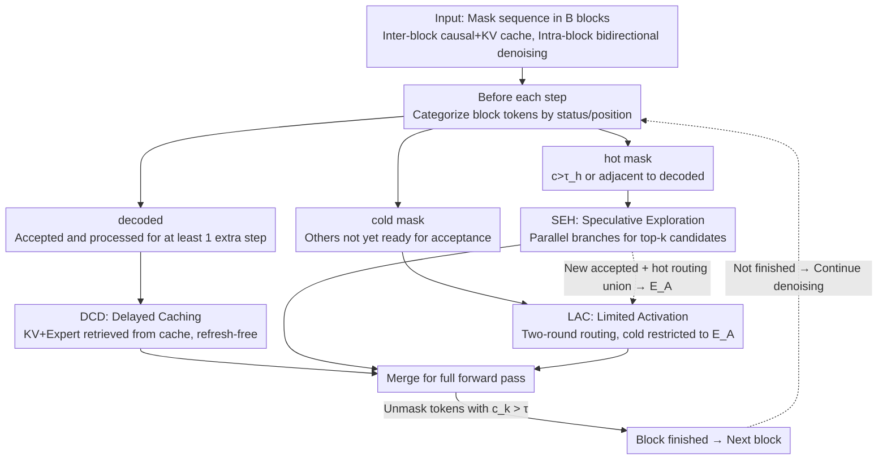

# TEAM: Temporal-Spatial Consistency Guided Expert Activation for MoE Diffusion Language Model Acceleration

**Conference**: ICML2026  
**arXiv**: [2602.08404](https://arxiv.org/abs/2602.08404)  
**Code**: https://github.com/PKU-SEC-Lab/TEAM-MoE-dLLM  
**Area**: LLM Efficiency / Diffusion Language Models / MoE  
**Keywords**: Diffusion Language Model, MoE, Expert Activation, Temporal-Spatial Consistency, Inference Acceleration

## TL;DR
TEAM addresses the inherent mismatch in MoE Diffusion Language Models (dLLM) where "many experts are activated for only a few accepted tokens." By leveraging temporal and spatial consistency within block decoding, it designs differentiated expert activation and decoding strategies for decoded, hot, and cold tokens, achieving up to 2.2× speedup on SDAR 30B-A3B with near-zero accuracy loss.

## Background & Motivation

**Background**: Diffusion Language Models (dLLMs) use bidirectional attention to "denoise" an entire response simultaneously, naturally supporting parallel decoding. Recent works like SDAR and LLaDA 2.0 utilize autoregressive (AR) initialization and replace FFNs with Mixture-of-Experts (MoE), allowing dLLMs to approach the efficiency and accuracy of mainstream AR LLMs. These are regarded as the next generation paradigm that inherits AR priors while breaking AR serial bottlenecks.

**Limitations of Prior Work**: Directly applying MoE to dLLMs results in "reverse degradation" of inference efficiency. In each denoising iteration of a block, all tokens (including those already accepted) perform parallel forward passes under bidirectional attention, with each token independently routing its top-$k$ experts. However, only a few tokens with confidence exceeding a threshold $\tau$ are actually unmasked. Consequently, the number of activated experts far exceeds the number of accepted tokens per step—SDAR routes 8 experts per token, but the ratio of activated experts to accepted tokens is much higher than 8, neutralizing the sparse activation advantage of MoE and causing it to behave like a dense model.

**Key Challenge**: There is a structural mismatch between the block parallelism of dLLMs and the sparse activation of MoEs. Block parallelism implies that computation likely does not reach the compute–bandwidth balance point of the GPU, making decoding memory-bound. In this state, activating more experts requires more parameter movement, slowing down the process. Thus, the true optimization direction is "fewer activated experts + more accepted tokens," but vanilla routing fails to exploit the block structure of dLLMs.

**Goal**: To reduce inference latency by **activating fewer experts** while **accepting more tokens** per forward pass, without retraining the MoE dLLM. The problem is decomposed into three token types: (a) already accepted **decoded tokens** that still participate in the forward pass; (b) soon-to-be-accepted **hot tokens**; (c) and **cold tokens** that will not be accepted in the short term.

**Key Insight**: Measurements on SDAR 30B-A3B reveal two layers of consistency in block-wise decoding. **Temporal Consistency**: The hidden states of accepted tokens tend to stabilize after the next forward pass (consistent with dKV-Cache findings), yet vanilla routing still triggers their expert activation every step. **Spatial Consistency**: The routing of mask tokens is highly concentrated—a few experts handle the decoding of almost all mask tokens; furthermore, the acceptance order is nearly autoregressive, with newly accepted tokens spatially clustered near decoded tokens. These points suggest tokens at different positions can be handled with differentiated strategies.

**Core Idea**: Separate "decoded / hot / cold" tokens for individual management. Decoded tokens use KV cache and no longer activate experts. Hot tokens undergo proactive speculative exploration to accept more tokens at once. Cold tokens are forced to reuse the activated expert set of hot/decoded tokens, eliminating redundant activations and reinvesting "saved computation" into positions more likely to succeed.

## Method

### Overall Architecture
TEAM addresses the mismatch where the number of activated experts in MoE dLLMs is much higher than the tokens accepted. It splits the block into three groups based on token status and position before each forward pass—without changing weights or retraining. Specifically, the input is a mask sequence divided into $B$ blocks of $L$ tokens. Causal attention and KV cache are used between blocks, while bidirectional multi-step denoising occurs within blocks, unmasking tokens with confidence $c_k > \tau$. Before each pass, tokens are categorized: **decoded** (unmasked and passed through at least one forward step), **hot mask** ($c_k > \tau_h$ or distance to any decoded position $< L_h$, i.e., $y_i^{k\text{-}hot}=\{y_i^k \mid (c_k > \tau_h)\ \text{or}\ (\forall j,\ |k-j|<L_h)\}$), and **cold mask** (others). These are processed via DCD, SEH, and LAC paths respectively, then merged for a full forward pass.

### Key Designs

**1. DCD — Decoded Token Delayed Caching: Eliminating the largest activation waste**

The primary driver of activation inflation is decoded tokens being recalculated in every forward step. Their routed expert sets rarely overlap with those of mask tokens. DCD allows decoded tokens to stop being recalculated after they have been accepted and passed through one additional forward step; their KV pairs and expert activations are then retrieved from cache. This "one-step delay" is intentional: measurements show hidden states only truly stabilize one step after acceptance. Crucially, because the internal block parallelism is small and the acceptance order is near-autoregressive, this cache **requires no periodic refreshing** to maintain accuracy, unlike dKV-Cache which requires global refreshes.

**2. SEH — Speculative Exploration for Hot Tokens: Reinvesting saved compute into high-probability positions**

DCD saves bandwidth, but since MoE inference is memory-bound, leaving compute idle is inefficient. SEH targets hot tokens that are "highly likely to be accepted next." It proactively accepts their top-$k$ high-confidence candidates and constructs multiple decoding branches to verify them in parallel within the same forward pass. Since these tokens are highly similar, they rarely activate new experts. In dense models, multi-branching would immediately become compute-bound, but in MoE, computation is naturally spread across experts, making "adding branches without adding experts" nearly free on a single GPU. This step converts the budget saved by DCD into an improved acceptance rate, increasing TPF (accepted tokens per forward) to 1.5–1.7×.

**3. LAC — Limited Activation for Cold Tokens: Reusing essential expert sets**

Routing and activating experts separately for cold tokens is wasteful as they won't be accepted soon, yet they cannot be skipped entirely without losing feature representations. LAC uses a two-round routing approach: the first round performs standard top-$k$ routing for newly accepted and hot tokens to derive weights $W_1$ and the essential expert set $E_A = \text{top-}k(W_1)$. In the second round, cold tokens $C$ are restricted to choosing from $E_A$, where $W_2 = Router(C, E_A)$. This is effective because of spatial consistency—mask token routing is naturally concentrated, so forcing cold tokens to reuse these experts does not significantly alter their likely trajectories while eliminating "cold-token-only" expert activations.

### Loss & Training
TEAM is training-free and requires no gradient updates. It introduces three inference hyperparameters: hot confidence threshold $\tau_h$, hot spatial distance $L_h$, and $top-k$ for speculative branches. The paper uses $\tau_h \in [0.4, 0.8]$ and $L_h \in [2,6]$.

## Key Experimental Results

### Main Results
The backbone is SDAR 30B-A3B (8 experts per token), evaluated on HumanEval, MBPP, GSM8K, and Math-500. Metrics include task scores, **APF** (Activated experts per forward), **TPF** (Accepted tokens per forward), and **APT = APF / TPF** (Average experts activated per decoded token).

| Benchmark | Method | Score | APF↓ | TPF↑ | APT↓ | Speedup |
|---|---|---|---|---|---|---|
| HumanEval | Vanilla | 79.27 | 53.34 | 2.91 | 18.33 | 1× |
| HumanEval | **Ours** | 79.88 (+0.61) | 34.48 (-35%) | 5.07 (1.74×) | 6.80 (-63%) | **2.20×** |
| MBPP | Vanilla | 65.76 | 49.59 | 2.74 | 18.10 | 1× |
| MBPP | **Ours** | 65.76 (+0.00) | 30.92 (-38%) | 4.56 (1.66×) | 6.78 (-63%) | **2.08×** |
| GSM8K | Vanilla | 90.60 | 59.11 | 3.16 | 18.71 | 1× |
| GSM8K | **Ours** | 90.30 (-0.30) | 36.20 (-39%) | 4.79 (1.52×) | 7.56 (-60%) | **1.83×** |
| Math-500 | Vanilla | 76.00 | 57.90 | 3.74 | 15.48 | 1× |
| Math-500 | **Ours** | 75.40 (-0.60) | 36.31 (-37%) | 5.57 (1.49×) | 6.52 (-58%) | **1.64×** |
| **Avg** | **Ours** | 77.84 (-0.07) | 34.48 (-37%) | 5.00 (1.59×) | 6.92 (-61%) | **1.94×** |

The average accuracy drop is only 0.07, APT is reduced by 61%, and end-to-end speedup is 1.94×.

### Ablation Study
| Configuration | Avg Score | Avg APF | Description |
|---|---|---|---|
| Full TEAM (DCD+SEH+LAC) | 77.84 | 34.48 | Complete model, 1.94× speedup |
| Refresh-free DCD only | ≈ Vanilla | ↓ to ~26.5 (HE) | DCD alone yields 1.58× (HE), 1.32–1.55× across tasks |
| Refresh-8 DCD | -1.22 (HE) | 29.61 | Periodic refresh actually reduces accuracy |
| Refresh-4 DCD | -0 / -1.20 | 32.67 | Frequent refresh reduces speedup from 1.58× to 1.38× |
| Hot params $(\tau_h, L_h)$ sweep | 70.05 → 73.68 | 21.33 → 23.35 | $\tau_h=0.6, L_h=4$ is the optimal trade-off |

### Key Findings
- **DCD alone provides 1.3–1.6× speedup**, and Refresh-free is more accurate and faster than periodic refreshes. This proves that block-diffusion + AR-init makes "delayed caching without refreshing" a safe strategy.
- **Hot hyperparameters are sensitive for accuracy but insensitive for APF**: Increasing $\tau_h$ from 0.4 to 0.8 only reduces APF from 23.35 to 21.33, while accuracy fluctuates. This confirms that SEH gains come from triggering speculation, and the number of branches is nearly free regarding activation costs.
- **Speedup is inversely proportional to task length**: Speedup is highest (2.2×) for short code generation (HumanEval) and lower (1.6–1.8×) for long reasoning (Math-500). Longer outputs have more blocks where natural acceptance rates are higher, diluting TEAM's relative gains.

## Highlights & Insights
- **The efficiency degradation of "MoE × dLLM" is a neglected issue**: The authors are the first to introduce the APF/TPF/APT metrics to reveal that sparse activation is neutralized by block parallelism.
- **The status-based differentiated token processing paradigm** is highly transferable. Using "position/status" as a scheduling variable rather than relying solely on learned router weights can be extended to any scenario with unequal token importance, such as long-context AR inference or Vision MoE.
- **"Reinvesting saved activation budget into speculative branches"** is the core of SEH. While most acceleration works only perform subtraction (caching/pruning), TEAM uses subtraction (DCD/LAC) to free memory bandwidth and addition (SEH) to convert it into TPF.
- **LAC's two-round routing is a nearly free lunch**: By utilizing the spatial consistency of mask token routing, forcing cold tokens into essential expert sets maintains accuracy while cutting redundant activations.

## Limitations & Future Work
- Validated only on SDAR 30B-A3B; whether ~2× speedup holds for LLaDA 2.0 or future 100B+ MoE dLLMs requires further evidence.
- Acceleration is concentrated on short generation; long reasoning shows some score drops. "Hot/cold partitioning" could be refined using token difficulty or router signals.
- The safety of refresh-free DCD depends on the AR-init prior of block-diffusion. If future dLLMs use purely non-autoregressive training, the safety of delayed caching would need re-evaluation.
- Speculative exploration might struggle in batched serving environments due to expert capacity contention between different requests.

## Related Work & Insights
- **vs dKV-Cache (Ma et al., 2025a)**: dKV-Cache targets global bidirectional dLLMs and requires periodic refreshes to offset KV drift. TEAM proves refreshes are unnecessary in block-diffusion + AR-init settings and shows caching gains primarily come from suppressing expert activation rather than saving attention.
- **vs dInfer (Ma et al., 2025b)**: dInfer focuses on cloud-scale MoE dLLM expert-parallel deployment. TEAM targets single-GPU/low-latency scenarios, focusing on reducing activated experts per forward pass.
- **vs Speculative Decoding (Chen 2023 / Leviathan 2023)**: Traditional AR speculation requires a draft model; SEH moves speculation into the dLLM block without extra models, utilizing MoE compute dispersion to make speculation nearly free.
- **vs MoE Routing Sparsity (Chen 2025 / Song 2025)**: Those methods rely on learning/pruning; LAC constrains the activation set at inference time with zero training cost.

## Rating
- Novelty: ⭐⭐⭐⭐ Systematically characterizes MoE dLLM activation mismatch and solves it via differentiated strategies.
- Experimental Thoroughness: ⭐⭐⭐⭐ Includes 4 benchmarks, quantitative metrics (APF/TPF/APT), and comprehensive ablations.
- Writing Quality: ⭐⭐⭐⭐ Clear motivation and hierarchical explanation of the method.
- Value: ⭐⭐⭐⭐ Provides ~2× speedup with a plug-and-play approach, highly relevant for MoE dLLM deployment.

<!-- RELATED:START -->

## Related Papers

- [\[ACL 2026\] Alloc-MoE: Budget-Aware Expert Activation Allocation for Efficient Mixture-of-Experts Inference](../../ACL2026/llm_efficiency/alloc-moe_budget-aware_expert_activation_allocation_for_efficient_mixture-of-exp.md)
- [\[ICML 2026\] OServe: Accelerating LLM Serving via Spatial-Temporal Workload Orchestration](oserve_accelerating_llm_serving_via_spatial-temporal_workload_orchestration.md)
- [\[ICML 2026\] dLLM-Cache: Accelerating Diffusion Large Language Models with Adaptive Caching](dllm-cache_accelerating_diffusion_large_language_models_with_adaptive_caching.md)
- [\[ICLR 2026\] Expert Divergence Learning for MoE-based Language Models](../../ICLR2026/llm_efficiency/expert_divergence_learning_for_moe-based_language_models.md)
- [\[ACL 2026\] CreditDecoding: Accelerating Parallel Decoding in Diffusion Large Language Models with Trace Credit](../../ACL2026/llm_efficiency/creditdecoding_accelerating_parallel_decoding_in_diffusion_large_language_models.md)

<!-- RELATED:END -->
