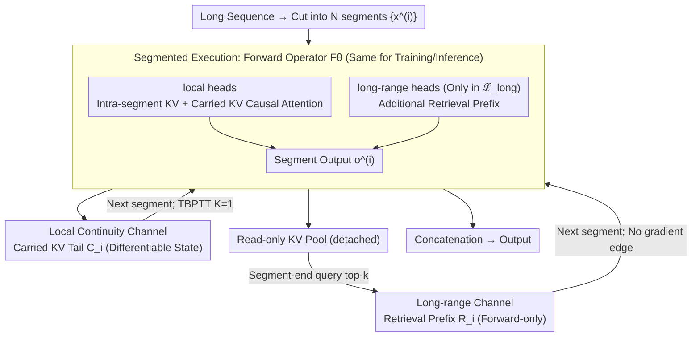

# Training-Inference Consistent Segmented Execution for Long-Context LLMs

**Conference**: ICML 2026  
**arXiv**: [2605.11744](https://arxiv.org/abs/2605.11744)  
**Code**: The paper mentions "Our code is available at: link", but no specific repository address is provided.  
**Area**: LLM Efficiency / Long Context Modeling  
**Keywords**: Long Context, Segmented Execution, Training-Inference Consistency, TBPTT, KV Cache

## TL;DR
This paper proposes a long-context LLM framework that shares identical segmented forward execution semantics for both training and inference: it maintains a fixed-length differentiable KV tail across segments plus a forward-only retrieval bypass. On LLaMA2-7B 32K/80K, it achieves LongBench/RULER performance comparable to or better than full attention with approximately $6\times$ lower peak prefill memory.

## Background & Motivation
**Background**: Transformer long-context generation is constrained by the $O(T^2)$ computational and memory overhead of full attention. The industry generally introduces restricted execution at the inference stage—such as window/sink attention (StreamingLLM), sparse prefill (MInference), compressed KV (ChunkKV), or head-based offloading (DuoAttention). System-level optimizations like FlashAttention/vLLM only reduce constant factors and fail to handle lengths like 128K.

**Limitations of Prior Work**: Most methods impose restrictions only during inference, while training still utilizes full attention. Consequently, dependencies "seen" by the model during training are inaccessible during inference, leading to inconsistent behavior and degradation in stability and generalization for long contexts. Even methods that align training and inference, such as Longformer or CCA, often rely on fixed sparse patterns or context compression without explicitly adopting "segmented recursion" as a unified assumption.

**Key Challenge**: Training uses global gradients, while inference uses local states—whenever gradients during training pass through dependency paths that do not exist during inference, "Training Objective $\neq$ Inference Objective" occurs. While schemes with memory like Transformer-XL introduce inter-segment states, the update dynamics of persistent memory are not naturally equivalent to the execution semantics at inference time.

**Goal**: Elevate "segmented execution" from an inference trick to a shared modeling assumption for both training and inference. Requirements include: (i) fixed and differentiably controllable cross-segment state interfaces; (ii) a training objective exactly equal to the unrolled inference objective; (iii) the capability to capture long-range dependencies beyond the segment.

**Key Insight**: It is observed that (a) long-range attention is concentrated in a few heads (conclusions from mechanism studies like DuoAttention), and (b) structural redundancy exists between attention layers (removing a few layers has minimal impact). Therefore, most heads/layers can follow a "local + carried KV tail" approach, with a "forward-only retrieval" bypass attached only to a few heads/layers.

**Core Idea**: Compress the cross-segment differentiable interface into a single fixed-size KV tail $C_i$ and add a retrieval prefix $R_i$ that does not participate in gradients. Training uses TBPTT to propagate back only $K$ steps, and it is proven that this is the exact gradient for the inference-consistent objective, rather than an approximation.

## Method

### Overall Architecture
The core proposition of this framework is that training and inference must run on the **exact same forward operator**; otherwise, dependencies learned during training cannot be accessed during inference. The sequence is cut into $N$ segments $\{x^{(i)}\}_{i=1}^N$ (each of length $S$), and processed segment-by-segment as $(C_i, o^{(i)}) = F_\theta(x^{(i)}, C_{i-1}, R_{i-1})$ for both training and inference. Information is passed across segments via two narrow channels: $C_{i-1}$ is a fixed-length KV tail carried from the previous segment (the only differentiable state with gradients), and $R_{i-1}$ is a prefix of length $R$ retrieved via top-$k$ from a read-only historical KV pool (forward-only, not in the gradient graph). Internally, the decoder divides heads into two groups—local heads only attend to the current segment + carried KV, while long-range heads additionally consume the retrieval prefix only in selected layers $\mathcal{L}_{\text{long}}$, with other layers degrading to pure intra-segment causal attention. RoPE ensures positional consistency by reassigning positions $\{0,\dots,P-1\}$ to the prefix and shifting the current segment right by $P$.

### Key Designs

**1. Training-Inference Consistent Segmented Execution + TBPTT Exact Gradients: Blocking "Training-Visible, Inference-Invisible" Dependency Paths**

Previous methods almost exclusively imposed segmented restrictions during inference while training with full attention, meaning gradient paths during training did not exist during inference. This paper uses the same forward operator for both and uses stop-gradient during training to truncate cross-segment gradients within the last $K$ segments: defining a truncated state chain $\tilde{C}_{b_i}^{(K)} = \mathrm{sg}(C_{b_i})$ and $\tilde{C}_j^{(K)} = \Phi_\theta(x^{(j)}, \tilde{C}_{j-1}^{(K)}, R_{j-1})$, with the training objective as $L_K(\theta) = \sum_i \ell_i(\theta; \tilde{C}_{i-1}^{(K)}, R_{i-1})$. Here, the forward graph remains unchanged; truncation only shortens the "length" of the gradient path. A key theoretical guarantee is Theorem 3.3: TBPTT on this truncated graph yields the **exact value of $\nabla_\theta L_K(\theta)$ rather than an approximation**, and Corollary 3.4 provides a formal guarantee for training-inference alignment. Because the only differentiable cross-segment state is compressed into a fixed-size KV tail, $K=1$ is optimal in ablations—contrary to the "deeper TBPTT is better" heuristic in classical RNNs, where deeper backpropagation only introduces gradient variance without bringing new information.

**2. Local Continuity Channel: Fixed-length KV Tail Interface $\{C_i\}$ for Consistent State Semantics**

To run training and inference on the same graph, the cross-segment interface must be fixed—this is the role of $\{C_i\}$, the only cross-segment state that carries gradients, responsible for the continuity of "recent context." Each layer caches the most recent $M$ keys/values for the local head set $\mathcal{H}_{\text{local}}$ as $C_i$ for the next segment. During the next segment's processing, local heads perform causal attention on "Carried KV + Intra-segment KV," capping the sequence length at $S+M$. Fixing the interface to a specific size and semantics avoids the training-inference inconsistency of Transformer-XL and the training burden of additional persistent memory tokens like in RMT.

**3. Long-range Channel: Head/Layer Sparse Forward-only Retrieval Prefix $\{R_i\}$ for Long-range Evidence**

A fixed KV tail alone loses long-range dependencies beyond the tail's horizon. Thus, a channel is needed to supplement long-range evidence without polluting the gradient graph. This paper maintains a detached read-only KV pool, where history is stored only for the long-range head set $\mathcal{H}_{\text{long}}$ in a default set of 4 layers $\mathcal{L}_{\text{long}}$. Before each segment, the segment-end query performs top-$k$ retrieval to obtain $R$ KV pairs as a prefix. These KVs are neither updated nor backpropagated. Lemma B.1 formally ensures the retrieval channel introduces no additional cross-segment credit assignment paths. The dual sparsity of heads and layers compresses the effective context per token to $S + \alpha M + \beta(1-\alpha) R$ (where $\alpha$ and $\beta$ are proportions of local heads and long-range layers), keeping active memory usage constant. Restricting retrieval to a few heads also aligns with mechanistic interpretability observations.

### Loss & Training
The training objective is standard next-token NLL, but applied to $L_K(\theta)$ defined by the truncated state chain. The practical implementation uses $K=1$, allowing gradients to pass through only one update from segment $i-1$ to produce $C_{i-1}$. Optimization involves fine-tuning LLaMA2-7B 32K/80K to align execution semantics with the segmented framework. A fair baseline (CCA) uses the same fine-tuning configuration, while other inference-only baselines use their respective pretrained weights.

## Key Experimental Results

### Main Results

| Dataset / Metric | Ours | Vanilla Full Attn | StreamingLLM | DuoAttention | MInference | CCA |
|---|---|---|---|---|---|---|
| LongBench-E 32K Avg | **23.24** | 23.13 | 21.90 | 23.00 | 23.08 | 21.12 |
| LongBench-E 80K Avg | **24.17** | 23.38 | 21.56 | 22.94 | 23.35 | 21.98 |
| 32K Prefill Memory (GB) | **18.56** | 23.61 | 22.19 | 18.15 | 22.19 | 28.08 |
| 80K Prefill Memory (GB) | **19.06** | 34.67 | 31.77 | 23.66 | 31.77 | 43.64 |
| 80K TTFT (s) | **3.49** | 4.13 | 3.07 | 3.79 | 4.13 | 3.88 |

In RULER length generalization tests (CWE/FWE, 4K→64K), Ours achieved CWE 46.39 / FWE 43.88 in the 4K-32K range (Avg*), significantly higher than all baselines. When extrapolating to 64K (beyond training length), existing methods collapsed to 0, while Ours retained CWE 2.00 / FWE 34.17.

### Ablation Study

| Configuration | LongBench-E Avg | Description |
|---|---|---|
| Aligned (TBPTT $K=1$) | **24.17** | Full method, training-inference aligned |
| Misaligned | 11.91 | Training with full attention, Inference with segment; drop > 12 points |
| Aligned (TBPTT $K=2$) | 25.41 (avg≈) | No significant Gain from deeper TBPTT, slight drop in some categories |

### Key Findings
- Training-inference alignment is the single most significant factor: the Misaligned configuration dropped to 11.91, proving that forcing segmentation only at inference prevents the model from performing; this empirically answers why prior inference-only methods are unstable under strict segmentation.
- TBPTT depth is not "the deeper the better": $K=1$ is optimal while $K=2$ is flat or slightly worse, reflecting that under the "unique differentiable cross-segment state" assumption, deeper backpropagation simply adds gradient variance, validating the theory in Section 3.
- Memory usage is nearly constant with length: 128K prefill is reported at approximately $6\times$ lower than FlashAttention full attention, primarily because head/layer sparsity prevents active KV from growing with $T$.

## Highlights & Insights
- "Treating segmentation as a modeling assumption rather than an inference optimization" is a simple yet under-explored perspective: previous works either used persistent memory (Transformer-XL/RMT) or had training-inference mismatches. This paper proves that by compressing the interface into a single KV tail, TBPTT provides exact rather than approximate gradients—elevating an engineering trick to a theoretically grounded training objective.
- Complete decoupling of "differentiable paths" and "long-range paths": the former carries state continuity, while the latter handles long-range retrieval without entering the gradient graph. This philosophy of "Gradient = Local, Long-range = Read-only" is elegant and could be migrated to the training alignment of SSMs, Mamba, and retrieval-augmented LLMs.
- The counter-intuitive finding that $K=1$ is optimal suggests that under a well-designed differentiable interface, "Long BPTT" is a source of noise rather than an advantage; this is a useful practical guide for all segment-level recurrent Transformers.

## Limitations & Future Work
- The retrieval pool uses no eviction strategy, meaning pool memory grows linearly with $T$ (though suppressed by the $\beta(1-\alpha)$ sparsity factor); truly extreme long contexts will still require eviction or quantization.
- Long-range head and layer sets use prior-based fixed selections $\mathcal{L}_{\text{long}} = \{6,8,11,18\}$, relying on empirical priors from previous mechanism studies rather than being "adaptive." Whether head groupings can be learned online remains an open question.
- Evaluations were primarily on LLaMA2 32K/80K + LongBench/RULER; LongBench v2 + LLaMA 3.1 results are only in the appendix. Coverage of recent long-context benchmarks (e.g., RULER-128K, ∞Bench, LV-Eval) is relatively low.
- The paper does not compare long-range performance against native recurrent baselines like GLA, Mamba, or RWKV, which theoretically also possess the "training-inference consistency" attribute.

## Related Work & Insights
- **vs Transformer-XL**: Both use inter-segment carrying + TBPTT; TXL treats this as an efficiency trick, while this paper elevates it to an aligned objective with theoretical guarantees and explicitly separates long-range retrieval from state recursion to avoid mismatch.
- **vs StreamingLLM / MInference**: These only modify attention patterns at inference; this paper demonstrates this mismatch is a performance ceiling—the Misaligned config drops 12 points.
- **vs CCA / Sliding-Window Training**: Both attempt alignment, but typically by "matching attention patterns"; this paper aligns the "entire forward operator," which is more thorough and provides the TBPTT exact gradient conclusion.
- **vs DuoAttention**: Both use head offloading; this paper further adds layer sparsity + training alignment, transforming the observation that "few heads handle long-range" into a trainable architecture.

## Rating
- Novelty: ⭐⭐⭐⭐ Elevating an inference trick to a training objective with TBPTT exact gradient guarantees is a rare "theory-engineering closed loop" in this field.
- Experimental Thoroughness: ⭐⭐⭐⭐ Covers PPL, LongBench-E, RULER length generalization + multiple backbones; however, putting 128K large-scale evaluations in the appendix is a minor drawback.
- Writing Quality: ⭐⭐⭐⭐ Clear definition/theorem structure, and Figures 2/3 intuitively convey the "differentiable path vs forward-only path."
- Value: ⭐⭐⭐⭐ Provides a plug-and-play training-inference alignment scheme for long contexts, offering significant reference value for industrial deployment.

<!-- RELATED:START -->

## Related Papers

- [\[ICML 2026\] Optimal Bayesian Stopping for Efficient Inference of Consistent LLM Answers](optimal_bayesian_stopping_for_efficient_inference_of_consistent_llm_answers.md)
- [\[ACL 2025\] LADM: Long-context Training Data Selection with Attention-based Dependency Measurement for LLMs](../../ACL2025/llm_efficiency/ladm_long_context_data.md)
- [\[ICML 2026\] OBCache: Optimal Brain KV Cache Pruning for Efficient Long-Context LLM Inference](obcache_optimal_brain_kv_cache_pruning_for_efficient_long-context_llm_inference.md)
- [\[ACL 2026\] StructKV: Preserving the Structural Skeleton for Scalable Long-Context Inference](../../ACL2026/llm_efficiency/structkv_preserving_the_structural_skeleton_for_scalable_long-context_inference.md)
- [\[ICML 2025\] Long-Short Alignment for Effective Long-Context Modeling in LLMs](../../ICML2025/llm_efficiency/long-short_alignment_for_effective_long-context_modeling_in_llms.md)

<!-- RELATED:END -->
