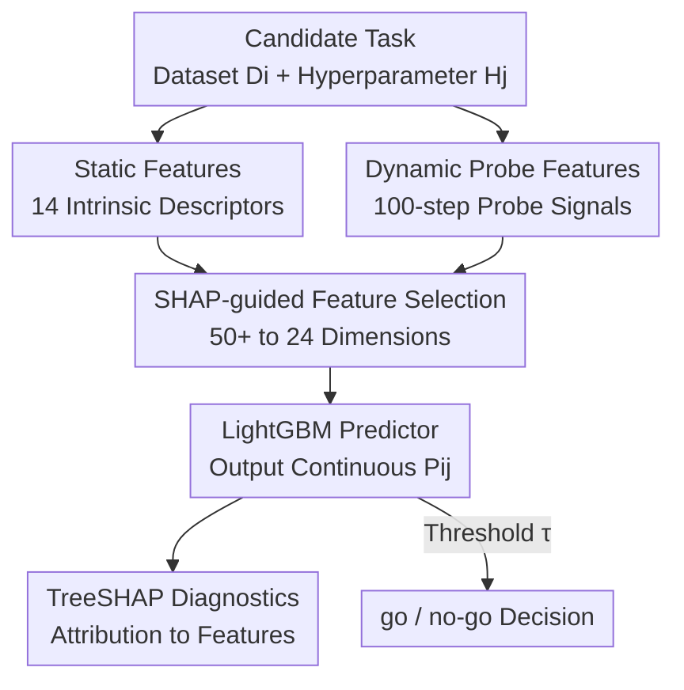

# TuneAhead: Predicting Fine-tuning Performance Before Full Training Begins

**Conference**: ICML2026  
**arXiv**: [2606.17660](https://arxiv.org/abs/2606.17660)  
**Code**: To be confirmed  
**Area**: LLM Efficiency / Performance Prediction / Data-centric AI  
**Keywords**: Fine-tuning performance prediction, meta-features, probes, LightGBM, SHAP diagnostics

## TL;DR
Addressing the pain point where failure is realized only after full training (wasting hundreds of GPU hours), TuneAhead encodes each candidate fine-tuning task into a meta-feature vector consisting of "static dataset descriptors + 100-step dynamic probe features." It uses LightGBM to predict final performance before training (RMSE 1.47pp on 370 test tasks, with 95.1% within ±3pp) and provides diagnosable explanations for "why it might fail" using SHAP.

## Background & Motivation

**Background**: Fine-tuning LLMs is the standard path for domain adaptation, but it is expensive and unpredictable—performance is highly sensitive to data quality and hyperparameters. Blindly running a job might even result in a model worse than the base. Practitioners often care less about "how to fine-tune" and more about "whether this specific task is worth running at all."

**Limitations of Prior Work**: Existing prediction methods are insufficient. Scaling law analysis only provides broad trends across models and datasets, lacking guidance for specific datasets. Proxy models (COSMOS, ProxyLM) and early-stop extrapolation demonstrate that low-cost prediction is feasible, but they compress all features into a **single entangled score**, mixing the "base model's capacity ceiling" with "dataset intrinsic properties." Practitioners receive a number but cannot answer "why it failed," preventing targeted improvements.

**Key Challenge**: Generating the ground truth score $R_{i,j}$ through full fine-tuning and evaluation is too costly (hundreds of GPU hours per cycle), while cheap proxy predictions offer black-box scores without diagnosability. It's a trade-off between being accurate but expensive, or cheap but uninterpretable.

**Goal**: To formalize "fine-tuning result prediction" as a **pre-hoc, diagnosable** meta-learning task. This supports three practical needs: pre-training go/no-go decisions, resource allocation by ranking dataset-hyperparameter combinations, and tracing predictions back to specific data/hyperparameter features for diagnosis.

**Key Insight**: The authors observe that "failure is often easier to predict than success." Failed fine-tuning often leaves clear, low-cost signals: data-model mismatch (high reference perplexity), lack of redundancy/diversity (flat or noisy short-term progress), or unstable optimization (erratic gradients, irregular loss decay). A single strong defect can reliably predict failure, allowing for low-cost early rule-outs.

**Core Idea**: Complementary low-cost features—**Static Dataset Descriptors** (model-agnostic data quality priors) and **Dynamic Probe Features** (derived from a 100-step short probe to capture the learnability of the data by the base model)—are fed into a lightweight LightGBM to predict performance. SHAP is then used to decompose the prediction into feature contributions, achieving both accuracy and diagnosability.

## Method

### Overall Architecture

TuneAhead aims to estimate ground truth performance $R_{i,j}$ using a low-cost prediction function $F$, given a base model $M$, fine-tuning algorithm $A$, and dataset-hyperparameter pair $(D_i, H_j)$. Formally, if full fine-tuning yields $M'_{i,j}=A(M,D_i,H_j)$ with a benchmark score $R_{i,j}$, TuneAhead learns $F$ such that $P_{i,j}=F(V_{i,j})\approx R_{i,j}$. Here, $V_{i,j}$ is the meta-feature vector. The training objective is $\min_F \mathbb{E}_{(D_i,H_j)\sim\mathrm{Dist}}[\Delta(F(V_{i,j}),R_{i,j})]$ where $\Delta$ is MSE. For deployment, a threshold $\tau$ can convert $P_{i,j}$ into a go/no-go decision ($P_{i,j}\ge\tau$).

The process involves two stages: Stage 1 Meta-dataset Construction (encoding tasks into static+dynamic meta-vectors) and Stage 2 Prediction & Diagnostic Modeling (LightGBM regression + TreeSHAP attribution).

### Key Designs

**1. Hybrid Static+Dynamic Meta-features: Separating "Data Priors" from "Learnability"**

This is the foundation that differentiates TuneAhead from black-box proxies. Static features are model-agnostic dataset descriptors (14 features in four categories): global statistics (size, length mean/var, specialized character ratio), lexical diversity (Type-Token Ratio, N-gram repetition, instruction complexity via parse trees), semantic diversity (MinHash deduplication, outlier ratios), and model-based complexity (reference perplexity, KL divergence from pre-training corpus). Dynamic features extract 10 signals from a standardized 100-step **interaction probe**: loss dynamics (initial loss, decay slope, loss variance $\sigma_L^2=\frac{1}{T}\sum_{t=1}^T(L_t-\bar{L})^2$), gradient signals (norm mean/var, consistency, sparsity), and generalization cues (parameter change norm, landscape flatness). Static features provide a prior on data quality, while dynamic features reveal early signs of data-model mismatch or optimization instability.

**2. SHAP-guided Feature Selection: Refining 50+ Dimensions to 24**

Features were selected rigorously. Starting from 50+ candidates, a preliminary LightGBM was trained on the training/validation set (never the held-out test set). Pruning followed three criteria: Global importance (mean absolute SHAP value $s_f=\frac{1}{N}\sum_{i=1}^N|\phi_{i,f}|$, removing the bottom 15th percentile), directional consistency ($c_f=\mathrm{sign}(\rho_f)\cdot\rho_f$, where $\rho_f$ is Spearman correlation; pruning if $c_f<0.2$), and redundancy pruning (iteratively removing highly correlated features unless RMSE worsened by $\Delta\mathrm{RMSE}>0.01$). This narrowed the pool to 24 highly discriminative features (14 static + 10 dynamic) with interpretable directions.

**3. LightGBM + TreeSHAP: Diagnosable Prediction**

Stage 2 uses LightGBM as a regressor, which naturally handles heterogeneous tabular meta-features better than SOTA SVR in scalability. The integration with TreeSHAP allows each prediction $P_{i,j}$ to be decomposed into additive feature contributions. Thus, a "failed" task can be traced back to specific causes—such as "low lexical diversity (static)" or "unstable gradient norms (dynamic)"—pointing directly to actionable improvements like data cleaning or hyperparameter tuning.

### Loss & Training

The predictor minimizes MSE with a fixed LightGBM configuration (learning rate 0.05, `num_leaves` 4). Ground truth labels are the MMLU test set accuracy averaged over seeds (default 3) after full LoRA fine-tuning. Feature selection is performed on the training/validation split; the held-out test set is reserved purely for final evaluation.

## Key Experimental Results

### Main Results

Using Qwen2.5-7B-Instruct to build a meta-dataset of 1300+ full fine-tuning tasks, with 370 held-out tasks for testing MMLU accuracy (errors in percentage points, pp):

| Method | RMSE ↓ | $R^2$ ↑ | $r$ ↑ | Acc@1pp | Acc@2pp | Acc@3pp |
|------|--------|--------|------|---------|---------|---------|
| Early-Stop Extrapolation | 7.43 | 0.81 | 0.90 | 11.2 | 23.9 | 32.8 |
| Domain-Proxy Baseline | 6.58 | 0.85 | 0.92 | 8.6 | 22.0 | 32.8 |
| Early-Dynamics Baseline | 3.33 | 0.96 | 0.98 | 29.9 | 50.0 | 67.5 |
| ProxyLM | 2.11 | 0.98 | 0.99 | 40.7 | 67.9 | 85.8 |
| **Ours (Full)** | **1.47** | **0.99** | **0.99** | **50.0** | **82.5** | **95.1** |

TuneAhead reduces RMSE by 30% compared to ProxyLM (2.11→1.47) and by 80% compared to Early-Stop. Acc@3pp reached 95.1%, meaning 95% of predictions were within ±3pp of the ground truth.

### Ablation Study

| Configuration | RMSE ↓ | Acc@3pp | Description |
|------|--------|---------|------|
| TuneAhead-Static-Only | 3.50 | 49.3 | Static dataset features only |
| TuneAhead-Dynamic-Only | 3.38 | 55.6 | 100-step probe dynamic features only |
| **Ours (Full)** | **1.47** | **95.1** | Hybrid; RMSE drops ~56-58% vs single source |

### Key Findings
- **High Complementarity**: Using either static or dynamic features alone results in an RMSE around 3.4-3.5. Combining them drops RMSE to 1.47, indicating both "data priors" and "learnability" are essential.
- **Portability**: Adapting to Llama-3-8B (400 tasks) yielded $R^2=0.86$, and Qwen2-0.5B (450 tasks) yielded $R^2=0.91$. The authors interpret this as "framework portability" rather than zero-shot migration.
- **Cross-benchmark Robustness**: When re-evaluated on TruthfulQA (MC2), the same features and protocol achieved RMSE 2.17 and $R^2=0.98$, still outperforming ProxyLM.
- **Efficiency Gains**: At threshold $\tau=55\%$, 58.4% of compute was saved while retaining 94.5% of successful tasks.

## Highlights & Insights
- The most clever insight is that "failure is easier to predict than success." Instead of modeling successful paths perfectly, identifying a single fatal flaw (high perplexity or gradient jitter) allows for reliable early screening.
- Hyperparameters are treated as candidate inputs rather than hidden tuning variables. Since meta-samples are $(D_i, H_j)$ pairs, TuneAhead can rank dataset-hyperparameter combinations rather than just evaluating data.
- Diagnosability is the differentiator. Decomposing failure into "low lexical diversity" or "unstable gradients" provides actionable directions for data cleaning or parameter adjustment.

## Limitations & Future Work
- The predictor is trained separately for each model setting. Migration to new base models currently requires rebuilding the meta-dataset.
- Ground truth is fixed to classification/multiple-choice accuracy (MMLU/TruthfulQA). Validation on generative tasks (e.g., summary) is limited.
- 100-step probes still incur cost, and the trade-off between probe length and prediction accuracy has not been systematically swept.

## Related Work & Insights
- **vs. ProxyLM / COSMOS**: These use proxy small models for a single entangled score. TuneAhead explicitly separates static data features from dynamic interaction features and utilizes SHAP for traceability, achieving higher accuracy.
- **vs. Early-Stop / Early-Dynamics**: These extrapolate short loss curves, which fails for non-monotonic LLM dynamics. TuneAhead’s 24 structured features are more robust (RMSE 1.47 vs. 3.33-7.43).
- **vs. Data Cartography**: These provide instance-level quality scores but don't predict final fine-tuning gains for the whole set. TuneAhead treats the dataset as a meta-instance, bridging the gap between quality assessment and performance prediction.

## Rating
- Novelty: ⭐⭐⭐⭐ Pre-hoc diagnosable formulation is clear; hybrid features + SHAP are solid increments.
- Experimental Thoroughness: ⭐⭐⭐⭐⭐ 1300+ tasks, 3 base models, multiple benchmarks, and threshold analysis.
- Writing Quality: ⭐⭐⭐⭐ Clear motivation and insights on failures; feature engineering is well-justified.
- Value: ⭐⭐⭐⭐⭐ Direct compute savings + actionable diagnostics; highly attractive for engineering practice.

<!-- RELATED:START -->

## Related Papers

- [\[ICML 2026\] A Risk Decomposition Framework for Pre-Hoc Fine-Tuning Prediction](a_risk_decomposition_framework_for_pre-hoc_fine-tuning_prediction.md)
- [\[ACL 2026\] Small Data, Big Noise: Adversarial Training for Robust Parameter-Efficient Fine-Tuning](../../ACL2026/llm_efficiency/small_data_big_noise_adversarial_training_for_robust_parameter-efficient_fine-tu.md)
- [\[ICML 2026\] ReMoE: Boosting Expert Reuse through Router Fine-Tuning in Memory-Constrained MoE LLM Inference](remoe_boosting_expert_reuse_through_router_fine-tuning_in_memory-constrained_moe.md)
- [\[ICLR 2026\] TokenSeek: Memory Efficient Fine Tuning via Instance-Aware Token Selection](../../ICLR2026/llm_efficiency/tokenseek_memory_efficient_fine_tuning_via_instance-aware_token_selection.md)
- [\[NeurIPS 2025\] Hierarchical Balance Packing: Towards Efficient Supervised Fine-tuning for Long-Context LLM](../../NeurIPS2025/llm_efficiency/hierarchical_balance_packing_towards_efficient_supervised_fine-tuning_for_long-c.md)

<!-- RELATED:END -->
