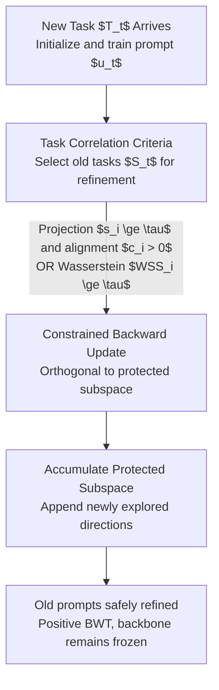

# Turning Back Without Forgetting: Selective Backward Refinement for Parameter-Efficient Continual Learning

**Conference**: ICML 2026  
**arXiv**: [2606.01379](https://arxiv.org/abs/2606.01379)  
**Code**: https://github.com/OptMN-Lab/SABER-ICML-2026/  
**Area**: LLM Efficiency / Continual Learning / Prompt Tuning  
**Keywords**: Continual Learning, Prompt Tuning, Backward Knowledge Transfer, Gradient Subspace, No-replay  

## TL;DR
SABER is the first to achieve "no-replay forward and backward transfer" in prompt-based continual learning. It utilizes dual correlation criteria—gradient geometry and loss distribution—to decide whether to "go back and refine old task prompts," and restricts updates to an orthogonal subspace that does not interfere with old tasks to perform "safe refinement," allowing subsequent tasks to actively improve the accuracy of prior tasks.

## Background & Motivation
**Background**: For continual learning (CL) on large models, the mainstream approach is Parameter-Efficient Fine-Tuning (PEFT): freezing the backbone and learning a small set of parameters for each task. Prompt-based methods are the most lightweight—learning a soft prompt for each task to prepend to the input while keeping the backbone completely untouched. The per-task parameter count is lower than adapter/LoRA, making it particularly suitable for long task sequences.

**Limitations of Prior Work**: These methods prevent forgetting through "strict task isolation"—once a task's prompt is learned, it is frozen and never modified for future tasks. While this prevents forgetting, the cost is that **subsequently learned tasks can never go back to improve previously learned tasks**, even if the tasks are highly correlated and could benefit from shared knowledge. Consequently, backward transfer (BWT) is structurally blocked in prompt-based CL.

**Key Challenge**: There is a dilemma regarding whether to modify old prompts. The paper demonstrates through experiments that directly using new task gradients to update old prompts (unconstrained backward updates) is **unreliable**: even for semantically related task pairs, unconstrained updates often lead to zero or negative BWT (e.g., Yelp $\leftarrow$ Amazon drops by 0.121), as they overwrite critical directions necessary for the old tasks.

**Goal**: Decomposition into two sub-problems: (1) **When** to perform backward refinement (which old tasks are sufficiently related to the current task to warrant refinement); (2) **How** to refine safely (injecting new knowledge without damaging the critical directions of old tasks).

**Key Insight**: The authors observe that backward refinement is not "universally beneficial" but depends strongly on whether the current task's learning signals are compatible with the old tasks. They characterize "task compatibility" from two complementary perspectives—prompt gradient geometry and loss response—and restrict updates to the **orthogonal complement** of the old tasks' gradient subspace.

**Core Idea**: Replace "blanket freezing" with "selective and constrained refinement"—refining old prompts only for related tasks and only along non-interfering directions, thereby achieving positive BWT without replay.

## Method

### Overall Architecture
SABER (Selective bAckward refinement for positive Backward knowledge transfER) addresses task-incremental CL: tasks $T_1,\dots,T_T$ arrive sequentially, the backbone $f(\cdot;\theta)$ is frozen, and each task $T_t$ learns a soft prompt $u_t\in\mathbb{R}^{\ell\times d}$. The pipeline consists of three steps: first, maintaining a "protected gradient subspace" for each prompt in completed tasks; when a new task $T_t$ arrives, using correlation criteria to **select** a subset $S_t$ of historical prompts worth refining; then, while training $u_t$, performing **orthogonally constrained** backward updates on old prompts in $S_t$, and appending newly explored directions to the protected subspace to ensure subsequent refinements do not overwrite them.

### Key Designs

**1. Projection + Alignment Dual Criteria: Judging "Whether to Refine" via Gradient Geometry**

The first criterion assesses task compatibility through the "geometry of parameter updates," addressing the pain point that semantic similarity or task labels cannot reliably predict whether backward transfer should occur. For an old task $T_i$, prompt gradients are collected to form a set of orthogonal bases $U_i\in\mathbb{R}^{(\ell d)\times r}$ ($r\ll \ell d$) spanning its gradient subspace. The gradient of the current task $T_t$ with respect to the old prompt $u_i$ is denoted as $g_{t\to i}=\nabla_{u_i}\mathcal{L}_t(u_i)$. The **projection score** is defined as:

$$s_i=\mathbb{E}\!\left[\frac{\lVert U_iU_i^\top g_{t\to i}\rVert_2}{\lVert g_{t\to i}\rVert_2}\right]\in[0,1],$$

which measures "what proportion of the current task's update falls into the critical directions of the old task." However, a high $s_i$ only indicates shared bases and does not guarantee directional alignment. Thus, a **gradient alignment** score $c_i=\max\!\big(\frac{\langle \bar g_i,\bar g_{t\to i}\rangle}{\lVert\bar g_i\rVert_2\lVert\bar g_{t\to i}\rVert_2},0\big)$ is added. A task is judged as positively correlated only if $s_i\ge\tau_s$ and $c_i>0$ hold simultaneously. This geometric criterion is precise and controllable, suitable for scenarios where "gradient information is reliable and stronger safety guarantees are desired."

**2. Wasserstein Loss Distribution Criterion: Lightweight Response-level Correlation**

Storing gradient subspaces incurs significant memory overhead when tasks are numerous or prompt dimensions are high. Thus, the paper provides a complementary criterion using only scalar loss statistics to judge correlation at the "model response" level. For a prompt $u_i$ of task $T_i$, applying it to batches of $T_t$ yields an empirical loss distribution $\mathcal{P}_t^{(i)}=\{\ell(B_j;u_i)\}$. Using the Wasserstein distance $W(\cdot,\cdot)$, it defines:

$$\mathrm{WSS}_i=d_i^{(0)}-d_i^{(i)},\quad d_i^{(0)}=W\!\big(\mathcal{P}_i^{(0)},\mathcal{P}_t^{(0)}\big),\ d_i^{(i)}=W\!\big(\mathcal{P}_i^{(i)},\mathcal{P}_t^{(i)}\big).$$

The intuition is: if the knowledge learned by $T_i$ can transfer to $T_t$, then applying prompt $u_i$ to both tasks should make their loss responses **more similar** (compared to the frozen backbone baseline). Thus, $\mathrm{WSS}_i>0$ indicates response-level correlation. This criterion only requires storing scalar loss statistics, making its storage/maintenance cost much lower than gradient subspaces—trading "granularity for efficiency." Both criteria have their strengths, and one can be chosen based on deployment constraints.

**3. Orthogonally Constrained Backward Update + Accumulated Protected Subspace: Safe Refinement without Overwriting**

Once $S_t$ is selected, the problem is "how to refine without harming old tasks." The paper treats the old task gradient subspace $U_i$ as a **protected subspace**, projecting the current task gradient to remove components aligned with it, keeping only the orthogonal complement for the update:

$$\Delta u_i^{\text{orth}}=(I-U_iU_i^\top)\,g_{t\to i},\qquad u_i\leftarrow u_i-\eta\,\Delta u_i^{\text{orth}}.$$

The paper compares unconstrained, same-subspace, and hybrid alternatives (Table 4). Unconstrained updates are noisy and inconsistent (avg. $\Delta$Acc +0.007); same-subspace updates are worse (-0.007, proving that modifying critical directions is particularly harmful); hybrid updates are unstable. Only orthogonal updates achieve an avg. $\Delta$Acc of **+0.0215**, balancing the use of unused prompt space capacity while avoiding critical directions. When an old prompt is refined multiple times, the paper maintains an **accumulated protected subspace** $\tilde U_i^{(t)}$: each step takes a safe direction $\Delta u_i^{(t)}=(I-\tilde U_i^{(t-1)}\tilde U_i^{(t-1)\top})\nabla_{u_i}\mathcal{L}_t(u_i)$ outside $\tilde U_i^{(t-1)}$, then appends the normalized new direction after orthogonalization. Proposition 4.1 guarantees each refinement is orthogonal to directions used in "original training + all previous refinements" (non-interfering, no reuse). Proposition 4.2 further proves that under $L$-smoothness and $\eta\le 1/L$, $K$ steps of safe refinement ensure the current task loss is monotonically non-increasing $f(u^{(0)})-f(u^{(K)})\ge\frac{\eta}{2}\sum_k\lVert\Delta(u^{(k)})\rVert_2^2$, making it theoretically safe and effective.

### Loss & Training
Each task $T_t$ first uses standard gradient descent to learn $u_t$ (backbone frozen; the first task degrades to standard prompt tuning). Once $u_t$ is stable, several steps of safe refinement are performed on old prompts in $S_t$. The selection set is:

$$S_t=\Big\{i\,\big|\,\text{C1: }s_i\ge\tau_s\wedge c_i>0\ \ \text{or}\ \ \text{C2: }\mathrm{WSS}_{t,i}\ge\tau_{\mathrm{WSS}}\Big\}.$$

A **fixed global threshold** of $\tau_s=0.1$ and $\tau_{\mathrm{WSS}}=0.2$ is used throughout, requiring no per-benchmark tuning across datasets or backbones. The overall optimization goal is $\min_{\{u_t\}\cup\{u_i\}_{i\in S_t}}\mathcal{L}_t(u_t)$, subject to $\tilde U_i^{(t-1)\top}\Delta u_i^{(t)}=0,\ \forall i\in S_t$. SABER is modular and can be directly embedded into existing Frozen Prompt Pool (FPP) and Shared Prompt Augmentation (SPA) frameworks, corresponding to the SABER-P (projection) and SABER-L (loss distribution) variants.

## Key Experimental Results

### Main Results
Evaluated on two standard task-incremental benchmarks—Long Sequence and SuperNI (15 tasks each, two task orders)—using AP (Average Performance) and BWT (Backward Transfer). Representative results on LLaMA-2-7B for Order 1 are shown below:

| Method | Long Seq. AP↑ | Long Seq. BWT↑ | SuperNI AP↑ | SuperNI BWT↑ |
|------|------|------|------|------|
| Replay | 60.32 | −19.54 | 37.48 | −21.47 |
| ProgPrompt | 78.98 | −0.18 | 40.65 | −0.26 |
| SHLPT | 79.40 | −0.27 | 44.97 | −0.45 |
| SAPT | 78.43 | −0.86 | 46.98 | −0.75 |
| **FPP + SABER-P** | **82.87** | **+1.56** | **48.65** | **+2.13** |
| SPA + SABER-P | 81.47 | +1.39 | 49.48 | +2.18 |

Key observation: All baseline methods exhibit negative BWT (at best close to 0). **SABER is the only method to consistently achieve positive BWT** while also yielding higher AP. Conclusions are consistent on T5-Large (FPP+SABER-P achieves AP 80.46 / BWT +1.76 on Long Seq. Order 1, compared to SAPT's 78.14 / −0.45).

### Ablation Study

| Configuration | Average $\Delta$Acc (pairwise BWT) | Description |
|------|------|------|
| Unconstrained $\Delta u^{\text{unconstr}}$ | +0.007 | Noisy, inconsistent benefits |
| Same-subspace $\Delta u^{\text{same}}$ | −0.007 | Damages critical directions; worst |
| Hybrid $\Delta u^{\text{hybrid}}$ | −0.002 | Unstable |
| **Orthogonal $\Delta u^{\text{orth}}$ (Ours)** | **+0.0215** | Only stable positive transfer |

### Key Findings
- **"Same-subspace" is actually the worst**: Uniformly perturbing the old task's critical directions overwrites fine-tuned representations, performing worse than no constraints. This validates the necessity of the "protected subspace" design.
- **Selectivity is a prerequisite**: Table 2/3 shows that unconstrained backward updates are catastrophic for unrelated task pairs (e.g., WiC $\leftarrow$ MultiRC drops 0.160) and often yield no benefit even for related pairs (e.g., IMDb $\leftarrow$ Amazon drops 0.044)—hence the need to filter incompatible tasks first.
- **Threshold Robustness**: Fixed $\tau_s=0.1$ and $\tau_{\mathrm{WSS}}=0.2$ work across datasets and backbones without tuning, facilitating easy engineering deployment.

## Highlights & Insights
- **Attributing "BWT Difficulty" to Geometry**: It is not a philosophical debate of "whether to move old prompts" but a geometric question of "along which directions to move." Moving in the orthogonal complement is safe; moving in critical directions is harmful.
- **Practical Trade-offs between Criteria**: The gradient geometry criterion is precise but requires subspace storage, while the Wasserstein loss criterion only stores scalars and is memory-friendly, providing a clear "granularity vs. efficiency" knob for deployment.
- **Theoretical + Empirical Closed Loop**: Propositions 4.1/4.2 prove non-interference and monotonicity. The accumulated protected subspace ensures multiple refinements do not overwrite each other—this orthogonal projection paradigm can be transferred to other PEFT modules for backward refinement.
- **Zero Replay**: In privacy or storage-constrained scenarios, achieving backward improvement without storing any old data is a significant advantage over replay-based methods.

## Limitations & Future Work
- **Dependency on Gradient Subspace Rank $r$ and Sampling Quality**: The projection criterion requires reliable gradient subspaces. In cases with sparse task data or high noise, the estimation of $U_i$ might be inaccurate. Validation was primarily on NLP classification/generation tasks.
- **Orthogonal Complement Capacity Depletion**: The accumulated protected subspace grows monotonically. In long task sequences, "available orthogonal directions" may diminish, potentially exhausting the space for backward refinement.
- **Task Boundary Assumption**: The method assumes a task-incremental setting with clear boundaries. How to select $S_t$ in task-free scenarios or where boundaries are blurred remains to be explored.
- **Future Directions**: Considering "aging/forgetting" for the protected subspace to release capacity, or extending criteria to online correlation estimation in task-free settings.

## Related Work & Insights
- **vs. ProgPrompt / CODA-Prompt (Freeze/Isolate school)**: These rely on freezing old prompts to prevent forgetting, capping BWT at 0. SABER allows "controlled movement" of old prompts, pushing BWT into positive territory and increasing AP.
- **vs. wong2024learning (mask + replay BWT)**: That work updates task masks via gradient signals but **requires replay data**. SABER is entirely replay-free and directly refines task representations rather than masks.
- **vs. li2026turning (causal-aware LoRA)**: That work uses prior task signals to guide current adapter updates but does not directly refine learned representations. SABER directly writes knowledge back to old task prompts.
- **vs. Gradient Projection CL (e.g., OGD/GPM)**: Traditional gradient projection uses task similarity to constrain **forward** learning to prevent forgetting. SABER conversely uses similarity for **selective backward refinement**, aiming for improvement rather than just protection.

## Rating
- Novelty: ⭐⭐⭐⭐⭐ First to achieve replay-free positive backward transfer in prompt-based CL with a clear geometric entry point.
- Experimental Thoroughness: ⭐⭐⭐⭐ Multiple backbones (T5/LLaMA/Qwen), two benchmarks, and two orders; the only method with stable positive BWT. Degradation over extremely long sequences is untested.
- Writing Quality: ⭐⭐⭐⭐⭐ Logical progression from motivation to criteria to constraints to theory. Tables 2/3/4 explain the design choices very well.
- Value: ⭐⭐⭐⭐ The paradigm of orthogonal refinement + accumulated protected subspaces is transferable to other PEFT backward transfer scenarios.

<!-- RELATED:START -->

## Related Papers

- [\[ICLR 2026\] One-Prompt Strikes Back: Sparse Mixture of Experts for Prompt-based Continual Learning](../../ICLR2026/llm_efficiency/one-prompt_strikes_back_sparse_mixture_of_experts_for_prompt-based_continual_lea.md)
- [\[ACL 2026\] Small Data, Big Noise: Adversarial Training for Robust Parameter-Efficient Fine-Tuning](../../ACL2026/llm_efficiency/small_data_big_noise_adversarial_training_for_robust_parameter-efficient_fine-tu.md)
- [\[AAAI 2026\] Resource Efficient Sleep Staging via Multi-Level Masking and Prompt Learning](../../AAAI2026/llm_efficiency/resource_efficient_sleep_staging_via_multi-level_masking_and_prompt_learning.md)
- [\[ICML 2026\] Skip a Layer or Loop It? Learning Program-of-Layers in LLMs](skip_a_layer_or_loop_it_learning_program-of-layers_in_llms.md)
- [\[ICML 2026\] STAR: Rethinking MoE Routing as Structure-Aware Subspace Learning](star_rethinking_moe_routing_as_structure-aware_subspace_learning.md)

<!-- RELATED:END -->
