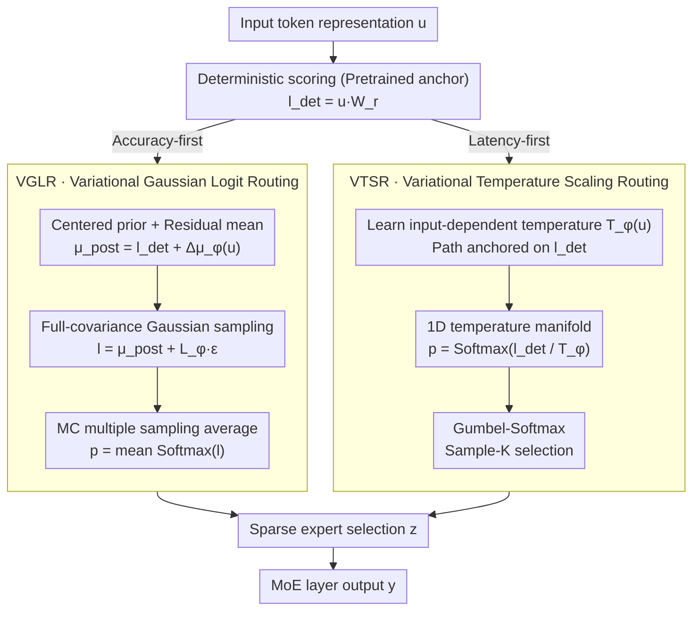

# Variational Routing: A Scalable Bayesian Framework for Calibrated MoE Transformers

**Conference**: ICML 2026  
**arXiv**: [2603.09453](https://arxiv.org/abs/2603.09453)  
**Code**: To be confirmed  
**Area**: Model Compression / LLM Efficiency / AI Safety  
**Keywords**: Mixture-of-Experts, Bayesian Inference, Calibration, Uncertainty Quantification, Sparse Routing

## TL;DR
Proposes the variational routing framework VMoER—by performing variational inference on the routing decisions of MoE layers rather than weight inference, it achieves efficient Bayesian uncertainty modeling. It reduces calibration error by 94% and improves routing stability by 38% while maintaining <1% additional FLOPs overhead.

## Background & Motivation

**Background**: Foundation model scales have reached trillions of parameters, achieving efficient scaling through sparse expert routing in MoE layers. However, current routing mechanisms adopt deterministic Top-K strategies, which are prone to incorrect expert selection under input perturbations.

**Limitations of Prior Work**: (1) Deterministic routing is sensitive to input noise, leading to brittle failures; (2) predictions are highly overconfident with large calibration errors; (3) existing Bayesian methods targeting weight uncertainty involve high computational overhead, making them unsuitable for trillion-parameter scales.

**Key Challenge**: How to inject uncertainty-aware capabilities into MoE models with minimal computational cost to ensure reliable model deployment.

**Goal**: Design a lightweight Bayesian framework to directly perform probabilistic modeling on routing decisions (rather than weights).

**Key Insight**: Reformulate MoE routing as a latent variable model, observing that—(1) deterministic routing implicitly ignores the uncertainty chain of logits → probability → selection; (2) the Top-K operation is essentially a multi-label problem.

**Core Idea**: Shift from weight space to decision space for variational inference—directly modeling the probability of routing logits or temperature parameters through amortized inference, bypassing the complexity of high-dimensional weight posteriors.

## Method

### Overall Architecture
VMoER shifts the task of "injecting uncertainty into MoE" from the weight space to the decision space: instead of approximating the weight posterior of trillion-parameter models, it performs variational inference only on the **routing decisions** for each token entering the MoE layer. All paths share the same starting point—deterministic routing first calculates the scoring $\mathbf{l}_{det}=\mathbf{u}\mathbf{W}_r$, and variational inference simply overlays an uncertainty layer on this pretrained anchor. Above this, it provides two complementary paths—one applies a variational Gaussian distribution $q_\phi(\mathbf{l}|\mathbf{u})$ to the routing scores $\mathbf{l}$ in the logit space to explicitly model correlations between experts; the other learns an input-dependent temperature $T_\phi(\mathbf{u})$ in the selection space, using it to dynamically adjust softmax sharpness and replace Top-K with Sample-K for randomized selection. The former provides the best calibration but requires multiple samplings, whereas the latter has almost zero additional overhead. These two paths cover both "accuracy-first" and "latency-first" deployment requirements.

### Key Designs

**1. Variational Gaussian Logit Routing (VGLR): Adding a correlated Gaussian posterior to routing scores**

The root of deterministic Top-K's brittleness lies in treating the chain of logits → probability → selection as noise-free; expert selection fails even with slight input perturbations. VGLR performs amortized variational inference directly on routing logits: the prior is defined as a centered Gaussian $p(\mathbf{l}|\mathbf{u})=\mathcal{N}(\mathbf{l}_{det}, \mathbf{I})$, where $\mathbf{l}_{det}=\mathbf{u}\mathbf{W}_r$ is the original deterministic score; the posterior mean is expressed in residual form $\boldsymbol{\mu}_{post}(\mathbf{u})=\mathbf{l}_{det}+\Delta\boldsymbol{\mu}_\phi(\mathbf{u})$, where the inference network only learns a correction term $\Delta\boldsymbol{\mu}_\phi(\mathbf{u})$ rather than relearning routing from scratch. The covariance is parameterized using Cholesky factorization $\boldsymbol{\Sigma}_{post}=\mathbf{LL}^\top$. With the number of experts $N \le 64$, the $O(N^2)$ complexity is entirely acceptable. During inference, MC sampling is performed on $q_\phi$ and then averaged. It is more effective than weight-space methods (MCDropout/SWAG) because the latter must project parameter noise indirectly through linear layers onto decisions, while VGLR models decision variables directly. Furthermore, the **full covariance** breaks the mean-field diagonal assumption, capturing inter-expert correlations like "choosing expert A tends to avoid expert B"—in ablations, full covariance was key to reducing ECE from 0.252 to 0.015.

**2. Variational Temperature Scaling Routing (VTSR): Compressing the variational family into a 1D temperature manifold**

While VGLR provides excellent calibration, multiple samplings slow down inference latency. VTSR constrains the entire variational family to a 1D manifold—all posteriors move along the trajectory of "deterministic logits divided by input-dependent temperature": $q_\phi(\mathbf{p}|\mathbf{u})=\text{Softmax}(\mathbf{l}_{det}/T_\phi(\mathbf{u}))$. The only learned component is the scalar temperature network $T_\phi(\mathbf{u})$. Higher temperatures result in flatter distributions and more conservative expert selection, while lower temperatures are sharper. Sampling uses Gumbel-Softmax for Sample-K, and the KL regularization term on this manifold conveniently reduces to Shannon entropy. The cost is movement only within the scaling parameter space, with computational overhead of just $O(D_H)$, or less than 0.67% FLOPs. It provides calibrated selections in a single forward pass without the repeated sampling of VGLR—representing zero additional sampling cost at a slight expense of precision.

**3. Centered Prior and Residual Learning: Maintaining pretrained routing during fine-tuning**

The stability of VGLR and VTSR relies on a shared premise: the variational solution is not learned from scratch but is anchored to the deterministic score $\mathbf{l}_{det}$. VGLR centers the Gaussian prior on the deterministic solution $p(\mathbf{l}|\mathbf{u})=\mathcal{N}(\mathbf{l}_{det},\mathbf{I})$, and the posterior only learns a residual mean $\Delta\boldsymbol{\mu}_\phi(\mathbf{u})$ added to the original logits. Consequently, the KL term naturally reduces to a distance of "residual to zero," regularizing around a zero residual. VTSR constrains the entire variational trajectory to a 1D temperature manifold passing through $\mathbf{l}_{det}$ (reverting to deterministic Top-K as temperature $T \to 0$). During fine-tuning, routing is prone to "selection drift," disrupting the expert division of labor learned during pretraining. This "anchoring to the deterministic solution" design provides a stable fulcrum for optimization: uncertainty is a layer of correction on top of an already high-quality deterministic router, rather than a full replacement.

### Loss & Training
**VGLR** directly maximizes ELBO: $\mathcal{L}_{ELBO}=\mathbb{E}_{q_\phi(\mathbf{l}|\mathbf{u})}[\log p(\mathbf{y}|\mathbf{l},\mathbf{u})]-\beta D_{KL}(q_\phi(\mathbf{l}|\mathbf{u})\|\mathcal{N}(\mathbf{0},\mathbf{I}))$, where the first term handles reconstruction and the second pulls the posterior towards the centered prior, with $\beta$ balancing the two. **VTSR** focuses on reconstruction, plus a surrogate loss $\mathcal{L}_{reg}=-\log T_\phi(\mathbf{u})$ to implicitly push the temperature toward the prior.

## Key Experimental Results

### Main Results

| Dataset | Model | Metric | MAP Baseline | VGLR-MF | VGLR-FC | VTSR |
|--------|------|------|--------|---------|---------|------|
| OpenBookQA | Granite-3B | ECE ↓ | 0.252 | 0.026 | **0.015** | 0.052 |
| OpenBookQA | Qwen-2.7B | ECE ↓ | 0.127 | 0.028 | **0.014** | 0.022 |
| OpenBookQA | DeepSeek-16B | ECE ↓ | 0.168 | 0.067 | **0.054** | 0.060 |

### Ablation Study

| Experimental Item | Granite ECE | Qwen ECE | Finding |
|--------|------------|----------|------|
| Deterministic Top-K | 0.252 | 0.127 | Baseline is overconfident |
| Fixed Temperature Scaling | 0.107 | 0.102 | Unstable across models (3% accuracy drop) |
| VGLR-FC Full Covariance | 0.015 | 0.014 | Calibration error reduced by 94% |
| Noise Robustness (σ=0.01) | Jaccard=0.532 | Jaccard>0.612 | VGLR stability improved by 38% |
| OoD Detection AUROC | 0.659 (Baseline) | 0.749 (VGLR) | Internal logit variance signal is better than gating entropy |

### Key Findings
- Full covariance is critical—explicitly modeling correlations significantly improves calibration.
- VTSR outperforms globally fixed temperature scaling in accuracy stability.
- Internal inference uncertainty provides a stronger signal for OoD detection than predictive entropy.

## Highlights & Insights
- **Probabilistic Generative Perspective**: Formalizes MoE routing as a latent variable model, interpreting heuristic load balancing and auxiliary losses as implicit Bayesian priors.
- **Shift from Weight Space to Decision Space**: Inferring directly on routing logits or temperature parameters captures necessary uncertainty while avoiding the curse of dimensionality.
- **Dual-path Flexible Design**: VGLR offers optimal calibration with slightly higher inference latency; VTSR sacrifices minor precision for zero additional sampling cost in single-pass inference.
- **Transferable Components**: Centered prior + residual learning and temperature-scaled 1D manifolds simplify generalization.

## Limitations & Future Work
- VTSR training instability—temperature parameters are prone to collapse, requiring careful initialization.
- Evaluation is limited to MCQA next-token prediction tasks and does not cover error accumulation in long-sequence generation.
- Evaluation on even larger scales—the largest tested was DeepSeek-16B.
- Improvements: Stabilize variational objectives for VTSR; extend to sequence-level uncertainty; hybridize with weight-space Bayesian methods.

## Related Work & Insights
- **vs. Weight-space methods (MCDropout/SWAG)**: The latter models the entire parameter space with 2.6% FLOPs; Ours models only routing decisions at <1%.
- **vs. Heuristic stabilization**: Existing methods (fixed temperature, load balancing regularization) lack probabilistic interpretation; Ours learns input-dependent uncertainty.
- **vs. Output-space uncertainty (Semantic Entropy)**: The latter aggregates output distributions post-hoc; Ours extracts epistemic uncertainty directly from internal routing decisions.

## Rating
- Novelty: ⭐⭐⭐⭐⭐ First systematic application of variational inference to MoE routing decisions rather than weights.
- Experimental Thoroughness: ⭐⭐⭐⭐ 3 SOTA architectures + multidimensional evaluation; however, limited to MCQA tasks up to 16B.
- Writing Quality: ⭐⭐⭐⭐⭐ Clear theory and rigorous derivation of the probabilistic generative process.
- Value: ⭐⭐⭐⭐⭐ Points toward an efficient path for reliable deployment of trillion-parameter foundation models.

<!-- RELATED:START -->

## Related Papers

- [\[ICML 2026\] DOT-MoE: 用可微 optimal transport 把 dense LLM 转成 MoE](dot-moe_differentiable_optimal_transport_for_moefication.md)
- [\[ICML 2026\] ProbMoE: Differentiable Probabilistic Routing for Mixture-of-Experts](probmoe_differentiable_probabilistic_routing_for_mixture-of-experts.md)
- [\[CVPR 2025\] Associative Transformer](../../CVPR2025/llm_efficiency/associative_transformer.md)
- [\[ICML 2026\] Skill-Based Mixture-of-Experts: Adaptive Routing for Heterogeneous Reasoning via Inferred Skills](skill-based_mixture-of-experts_adaptive_routing_for_heterogeneous_reasoning_via_.md)
- [\[ACL 2026\] CoMeT: Collaborative Memory Transformer for Efficient Long Context Modeling](../../ACL2026/llm_efficiency/comet_collaborative_memory_transformer_for_efficient_long_context_modeling.md)

<!-- RELATED:END -->
