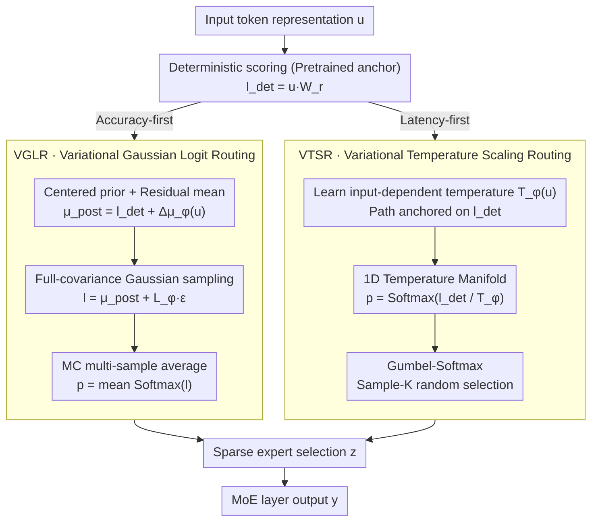

# Variational Routing: A Scalable Bayesian Framework for Calibrated MoE Transformers

**Conference**: ICML 2026  
**arXiv**: [2603.09453](https://arxiv.org/abs/2603.09453)  
**Code**: TBD  
**Area**: Model Compression / LLM Efficiency / AI Safety  
**Keywords**: Mixture-of-Experts, Bayesian Inference, Calibration, Uncertainty Quantification, Sparse Routing

## TL;DR
This paper proposes VMoER, a variational routing framework that achieves efficient Bayesian uncertainty modeling by performing variational inference on MoE routing decisions rather than weights. It reduces calibration error by 94% and improves routing stability by 38% while maintaining <1% extra FLOPs overhead.

## Background & Motivation

**Background**: Foundation models have reached trillion-parameter scales, utilizing MoE sparse routing to achieve efficient scaling. However, current routing mechanisms employ deterministic Top-K strategies, which are prone to incorrect expert selection under input perturbations.

**Limitations of Prior Work**: (1) Deterministic routing is sensitive to input noise, leading to brittle failures; (2) Predictions are often highly over-confident with significant calibration errors; (3) Existing Bayesian methods targeting weight uncertainty involve prohibitive computational overhead for trillion-parameter models.

**Key Challenge**: How to inject uncertainty-awareness into MoE models with minimal computational cost to ensure reliable deployment.

**Goal**: Design a lightweight Bayesian framework to probabilistically model routing decisions (rather than weights).

**Key Insight**: The authors reformulate MoE routing as a latent variable model, observing that: (1) Deterministic routing implicitly ignores the uncertainty chain from logits $\to$ probability $\to$ selection; (2) Top-K operations are essentially multi-label problems.

**Core Idea**: Shift from weight-space to decision-space for variational inference—using amortized inference to directly model the probability of routing logits or temperature parameters, bypassing the complexity of high-dimensional weight posteriors.

## Method

### Overall Architecture
VMoER shifts the task of "injecting uncertainty into MoE" from the weight space to the decision space: instead of approximating the posterior of trillion-parameter weights, it performs variational inference only on the **routing decisions** of each token entering an MoE layer. All paths share a common starting point: deterministic routing calculates scores $\mathbf{l}_{det}=\mathbf{u}\mathbf{W}_r$, and variational inference adds a layer of uncertainty over this pretrained anchor. Above this, it provides two complementary paths: one applies a variational Gaussian distribution $q_\phi(\mathbf{l}|\mathbf{u})$ to routing scores $\mathbf{l}$ in logit space to explicitly model correlations between experts; the other learns an input-dependent temperature $T_\phi(\mathbf{u})$ in the selection space, using it to dynamically adjust softmax sharpness and replacing Top-K with Sample-K for randomized selection. The former provides the best calibration but requires multiple samples, while the latter incurs almost zero extra overhead. These two paths cover "accuracy-first" and "latency-first" deployment requirements.

### Key Designs

**1. Variational Gaussian Logit Routing (VGLR): Adding a correlated Gaussian posterior to routing scores**

The brittleness of deterministic Top-K stems from treating the chain of logits $\to$ probability $\to$ selection as noise-free. VGLR performs amortized variational inference directly on routing logits: the prior is a centered Gaussian $p(\mathbf{l}|\mathbf{u})=\mathcal{N}(\mathbf{l}_{det}, \mathbf{I})$, where $\mathbf{l}_{det}=\mathbf{u}\mathbf{W}_r$ is the original deterministic score. The posterior mean is formulated as a residual $\boldsymbol{\mu}_{post}(\mathbf{u})=\mathbf{l}_{det}+\Delta\boldsymbol{\mu}_\phi(\mathbf{u})$, where the inference network learns a correction term $\Delta\boldsymbol{\mu}_\phi(\mathbf{u})$ rather than relearning routing from scratch. The covariance is parameterized using Cholesky factorization $\boldsymbol{\Sigma}_{post}=\mathbf{LL}^\top$ with complexity $O(N^2)$; since the number of experts $N \le 64$, this is acceptable. During inference, MC sampling and averaging are performed over $q_\phi$. This is more effective than weight-space methods (e.g., MCDropout) because those methods propagate parameter noise through linear projections, whereas VGLR models decision variables directly. Furthermore, the **full covariance** structure captures inter-expert correlations (e.g., "selecting expert A implies avoiding expert B"), which was found to be critical for reducing ECE from 0.252 to 0.015.

**2. Variational Temperature Scaling Routing (VTSR): Compressing the variational family into a 1D temperature manifold**

While VGLR provides excellent calibration, multi-sampling increases inference latency. VTSR constrains the entire variational family to a 1D manifold where all posteriors move along the trajectory of "deterministic logits divided by input-dependent temperature": $q_\phi(\mathbf{p}|\mathbf{u})=\text{Softmax}(\mathbf{l}_{det}/T_\phi(\mathbf{u}))$. The only learned parameter is the scalar temperature network $T_\phi(\mathbf{u})$; higher temperatures lead to a flatter distribution (conservative selection), while lower temperatures lead to sharper distributions. Gumbel-Softmax is used for Sample-K sampling. The KL divergence term on this manifold collapses into Shannon entropy. The computational cost is only $O(D_H)$, or less than 0.67% FLOPs, providing calibrated selections in a single forward pass without repeated sampling.

**3. Centered Prior and Residual Learning: Maintaining pretrained routing**

Both VGLR and VTSR rely on a shared premise: the variational solution is not learned from scratch but is anchored to the deterministic score $\mathbf{l}_{det}$. VGLR centers the Gaussian prior on the deterministic solution $p(\mathbf{l}|\mathbf{u})=\mathcal{N}(\mathbf{l}_{det}, \mathbf{I})$, so the KL term naturally regularizes the "residual-to-zero" distance. VTSR constrains the variational trajectory to a 1D manifold passing through $\mathbf{l}_{det}$ (where $T \to 0$ recovers deterministic Top-K). This design provides a stable anchor for optimization, ensuring that uncertainty acts as a correction layer rather than disrupting the expert specialization learned during pretraining.

### Loss & Training
**VGLR** directly maximizes the ELBO: $\mathcal{L}_{ELBO}=\mathbb{E}_{q_\phi(\mathbf{l}|\mathbf{u})}[\log p(\mathbf{y}|\mathbf{l},\mathbf{u})]-\beta D_{KL}(q_\phi(\mathbf{l}|\mathbf{u})\|\mathcal{N}(\mathbf{0},\mathbf{I}))$, where the first term handles reconstruction and the second pulls the posterior toward the centered prior. **VTSR** focuses on reconstruction with an additional proxy loss $\mathcal{L}_{reg}=-\log T_\phi(\mathbf{u})$ to implicitly push the temperature toward the prior.

## Key Experimental Results

### Main Results

| Dataset | Model | Metric | MAP Baseline | VGLR-MF | VGLR-FC | VTSR |
|--------|------|------|--------|---------|---------|------|
| OpenBookQA | Granite-3B | ECE ↓ | 0.252 | 0.026 | **0.015** | 0.052 |
| OpenBookQA | Qwen-2.7B | ECE ↓ | 0.127 | 0.028 | **0.014** | 0.022 |
| OpenBookQA | DeepSeek-16B | ECE ↓ | 0.168 | 0.067 | **0.054** | 0.060 |

### Ablation Study

| Experiment Item | Granite ECE | Qwen ECE | Finding |
|--------|------------|----------|------|
| Deterministic Top-K | 0.252 | 0.127 | Baseline is over-confident |
| Fixed Temperature Scaling | 0.107 | 0.102 | Unstable across models (3% acc drop) |
| VGLR-FC Full Covariance | 0.015 | 0.014 | Calibration error reduced by 94% |
| Noise Robustness (σ=0.01) | Jaccard=0.532 | Jaccard>0.612 | VGLR stability improved by 38% |
| OoD Detection AUROC | 0.659 (Base) | 0.749 (VGLR) | Internal logit variance is a better signal than gating entropy |

### Key Findings
- Full covariance is critical: Explicitly modeling correlations significantly improves calibration.
- VTSR outweighs global fixed temperature in terms of accuracy stability.
- Internal inference uncertainty provides a stronger signal for OoD detection than predictive entropy.

## Highlights & Insights
- **Probabilistic Generative Perspective**: Formalizes MoE routing as a latent variable model, interpreting heuristic load balancing and auxiliary losses as implicit Bayesian priors.
- **Decision-Space Shift**: Directly inferring routing logits or temperature parameters captures necessary uncertainty while avoiding the curse of dimensionality.
- **Dual-Path Design**: VGLR offers optimal calibration with slight latency, while VTSR provides single-pass inference with zero extra sampling cost.
- **Transferable Components**: The centered prior + residual learning and 1D temperature manifold designs are easily generalized.

## Limitations & Future Work
- VTSR training can be unstable: temperature parameters are prone to collapse and require careful initialization.
- Evaluation is limited to MCQA next-token prediction and does not cover error accumulation in long-sequence generation.
- Scalability has not been tested beyond DeepSeek-16B.
- Future Work: Stabilize VTSR variational objectives; extend to sequence-level uncertainty; hybridize with weight-space Bayesian methods.

## Related Work & Insights
- **vs Weight-Space Methods (MCDropout/SWAG)**: These model the entire parameter space (~2.6% FLOPs), whereas the proposed method models only routing decisions (<1% FLOPs).
- **vs Heuristic Stabilization**: Existing methods (fixed temperature, load balancing) lack probabilistic interpretation; this work learns input-dependent uncertainty.
- **vs Output-Space Uncertainty (Semantic Entropy)**: The latter aggregates output distributions post-hoc; this method extracts epistemic uncertainty directly from internal routing decisions.

## Rating
- Novelty: ⭐⭐⭐⭐⭐ First systematic application of variational inference to MoE routing decisions rather than weights.
- Experimental Thoroughness: ⭐⭐⭐⭐ 3 SOTA architectures + multi-dimensional evaluation; however, limited to MCQA tasks and 16B scale.
- Writing Quality: ⭐⭐⭐⭐⭐ Clear theory and rigorous derivation of the probabilistic generative process.
- Value: ⭐⭐⭐⭐⭐ Provides an efficient path for the reliable deployment of trillion-parameter foundation models.

<!-- RELATED:START -->

## Related Papers

- [\[ICML 2026\] STAR: Rethinking MoE Routing as Structure-Aware Subspace Learning](star_rethinking_moe_routing_as_structure-aware_subspace_learning.md)
- [\[ICML 2026\] DOT-MoE: 用可微 optimal transport 把 dense LLM 转成 MoE](dot-moe_differentiable_optimal_transport_for_moefication.md)
- [\[ICML 2026\] ProbMoE: Differentiable Probabilistic Routing for Mixture-of-Experts](probmoe_differentiable_probabilistic_routing_for_mixture-of-experts.md)
- [\[CVPR 2025\] Associative Transformer](../../CVPR2025/llm_efficiency/associative_transformer.md)
- [\[ACL 2026\] CoMeT: Collaborative Memory Transformer for Efficient Long Context Modeling](../../ACL2026/llm_efficiency/comet_collaborative_memory_transformer_for_efficient_long_context_modeling.md)

<!-- RELATED:END -->
