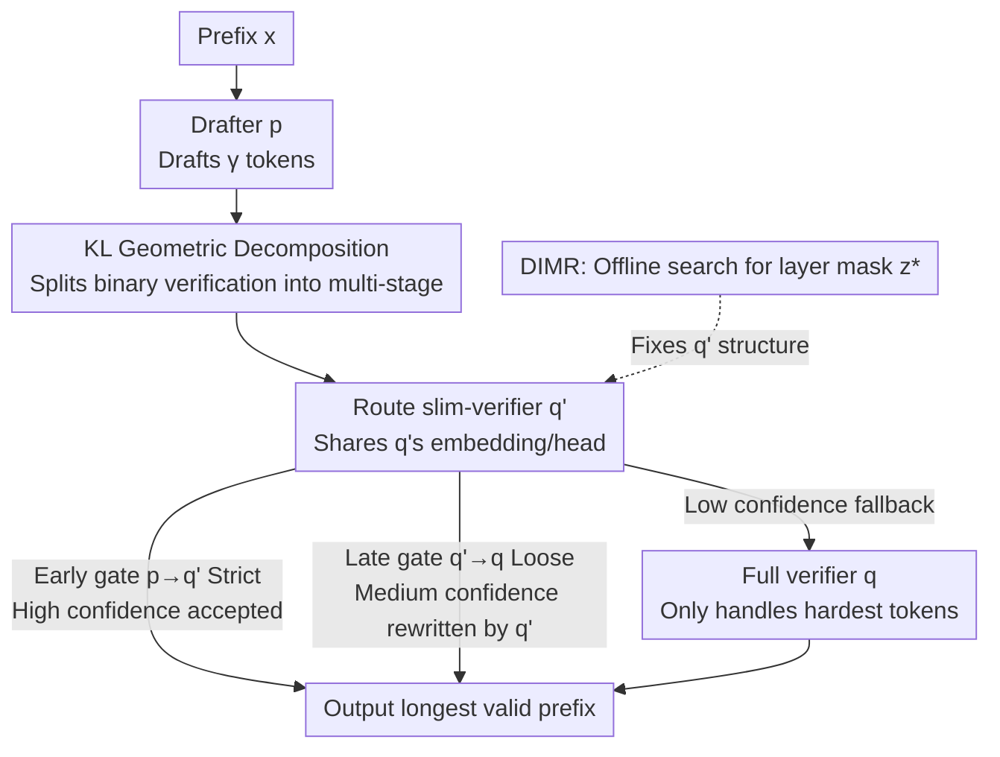

# VIA-SD: Verification via Intra-Model Routing for Speculative Decoding

**Conference**: ICML 2026  
**arXiv**: [2606.12243](https://arxiv.org/abs/2606.12243)  
**Code**: https://zju-xyc.github.io/VIA-SD-Project-Page/ (Project Page)  
**Area**: LLM Efficiency / Speculative Decoding  
**Keywords**: Speculative Decoding, Hierarchical Verification, Intra-Model Routing, KL Geometry, Inference Acceleration  

## TL;DR
Addressing the binary decision bottleneck of "either accept or recompute with the target model" in speculative decoding, VIA-SD routes a lightweight "slim-verifier" from within the full verifier to handle "medium-confidence" tokens. This forms a draft → slim-verifier → full-verifier multi-stage process, reducing rejection rates by 0.10–0.22 and achieving an additional 10–20% speedup over strong speculative decoding baselines across four tasks and multiple model families.

## Background & Motivation
**Background**: Speculative decoding (SD) is a primary system-level technique to reduce LLM inference latency. It uses a lightweight drafter to propose $\gamma$ candidate tokens, which are then verified in parallel by a large model. Accepted blocks are emitted together, saving the cost of sequential forward passes by the large model. Most subsequent works focus on either strengthening the drafter (accuracy) or accelerating the verifier.

**Limitations of Prior Work**: Regardless of modifications, mainstream SD remains constrained by a **binary allocation rule**—each draft token is either accepted by the small model or rejected and recomputed from scratch by the largest verifier. Even concurrent hierarchical SD (e.g., Syu & Lee, 2025) uses intermediate models for binary decisions. The authors observe that many tokens fall into a "middle ground": the drafter is nearly correct but not fully reliable. These tokens do not require the full computation of the largest model but are forced into the most expensive path.

**Key Challenge**: From an information-theoretic perspective, the acceleration potential of SD is determined by the alignment between the drafter distribution $p_t$ and the verifier distribution $q_t$. In the lossless case, the single-step rejection rate is exactly the total variation distance $\rho_t = D_{TV}(p_t, q_t)$. The "hard equivalence" of TV distance implies that to reduce the rejection rate, one must change the drafter or verifier itself—it **cannot perceive the existence of a middle ground**, leaving intermediate tokens to be handled solely by the full verifier.

**Goal**: Can a sequence of "intermediate verification stages" be introduced to specifically handle these middle-ground tokens without widening the gap between $p$ and $q$?

**Key Insight**: Replace TV distance with KL divergence. KL is **directional and additive**, naturally supporting "segmental decomposition." A multi-stage path $p \to u_1 \to \dots \to u_n \to q$ can have a cumulative divergence smaller than the direct $p \to q$ mapping (Generalized Pythagorean Theorem in information geometry). This suggests that intermediate distributions are not just heuristics but theoretically sound "verification anchors."

**Core Idea**: Use a slim-verifier **routed internally** from the large verifier to act as an intermediate distribution, rewriting speculative decoding from "binary accept/reject" into a multi-stage verification that "gradually hands over generation responsibility to increasingly powerful verifiers."

## Method

### Overall Architecture
VIA-SD inserts a slim-verifier layer between the standard draft and verify stages, forming a three-stage pipeline. Given a prefix $x_{<t}$, in each decoding cycle: the drafter $p$ first drafts $\gamma$ tokens; then, a slim-verifier $q'$ (routed from the full verifier $q$ and **determined offline**) performs the first parallel verification. The draft block is guarded by two confidence thresholds $(\delta_1, \delta_2)$—the "early gate" $p \to q'$ is stricter, while the "late gate" $q' \to q$ is looser ($\delta_1 \gg \delta_2$ in practice). The longest valid prefix is accepted; if a token is rejected, $q'$ rewrites it, and only the most difficult cases fall back to the full verifier $q$. This allows many tokens that would traditionally require $q$ to be handled by $q'$, significantly reducing large model calls.

Crucially, $q'$ is not an independently loaded model but a sub-model obtained by skipping Transformer layers of $q$, **sharing $q$'s embedding and output head**. This ensures distributional consistency with $q$ and is the fundamental reason it is more effective than an independent intermediate model of the same size.

### Key Designs

**1. KL Geometric Decomposition: Rewriting "Binary Choice" as Multi-stage Verification**

This design specifically targets the hard constraint of TV distance. Since $\rho_t = D_{TV}(p_t, q_t)$ locks rejection reduction to "changing $p$ or $q$," the authors use KL divergence $D_{KL}(p\|q) = \sum_v p(v)\log\frac{p(v)}{q(v)}$. Due to additivity, decomposition can be performed along intermediate distributions $u_i = \arg\min_{u\in S} D_{KL}(u_{i-1}\|u)$. By the Generalized Pythagorean Theorem:

$$D_{KL}(p \| q) \ge \sum_{i=0}^{n} D_{KL}(u_i \| u_{i+1}), \quad u_0 = p,\ u_{n+1} = q$$

A multi-stage path $p \to u_1 \to \dots \to q$ can yield lower cumulative divergence than $p \to q$. To implement this, the authors define a hybrid target distribution $\pi_t(v) = (1-\delta)p_t(v) + \delta q_t(v)$ and provide a criterion: inserting an intermediate verifier $u$ is beneficial if $\Delta_{KL}^{\alpha,\beta}(u\mid\pi) = C_{KL}^{\alpha,\beta}(q\|p) - C_{KL}^{\alpha,\beta}(u\|p) - C_{KL}^{\alpha,\beta}(q\|u)$ is positive. This converts the decision to add stages from intuition into a computable cost criterion. Empirically, three stages (one intermediate verifier) provide the best tradeoff.

**2. Routing Slim-verifier: Extracting Verifiers from Large Models**

Three candidates exist for intermediate verifiers: an upscaled drafter $p'$, an independent small model, or a sub-model $q'$ routed from $q$. VIA-SD chooses the third due to **distributional consistency**. While $q'$ has similar parameters to an independent model, its shared components mean $C_{KL}^{\alpha,\beta}(q\|q')$ is always lower than a standalone model's cost. Thus, the path $p \to q' \to q$ more easily satisfies $\Delta_{KL}^{\alpha,\beta}(u\mid\pi) > 0$.

Specifically, the $L$ layers of $q$ are represented by a routing mask $z\in\{0,1\}^L$ ($z_\ell=1$ keeps layer $\ell$, $0$ skips it). The cost is given by logarithmic marginal violations in ReLU form:

$$R_{KL}^{\alpha,\beta}(q\|p)_t = \sum_v p_t(v)\,\mathrm{ReLU}(z_1(v)) + \sum_v q_t(v)\,\mathrm{ReLU}(z_2(v))$$

This design ensures **zero extra loading cost**—it doesn't increase peak VRAM consumption but allows for controllable speed/accuracy tradeoffs.

**3. DIMR: Offline Search for Stable Layer Masks**

Randomly skipping layers is ineffective. DIMR (Dynamic Intra-Model Routing) searches for the optimal mask **once per model pair offline**. Using a context window of length $\tau$, it scores candidate masks: $z^* = \arg\min_z \sum_{t=1}^{\tau} R_{KL}^{\alpha,\beta}(q\|q'_z)_t$. The strategy uses a combination of random search and periodic Bayesian optimization:

$$z = \begin{cases} \mathrm{BayesOpt}(l), & \text{if } o \bmod \theta = 0 \\ \mathrm{RandomSearch}(l), & \text{otherwise}\end{cases}$$

The search takes only 18–68 minutes (0.30–1.13 GPU-hours) per model pair and is reusable across tasks. The reported speedups are pure online decoding improvements.

## Key Experimental Results

### Main Results
On WebQuestions / NaturalQA / TriviaQA across Gemma2, LLaMA2, and Qwen, VIA-SD achieves the lowest rejection rates and highest speeds while maintaining accuracy (selection for Gemma2-2B→27B):

| Method | WebQ Rejection | WebQ Speed | NatQA Rejection | NatQA Speed | TriviaQA Rejection | TriviaQA Speed |
|------|------------|-----------|-------------|-----------|----------------|--------------|
| Speculative Decoding | 0.27 | 1.55× | 0.45 | 1.54× | 0.24 | 1.65× |
| Cascade SD | 0.24 | 1.71× | 0.42 | 1.73× | 0.23 | 1.81× |
| Faster Cascades | 0.22 | 1.81× | 0.40 | 2.10× | 0.20 | 2.30× |
| **VIA-SD (Ours)** | **0.14** | **2.32×** | **0.30** | **2.61×** | **0.15** | **2.50×** |

VIA-SD reduces the rejection rate by 0.10–0.22 over strong baselines, improving speed by 10–20%, reaching 2.5–3× acceleration relative to non-speculative decoding.

### Ablation Study

| Configuration | Extra Model | Peak VRAM | Speed | Accuracy |
|------|---------|---------|------|------|
| Two-layer SD (Binary Baseline) | ✘ | 1.00× | 1.55× | 0.32 |
| Independent 13B Intermediate | ✔ | 1.38× | 2.08× | 0.33 |
| Random Layer Skipping | ✘ | 1.04× | 1.62× | 0.29 |
| **DIMR Routing (Ours)** | ✘ | **1.04×** | **2.32×** | 0.32 |

### Key Findings
- **The "Source" of intermediate verifier is decisive**: Independent models increase VRAM to 1.38×. DIMR routing achieves 2.32× speedup at 1.04× VRAM without losing accuracy, proving that intermediate verifiers must be carefully selected and distributionally consistent with $q$.
- **Skip ratio "sweet spot"**: More skipping is faster, but excessive skipping makes the slim-verifier too weak, triggering more fallbacks and reducing speed. A 45% skip ratio is optimal for Gemma2.
- **Robust thresholds**: Default $(\alpha_1,\alpha_2)=(0.5,0.3)$ outperforms conservative or aggressive settings.
- **Task variance**: Benefits are largest in large-gap settings (2B→27B, 7B→70B). In translation tasks (WMT14), slim-verifiers excel at filtering medium-confidence tokens before invoking the full model.

## Highlights & Insights
- **Converting stage selection to a computable criterion**: $\Delta_{KL}^{\alpha,\beta}(u\mid\pi)$ tells you if an intermediate verifier is worth inserting, providing better guidance than trial-and-error.
- **Reusing full model components**: Shared embeddings/heads provide distributional consistency—a key factor over standalone models verified by ablation.
- **Clean separation of offline/online costs**: DIMR is a one-time search, making online gains authentic and easy to overlay on existing SD frameworks without training.

## Limitations & Future Work
- **Static masks from DIMR**: Mask is searched once and is not adaptive during inference. Fixed slim-verifiers might not be optimal as token difficulty distributions drift.
- **Upper bound of slim-verifier**: For models with low layer redundancy, the compression space and resulting gains may shrink.
- **Three-stage empirical optimality**: While theory allows any number of stages, only one intermediate verifier was instantiated. Deeper hierarchies in varying distributions are not fully characterized.

## Related Work & Insights
- **vs. Traditional two-stage SD (Leviathan 2023, etc.)**: These rely on binary accept/reject; VIA-SD adds a slim-verifier for middle-ground tokens, delegating generation responsibility hierarchically.
- **vs. Cascade SD / Faster Cascades**: Those depend on independent models or learned policies; VIA-SD uses intra-model routing to ensure consistency and higher speedup at similar VRAM usage.
- **vs. Learned verification (EAGLE, etc.)**: Those require extra training and deeper coupling. VIA-SD remains on the verification side, is training-free, and keeps components decoupled.

## Rating
- Novelty: ⭐⭐⭐⭐⭐ Rewriting SD as KL-driven multi-stage verification with intra-model routing is novel and theoretically supported.
- Experimental Thoroughness: ⭐⭐⭐⭐ Covers various tasks and models with extensive ablations, though lacks long-context stress tests beyond standard benchmarks.
- Writing Quality: ⭐⭐⭐⭐ Solid theoretical foundation, though KL geometry sections are formula-heavy.
- Value: ⭐⭐⭐⭐⭐ Training-free, minimal VRAM overhead, and offline reusability make it highly practical.

<!-- RELATED:START -->

## Related Papers

- [\[ACL 2026\] Speculative Verification: Exploiting Information Gain to Refine Speculative Decoding](../../ACL2026/llm_efficiency/speculative_verification_exploiting_information_gain_to_refine_speculative_decod.md)
- [\[NeurIPS 2025\] 3-Model Speculative Decoding (PyramidSD)](../../NeurIPS2025/llm_efficiency/3model_speculative_decoding.md)
- [\[ACL 2026\] TokenTiming: A Dynamic Alignment Method for Universal Speculative Decoding Model Pairs](../../ACL2026/llm_efficiency/tokentiming_a_dynamic_alignment_method_for_universal_speculative_decoding_model_.md)
- [\[ICML 2026\] MineDraft: A Framework for Batch Parallel Speculative Decoding](minedraft_a_framework_for_batch_parallel_speculative_decoding.md)
- [\[ICML 2026\] Diffusion Language Model Parallel Decoding via Product-of-Experts Bridge](diffusion_language_model_parallel_decoding_via_product-of-experts_bridge.md)

<!-- RELATED:END -->
