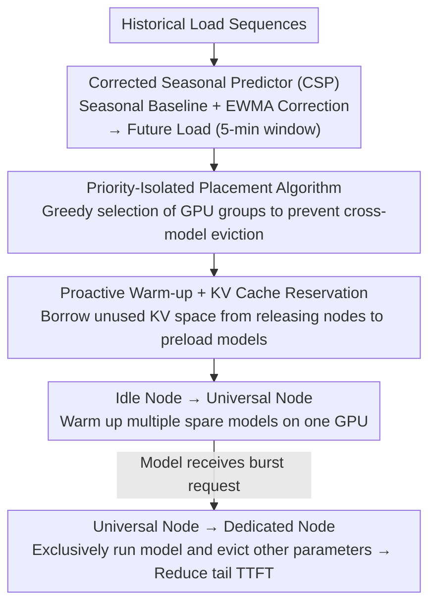

# WarmServe: Multi-model GPU Warm-up Mechanism via Load-Once-Many

**Conference**: ICML 2026  
**arXiv**: [2512.09472](https://arxiv.org/abs/2512.09472)  
**Code**: https://github.com/LLMServe/WarmServe  
**Area**: LLM Efficiency / Multi-model Serving  
**Keywords**: GPU Warm-up, Multi-LLM Serving, Workload Prediction, Cold Start, Resource Efficiency

## TL;DR
WarmServe reduces tail TTFT by 50.8x compared to existing systems by analyzing long-term periodic patterns in LLM serving workloads. It proactively preloads multiple model parameters into GPUs, using optimized placement algorithms and dynamic KV cache reservation strategies to quickly launch new instances during request bursts.

## Background & Motivation

**Background**: Multi-LLM serving systems must deploy multiple models concurrently in shared GPU clusters to improve resource utilization. Two mainstream solutions exist: (1) Auto-scaling: dynamically creates instances based on current load but suffers from large cold-start latency; (2) GPU Sharing: co-locates multiple models on the same GPU but is severely limited by KV cache capacity.

**Limitations of Prior Work**: Auto-scaling requires loading model parameters on the fly during request bursts, leading to severe TTFT. GPU sharing avoids initialization delay but allocates minimal KV cache to each model.

**Key Challenge**: Existing systems lack awareness of future workload characteristics—auto-scaling only responds passively, while GPU sharing placement strategies must remain stable over time.

**Key Observation**: While short-term request arrivals are stochastic, the long-term statistical properties of LLM serving in production environments exhibit strong periodicity—peak loads can be predicted within a 5-minute window with an average relative error of 7.3%.

**Key Insight**: Fully utilize this predictability by adopting a proactive warm-up strategy—load spare model replicas onto idle GPUs before predicted workload surges.

**Core Idea**: Introduce a "load multiple models once" mechanism—load parameters of multiple models into a single GPU's memory simultaneously. When a model experiences a request burst, it immediately uses the warmed-up parameters to start an active instance and then quickly evicts other model parameters. Weight eviction is much faster than on-demand loading.

## Method

### Overall Architecture
WarmServe addresses the cold start problem in multi-LLM serving: loading hundreds of gigabytes of parameters on-the-fly destroys tail TTFT. The approach involves prediction, warm-up, and rapid switching. The system categorizes GPU cluster worker nodes into three types—idle, universal, and dedicated. After the predictor calculates future loads for each model, the placement algorithm selects idle nodes to warm up multiple spare models at once, upgrading them to universal nodes. Once a warmed-up model receives a burst of requests, the node is immediately upgraded to a dedicated node, running that model exclusively and evicting others; additionally, dedicated nodes about to be released are borrowed, using their unused KV cache space to stealthily warm up the next batch of models.

### Key Designs

**1. Corrected Seasonal Predictor (CSP): Transforming "short-term stochastic, long-term periodic" load into predictable signals**

Proactive warm-up requires knowing which model to scale. Since short-term LLM requests are stochastic, WarmServe splits prediction into two parts: a seasonal baseline $P_{k,i} = \frac{1}{D}\sum_{d=1}^{D}L_{k-d,i}$ using the average load from the same period $i$ over the past $D$ days, and a correction term $\Delta_{k,i} = \frac{\sum_{w=1}^{\min(i,N)}(L_{k,i-w}-P_{k,i-w})\cdot 2^{w-1}}{2^{\min(i,N)}-1}$ that applies exponential weighting to recent deviations. The final prediction is $\hat{L}_{k,i} = P_{k,i} + \Delta_{k,i}$. The baseline captures periodicity while the correction tracks daily drift, achieving 92.7% accuracy for peak loads in 5-minute windows.

**2. Priority-Isolated Placement Algorithm: Avoiding cascading evictions during GPU release**

When placing warmed-up replicas, the challenge is that LLMs use tensor parallelism across multiple GPUs. Losing one GPU forces the entire group offline, causing "cross-model interference." The algorithm assigns a priority score to each replica based on the gap between expected load and current instances. It processes replicas in descending order of priority, greedily selecting GPU groups where high-priority replicas will not be evicted by lower-priority ones. This approach maintains low runtime overhead without requiring online integer programming while protecting critical models.

**3. Proactive Warm-up + KV Cache Reservation: Hiding massive checkpoint I/O during GPU idle periods**

LLM checkpoints often exceed 128GB, making on-demand loading impossible within narrow windows. WarmServe utilizes the timing when workloads decrease and instances are about to close. Before the auto-scaler reclaims an instance, its unused KV cache space is used to stealthily preload parameters for the next batch of models. To avoid impacting active requests, the system reserves KV cache based on $R = \max(C \cdot Q/B, T + C/B)$ (the upper bound for queue satisfaction and throughput), using only the remaining space for warm-up. This spreads the 128GB transfer cost over the idle bandwidth of a serving GPU.

## Key Experimental Results

### Main Results

| System | P95 TTFT(s) | P99 TTFT(s) | Gain | Max RPS |
|------|-----------|-----------|--------|--------|
| SLLM-GPU | 1.23 | 3.45 | - | 10 |
| MuxServe | 0.89 | 2.34 | - | 6 |
| WarmServe (w/o Proactive) | 0.18 | 0.31 | 6.8×-11.1× vs SLLM | 20 |
| WarmServe (Full) | 0.17 | 0.29 | 7.2×-11.9× vs SLLM / 5.2× vs MuxServe | 25 |

At 15 RPS and $\alpha$=0.5, WarmServe achieves a 1.53-50.79× reduction in P99 TTFT compared to SLLM-GPU.

### Ablation Study

| Configuration | % TTFT within 100ms | Description |
|------|---------------|------|
| Full Model | 100% | baseline |
| W/o Model Warm-up | 15% | Performance collapse |
| W/o Placement Algorithm | 29% | Sharp increase in interference |
| W/o Proactive Warm-up | 88% | Improved but 32.87× worse than full |
| 3-min Window | 46% | Unstable prediction due to small window |
| 40-min Window | 30% | Fails to capture short-term changes |

### Key Findings
- Model warm-up provides orders of magnitude improvement in TTFT.
- Proactive warm-up is the most significant contributor (up to 32x improvement).
- The placement algorithm prevents interference cascades under high load.
- A 5-minute warm-up window is optimal.
- Workload prediction: Average load prediction accuracy is 94.7%, with 92.7% for peak loads under a 5-minute window.

## Highlights & Insights
- **Discovery of long-term periodicity in LLM workloads**: Challenges the assumption that LLM requests are entirely unpredictable.
- **Innovation in "Loading Multiple Models Once"**: Successfully balances resource efficiency with performance.
- **Dual-purpose KV cache**: Expands the role of KV cache from simple activation storage to temporary storage for warm-up.
- **Priority isolation in greedy placement**: Simple and efficient, avoiding complex integer programming at runtime.

## Limitations & Future Work
- Applicability boundaries of workload prediction—may fail for entirely new models or unique business events.
- Lack of evaluation in multi-datacenter or multi-tenant scenarios.
- Insufficient handling of model size disparities (e.g., co-locating 7B and 70B models).
- Improvements: Incorporating online learning, multi-model ensemble prediction, and detailed analysis of energy consumption.

## Related Work & Insights
- **vs ServerlessLLM/MuxServe**: WarmServe finds a new design space between the two by using a warm-up intermediate layer.
- **vs Serverless Warm-up**: Specifically addresses the unique challenges of LLMs (multi-GPU dependencies, extreme model sizes, and KV cache).
- **vs KV Cache Optimization**: Leverages unused cache space as temporary warm-up storage, embodying the philosophy of maximizing system resource utilization.

## Rating
- Novelty: ⭐⭐⭐⭐⭐  Identifies long-term predictability and introduces innovative multi-model loading.
- Experimental Thoroughness: ⭐⭐⭐⭐  Extensive simulations, ablation studies, and prediction accuracy validation.
- Writing Quality: ⭐⭐⭐⭐⭐  Clear logic with a natural progression of motivation.
- Value: ⭐⭐⭐⭐⭐  50× TTFT improvement offers significant practical deployment value.

<!-- RELATED:START -->

## Related Papers

- [\[ICLR 2026\] Scaling Large Vision-Language Model RL Training via Efficient Load Balancing](../../ICLR2026/llm_efficiency/scaling_large_vision-language_model_rl_training_via_efficient_load_balancing.md)
- [\[ICLR 2026\] Scaling Up, Speeding Up: A Benchmark of Speculative Decoding for Efficient LLM Test-Time Scaling](../../ICLR2026/llm_efficiency/scaling_up_speeding_up_a_benchmark_of_speculative_decoding_for_efficient_llm_tes.md)
- [\[ICLR 2026\] ICaRus: Identical Cache Reuse for Efficient Multi-Model Inference](../../ICLR2026/llm_efficiency/icarus_identical_cache_reuse_for_efficient_multi-model_inference.md)
- [\[ACL 2026\] MTRouter: Cost-Aware Multi-Turn LLM Routing with History-Model Joint Embeddings](../../ACL2026/llm_efficiency/mtrouter_cost-aware_multi-turn_llm_routing_with_history-model_joint_embeddings.md)
- [\[ICLR 2026\] Randomization Boosts KV Caching, Learning Balances Query Load: A Joint Perspective](../../ICLR2026/llm_efficiency/randomization_boosts_kv_caching_learning_balances_query_load_a_joint_perspective.md)

<!-- RELATED:END -->
