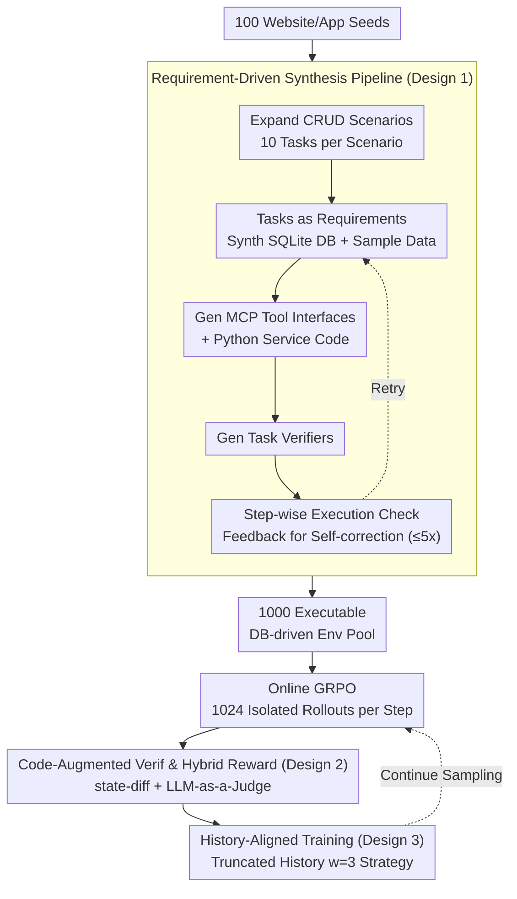

# Agent World Model: Infinity Synthetic Environments for Agentic Reinforcement Learning

**Conference**: ICML2026  
**arXiv**: [2602.10090](https://arxiv.org/abs/2602.10090)  
**Code**: https://github.com/Snowflake-Labs/agent-world-model  
**Area**: LLM Agent / Reinforcement Learning  
**Keywords**: Agent Environment Synthesis, Tool Use, MCP, Reinforcement Learning, Executable World Models  

## TL;DR
This paper proposes Agent World Model, a fully synthetic pipeline encompassing scenarios, tasks, databases, MCP tool interfaces, and verifiers. It generates 1,000 executable, database-driven environments used to train tool-calling agents, achieving superior out-of-distribution generalization on BFCLv3, $\tau^2$-bench, and MCP-Universe.

## Background & Motivation

**Background**: LLM Agents are capable of multi-turn tool use, web operations, and complex task planning. However, the bottleneck for training these agents has shifted from "model inability to call tools" to a "lack of sufficient, reset-able, parallelizable, and verifiable interaction environments." Existing benchmarks are often small-scale, real-world APIs are difficult to reproduce stably, and LLM-simulated environments, though easy to generate, suffer from hallucinatory state transitions.

**Limitations of Prior Work**: Agentic RL requires thousands of interactions; environments must support concurrent instances, reliable resets, state consistency, and automated rewards. Real services rarely expose APIs needed for training and cannot tolerate large-scale trial-and-error. Manual environments like $\tau^2$-bench or TheMCPCompany offer limited scenarios. LLM simulators require model calls at every step, making them expensive and prone to self-contradictory state updates.

**Key Challenge**: Tool-calling agents require real executable environments to learn long-term interactions, but real-world environments cannot scale, and pure LLM simulations are unreliable. While training data synthesis is abundant, the "environment itself" remains the missing link in scalability.

**Goal**: The authors aim to construct an open environment synthesis pipeline that automatically generates a large number of executable environments—featuring database states, tool interfaces, and task verifiers—from a few scenario seeds, demonstrating their utility for large-scale online RL.

**Key Insight**: The paper treats agent environments as software systems rather than delegating them to step-by-step LLM simulation. An executable application typically consists of requirements, a database, interfaces, backend code, and tests/verification. By sequentially synthesizing these components, a "programmatic world model" is created where state transitions are governed by code and SQL constraints.

**Core Idea**: Use a software engineering pipeline to synthesize database-driven MCP environments, transforming the world model from a neural predictor into an executable code sandbox, followed by large-scale agentic RL within these sandboxes.

## Method

### Overall Architecture

The Agent World Model formalizes each environment as a POMDP. The database defines the state space $\mathcal{S}_{E_i}$, the MCP tool interface defines the action space $\mathcal{A}_{E_i}$, the observation space $\mathcal{O}_{E_i}$, and the transition function $T_{E_i}$, while each user task $\tau$ corresponds to a reward function $R_\tau$. The agent interacts solely through a unified MCP tool interface without direct database access.

Starting from 100 popular website/app seeds, the pipeline expands them into scenarios suitable for CRUD operations and generates 10 user tasks per scenario. These tasks serve as functional requirements for the subsequent database schema, sample data, tool interfaces, and verifiers. LLMs then sequentially synthesize the SQLite database, sample data, interface specifications, Python MCP service code, and task verification functions. Each step executes the generated result; if code or SQL fails, an error summary is fed back to the LLM for self-correction (up to 5 retries).

The resulting environments are used for online GRPO training. During training, 1,024 isolated environment instances are launched per step, each with an independent SQLite database copy. After rollout, a "code-augmented signal + LLM-as-a-Judge" assesses status as Completed, Partially Completed, Agent Error, or Environment Error, mapping these to rewards.

### Key Designs

**1. Requirement-Driven Synthesis Pipeline: Aligning Components via Software Engineering Sequence**

If an LLM writes an entire environment at once, the schema, tool interfaces, and tasks often mismatch—tools might exist that the task never uses, or the task might reference entities absent from the database. This paper builds environments like software: scenarios are filtered for stateful CRUD operations, 10 specific tasks are generated first to act as functional requirements, and these requirements constrain the design of subsequent components—the tables needed, the endpoints required, and the preconditions for sample data. Components are synthesized in the order: "Task → SQLite DB + Sample Data → MCP Tool Interface → Python Service Code → Task Verifier." State transitions are strictly governed by code and SQL, not LLM imagination.

**2. Code-Augmented Verification and Hybrid Reward: Reliable RL Signals in Synthetic Envs**

Synthetic verifiers are prone to bugs: pure code verification is fragile to minor flaws in auto-generated code, while pure LLM judgment lacks state grounding and may misjudge based solely on trajectories. This work makes them complementary: each task includes a verification function that compares database states before and after execution, extracting changed records and diagnostic signals. The final decision is handled by LLM-as-a-Judge, which combines these structured signals with the agent's trajectory. Rewards are mapped: 1.0 for Completed, 0.1 for Partially Completed, 0 otherwise, with format errors resulting in immediate termination and a -1 reward. This maintains automation while grounding the Judge in real state transitions via database diffs.

**3. History-Aligned Training for Tool-Calling RL: Eliminating Distribution Mismatch**

Multi-turn agent trajectories are long. During inference, a sliding window is typically used to retain only the most recent history; however, if the model sees the full trajectory during training, it learns information unavailable at deployment, causing distribution mismatch. During GRPO optimization, this paper splits trajectories using the same window $w=3$, ensuring the loss for each action $a_t$ is conditioned only on the truncated history $h_t^{trunc}$ rather than the entire long sequence. Incorporating this inference-time history management into the training objective improves stability and OOD generalization.

### Loss & Training

Training utilizes GRPO. For each task, a group of rollouts is sampled, and advantages are calculated as $A^{(k)}=(R^{(k)}-\bar{R})/\sigma_R$. The log probability of each action step is optimized under truncated history. Qwen3 thinking 4B, 8B, and 14B serve as agents. The training subset includes 526 AWM environments and 3,315 tasks, with up to 96 optimization steps, a learning rate of $7\times10^{-7}$, batch size of 64, and 16 rollouts per task, totaling 1,024 parallel instances.

To unify environments, the agent sees two meta-tools: `list_tools` to enumerate tools in the current MCP environment, and `call_tool` to execute a specific tool via name and JSON parameters. Format validation is enforced: `list_tools` must be called first, tool names and parameters must be valid, and messages must conform to Qwen3 tool-calling formats. Formatting errors trigger immediate termination to prevent wasting environment steps.

## Key Experimental Results

### Main Results

| Benchmark | Model | Base | Simulator | EnvScaler | Oours (AWM) | Main Conclusion |
|-----------|------|------|-----------|-----------|-----|----------|
| BFCLv3 Overall | Qwen3-4B | 54.92 | 55.52 | 54.06 | 64.50 | AWM significantly improves function calling capability |
| BFCLv3 Overall | Qwen3-8B | 53.83 | 52.53 | 36.83 | 65.94 | 12.11 point gain over Base on 8B model |
| BFCLv3 Overall | Qwen3-14B | 61.25 | 67.68 | - | 70.18 | Outperforms LLM simulation even on larger models |
| $\tau^2$-bench Pass@1 | Qwen3-8B | 26.44 | 31.30 | 39.39 | 33.45 | AWM outperforms Base and Simulator despite not targeting dialogue |
| MCP-Universe Overall | Qwen3-14B | 8.38 | 10.62 | - | 12.29 | Best generalization on real-world MCP server tasks |

### Ablation Study

| Analysis | Setting | Key Metric | Description |
|------|------|---------|------|
| Synthesis Scale | 1k Envs, 10k Tasks | Avg 35.1 tools, 1984.7 LOC, 18.5 tables | High env complexity, suitable for multi-turn training |
| Pipeline Success | GPT-5 Generation | DB 88.3%, Data 88.2%, Code 86.8%; avg 1.13 fixes | Execution feedback fixes most shallow generation errors |
| Complexity Buckets | BFCLv3 / $\tau^2$ 8B | Simple: Base 53.6 → AWM 80.3; Hard: 43.9 → 45.0 | Gains highest for simple/medium multi-tool tasks |
| Verifier Strategy | LLM-only / Code-only / Augmented | BFCLv3: 55.46 / 60.00 / 65.94 (8B) | Code-augmented Judge outperforms individual components |
| History Alignment | 4B w/ HL vs w/o HL | BFCLv3: 64.50 vs 55.35 | Truncated history during training is significantly better |

### Key Findings
- AWM provides the most stable gains on BFCLv3, suggesting code-driven, multi-tool environments effectively transfer to function-calling benchmarks.
- On $\tau^2$-bench 8B Pass@1, AWM is secondary to EnvScaler, but it avoids degradation on BFCLv3 and MCP-Universe; EnvScaler's reliance on existing tasks likely aligns closer to the $\tau^2$ distribution.
- While scores on MCP-Universe remain low due to task difficulty, AWM shows gains in Finance, Location, and Browser subcategories, proving it learns more than just internal formatting.
- Quality analysis shows AWM's Task Feasibility and Toolset Completeness exceed EnvScaler. Although code bugs persist, the ratio of blocked tasks is significantly lower, preventing RL from being poisoned by unexecutable tasks.

## Highlights & Insights
- The primary value lies in grounding the "world model" in executable software rather than step-by-step LLM imagination. For tool-agents, databases and backend code *are* the world dynamics.
- Requirement-driven synthesis is crucial. Synthesizing tasks before the schema and tools prevents common issues where entities or tools are mismatched with the environment's purpose.
- Code-augmented judgment is a pragmatic compromise. Since auto-generated code isn't perfect, letting an LLM interpret database diffs provides a reward signal more robust than either pure code or pure LLM judging.
- History-aligned training serves as a reminder that context management is not just an inference trick; it shifts the information distribution and must be integrated into the training loop.

## Limitations & Future Work
- AWM focuses on CRUD-heavy, database-driven applications, making it less suitable for UI-heavy, real-time, or complex visual interaction tasks.
- Synthetic environments still contain code bugs. While blocked tasks are reduced, RL might still learn biases from these imperfections.
- High synthesis and training costs. While evaluated with Claude and Qwen3.5, the pipeline currently relies heavily on GPT-5 for high-quality generation and judging.
- Task verification still depends on LLM-as-a-Judge, which may carry biases. Future work could explore provable state-diff specifications and human-in-the-loop calibration.
- There remains a semantic gap between AWM environments and enterprise systems. Future iterations could bridge this by integrating real API documentation or synthetic UIs.

## Related Work & Insights
- **vs LLM Simulators**: AWM is cheaper and more stable than simulators that generate state transitions via LLM text at every step.
- **vs EnvScaler**: While EnvScaler also generates programming environments, it relies on existing task sets; AWM scales to 1,000 environments and 35,000+ tools starting from mere scenario names.
- **vs Tool Learning Data (ToolLLM/Gorilla)**: These focus on synthesis of API docs or trajectories; AWM synthesizes the entire world dynamics required for trial-and-error RL.
- **vs Traditional Model-Based RL**: Instead of learning neural dynamics, AWM generates programmatic dynamics, trading some realism for control and scalability.

## Rating
- Novelty: ⭐⭐⭐⭐☆
- Experimental Thoroughness: ⭐⭐⭐⭐⭐
- Writing Quality: ⭐⭐⭐⭐☆
- Value: ⭐⭐⭐⭐⭐

<!-- RELATED:START -->

## Related Papers

- [\[ICML 2026\] Beyond Trajectory-Level Attribution: Graph-Based Credit Assignment for Agentic Reinforcement Learning](beyond_trajectory-level_attribution_graph-based_credit_assignment_for_agentic_re.md)
- [\[ICML 2026\] HiPER: Hierarchical Reinforcement Learning with Explicit Credit Assignment for Large Language Model Agents](hiper_hierarchical_reinforcement_learning_with_explicit_credit_assignment_for_la.md)
- [\[ICML 2026\] Multi$^2$: Hierarchical Multi-Agent Decision-Making with LLM-Based Agents in Interactive Environments](multi2_hierarchical_multi-agent_decision-making_with_llm-based_agents_in_interac.md)
- [\[ICML 2026\] On Effectiveness and Efficiency of Agentic Tool-calling and RL Training](on_effectiveness_and_efficiency_of_agentic_tool-calling_and_rl_training.md)
- [\[ACL 2026\] Multi-Task Reinforcement Learning for Enhanced Multimodal LLM-as-a-Judge](../../ACL2026/llm_evaluation/multi-task_reinforcement_learning_for_enhanced_multimodal_llm-as-a-judge.md)

<!-- RELATED:END -->
