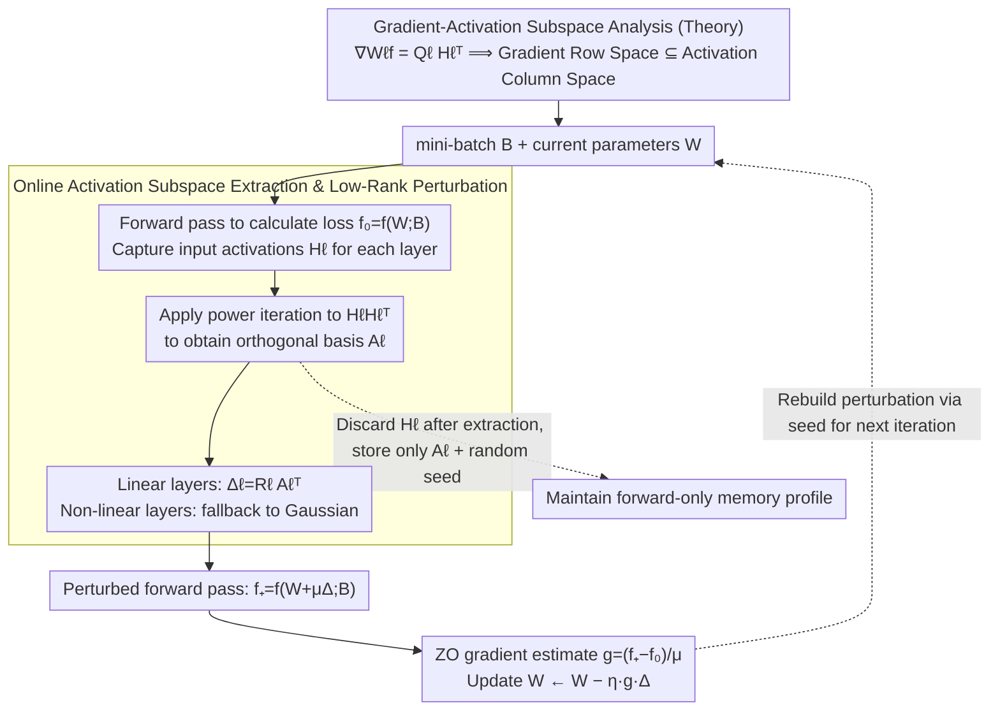

# AGZO: Activation-Guided Zeroth-Order Optimization for LLM Fine-Tuning

**Conference**: ICML2026  
**arXiv**: [2601.17261](https://arxiv.org/abs/2601.17261)  
**Code**: None  
**Area**: LLM Efficiency / Zeroth-Order Optimization  
**Keywords**: Zeroth-Order Fine-tuning, Activation Subspace, Low-Rank Perturbation, Memory-Efficient Training, LLM Optimization  

## TL;DR
AGZO discovers that the row space of linear layer gradients is constrained by the forward activation subspace. Based on this, it perturbs parameters only along activation-guided low-rank directions during zeroth-order fine-tuning, thereby improving gradient alignment and downstream task performance while maintaining memory usage levels nearly identical to MeZO.

## Background & Motivation

**Background**: Downstream adaptation of LLMs typically relies on backpropagation-based fine-tuning. however, backpropagation requires storing forward activations, which quickly becomes a memory bottleneck for long sequences and large batches. Zeroth-order (ZO) optimization provides an alternative: it estimates the update direction only through forward function value differences without storing activations, making the memory footprint close to inference and suitable for resource-constrained devices or consumer GPUs.

**Limitations of Prior Work**: Representative methods like MeZO use random Gaussian perturbations in the full parameter space to estimate gradients. Although LOZO introduces low-rank perturbations, its low-rank factors are still sampled randomly and are data-independent. These methods treat the model as a black box and ignore the substantial structural information generated during the forward pass, leading to much of the query budget being wasted on directions nearly irrelevant to the true gradient.

**Key Challenge**: ZO fine-tuning aims to save the memory overhead of backpropagation. However, with completely random perturbations, it is extremely difficult to align a single difference direction in a high-dimensional parameter space with the true gradient. The core issue is not whether to use low-rank perturbations, but whether the low-rank subspace is related to the structural properties of the true gradient for the current batch.

**Goal**: The authors aim to utilize forward activations to construct more informative ZO perturbation directions, allowing ZO methods to approach first-order gradient updates without significantly increasing memory consumption.

**Key Insight**: The paper starts from the gradient formula of linear layers: for weights $W_\ell$, the true gradient can be expressed as the product of the upstream gradient matrix and the input activation matrix $\nabla_{W_\ell} f = Q_\ell H_\ell^\top$. This indicates that the row space of the gradient is contained within the subspace spanned by the activations. Thus, activations are not irrelevant intermediate variables but geometric constraints that determine the gradient direction.

**Core Idea**: Extract the principal directions of the activation matrix on-the-fly during each forward pass and restrict the zeroth-order perturbation to this activation-guided low-rank subspace, replacing blind full-space sampling with "directional random perturbations."

## Method

### Overall Architecture

AGZO is designed for full-parameter zeroth-order fine-tuning. Like MeZO, it first calculates the loss $f_0=f(W;B)$ on the current parameters $W$, applies a small perturbation $W+\mu\Delta$, calculates the perturbed loss $f_+=f(W+\mu\Delta;B)$, and finally uses $(f_+-f_0)/\mu$ multiplied by the perturbation direction as the update estimate. The difference lies in how the perturbation $\Delta$ is constructed.

For each linear layer, AGZO captures the input activation matrix $H_\ell$ of the current mini-batch during the normal forward pass. It uses lightweight power iteration to approximate the top $r$ principal directions of $H_\ell H_\ell^\top$, obtaining an orthogonal basis $A_\ell\in\mathbb{R}^{d_{in}\times r}$. Subsequently, it samples perturbations only within this subspace: for linear layers, let $\Delta_\ell=R_\ell A_\ell^\top$, where $R_\ell$ is a Gaussian random left factor; for non-linear parameters, it falls back to standard Gaussian perturbations. In main experiments, the authors set $r=1$ to concentrate the single ZO sample along the strongest activation direction.

AGZO does not store complete activations for backpropagation. Subspace extraction is completed immediately while the activations are available; once the small matrix $A_\ell$ is extracted, $H_\ell$ is released. Perturbations are still reconstructed via random seeds. Therefore, it only stores an additional $d_{in}\times r$ basis per layer compared to MeZO, which is much smaller than the weight matrix $d_{out}\times d_{in}$.

### Key Designs

**1. Gradient-Activation Subspace Analysis: Why Forward Activations Can Guide ZO Perturbations**

The gradient of linear layer weights satisfies $\nabla_{W_\ell} f(W;B)=Q_\ell H_\ell^\top$, where $H_\ell$ is the input activation for that layer and $Q_\ell$ is the upstream signal. This implies that the gradient matrix is a linear combination of the columns of $H_\ell$, and the row space of the gradient is strictly constrained within the subspace spanned by the activations. The authors verified this on GPT-2/SST-2 by orthogonally projecting the true gradient onto the principal activation subspace: at a rank of approximately 10, the cosine similarity of the gradient before and after projection is close to 1. Furthermore, the singular value spectra of both gradients and activations decay rapidly. In other words, the energy of the true gradient falls almost entirely on a few principal directions of the activations. This conclusion directly refutes the black-box assumption of MeZO/LOZO—since the forward pass already exposes the geometric constraints of the gradient direction, zeroth-order perturbations should not be sampled blindly in the full parameter space but should align with the principal directions of the activations.

**2. Online Activation Subspace Extraction and Low-Rank Perturbation: Pinning Perturbations to the Principal Subspace**

Based on the above conclusion, AGZO captures the input activation matrix $H_\ell$ for each linear layer on-the-fly during each normal forward pass and uses lightweight power iteration to approximate the top $r$ principal directions of $H_\ell H_\ell^\top$. This involves sampling a test matrix $\Omega$, calculating $Y=H_\ell\Omega$, and performing repeated QR orthogonalization and $H_\ell(H_\ell^\top Q)$ iterations to obtain the orthogonal basis $A_\ell\in\mathbb{R}^{d_{in}\times r}$. The perturbation is then formulated as $\Delta_\ell=R_\ell A_\ell^\top$ ($R_\ell$ being a Gaussian random left factor), effectively pinning its row space to the principal activation subspace. For non-linear parameters lacking this structure, the method reverts to standard Gaussian perturbations to maintain generality. Power iteration is used instead of direct SVD because SVD is computationally expensive and requires extra memory, while power iteration only requires a few matrix multiplications—the paper shows that $K=3$ steps already achieve direction alignment close to exact SVD. The main experiments fix $r=1$ to compress the single ZO sample into the single strongest activation direction.

**3. Maintaining Forward-Only Memory Profile: Utilizing Activation Information Without Backpropagation**

The value proposition of AGZO is that it must not compromise the "inference-level memory" advantage of zeroth-order optimization. Therefore, it never stores activations for the purpose of backpropagation. Subspace extraction is completed immediately when $H_\ell$ is available, and $H_\ell$ is released once the small matrix $A_\ell$ is extracted. The perturbations themselves are not stored explicitly; only the random seed is recorded, and the perturbation is regenerated during the update. Consequently, compared to MeZO, AGZO only stores an additional $d_{in}\times r$ basis per layer (minimal for $r=1$), which is much smaller than the weight matrix $d_{out}\times d_{in}$. During the update phase, the perturbation is reproduced using the seed: first restoring $W_\ell-\mu\Delta_\ell$, then executing $W_\ell\leftarrow W_\ell-\eta g\Delta_\ell$. This "use-and-toss + seed regeneration" approach ensures that the memory curve of AGZO largely overlaps with MeZO/LOZO, compressing the transient activation structures from the forward pass into minimal subspace descriptions.

### Loss & Training

Theoretically, AGZO can be viewed as optimizing a subspace-smoothed objective within the activation subspace. The authors prove that the expectation of its estimator equals the projection of the gradient of this smoothed objective onto $A_\ell A_\ell^\top$, and the bias vanishes linearly with $\mu$ when the true gradient row space is supported by $A_\ell$. Furthermore, in a noiseless setting, the expected cosine similarity between AGZO and the true gradient includes the term $\|GA\|_F/\|G\|_F$, representing the gradient energy captured by the subspace. As long as the upstream gradient energy is not abnormally concentrated in the directions of small activation singular values, AGZO's expected alignment is strictly superior to MeZO.

In experiments, all ZO methods were trained for 20,000 steps. The Qwen3 model utilized a perturbation scale of $\mu=10^{-7}$, while Pangu-1B used BF16 and thus $\mu=10^{-4}$ to resist numerical noise. AGZO, MeZO, and LOZO shared the same code framework, data processing, and evaluation pipeline. The first-order (FO) baseline was trained for 1,000 steps where memory permitted.

## Key Experimental Results

### Main Results

| Model / Task | FO | AGZO | MeZO | LOZO | Zero | ICL | Conclusion |
|------------|----|------|------|------|------|-----|------|
| Qwen3-0.6B SST-2 | 0.904 | 0.877 | 0.858 | 0.870 | 0.540 | 0.510 | AGZO closest to FO |
| Qwen3-0.6B CB | 0.946 | 0.892 | 0.803 | 0.760 | 0.410 | 0.570 | Significant gain on low-resource NLI |
| Qwen3-0.6B RTE | 0.808 | 0.772 | 0.732 | 0.743 | 0.599 | 0.722 | Outperforms both ZO baselines |
| Qwen3-4B SST-2 | OOM | 0.892 | 0.875 | 0.866 | 0.649 | 0.887 | AGZO remains trainable when FO is impossible |
| Qwen3-4B SQuAD | OOM | 0.876 | 0.870 | 0.869 | 0.583 | 0.555 | Small but consistent lead on QA |
| Pangu-1B BoolQ | 0.751 | 0.730 | 0.699 | 0.696 | 0.695 | 0.735 | Effective on BF16/Edge models |

### Ablation Study

| Analysis Item | Setting | Key Metric | Description |
|------|------|---------|------|
| Gradient Alignment | Qwen3-0.6B / SST-2 | AGZO consistently higher than MeZO during training | Empirical support for theoretical directional alignment |
| Cross-Platform | Pangu-1B GPU train, NPU eval | NPU Avg: AGZO 0.709, MeZO 0.703, LOZO 0.667 | Activation-guided ZO transfers to Ascend NPU evaluation |
| vs LoRA | Qwen3-0.6B | AGZO > LoRA on SST-2/CB/BoolQ, = COPA, < LoRA on MultiRC | AGZO is a forward-only alternative, not a full PEFT replacement |
| Throughput | Qwen3-0.6B steps/s | AGZO comparable to MeZO, but power iteration adds overhead | Trading moderate speed loss for better direction quality |
| Rank Ablation | Qwen3-0.6B / SST-2 | rank 1: 0.877, rank 4: 0.870, rank 16: 0.863 | Higher rank dilutes instantaneous perturbation quality in single-query settings |

### Key Findings
- AGZO is the strongest ZO method across most tasks. Specifically, it improves the CB task on Qwen3-0.6B from MeZO's 0.803 to 0.892, indicating the significant value of activation subspaces for small-data reasoning tasks.
- On Qwen3-4B, where FO is untrainable due to memory constraints, AGZO remains functional and generally outperforms MeZO/LOZO, demonstrating the practical value of forward-only fine-tuning.
- Memory curves show AGZO's footprint largely overlaps with MeZO/LOZO and is significantly lower than FO. On Pangu-1B, FO encounters OOM for long contexts and large batches, whereas AGZO can handle a length of 2048 and a batch size of 64.
- Diagnostics of power iteration vs. exact SVD show that at $K=3$, the cosine similarity reaches 0.0123, nearly matching the 0.0124 of exact SVD and significantly exceeding MeZO (0.0015) and LOZO (0.0014).

## Highlights & Insights
- The key insight of the paper is clear: zeroth-order optimization does not imply a complete black box. Even without backpropagation, forward activations reveal the gradient row space, and this structure can be exploited at low cost.
- The distinction between AGZO and LOZO is critical. While both are low-rank, LOZO's directions are data-independent random directions, whereas AGZO's directions are derived from the current batch's activations. Thus, "low-rank" is not the sole source of gain; activation alignment is the core.
- The observation that rank 1 is optimal is intriguing. it suggests that the bottleneck for single finite-difference estimation is not subspace coverage, but rather concentrating the random direction onto high-energy directions given a limited query budget.
- This method is not a direct replacement for LoRA. LoRA uses backpropagation to train adapters, while AGZO uses forward-only updates for the original parameters. Future work could explore activation-guided ZO for training adapters or selective layer updates.

## Limitations & Future Work
- The gains of AGZO are built on the structural constraint of linear layer gradients; non-linear parameters still fall back to standard Gaussian perturbations, leaving their structural information underutilized.
- Although memory usage is close to MeZO, power iteration and QR orthogonalization increase computational overhead. Throughput shows it is still practical, but extremely low-compute devices might require lighter approximations.
- In the main experiments, the rank was fixed at 1, which works well for single queries. However, different layers or tasks might require adaptive ranks or multi-direction estimation, which the paper has not yet explored systematically.
- The experimental models scaled up to Qwen3-8B in supplementary results, but there is still a gap relative to models with dozens of billions of parameters. In ultra-large models, activation spectra, numerical perturbation scales, and communication overhead might alter conclusions.
- ZO methods still require 20,000 steps to achieve results, meaning optimization efficiency remains lower than first-order methods. Future work could combine better difference estimation, control variates, PEFT, and hybrid FO/ZO training.

## Related Work & Insights
- **vs MeZO**: MeZO achieves extremely low memory via full-space Gaussian perturbations but lacks directionality; AGZO retains the forward-only form while using activation subspaces to improve perturbation quality.
- **vs LOZO**: LOZO uses random low-rank perturbations based on the low-rank gradient prior; AGZO goes further by aligning low-rank directions with current batch activations, resulting in higher cosine similarity to the true gradient.
- **vs First-Order Fine-tuning (FO)**: FO generally yields the best results but has high memory costs for storing activations; AGZO sacrifices some performance for trainability on restricted hardware.
- **vs LoRA**: LoRA reduces trainable parameters but keeps backpropagation, while AGZO eliminates backpropagation and updates original parameters. They address different memory bottlenecks and could potentially be combined.
- **vs Low-dimensional Fine-tuning Theory**: The paper follows the observation of low-dimensional intrinsic structures in fine-tuning but shifts the low-dimensional subspace from a static random one to a dynamic activation subspace extracted per batch.

## Rating
- Novelty: ⭐⭐⭐⭐☆ Improving ZO perturbation directions via activation-gradient geometry is elegant and more structured than random low-rank approaches.
- Experimental Thoroughness: ⭐⭐⭐⭐☆ Covers Qwen3, Pangu, GPU/NPU, memory, throughput, LoRA, rank, and power iteration ablations; verification on larger-scale models is still relatively limited.
- Writing Quality: ⭐⭐⭐⭐☆ Theory and algorithms are explained clearly with a complete chain of formulas; despite many tables, main conclusions are easy to grasp.
- Value: ⭐⭐⭐⭐☆ Highly practical for memory-constrained LLM fine-tuning, especially for forward-only full-parameter adaptation, though training steps and computation overhead still require optimization.

<!-- RELATED:START -->

## Related Papers

- [\[AAAI 2026\] Low-Rank Curvature for Zeroth-Order Optimization in LLM Fine-Tuning](../../AAAI2026/llm_evaluation/low-rank_curvature_for_zeroth-order_optimization_in_llm_fine-tuning.md)
- [\[ICML 2026\] Beyond Log Likelihood: Probability-Based Objectives for Supervised Fine-Tuning across the Model Capability Continuum](beyond_log_likelihood_probability-based_objectives_for_supervised_fine-tuning_ac.md)
- [\[ICML 2026\] RouteJudge: An Open Platform for Reproducible and Preference-Aware LLM Routing](routejudge_an_open_platform_for_reproducible_and_preference-aware_llm_routing.md)
- [\[ICML 2026\] Spherical Steering: Geometry-Aware Activation Rotation for Language Models](spherical_steering_geometry-aware_activation_rotation_for_language_models.md)
- [\[ICML 2026\] Correcting Prompt Dependence in LLM Benchmarks: A Bayesian Hierarchical Model with Embedding-Space Clustering](correcting_prompt_dependence_in_llm_benchmarks_a_bayesian_hierarchical_model_wit.md)

<!-- RELATED:END -->
